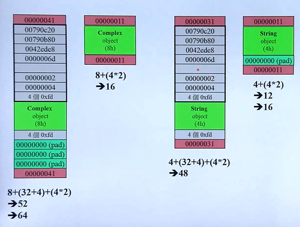
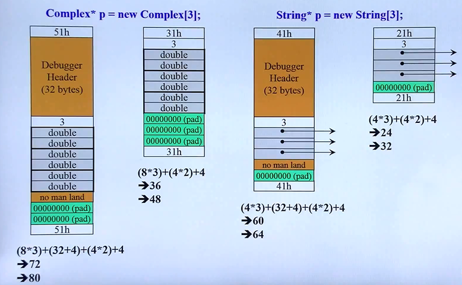

# C++ 侯捷

标签（空格分隔）：study

[TOC]

---

# 1 c++程序设计上


程序的组成：.h（头文件） + .cpp（过程文件） + .h（标准库）
```
#include <iosstream.h> //标准库
#include ''complex.h'' //自己定义的头文件
```

## 1.1 头文件和类的声明

### 1.1.1 头文件

头文件的形式：


### 1.1.2 class的声明

```
template<typename T>
class complex
{
public: //代表公开的属性 通常放置函数
    complex (double r = 0, double i = 0)
    : re(r), im(i)
    {}
    complex& operator += (const complex&);
    double real () const {return re;}
    double imag () const {return im;}
private: //代表私有的属性 通常放置包含的变量
    double re, im;
    T re, im; //利用模板 更换变量名类型
    friend complex& __doapl(complex*, const complex &);
};

{
    complex c1(2,1);
    complex c2;
}

```

### 1.1.3 inline（内联函数）

函数若在class body内完成，便自动成为inline候选人

访问：

```
{
    #错误的 直接访问private
    complex c1(2,1);
    cout << c1.re;
    cout << c1.im;
    
    #正确
    complex c1(2,1);
    cout << c1.real();
    cout << c1.imag();
}
```

## 1.2 构造函数

```
template<typename T>
class complex
{
public: //代表公开的属性 通常放置函数
    complex (double r = 0, double i = 0) //与类同名的函数即构造函数
    : re(r), im(i)  //初始化
    {}
    complex& operator += (const complex&);
    double real () const {return re;}
    double imag () const {return im;}
private: //代表私有的属性 通常放置包含的变量
    double re, im;
    T re, im; //利用模板 更换变量名类型
    friend complex& __doapl(complex*, const complex &);
};

注意：标准化编写代码，构造函数应用：进行初始化。编译器会先进行初始化，再进行赋值操作

```

### 1.2.1 overloading（重载）


构造函数可以有很多个，但是不能是完全一模一样的。因为再编译的过程中，编译器会根据构造函数的各种属性进行编码命名。

### 1.2.1 构造函数放在private 

构造函数放在private时，不允许调用它。

```
    //这种写法会报错
    complex c1(2,1);
    complex c2;
    ...
```

因为构建对象时用到了private的内容所以会报错

### 1.2.2 singleton 只用一次的函数


```
class A{
public:
    static A& getInstance();
    setup(){...}
private:
    A();
    A(const A& rhs);
};

A& A::getInstance()
{
    static A a;
    return a;
}

```

### 1.2.3 常量成员函数


如果class中没有写const，那么就会出现问题：
    定义告诉不可改变，但是class又表示可以改变

## 1.3 参数传递和返回值

### 1.3.1 pass by value 和 pass by reference

pass by value: 传递值，生成一个局部变量复制其值。
pass by reference: 传递引用，类似传递指针。但reference初始化必须赋值

注意：

- 一般都使用引用，传递快。
- 为了引用过程中不更改值 常使用const进行修饰
- 返回不能使用local perference 因为局部变量在函数调用完后就会释放

```
class complex
{
public:
    complex (double r = 0, double i = 0)
    : re(r), im(i)
    complex& operator += (const complex&) #使用引用传递参数和返回值
    double real () const {return re;}
    double imag () const {return im;}
private:
    double re, im;
};
```

### 1.3.2 friend(友元)

friend:开启一个窗口，可以直接访问private里的值。这样相较于通过private的函数取值更为快捷，且能修改值的大小。

***相同class的各个object互为object(友元)***

>如下，c2.func()这个方法可以访问c1里面的内容
>
>
>这里c1调用c2的私有属性不会报错


### 1.3.3 class body外的定义

>什么情况下不能返回reference

```
inline complex& fun(complex &ths, complex &r)
{
    complex new temp;
    temp->re = ths->re + r->re;
    temp->im = ths->im + r->im;
    return temp;
}
```

如上，在函数体中创建了一个reference，但由于reference是局部，在函数体调用完后会自动释放，所以你用局部引用做为返回值，在函数体介绍后访问就会报错。


### 总结

- 数据放在private
- 参数传递reference 考虑加不加const
- 返回值reference


## 1.4 操作符重载和临时对象

重载：即对操作符‘+‘，'-'等进行重新定义


### 1.4.1 操作符重载1 成员函数

成员函数（含有this）前面含有complex:(类名)

```
inline complex& __doap1(complex* this, const complex& r)
{
    this->re += r.re;
    this->im += r.im;
    return *this;
}

inline complex&
complex::operator += (const complex& r)
{
    return __doap1(this,r);
}

inline complex& complex::operator += (this, const complex& r)
{
    return __doap1(this, r);
}

//调用
{
    complex c1(2,1);
    complex c2(5);
    c2 += c1
    c3 += c2 += c1;
}
```

当使用c2 += c1时，会调用operator的函数，自动将c2赋值给this这个指针。

>传递者无需知道接收者是以reference形式接受

在__doap1函数中，返回的是一个值，返回类型定义的是一个引用。但这是被运行的。之所以这样做：

    c3 += c2 += c1;
    是将c2+=c1的返回类型赋值给__doap1的r参数，所以需要引用。

### 1.4.2 操作符重载2 非成员函数


前面不含有complex:(类名)

>创建临时对象 在下一行释放

    complex();
    typename(); //类似int()


## 堆、栈、内存管理

### 对象的分配和释放

`complex* pc = new complex(1,2)`的实际操作如下：

- `void* mem = operator new(sizeof(complex)); //分配内存`
- `pc = static_cast<complex*>(mem); //转型`
- `pc->complex::complex(1,2)` //构造函数

`delete pc`的实际操作如下：

- `string::~string(ps) //调用析构函数`先释放指针所指向的内容
- `operator delete(ps) //释放内存` 再释放指针本身

### 内存块空间

在vc编译器下，内存的分配策略如下：

- 先分配预定空间
- debug模式下将在前后加入灰色空间
- 在头和尾加入两个cookie（存放内存块大小，最后一位1表示是要分配的空间）
- 最后填充字节，使其16字节对齐

`complex* p = new complex;`



对于数组空间的分配，则加入一个4字节标识其个数。


