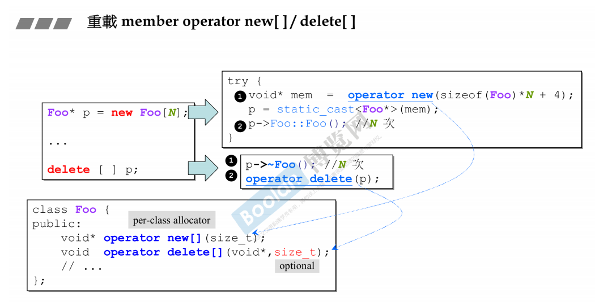
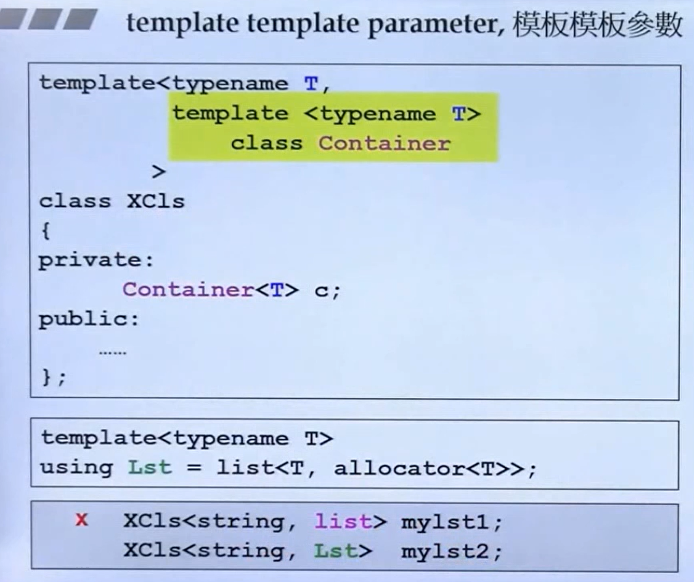

# C++primer

标签（空格分隔）： study

---

[TOC]


# 预备知识

```
#编译
g++ app.cpp greet.cpp -o hello.exe
```

## c++特性

- 面向对象编程
- 泛型编程 对语言进行扩展 可以应用各种实际类型

## 输入和输出

要让窗口一直打开，加入cin.get()，加入次数要和输入一致。可以理解为打开时会自动生成一个enter
或者最好加入system('pause')

```
#include <iostream>
int main()
{
    using namespace std;
    cout << "hello world";
    cin.get();
    return 0;
}
```

cout不换自动换行，所以可以加入cout或者加入转义序列'\n'来进行换行。

```
#include <iostream>
using namespace std;
int main()
{
    using namespace std;
    cout << "hello world" << endl;
    cout << "sherlolo\n";
    cin.get();
    system("pause");
```

## 头文件名

|c头文件|c++头文件|
|---------|---------|
|math.h|cmath|
|iostream.h|iostream|

c++里的头文件一般会在前加上'c'，去掉'.h'

## 名称空间

    using namespace std; 

这叫做using编译指令，包含有名称空间，来自哪个版本,类、函数、变量都放在std空间中

```
using namespace std;//会自动从名称空间中查找

//不想使s用声明时
std::cout << "hello world"; //标准的使用

using std::cout；
cout << "hello world"; //需要用到时 再进行声明

//使用的是变量输出时
cout << using jack::var;    //可以
```


# 简单变量

## 指定字面值的类型

```
L'a' //宽字符类型，wchar_t
u8"hi!" //utf-8字符串字面值
32ULL //无符号整型 值为32
1.f //单精度浮点型字面
3.13L //扩张精度浮点型

```

## 别名声明

别名声明(using)与typedef类似

```
using SI = Sales_item;
```


##  wchar_t 

    wchar_t 实际上的空间是和 short int 一样。为了扩展unicode编码

## sizeof和climits头文件

sizeof 返回类型或变量的长度，单位为字节。

climits头文件包含有个变量存储的最大值

|符号变量|表示|
|-----|-----|
|CHAR_BIT|char的位数|
|CHAR_MAX|char最大值|
|CHAR_MIN|char最小值|
|INT_MAX|int最大值|
|INT_MIN|int最小值|
。。。。。其他类型类似

## 特定类型的输出

    cout.put() //输出一个字符 不会自动添加换行符

类比与c语言中的put()

>>cout.setf(ios_base::fixed, ios_base::floatfield);
迫使输出采用定点表示法，而不是用指数法来输出。其中的参数来自于iostream

```
#include <iostream>
int main()
{
    cout.setf(ios_base::fixed, ios_base::floatfield); //fixed-point
    float min = 10.0 / 3.0;
    double large =  10.0 / 3.0;

    cout << "min is " << min << endl;
    cout << "large is " << large << endl;

    cout << "The ten multi" << endl;
    cout << "min is " << min*100 << endl;
    cout << "large is " << large*100 << endl;
    system("pause");
    return 0;
}
```

## constexpr变量

constexpr 是 C++ 11 标准新引入的关键字，表达常量表达式。

- 定义变量时可以用 constexpr 修饰，从而使该变量获得在编译阶段即可计算出结果的能力。
- constexpr 还可以用于修饰函数的返回值，这样的函数又称为“常量表达式函数”。但需要一定的条件

```c++
#include <iostream>
using namespace std;

int main()
{
    constexpr int num = 1 + 2 + 3;
    int url[num] = {1,2,3,4,5,6};
    couts<< url[1] << endl;
    return 0;
}

// constexpr 删除，此时编译器会提示“url[num] 定义中 num 不可用作常量”。
```


一些应用：

```c++
// 通过对斐波拉契函数的递归实现，来看看constexpr具体怎么修饰函数，同时比较这样使用的好处
#include<iostream> 
#include<time.h>
using namespace std; 
//在这个函数里面，由于constexpr稀释的是fib1这个函数，因此每一次计算的结果都会作为一个常量保存下来
//这个实现的复杂度等同于迭代的方法，基本上为O(n)。 运算时间移植到编译期
constexpr long int fib1(int n) 
{ 
	return (n <= 1)? n : fib1(n-1) + fib1(n-2); //只能包含一个retrun语句
} 
//熟悉递归函数就不难证明下面这个函数的时间复杂度为O(2^n)
long int fib2(int n){
        return (n <= 1)? n : fib2(n-1) + fib2(n-2); 
}
int main () 
{ 
	// value of res is computed at compile time. 
  	clock_t start, end;
  	start = clock();
    for(int i = 0; i < 100; ++i)
	    const long int res = fib1(30); 
  	end = clock();
  	cout << "Totle Time fib1 : " <<(double)(end - start) / CLOCKS_PER_SEC << "s" << endl;

  	start = clock();
    for(int i = 0; i < 100; ++i)
	    const long int ress = fib2(30); 
  	end = clock();
  	cout << "Totle Time fib2 : " <<(double)(end - start) / CLOCKS_PER_SEC << "s" << endl;


	// cout << res << endl; 
    // cout << ress << endl;
	return 0; 
} 
```

> 不过在某些编译器上可能不能通过


## 变量初始化

初始化不是赋值，而是创建变量时赋予一个初始值，初始化的方式如下：

```
int a = 0;
int a = {0};
int a{0};
int a(0);
```

### 直接初始化

```c++
string s6("hiya");
string s7(10, 'c');
```

如上将采取构造函数进行直接初始化

### 拷贝初始化

```c++
string s5 = "hiya"
string s8 = string(10 ,'c');
```

如果使用=初始化一个变量，实际执行的是拷贝初始化，编译器把等号右侧的初始值拷贝到新创建的对象中去。

上述代码等效如下：

```c++
string temp("hiya");
string s5 = temp;

string temp = string(10, 'c')
string s8 = temp
```


### 列表初始化

{}用大括号进行初始化称为列表初始化。

- 括号内的内容必须为常量，
- 不允许将高范围的数赋值个小范围的数。

对于类的列表初始化:

>Test b{1,2};Test c = {1, 2};
>
>都会使用构造函数，列表初始化采取依次赋值的方式。

```c++
//列表初始化限制
int main()
{
    int x{123213};
    char c = {x}; //x不是个常量
    char s = {213213123}; //太多不允许
    return 0;
}

//类的列表初始化
class Test
{
public:
    Test(int _a, int _b) : a(_a), b(_b) 
    {
        std::cout << "Test()" << std::endl;
    }
    Test(const Test& rhs)
    {
        std::cout << "Test(Test&)" << std::endl;
        a = rhs.a;
        b = rhs.b;
    }
    Test& operator=(const Test& rhs)
    {
        if(this == &rhs)
            return *this;
        a = rhs.a;
        b = rhs.b;
        return *this;
    }
private:
    int a;
    int b;
};

int main()
{
    std::cout << "a" << std::endl;
    Test a(1,2);
    std::cout << "b" << std::endl;
    Test b{1,2};
    std::cout << "c" << std::endl;
    Test c = {1, 2};
    system("pause");
    return 0;
}

//拷贝构造和拷贝赋值
int main()
{
	Person p;
	Person p1 = p;    //这是虽然使用了"="，但是实际上使用对象p来创建一个新的对象p1。也就是产生了新的对象，所以调用的是拷贝构造函数。
    
	Person p2;	
	p2 = p;           //将p的值赋值给p2，调用的是赋值运算符 
	std::getchar();
	return 0;
}
```

## 类型转换

强制转换不会改变变量本身的值，而是创建一个新的指定类型的值

cast:强制类型转换

```
    (int) x  //c语言格式
    int (x)  //c++格式
```

### 命名的强制类型转换

其形式如下，type是转换的类型，value是要转换的目标。

```
cast_name<typename> (value)
```

cast_name有如下形似：

- static_cast:不包含底层const,都可使用。用来强迫隐式类型转换，例如将non-const转换为const对象
- dynamic_cast：支持允许时识别指针或引用所指向的对象，主要用来执行"安全向下转型",

也就是用来决定某对象是否归属继承体系中的每个类型，也是唯一可能耗费重大运行成本的转型动作。

- const_cast：只能去掉运算对象的底层const,但是通过其写值会产生未定义的行为。
- reinterpret_cast：(interpret是解释的意思，reinterpret即为重新解释)，通常为运算对象的位模式提供较低层次的重新解释。

意图执行低级转型。

案列：

```c++
double slope = static_cast<double>(j) / i;

//const_cast
const int a=100;
int * pa = const_cast<int *>(&a);
*pa = 110;
printf("%d,\n",a); //输出100 在预编译阶段，常量会被真实值替换，就像宏定义一样
printf("%d,\n",*pa);	//输出110
printf("0x%08x\n",&a); //a和pa的地址一样
printf("0x%08x\n",pa);

//reinterpret_cast
int i; 
char ch='A';
i = reinterpret_cast<int>(ch); //i = 65 重新解释保存的二进制对象
```


## auto声明

在声明变量时，使用关键字auto而不指定变量的类型，编译器将把变量的类型设置与初始值相同

```c++
auto value;	//错误，如果只是初始化，并没有赋值会报错
auto n = 100;
auto f = 1.2;
```

# 内存分配释放机制(new和malloc)

## new

### new分配空间

```c++
//new分配动态内存空间
int *pi = new int;	//申请空间
int *pi = new int(1);	//申请空间并初始化为1
int *pa = new(40 * sizeof(int));	//申请连续空间 40 * sizeof(int)
int *pi = new int[40];				//申请连续空间 40 * sizeof(int)

//new分配字符串
char *ptr = new char("hello") //分配空间并初始化
char* p=new char[6];
std::strcpy(p, "hello");

//new分配空间并初始化
int *pi = new int(6);
double *pd = new double (99.9);
struct where
{
    double x;
    double y;
    double z;
}

int *ar = new int[4]{2, 4, 6, 7};	//分配空间并使用列表初始化
int *one = new where{2.5, 5.5, 7.2};
```

### new定位运算符

new定位运算符的功能是对已存在的空间进行初始化，会使用对应的构造函数进行初始化

使用格式`new(指针名) 类型(参数值)`

```c++
#include <new>
struct chaff
{
    char droos[20];
    int slag;
}
char buffer1[50];
char buffer2[100];

int main()
{
    chaff *p1, *p2;
    int *p3, *p4;
    p1 = new chaff;
    p3 = new int[20];
    p2 = new (buffer1) chaff;	//将chaff赋值给buff1中的空间
    p4 = new (buffer2) int[20];
}

//buffer1中分配空间给结构chaff; buffer2中分配空间给20个元素的int数组;
```

### new总结

- new是操作符，无需任何头文件
- new去申请对象会先申请对象的空间并调用对象的构造函数完成对象的初始化
- 用运算符new动态分配内存时，如果没有足够的内存满足分配要求，new将返回空指针,并返回异常

## delete

### delete释放空间

```c++
	//申请空间
	int* ptr = new int;
	//申请空间并初始化
	int* ptr2 = new int(1);
	//申请连续的空间，空间大小为4*10=40
	int* arr = new int[10];//c++98不允许连续空间初始化

	//释放单个空间
	delete ptr;
	delete ptr2;

	//释放连续的多个空间
	delete[] arr;

```

### delete总结

- delete是操作符，无需任何头文件
- delete会先去完成对象的资源清理，再将对象所占的空间释放掉

## operator new 和operator delete

这两个是系统提供的全局函数，也是对malloc和free进行封装过的函数。而new和delete是对这两个全局函数进行的封装。operator new和malloc的最大区别就是当申请错误时，处理的方式不一样。malloc申请失败时会返回NULL，operator new申请失败时会抛异常.

```c++
void test()
{
	int* ptr = (int*)operator new(sizeof(int) * 2);
	operator delete(ptr);

	//申请失败抛异常
	int* ptr1 = (int*)operator new(0x7fffffff);
	operator delete(ptr1);
}
```

## C接口的资源管理

- malloc：函数原型`void* malloc(size_t size)` 参数size为要分配的字节数，返回值是void*,通常要强转为我们需要申请空间的类型,开辟成功回返回空间首地址，失败会返回NULL，但是申请成功后并不进行初始化，每个数据都是随机值。

- calloc：函数原型`void* calloc(size_t number, size_t size);` 参数number为要申请的个数；size为每一个数据的大小，返回值是void*,通常要强转为我们需要申请空间的类型,开辟成功回返回空间首地址，失败会返回NULL，但是申请成功会对空间进行初始化，且初始为0。

- realloc：函数原型` void*realloc(void * mem_address, unsigned int newsize); `参数address为要扩展调整的空间首地址，参数newsize为调整为多少字节的空间，返回值是void*,申请成功后并不进行初始化，每个数据都是随机值。
  - 如果当前内存段后面有需要的内存空间，则直接扩展这段内存空间，realloc()将返回原指针。
  - 如果当前内存段后面的空闲字节不够，那么就使用堆中的第一个能够满足这一要求的内存块，将目前的数据复制到新的位置，并将原来的数据块释放掉，返回新的内存块位置。
  - 如果申请失败，将返回NULL，此时，原来的指针仍然有效。

## C++和C的资源管理对比

- malloc和free是函数，new和delete是操作符
- malloc申请的空间不会初始化，new可以初始化
- malloc申请空间时需要手动计算空间大小并传递，new不需要
- malloc的返回值为void*，使用时必须强转来接收，new不需要
- malloc申请失败时返回NULL，new申请失败会抛异常
- 申请自定义类型的对象时，malloc/free不会调用构造函数和析构函数，而new会申请空间后调用构造函数，delete会调用析构函数后再释放空间
  

# 复合类型

 C++对数组等称为复合类型，C语言称为派生类型，因为c++中已对类关系使用了派生。

## 数组

初始化

```
int a[3] = {1, 2, 3};
int b[]{2,3}; //自动计算数组长度
int c[3] = {}; //所有元素自动赋值为0
int d[3] = {0}; //所有元素自动赋值为0
int f[5] = {1}; //只有第一个值赋值为1 其他都为0
int g[3]; //不会自动初始化 g里面的值未知

#变量数组
const int Size = 15;
int name1[Size] = {};
```

注意：c++和c语言一样，编译器不会检查数组使用的下标是否有用

## 引用

一般所说的引用为左值引用，即创建了一个别名。

- 引用必须初始化，创建后就无法再绑定到其他的对象。
- 因为引用本身不是一个对象，所以不能定义引用的引用。
- 引用是一种漂亮的指针，内部还是由指针来实现
- 引用常用于函数传参和返回类型声明

### 左值引用

左值引用就是必须绑定到左值的引用。
左值引用不能绑定到表达式、字面常量和返回右值的表达式

```c++
int i = 42;
int &r = i; //正确

int &r = 42;    //错误 42是字面常量
int &r = i*42   //错误 i*42是一个右值表达式
    
    
void testfun(int a)
{
    std::cout << a;
}

void testfun(int& a)
{
    std::cout << "int &" << std::endl;
    std::cout << a;
}
int main
{
	int a;
    testfun(a);	//错误
}
//testfun会出现二义性
```

>考虑所赋值的对象是否可以作为左值

### 右值引用

右值引用只能绑定到临时对象：

- 所引用的对象将要被销毁
- 该对象没有其他用户

这意味着：使用右值引用的代码可以自由接管所引用对象的资源

```
int i = 42;
int &&rr = i;
int &&rr = i*42;
```

## C字符串的输入和输出(char *s)

### 自动拼接

```
cout << "my name is""sherlolo";
cout << "hello" "my frinde";
//在cout中会默认进行拼接
```

### 字符输入的不同方式比较

```
字符串
cin >> name; //cin通过空白字符(空格、制表符、换行符)来确定字符串的结束位置，遇到空白字符不会将换行符丢弃 cin在读入前会跳过所有空白字符
cin.get(name, 20); //通过换行符截止不会将换行符丢弃 cin.get()读取行  读取空行将导致cin为false 也可读取字符
cin.getline(name, 20); //通过换行符截止并将其丢弃 cin.getline()读取行  会读取空白字符

字符
char c;
cin >> c;   //cin>>c的形式 会跳过空格和换行符
cin.get(c); //cin.get()函数会读取所有的字符，包括空格和换行符

input: a\n
output:‘空格’和‘a’

```

>cin.clear() 处理如下情况
get()读取空行后将设置失效位
getline()在读取比它多的字符时，也会设置失效位

>特殊情况

读取字符串和数字时

```
int year;
char name[20];
cin >> year;
cin >> name;
```
输入一个数字后自动将换行符赋给name。
cin读取数字时。在cin读取年份后，换行符还在缓冲区中。

### strlen()

```
#include <cstring> //包含c语言中各类库的处理
int main()
{
    char strs[] = "hello";
    cout << strlen(strs);
}
```

## const的顶层和底层

顶层const表示指针本身就是个常量
底层const表示指针指向的对象是个常量

```
int *const p1 = &i; //不能该改变p1的值 这是个顶层const
const int ci = 42; //不能改变ci的值 这是个顶层const
const int *p2 = &ci; //运行改变p2的值 这是个底层const
const int * const p3 = p2; //靠右的是顶层const，靠左的是底层const
const int &r = ci; //用于声明引用的都是底层const
```


## c++字符串的使用

### string c++字符串概要

c++中的字符串采用string类进行扩展，并在库"string"中。

```
#include <iostream>
#include <cstring>
#include <string>

using namespace std;

int main()
{
    char chars0[20] = "hello world";
    string str1 = "sherlolo tt";    //c++字符串初始化
    string str2{"today is wednsday"};
    string str3; //未初始化的长度为0 
    int len0 = strlen(chars0);
    int len1 = str2.size();  //返回长度

    str3 = str1 + str2;
    cout << chars0 << endl;
    cout << str1 << endl;
    cout << "the chars size is " << len0 << endl;
    cout << "the str1 size is " << len1 << endl;

    system("pause");
    return 0;
}
```

如上所示，具有stirg具有如下特性：

- string的初始化兼容c语言字符串的初始方法。
- 没有初始的string类长度为0
- 计算长度使用方法：string.size()

### 输入和输出

string类的输入方式: cin和getline.

- cin 类 istream类的设计考虑了基础类型，但没有考虑到string类型，所以调用的是友元函数。
- getline 函数 getline(cin, str2);

string类的输出方式：cout

```
#include <iostream>
#include <cstring>
#include <string>
using namespace std;

int main()
{
    char chars0[20] = "hello world";
    string str1 = "sherlolo tt";
    string str2{"today is wednsday"};
    string str3;

    cin.getline(chars0, 20);
    getline(cin, str2);
    getline(cin, str3);

    cout << "chars is " << chars0 << endl;
    cout << "str1 is " << str2 << endl;
    cout << "str3 is " << str3 << endl;
    
    system("pause");
    return 0;
}
```

### 其他类型的字符串

扩充类型

```
wchat_t a[] = L"chief";
char16_t b[] = u"hello";
char32_t c[] = U"world";
```

原始字符串(RAW)

原始字符串，即没有转移类型的字符串。使用如下：

- R"(strings)"
- R"+*(strings)*+"

```
R"(hello world)"
R"+*(hello world)*+"
```

## 结构体

### 结构体使用初始化

使用struct infaltable定义好结构体后，下次声明结构体变量只需要infaltable variable即可

```
#include <iostream>
struct inflatable
{
    char name[20];
    float f;
    double prize;
};
using namespace std;
int main()
{
    inflat a = {"sherlolo", 1.88, 20};
    cout << a.name << "have " << a.f << endl;
    system("pause");
    return 0;
}
```

初始化

```
inflat a{"sherlolo", 1.88, 20}; //c++11后可采用此种方式
inflat b{}; //b中所有数字变量会被初始化为0，字符类型的每个字节设置为0
```

### 结构体属性

结构体可以直接赋值，也可以直接使用string类作为成员

```
//如下结构体省略了名称，它只能使用一次，以后都无法创建此类类型
struct
{
    int x;
    int y;
}position;
```

## 共用体

共用体，能存储不同的类型，但只能同时存储其中的一种类型。其长度为所有成员的最大长度

```
union one4all
{
    int val;
    long long_val;
    double double_val;
};
//如上长度为double_val的长度
```

匿名共用体

在结构体定义的共用体中，union没有定义名称，使用时也无需使用prize.id.id_num形式

```
struct widget
{
    char name[20];
    int type;
    union
    {
        long id_num;
        char id_char[20];
    };
}
widget prize;
cin >> prize.id_num;
cin >> prize.id_char;
```

## 枚举

即定义了一种符号常量的形式,

```
enum spectrm{red, orange,yellow};
spectrm成为了枚举类型
red、orange、yellow等作为符号常量，对应0~2；整数部分也成枚举量
```

### 枚举类型的使用

```
spectrm band;
band = orange;  //合法
band += 1;      //可能通过 不建议使用
band = spectrm(2);  //合法 通过强制类型转换使用
```

### 枚举类型设置值

```
enum bits{one = 1, tow = 2, four = 4, five}; //five会在上一个枚举量上加1
enum {zeor, null = 0, one, numone = 1}; //允许枚举值相同
```

## 指针

### 指针也是迭代器

数组内置的下标运算符可以处理负值，前提是结果地址依然在原数组中。这一点和vector和string不一样

```
int arr[] = {0,1,2,3,4,5};
int *p = arr;
p++;

//使用begin和end，由于数组不是类，所以不能采用方式的形式调用，采用如下形式：
int* beg = begin(arr);
int* last = end(arr);

//指针运算
auto n = end(arr) - begin(arr); //n等于数组的长度

int* p = &ia[2];
int k = p[-2];  //可以处理负值
```

### 空指针

```
//C++
int *p1 = nullptr;
int *p2 = 0;

//c 需要#include <cstdlib>
int *p3 = NULL;

it(pi) //pi为空指针时 为false

```


### 指针的声明和基本使用

```
int *ptr; //c语言风格
int* ptr; //c++风格 表面int*是一种类型：指向int的指针

int *ptr1, *ptr2; //声明两个指针时候，两个都需要加*
```


### 指针的赋值

```
int *pint;
*pint = 123;
//如上的操作是非常严重的错误
```

```
int* pt;
pt = 0xb800000; //c99之前可以使用

int* pt;
pt = (int *)0xb800000; //c99之后需要加入强制类型转换
```

### 使用new分配内存

new动态分配内存的空间为：堆或自由存储区
常规变量分配的内存空间为：栈

```
int* pt = new int;  //分配适合int的内存
delete pt;  //释放内存
```

    >注意：如果内存分配失败或内存空间用完，new将返回0

### 使用new创建动态数组

```
int* num = new int [10];
delete [] num;
```


### 使用new的注意事项

- 不要使用delete释放不是new分配的内存
- 不要使用delete释放同一内存块两次
- 对空指针使用delete是安全的
- new和delete的使用要对应（数组对应数组[]）
- new分配的内存空间是不知道（系统知道）只能知道指针所占的大小

### 指针和数组的区别


    p3 = p3 + 1
1. 如上的语句对指针是适用的，但对于数组则不可，因为数组名的值不可改变。
2. 对数组使用sizeof将返回整个数组的大小，而对指针使用sizeof返回的只是指针的大小。

## 指针算术

对指针变量加1，增加的量等于的类型字节数

### 数组的地址

数组名被解释为第一个元素的地址，而对数组名使用地址运算符时，返回的是整个数组的地址。

```
short tell[10];
cout << tell << endl;
cout << &tell << endl;

**&tell == *tell == tell[0] //三者等效

short (*pas)[10] = &tell;   //表明pas是一个指针，指向short[10]数组
short* pas[10]; //pas先与[10]结合 表明它是含有10个元素的指针数组
```

>要想了解复合类型的类型，可以尝试从右到做去阅读变量定义。

### 字符数组

对于字符型的数组或指针，在进行cout输出时，cout将显示它所指向的字符串，若要打印指针地址，则需要加入强制类型转换(int *)

```
char flower[10] = "rose";
cout << flower << endl;
cout << (int *)flower << end;
```

对于字符串字面值，有些编译器会把它视作一个常量，而有些编译器会视为一个副本。

```
const char *bird = "wren";
//如果视为一个常量，编译器将禁止改变bird指向的内容的值
```

### 使用new创建动态结构

```
struct things
{
    int good;
    int bad;
}

things *ptr = new tings; //把可以存储thingdds的内存地址赋值给ptr
```

### 类型组合

```
const antarctica_ptr ** ppa = arp;
auto ppb = arp;
#如上两种组合是等效的
std::cout << (*ppa)->year << endl;
```

# 顺序容器

一个容器就是一些特定类型对象的集合。容器均会定义为模板类。
顺序容器提供了控制元素存储和访问顺序的能力。顺序容器的类型：

- vector
- deque 双端队列
- list 双向链表
- forward_list 单向列表
- array 固定大小数组
- string

上述类型的区别：

string和vector都保存在连续的内存空间中，对其进行随机访问速度较块，但在中间位置插入和删除较慢
list和forward_list两个容器：在任何位置插入和删除都比较快，但不支持随机访问
deque是一个更复杂的数据结构：支持元素的快速随机访问，在任何位置插入和删除都比较快。
array和内置数组类型比，是一种更安全的类型，但是其大小是固定的。只有array大小是固定的

>注意：

- 注意assgin运行使用不同但相容的类型进行赋值。比如char->string
- vector<double> a2(a1.cbegin(), a1.cend()); //使用复制初始化也可以使用相容的类型赋值
- c.emplace(init) 使用的是构造函数来添加
- c.push_back(var) 是将一个对象拷贝到c的末尾
- vector、string、deque和list的迭代器支持递增和递减操作。array和forward_list不支持


## 使用

```
auto b = v.begin(); //b表示v的第一个元素的位置 注意v.begin()返回的是一个指针 
auto e = v.end();   //e表示v的尾元素的下一个位置

//迭代器类型可以使用== != < >进行比较判断。
*iter; //返回迭代器iter所指元素的引用
iter->mem; //取iter对象中的mem成员
++iter; //指向下一个元素    
--iter; //指向上一个元素，v.end()不能使用++ --
```

>注意，在顺序容器中进行插入和删除操作，可能会使原来的引用和迭代器无法使用。

## 顺序容器共有的操作

### 类型

|操作|解释|
|-----|-------|
|iterator|此容器类型的迭代器类型|
|const_iterator|可以读取元素但不能修改元素的迭代器类型|
|size_type|无符号整数类型，足够保存此种容器类型最大可能的大小|
|difference_type|带符号整数类型，足够保存两个迭代器之间的距离|
|value_type|元素类型|
|reference|元素的左值类型；和value_type &含义相同|
|const_reference|元素的const左值类型，即const value_type &|

### 构造函数

|操作|解释|
|------|--------|
|C c;|默认构造函数，构造空容器|
|C c1(c2);|或C c1 = c2;	构造c2的拷贝c1|
|C c(b, e)|	构造c，将迭代器b和e指定范围内的所有元素拷贝到c|
|C c(a, b, c...)	|列表初始化c|
|C c(n)	|只支持顺序容器，且不包括array，包含n个元素，这些元素进行了值初始化|
|C c(n, t)	|包含n个初始值为t的元素|

### 赋值和swap

|操作	|解释|
|------|-----------|
|c1 = c2;	|将c1中的元素替换成c2中的元素|
|c1 = {a, b, c...}	|将c1中的元素替换成列表中的元素（不适用于array）|
|c1.swap(c2)	|交换c1和c2的元素|
|swap(c1, c2)	|等价于c1.swap(c2)|
|c.assign(b, e)	|将c中的元素替换成迭代器b和e表示范围中的元素，b和e不能指向c中的元素|
|c.assign(il)	|将c中的元素替换成初始化列表il中的元素|
|c.assign(n, r)	|将c中的元素替换为n个值是t的元素|


- 使用非成员版本的swap是一个好习惯。
- assign操作不适用于关联容器和array

### 大小

|操作|解释|
|----|--------|
|c.size()|c中元素的数目（不支持forward_list）|
|c.max_size()|c中可保存的最大元素数目|
|c.empty()|若c中存储了元素，返回false，否则返回true|

### 添加元素

|操作|解释|
|------|-------|
|c.push_back(t)|	在c尾部创建一个值为t的元素，返回void|
|c.emplace_back(args)|同上，emplace会使用构造函数的方式来添加|
|c.push_front(t)	|在c头部创建一个值为t的元素，返回void|
|c.emplace_front(args)|	同上|
|c.insert(p, t)	|在迭代器p指向的元素之前创建一个值是t的元素，返回指向新元素的迭代器|
|c.emplace(p, args)|	同上|
|c.insert(p, n, t)	|在迭代器p指向的元素之前插入n个值为t的元素，返回指向第一个新元素的迭代器；如果n是0，则返回p|
|c.insert(p, b, e)|	将迭代器b和e范围内的元素，插入到p指向的元素之前；如果范围为空，则返回p|
|c.insert(p, il)|	il是一个花括号包围中的元素值列表，将其插入到p指向的元素之前；如果il是空，则返回p|


- 因为这些操作会改变大小，因此不适用于array。
- forward_list有自己专有版本的insert和emplace。
- forward_list不支持push_back和emplace_back。
- 当我们用一个对象去初始化容器或者将对象插入到容器时，实际上放入的是对象的拷贝。
- emplace开头的函数是新标准引入的，这些操作是构造而不是拷贝元素。
- 传递给emplace的参数必须和元素类型的构造函数相匹配

### 访问元素

|操作	|解释|
|---------|-----------|
|c.back()|返回c中尾元素的引用。若c为空，函数行为未定义|
|c.front()|	返回c中头元素的引用。若c为空，函数行为未定义|
|c[n]	|返回c中下标是n的元素的引用，n时候一个无符号证书。若n>=c.size()，则函数行为未定义|
|c.at(n)|	返回下标为n的元素引用。如果下标越界，则抛出out_of_range异常|


- 访问成员函数返回的是引用。
- at和下标操作只适用于string、vector、deque、array。
- back不适用于forward_list。
- 如果希望下标是合法的，可以使用at函数。

### 删除元素

|操作|解释|
|-----|---------|
|c.pop_back()|删除c中尾元素，若c为空，则函数行为未定义。函数返回void|
|c.pop_front()|	删除c中首元素，若c为空，则函数行为未定义。函数返回void|
|c.erase(p)|删除迭代器p指向的元素，返回一个指向被删除元素之后的元素的迭代器，若p本身是尾后迭代器，则函数行为未定义|
|c.erase(b, e)|	删除迭代器b和e范围内的元素，返回指向最后一个被删元素之后元素的迭代器，若e本身就是尾后迭代器，则返回尾后迭代器|
|c.clear()|删除c中所有元素，返回void|


- 会改变容器大小，不适用于array。
- forward_list有特殊版本的erase
- forward_list不支持pop_back
- vector和string不支持pop_front

## 迭代器类型

迭代器的类型使用iterator和const_iterator

```
vector<int>::iterator it;
string::iterator it2;  

#获取迭代器
c.begin() c.end()   #返回首元素和尾元素的迭代器
c.cbegin() c.cend() #返回const_iterator
c.rbegin() c.rend() #返回反向迭代器类型
c.crbegin()
```

有begin和end确定的迭代器范围，是一个左闭合区间。这种区间有如下特性：

- 如果begin和end相等，则范围为空
- 如果begin和end不等，则范围至少包含一个元素
- 我们可以对begin递增若干次，直至begin==end

> iter1 = c.begin() iter2 = c.end
while(iter1 < iter2) 错误 两个容器不在统一容器内，不能进行比较
while(iter != iter2)

### 迭代器类型的运算

string和vector提供了更多的运算符

```
iter + n;
iter - n;
iter += n;
iter -= n;
iter1 - iter2;
>, <=, <, <=;
```

## string类型

### string的常见操作

```
#include <string>
//常见构造函数
string(size type n, char c) //创建由n个字符c组成的string
string(const char * s, size_type n) //创建由s中前n个字符组成的string
s.empty()  //s为空返回true 
s.size()    //返回s中字符的个数
const char* str = s.c_str() //返回string对象的c字符串地址

```

### 数值转换

```
int i = 42;
string s = to_string(i);
double d = stod(s); //stod stoi stol stof

```

### 字面值和string相加

```
string s1 = "hello", s2 = "world";
string s3 = s1 + "," + s2 + '\n'; //字面值可以和string对象相加，但字面值左右必须有一个stirng对象
```

### 直接初始化和拷贝初始化

```c++
string s2 = {"hello"}; //拷贝初始化
string s5 = "hiya"; //拷贝初始化 会隐式调用string("hiya")创建一个临时对象再拷贝给s5
string s6("huyua"); //直接初始化
string s7(10,'c')	//直接初始化
```

### 读取

读取string类型有两种方式。

```
string word;
cin >> word;
getline(cin, word);
```

## initializer_list

std::initializer_list<T> 类型对象是一个访问 const T 类型对象数组的轻量代理对象。
与vector不同类似也是一种模板类型，initializer_list对象中的元素永远是常量值，我们无法改变initializer_list对象中元素的值。
构造函数更加方便，能自动判读类型，一般使用在列表初始化中。

|操作|解释|
|--------|-------|
|initializer_list<T> lst;| 默认初始化；T类型元素的空列表|
|initializer_list<T> lst{a,b,c...};	| lst的元素数量和初始值一样多；lst的元素是对应初始值的副本；列表中的元素是const。|
|lst2(lst)	|拷贝或赋值一个initializer_list对象不会拷贝列表中的元素；拷贝后，原始列表和副本共享元素。|
|lst2 = lst	|同上|
|lst.size()	|列表中的元素数量|
|lst.begin()	|返回指向lst中首元素的指针|
|lst.end()	|返回指向lst中微元素下一位置的指针|

```
template <typename T>
vector::vector(std::initializer_list<T> initList);

std::vector v = { 1, 2, 3, 4 };
```

## vector

vector表示对象的集合，其中所有的对象类型都相同，因为vector容纳这其他对象，也成为容器，也是类模板。

>注意： vector类型：不能在for循环内向vector对象添加元素。

### 定义和初始化vector

```
#include <vector>
using std::vector;

vector<t> v1;
vector<t> v2(v1);
vector<t> v2 = v1;
vector<t> v3(n, val); //v3中包含n个val元素
vector<t> v4{1,2,3,4};
```

### vector支持的操作

```
v.empty() //v为空 返回ture
v.size()
v.push_back(t) //向v的尾端添加元素
v[n]
v1 == v2
v1 != v2 // < <= > >= 
```

注意：

```
vector<int> a;
a[0] = 42; //运行时会
```

>vector、array和valarray
vector模板类时一个容器类和算法系统的一部分，支持面向容器的操作，如排序、插入、搜索
valarray类模板是面向数值运算的，为很多数学计算提供了一个简单直观的接口
array是为替代内在数组而设计的，提供了更安全的接口，不管表示的长度是定长的。

##  模板类array

### 模板类array(c++11)

类似于数组，使用栈空间(静态分配)。但比数组更方便，更安全。
与vector不同,b_elem不能是变量,一旦声明其空间就已被确定。


```
//声明和初始化
#include <array>
using std::array;
array<typename, n_elem> arr;

array<int, 5> ai;
array<double, 5> ad = {1.2, 1.3, 1.5, 1.6}；
array<double, 5> ad{1.2, 1.3, 1.5, 1.6}
```

### 模板类的成员函数

```
v.empty() //v为空 返回ture
v.size()
v.begin() v.end() 等迭代器函数
v[n]
v1 == v2
v1 != v2 // < <= > >= 
```

### 关于索引的使用

```
double a1[4] = {1.2, 1.3, 1.5, 2.1};
a1[-2] = 2012; //该语句的意思是找到a1所指向的地方向前移动2个double元素
```

为了能解决索引访问问题,使用成员函数at（），double、vector、array都可以使用。

```
a2.at(1) = 2.2; //运行期间将自动捕获非法索引
```

## valarray数字科学运算

valarray和vector类似，但是valarray没有插入和删除操作，其大小是固定的。

### 初始化

```
valarray<int> v; // 一个空的valarray
valarray<int> v(2,3); // 由3个2组成的valarray 注意这里和vector是相反的
valarray<int> v{2,3,4}; // 需要C++11，一个内容为2,3,4三个数的valarray
```

### 成员函数

```
v.empty() //v为空 返回ture
v.size()
v.begin() v.end() 等迭代器函数


//专有操作

//切片 slice(start,size,stride) 类似pychon中的a[2:4]
a[slice(1,2,2)]

//交换元素
std::valarray<size_t> sizes_3 {1, 2, 3};
std::valarray<size_t> sizes_4 {2, 3, 4, 5};
sizes_3.swap(sizes_4); // sizes_3 now has 4 elements and sizes_4 has 3

//移动元素 如果参数是正数，元素会被左移；如果是负数，会右移元素
auto d2 = d1.shift(2);  // Shift left 2 positions 
auto d3 = d1.cshift(-3); //循环移动

//apply()
valarray<T> apply(T func(T)) const;
valarray<T> apply(T func(const T&)) const;
```


# 关联容器

## 概要

- 关联容器和顺序容器的不同：关联容器中的元素时按照关键字来保存和访问的。
- 关联容器支持通过关键字来高效地查找和读取元素，基本的关联容器类型是 map和 set。

关联容器类型：

|容器类型|解释|
|--------------|------------|
|按顺序存储||
|map|关键数组：保存关键字-值对|
|set|关键字即值，即只保存关键字的容器|
|multimap	|支持同一个键多次出现的map|
|multiset	|支持同一个键多次出现的set|
|无序集合	||
|unordered_map|	用哈希函数组织的map|
|unordered_set	|用哈希函数组织的set|
|unordered_multimap|哈希组织的map，关键字可以重复出现|
|unordered_multiset|哈希组织的set，关键字可以重复出现|

注意：

- set中每个元素只包含一个关键字，支持高效的关键字查询操作
- map或set中的关键字必须时唯一的

## 简单使用

### 定义和使用关联容器

从map中提取一个元素时，会得到一个pair类型的对象。pair是一个模板类型，保存两个名为first和second的公有数据成员。
map所使用的pair用first成员保存关键字，用second成员保存对应的值.

```
map<string, size_t> word_count;   // empty
set<string> exclude = { "the", "but", "and" };
map<string, string> authors =
{
    {"Joyce", "James"},
    {"Austen", "Jane"},
    {"Dickens", "Charles"}
};

while (cin >> word)
    ++word_count[word];     // fetch and increment the counter for word
for (const auto &w : word_count)    // for each element in the map
    // print the results
    cout << w.first << " occurs " << w.second
        << ((w.second > 1) ? " times" : " time") << endl;
```

### 关键字类型

关联容器中的关键字类型必须定义相关的比较方法，默认情况下使用<运算符来进行比较。
如果有自定义的变量，应定义相关的严格弱序比较操作.

```
bool compareIsbn(const Sales_data &lhs, const Sales_data &rhs)
{
    return lhs.isbn() < rhs.isbn();
}

multiset<Sales_data, decltype(compareIsbn)*> bookstore(compareIsbn);
```

## pair类型

pair类型定义在头文件utility中。一个pair中可以保存两个数据成员，分别命名为first和second

```
pait<string, vector<int>> line;
std::cout << line.first;
```

### pair操作

|操作|解释|
|-----------|-----------|
|pair<T1, T2> p; | p是一个pair，两个类型分别是T1和T2的成员都进行了值初始化。|
|pair<T1, T2> p(v1, v2); |	first和second分别用v1和v2进行初始化。|
|pair<T1, T2>p = {v1, v2};	|等价于`p(v1, v2)|
|make_pair(v1, v2);	|pair的类型从v1和v2的类型推断出来。|
|p.first	|返回p的名为first的数据成员。|
|p.second	|返回p的名为second的数据成员。|
|p1 relop p2	|运算关系符按字典序定义。|
|p1 == p2	|必须两对元素两两相等|
|p1 != p2	|同上|

## 关联容器的操作

关联容器的类型别名：

|类型别名|解释|
|------------|-----------------|
|key_type|此容器类型的关键字类型|
|mapped_type|每个关键字关联的类型，只适用于map|
|value_type |对于map，就是pair<const key_type, mapped_type>; 对于set，和key_type相同。|

注意：

- 解引用一个关联容器迭代器时，会得到一个类型为容器的value_type的值的引用。
- set的迭代器是const的。
- 遍历关联容器：使用begin和end，遍历map、multimap、set、multiset时，迭代器按关键字升序遍历元素。

### 添加元素

关联容器insert操作

|insert操作|关联容器|
|------------|------------------|
|c.insert(v) c.emplace(args)|v是value_type类型的对象；args用来构造一个元素。对于map和set，只有元素的关键字不存在c中才插入或构造元素。函数返回一个pair，包含一个迭代器，指向具有指定关键字的元素，以及一个指示插入是否成功的bool值。对于multimap和multiset则会插入范围中的每个元素。|
|c.insert(b, e) c.insert(il)|b和e是迭代器，表示一个c::value_type类型值的范围；il是这种值的花括号列表。函数返回void。对于 |map和set，只插入关键字不在c中的元素。|
|c.insert(p, v) c.emplace(p, args)|类似insert(v)，但将迭代器p作为一个提示，指出从哪里开始搜索新元素应该存储的位置。返回一个迭代器，指向具有给定关键字的元素。|

insert和emplace返回的是个pair类型：

- first：返回一个迭代器，指向给定关键字的元素(value_type)
- second:返回插入成功的bool类型

```
word_count.insert({word, 1});
word_count.insert(make_pair(word, 1));
word_count.insert(pair<string, size_t>(word, 1));
word_count.insert(map<string, size_t>::value_type (word, 1));

set<int> set2;
set2.insert(2);     //set类型可以直接插入单个元素 


#案例
map<string, size_t> word_count;
string word;
while(cin >> word)
{
    auto ret = word_count.insert({word, 1});
    if(!ret.second)
        ++(ret.first)->second;
}
```

### 删除元素

关联容器中删除元素

|操作|解释|
|---------|--------------|
|c.erase(k)|从c中删除每个关键字为k的元素。返回一个size_type值，指出删除的元素的数量。|
|c.erase(p)|从c中删除迭代器p指定的元素。p必须指向c中一个真实元素，不能等于c.end()。返回一个指向p之后元素的迭代器，若p指向c中的尾元素，则返回c.end()|
|c.erase(b, e)|删除迭代器对b和e所表示范围中的元素。返回e。|

### 下标操作

map和unorderd_map的下标操作

|操作|解释|
|--------|----------------|
|c[k]|返回关键字为k的元素；如果k不在c中，添加一个关键字为k的元素，对其值初始化。|
|c.at(k)|访问关键字为k的元素，带参数检查；若k不存在在c中，抛出一个out_of_range异常。|

注意：

- set类型不支持下标操作
- 对map进行下标操作，返回的是mapped_type对象，即一个值
- 对map进行迭代器操作，返回的是value_type对象。一对pair。
- 如果不改变元素，建议使用find来访问下标。

### 查找元素

|操作|解释|
|-------|------|
|c.find(k)|返回一个迭代器，指向第一个关键字为k的元素，若k不在容器中，则返回尾后迭代器|
|c.count(k)|返回关键字等于k的元素的数量。对于不允许重复关键字的容器，返回值永远是0或1。|
|c.lower_bound(k)|返回一个迭代器，指向第一个关键字不小于k的元素。|
|c.upper_bound(k)|返回一个迭代器，指向第一个关键字大于k的元素。|
|c.equal_range(k)|返回一个迭代器pair，表示关键字等于k的元素的范围。若k不存在，pair的两个成员均等于c.end()。|

注意：

- lower_bound和upper_bound不适用于无序容器。
- 下标和at操作只适用于非const的map和unordered_map。

## 无序容器

|操作|解释|
|---------|-----------|
|桶接口||
|c.bucket_count()|	正在使用的桶的数目|
|c.max_bucket_count()|	容器能容纳的最多的桶的数目|
|c.bucket_size(n)|	第n个桶中有多少个元素|
|c.bucket(k)|	关键字为k的元素在哪个桶中|
|桶迭代	||
|local_iterator|可以用来访问桶中元素的迭代器类型|
|const_local_iterator|桶迭代器的const版本|
|c.begin(n)，c.end(n)|桶n的首元素迭代器|
|c.cbegin(n)，c.cend(n)|与前两个函数类似，但返回const_local_iterator。|
|哈希策略	|
|c.load_factor()|	每个桶的平均元素数量，返回float值。|
|c.max_load_factor()|	c试图维护的平均比桶大小，返回float值。c会在需要时添加新的桶，以使得load_factor<=max_load_factor|
|c.rehash(n)|重组存储，使得bucket_count>=n，且bucket_count>size/max_load_factor|
|c.reverse(n)|	重组存储，使得c可以保存n个元素且不必rehash。|

## 关联容器和算法

关联容器可用于只读取元素的算法，由于关联容器中的元素不能通过他们的关键字进行快速查找。
因此使用关联容器定义的find比调用泛型find快很多。

# tuple容器

tuple是类似pair类型的模板，pair恰好只能有两个成员，但一个tuple可以有任意个成员。
每个确定的tuple类型的成员是固定的

|操作|解释|
|-------|---------|
|tuple<T1, T2, ..., Tn> t;|t是一个tuple，成员数为n，第i个成员的类型是Ti所有成员都进行值初始化。|
|tuple<T1, T2, ..., Tn> t(v1, v2, ..., vn);	|每个成员用对应的初始值vi进行初始化。此构造函数是explicit的。|
|make_tuple(v1, v2, ..., vn)|返回一个用给定初始值初始化的tuple。tuple的类型从初始值的类型推断。|
|t1 == t2|当两个tuple具有相同数量的成员且成员对应相等时，两个tuple相等。|
|t1 relop t2|tuple的关系运算使用字典序。两个tuple必须具有相同数量的成员。|
|get<i>(t)|返回t的第i个数据成员的引用：如果t是一个左值，结果是一个左值引用；否则，结果是一个右值引用。tuple的所有成员都是public的。|
|tuple_size<tupleType>::value	|一个类模板，可以通过一个tuple类型来初始化。它有一个名为value的public constexpr static数据成员，类型为size_t，表示给定tuple类型中成员的数量。
|tuple_element<i, tupleType>::type|一个类模板，可以通过一个整型常量和一个tuple类型来初始化。它有一个名为type的public成员，表示给定tuple类型中指定成员的类型。|

注意：
tuple的构造函数时explicit的，所以必须要使用直接初始化语法，不能使用赋值初始化。

```
tuple<string, vector<double>, int> someval("constants", {3.14, 2.718}, 42);

auto book = get<0>(someval);
auto vec = get<1>(someval);
```


# 循环和关系表达式

## 左值和右值

左值是位于赋值语句左侧的值，右值则不能

使用左值的运算符：

- 赋值运算符，需要一个左值作为其左侧运算对象，结果也是个左值
- 内置解引用运算符、小标运算符，迭代器解引用运算符的求值结果都是左值
- 内置类型和迭代器的递增递减运算符所得的结果都是左值。
- 取地址符(&)，取地址符返回指向该对象的指针，返回右值

>注意decltype的使用：
decltype作用与左值时，得到的是一个引用类型。eg：int* p; decltype(*p)返回int&;
decltype作用与右值，则根据表达式返回


## 求值顺序

求值顺序由：运算符的优先级和运算符的结合律决定。其中如果优先级相同则采取从左到右的结合律进行求值。

>注意：
优先级规定了运算对象的组合方式，但是没有说明运算对象按照什么顺序求值。
int i = f1() * f2(); //无法确定f1()和f2()谁先调用。
赋值运算符满足右结合律

### 常见错误

```
*beg = toupper(*beg++); //错误，因为赋值运算符左右两端的对象都用到了beg，所以该语句时未定义的。
*beg++ => *(beg++)
```

## 显式转换类型

### c++的显式类型转换

    cast-name<type>(expression); //type代表类型，cast-name代表转换方式

cast-name:

- static_cast:  任何具有明确定义的类型转换，只要不包含底层const都可使用
- const_cast:   只能改变对象的底层const，会去掉其const特性，运行进行写操作
- dynamic_cast：将指向派生类对象的基类指针（引用）转换为派生类指针（引用），dynamic_cast会根据基类指针是否真正指向继承类指针来做相应处理， 即会作出一定的判断(基类转换派生类会进行检查)
- reinterpret_cast： 通常为运算对象的位模式提供较低层次上的重新解释

### c的显式转换

```
type(expr);  //函数形式
(expr)type;  //c风格
```

## for循环

```
for(int i = 0; i < 5; i++)
    cout << "hello world";
```

- for语句的控制部分由三个表达式组成。
- 对任何表达式加上分号都可以成为语句，但这句话放过来就不行。
- for里面声明的变量，其作用域只在for语句中。

## 递增和递减运算符

++x(前缀) x++（后缀）

```
x = 2 * x++ * (3 - ++x); //同一语句使用多次递增和递减运算符，会生成不同的结果
x = *pt++; //后缀运算符++优先级更高，所以为*（pt++）只不过是在语句结束后pt才加1
```

注意：


- c++只保证程序执行到下一条语句前，x的值被递增两次。并不保证每个子表达式后的x的值变换
- 前缀：将值加一返回 后缀：复制一个副本，将副本加1，然后将副本返回
- 所以前缀的效率会高一点

## 组合赋值运算符

    += -= *= /= %=

都为二元操作符


## for和while

- for和while省略了测试条件
- for中可以声明一个局部变量，但在while中不可以（会和continue冲突）

## do while

```
int i = 0;
do{
    i++;
}while(30>i);
```

## 异常处理

### throw表达式

throw和接一个表达式形成完整的异常处理

```
if (item1.isbn() != item2.isbn())
    throw runtime_error("Data must refer to same ISBN");
```

### try语句块

try语句块的语法格式如下：

```
try{
    program-statements
} catch (exception-declaration){
    handler-statements
} catch (exception-declaration){
    handler-statements
}
```


## 延时循环

```
CLOCKS_PER_SEC //表示每秒钟包含的系统时间单位数

#include <iostream>
#include <ctime>
int main()
{
    using namespace std;
    float secs;
    cin >> secs;
    clock_t delay = secs * CLOCKS_PER_SEC;
    clock_t start = clock();
    while(clock() - start < delay);
        ;
    cout << "done\n";
    return 0;
}

```

## 基于范围的for循环

```
double prices[5] = {1.4, 10.99, 6.87, 7.99, 8.49}
for(double x : prices)  //x将依次遍历prices的元素
    cout << x << endl;

for(double &x : prices) //x是一个引用变量 这种声明可以改变数组的值
    x = x * 0.8
    
for(int x : {3,5,6,7,8})    //基于for循环和初始化列表
    cout << x << " ";
cout << '\n';

```


# 文本输入(cin.get()的进一步理解)


```
//cin读取来自文本的键盘输入
//弊端cin会忽略空格和换行符

char ch;
while(ch != '#')
{
    cout << ch;
    ++count;
    cin >> ch;
}

//使用cin.get(char)
//cin.get(ch)的参数声明是一个引用类型 所以可以修改ch
//返回的是对象
char ch;
cin.get(ch);
while(ch != '#')
{
    cout << ch;
    ++count;
    cin.get(ch);
}
```

## 文件尾条件

windows会将ctrl+z和回车键模拟EOF条件
cin.fail()会自动检测文件结尾处的EOF

```
#include <iostream>

int main()
{
    using namespace std;
    char ch;
    int cout = 0;
    cin.get(ch);
    while(cin.fail() == false)
    {
        cout << ch;
        ++count;
        cin.get(ch);
    }
    cout << endl << "charactere read\n";
    return 0;
}
```

>注意：cin方法检测到EOF时，cin将不再读取，为了能继续读取键盘的输入内容。利用cin.clear()方法清除EOF标记。


## cin返回值的对象转换

cin.get(char)返回的是一个cin对象，istream提供了将istream对象转换为bool值的函数 需要的时候将cin转为bool类型。

```
while(cin.fail() == false);
while(cin)
while(cin.get(ch))
```

### cin.get()

```
ch = cin.get()
cout.put(ch)
//类似于c中的getchar和putchar
```

使用cin.get

```
int ch;
ch = cin.get();
while(ch != EOF)
{
    cout.put(ch);   //cout.put(char(ch))
    ++count;
    ch = cin.get()
}
```


>注意,对于有些系统可能会出现int于char不兼容的情况，在输出时，需强制转换为char（int）

```
while((ch = cin.get()) != EOF)  //优先计算ch=cin.get()表达式
while(ch = cin.get() != EOF)    //会将cin.get()和EOF进行比较 比较的结果为false和true 再赋值给ch
```

## 分支和逻辑运算符

```
if (ch=='A')
    ++a_grade;
else if (ch=='B')
    ++b_grade;
else
    ++soso
```

### 编程习惯

```
if (value == variable) //常量放在左边

if (3 == variable)
//防止写成 if (3 = variable) 
```


## 逻辑运算符

> 关于短路定理和顺序点

    i++ < 6 || i==j

- 如上语句中||逻辑运算符会被视为实现点，右边表达式的i会进行加一操作
- 短路定理 如果前面表达式可以确定逻辑值 则后续表达式不会进行处理


> 逻辑运算符的另一种表达形式

|运算符|另一种表达|
|----|----|
|&&|and|
|\|\||or|
|!|not|


## 字符函数库cctype

c++从c里面继承了一个与字符有关的软件包，在c++为cctype，在c中为ctype.h
利用其中的函数进行判断比实用性更强，比如在编码问题

- isalnum() 是否为字母数字 是为true 否为false
- isalpha() 是否为字母
- iscntrl() 是否为控制字符
- isdigit() 是否为数字(0~9)
- isspace() 是否为空白字符

## ？运算符

    expression?:result1:result2 //expression为true返回result1 否则返回result2

## switch语句

```
switch(choice)
{
    case1: cout << "a\n";
           break;
    case2: cout << "b\n";
           break;
    default: cout << "that's not a choice\n";
}
```

- switch的标签需为int、char或枚举量
- 如果case后面没有break，它将自动执行到下一个break或default结束

## 简单文件的输入输出

cin进行输入时，程序会将输入视为一系列的字节，输入一开始都是字符数据（文本数据）

### 写入

```
#include <iostream>
#include <fstream>

int main()
{
    using namespace std;
    ofstream outFile;
    outFile.open("test.txt");
    outFile << fixed; ////用一般的方式输出浮点型，例如Ｃ＋＋程序在控制台显示大一点的数，显示的时候使用了科学计数法，使用该命令即可像一般的方式显示
    outFile.precision(2); ////设置精确度为2，并返回上一次的设置。
    outFile.setf(ios_base :: showpoint); //显示浮点数小数点后面的零。
    outFile << "Year" << year << endl;
    outFile << "sherloke" << endl;
    outFile.close()
    return 0;
}
```

类比屏幕的输出，cout使用的方式都可迁移到ofstream上。

### 读取

```
#include <iostream>
#include <fsteam>
#include <cstdlib> //support for exit()

const int SIZE = 60;
int main()
{
    using namespace std;
    char name[SIZE];
    ifstream inFile;
    inFile.open(filename);
    
    if (!inFile.is_open())
    {
        cout << "can not open ths file" << filename << endl;
        exit(EXIT_FALLURE);
    }
    
    double value;
    inFile >> value;
    while(inFile.good())    //读取成功且不为EOF
    {
        ++count;
        sum += value;
        inFile >> value;    //再获取下一个值
    }
    
    if (inFile.eof())
        cout << "end of read" << endl;
    else if (inFile.fail())
        cout << "input terminated by data mismatch" << endl;
    inFile.close();
    return 0;
}
```


# 函数

```
#include <iostream>
using namespace std;
void cheers(int);   //函数原型
int main()
{
    ....
}
```

关于函数原型，即在主函数前声明函数的返回值传递参数
函数的特征标即为参数列表

- 函数原型可以省略变量名 eg：void cheers(int);
- void saye_hi(); //c++中空号为空代表void
- void saye_hi();  //表示接受可变参数
- c++的函数在传递参数过程中 会自动将传递的值转换为原型指定的类型

## 函数传递

```
传递数组
int sum_arr(int arr[], int n); //注意这里的arr是一个指针 使用sizeof(arr)返回的是int的字节大小
传递二维数组

int sum(int (*ar2)[4], int size);   //ar2表示指向由4个int组成的数组的指针
int sum(int ar2[][4], int size);
```

## 指针和const


### 指向const常量的指针

```
int age = 21;
const int * pt = &age; //表示pt指向const常量

// 但此时的const只针对pt而言 可以直接修改age的值从而改变pt指向的变量值
*pt = 20; //错误，pt指向的变量不可改变
age = 20;

//不同类型的指针赋值
const float g_earth = 9.80;
const float *pe = &g_earth; //const变量的地址赋给指向const的指针

const float g_moon = 1.63;
float * pm = &g_moon;   //const变量的地址赋值常规指针 错误
```

c++禁止const的地址赋给非const指针

>尽可能使用const

- 可以避免无意修改数据而导致的编译错误
- 使用const能同时处理const和非const实参

### 声明指针为常量

```
int sloth = 13;
int * const finger = &sloth; //finger只能指向sloth 但是可以通过finger修改slot的值
```

    const doubel * const stick = &var; //声明指向const对象的const指针

## 函数和对象

c++中类的对象是基于结构的


```
// string类的传递
int main()
{
    string list[SIZE];
    display(list, SIZE);
}

void display(const string sa[], int n)
{
    for(int i = 0; i < n; i++)
        cou << i + 1 << endl;
}
```

```
//array对象的传递
int main()
{
    array<double, 4> expense;
    fill(&expense);
    show(expense);
}

void fill(array<double, 4> *pa)
void show(array<double, 4> da)
```

### 函数指针

#### 函数指针的初步认识

与数据类似，函数也有地址。函数的地址是存储在机器语言内存中的开始地址

```
double pam(int);
double (*pf)(int);  //声明一个函数指针， 注意其返回值和参数应一致
pf = pam;
double x = pam(4);
double y = (*pf)(5);
double y = pf(5); 
//pf(5)和(*pf)(5)都是一样的 （*pf）更强调了函数指针 建议使用（&pf）

```

#### 单值函数指针

```
const double * f1(const double ar[]. int n);
const double * f2(const double [], int);
const double * f3(const double *, int);

//对函数指针赋值
const double * (*p1)(const double *, int) = f1;
auto p2 = f2;
```


#### 列表函数指针

声明一个函数指针数组，运算符[]高于*，因此*pa[3]表面pa是一个包含三个指针的数组


```
const double * (*pa[3])(const oduble *, int) = {f1, f2, f3};
```

auto只使用单值初始化，不过在声明pa后，声明同类型就可使用了

    auto pb = pa;


## 函数探究

### 内联函数

内联函数与宏类似， 在使用时直接将代码替换。两者的区别主要是：宏不能按值传递，它是参数的替换。

内联函数的特点

- 占用的主要是代码执行时间
- 节省函数调用时间
- 适用一个函数经常调用的情况
- 内联函数不能递归
- 内联函数的启用需要编译器来进行判断，如果函数过大或存在递归都不会使它成为内联函数

```
#include <iostream>
inline double square(double x)
{
    return x * x;
}

int main()
{
    double a;
    a = square(5.0);
    return 0;
}
```

### 引用变量

引用变量即为一个变量创建一个别名，它们指向相同的值和内存单元

引用变量具有如下特点

- 必须在声明引用时进行初始化
- 一旦与某个变量关联，就会一直效忠与它，不可进行赋值

```
int & rodents = rats;
```

### 引用变量传参

```
double cube(double a)   //按指传递
double refcube(double &ra)  //按参数传递
```

```
double refcube(double &ra)

double z = refcube(x + 3.0); //错误 表达式不能赋值

double refcube(const double &ra)

仅当参数为const引用时,如果实参和引用参数不匹配,c++将产生临时变量。此时就相当于值传递，不会改变参数的值。
这样做时为了将改变参数和不改变参数的情况区别开来
```

生成临时变量的情况

- 实参类型正确，但不是左值（左值指赋值语句左边的数据对象，非左值一般值字面常量）
- 实参类型不正确，但可以转换为正确的类型

>&也称左引用 &&称为右引用

### 引用结构

#### 返回引用

注意声明返回一个引用类型时，不能返回一个动态变量。而如果返回的是简单类型，则可以返回一个动态变量。

```
//案例
//注意cout输出中不要出现中文 否则会出现乱码
#include <iostream>
#include <string>

using namespace std
struct free_throws
{
    string name;
    int made;
    int attempts;
    float percent;
};

void display(const free_throws & ft);
void set_pc(free_throws & ft);
free_throws & accumulate(free_throws &target, const free_throws &source);

int main()
{
    display(accumulate(team, two));
    accumulate(accumulate(team, three), four);
    accumulate(dup, five) = four;
}
```

>free_throws & accumulate(free_throws &target, const free_throws &source); //返回值为一个引用
当返回值为一个引用时，传递的是最初的team对象。
accumulate(dup, five) = four; 因为返回的是一个引用即左值 所以允许

#### 返回为一个引用类型

避免返回值是一个临时存储单元
```
当设置为
const free_throws & accumulate(free_throws &target, const free_throws &source);
accumulate(dup, five) = four; //也会报错
```

#### 传递参数为引用类型

```
const string & version2(string & s1, const string & s2)

//调用
version2(input, "@@@")
```

如上代码所示：当实参的类型与引用参数类型不匹配时，但可转换引用类型，程序将创建一个正确类型的临时变量来进行传递。


### 何时使用引用参数

函数传递参数有三种模式：按值传递、按引用传递、按指针传递
引用只能针对一个确定的实体。

只读传递的值而不修改

- 如果数据对象小，则按值传递
- 如果数据对象是数组，则使用指针，这是唯一的选择。因为数组的长度未知，所以不能使用引用，而结构体的内容确定，可以使用引用。
- 如果数据对象较大，则使用const指针或const引用
- 如果数据对象是类对象， 则使用const引用

需要修改调用参数的值

- 如果数据对象是内置数据类型，则使用指针
- 如果数据对象为指针，则只能使用指针
- 如果数据对象是结构体，则使用引用或指针
- 如果数据对象是类对象，则使用引用

#### 数组和引用

```
int &array[]; //引用数组 非法的
等效于（int &）array[] 数组元素存储引用类型，这是非法的，因为引用实际不是一个变量，不占有空间，不支持复制。
int& array[3];  //引用某个元素可以


//数组的引用 合法的 但不建议使用
void Test(int (&array)[5])
{
	cout << "size:" << sizeof(array) << endl;
	for (int i = 0; i < sizeof(array)/4; i++)
	{
		cout << array[i] << " ";
	}
}
int main()
{
    int  array[5] = {1,2,3,4,5};
    Test(array);
    return 0；
```

#### 默认参数

```
int harpo(int n, int m = 4, int j = 5); //函数原型
int main()
{
    beeps = harpo(2);
    beeps = harpo(1, 8);
}
int harpo(int n, int m, int j)
{
    ...
}
```

注意：修改默认参数可以只在原型上进行更改，不用在函数定义上进行修改
默认参数的需放在形参列表的右边

### 函数重载

函数重载是指：可以用多个同名的函数，这里的同名要求函数的参数列表(函数特征标)不一样才可同名

注意：

- 返回值不同，不能声明为同名函数    
- 按值传递和按引用传递，不能声明为同名函数  double cube(double x) double cube(double &x)
- 有const和没有const可以声明为同名函数 
- 左值和右值引用可以声明为同名函数
- 仅当函数基本上执行相同的任务，但使用不同形式的数据时，才使用函数重载。

### 重载解析

重载解析：对于函数重载、函数模板、函数模板重载。C++需要一个策略决定为函数调用使用哪一个函数定义。

实参和形参匹配的顺序：

- 完全匹配
- 提升转换(char和short自动转换为int float转换为double)
- 标准转换(int转换为char，long转换为double)
- 用户定义的转换，如类声明定义的转换

#### 更具体化(most specialized)

更具体化是指使用哪种类型时进行的转换更少

```
struct <class Type> void recycle (Type t); //#1
sturct <class Type> void recycle (Type * t); //#2

struct blot {int a; char b[10]};
blot ink = {23,"sherlolo"}
recycle(&ink);
```

recycle(&ink)与#1匹配时，Type被解释为blot *
recycle(&ink)与#2匹配时，Type被解释为blot 
所以#2进行的转换更少，它"更具体"。

#### 创建自定义选择

编写合适的函数调用，引导编译器做出你希望的选择

```
template <class T>
T lesser(T a, T b)
{
    return a < b ? a : b;
}

cout << lesser(x, y);   //会优先选择非模板函数
cout << lesser<>(m, n); //编译器会选择模板函数
cout << lesser<int>(m, n);  //要求进行显式实例化，实参将强制转换为int
```

#### decltype (c++11)

```
template <class T1, class T2>
void ft(T1 x, T2 y)
{
    ?type? xpy = x + y;
}

//如果x和y类型不一致 如何确定xpy的类型
```

引进decltype来解决此类问题

    decltype(expression) variable;

- 如果expression是一个表达式，则var和表达式最后的类型一致，包括const等限定符
- 如果expression是一个函数调用，则var与返回类型一致（这里不用调用函数 只是去查看返回类型）
- 如果expression是一个左值，var为指向类型的引用

#### 后置返回类型(c++11)

```
template <class T1, class T2>
auto gt(T1 x, T2 y) -> decltype(x + y)
{
    return x + y;
}
```

decltype在参数声明后面，因此x和y位于作用域内，可以使用它。

#内存模型和名称空间

c++名称空间是另一种控制访问权的方式，通常，大型程序由多个源代码文件组成，这些文件可能共享一些数据，这样的程序涉及到程序文件的单独编译。

## 单独编译

一个工程一般由头文件和源文件组成

### 头文件

头文件主要包含各种声明和定义

- 函数原型
- 使用#define或const定义的符号常量
- 结构声明
- 类声明
- 模板声明
- 内联函数

头文件的编写：

```
#ifndef COORDIN_H_  //ifndef表示 if not defined
#define COORDIN_H_

struct polar
{
    double distance;
    double angle;
};

struct rect
{
    double x;
    double y;
};

polar rect_to_polar(rect xypos);
void show_polar(polar dapos);

#endif
```


注意：同一个文件中只能将同一个头文件包含一次，所以设置宏变量COORDIN_H_判断是否第一次调用，如果不是则跳过中间内容。

### 源文件

源文件即包含各种源码、函数的定义。

### 使用

源文件将放在当前目录中

```
#include <iostream> //等价于 <iostream.h> <>表示在标准库里链接
#include "coordin.h"    //""表示在用户目录里搜索

int main()
{
    ....
}
```

编译：

    gcc/g++ file1.cpp file2.cpp -o file.exe
    //注意多个库的链接，应确保所有对象文件或库都是同一个编译器生成的

## 持续性、作用域和链接性

持续性：数据保留在内存的时间
作用域：描述变量在文件的多大范围内可见
链接性：变量如何在不同的单元间共享

### 持续性

有如下种类：

- 自动存储持续性：在开始执行函数或代码块时被创建，执行完函数或代码块后被释放
- 静态存储连续性：函数定义外定义或使用staic定义的变量，在整个运行过程中都存在
- 线程存储连续性：利用thread_local声明的，其生命周期和线程一样长。
- 动态存储连续性：new分配的动态变量，存储在堆空间，直到使用delete释放。

### 作用域

- 全局作用域 
- 局部作用域

自动变量作用域为局部，静态变量的作用可为全局可为局部


### 链接性

- 外部 可在文件间进行共享
- 内部 只能在一个文件中共享
- 无链接性 只能在函数或代码块中访问

### 自动变量

自动变量，程序在运行时对自动变量进行管理，常用的方法时留出一段内存，并将其视为栈。

### auto和register

C++11前，auto代表显式指出变量为自动存储的，C++11后，auto代表自动类型推断

register，C++11前表示寄存器变量，C++11后，只是显式代表变量为自动的，来区分外部变量。

### 静态持续变量

静态持续变量，整个程序运行期间一直存在，分为三种链接性：外部链接性、内部链接性、无链接性。
静态持续变量特点：未被初始化的静态变量和所有位都被初始化为0

```
int global = 1000;  //静态变量 外部链接
static int one_file = 50;   //静态变量 内部链接

void fun(int n)
{
    static int count = 0;   //静态变量 无链接性
}
```

>static
    static用在局部声明时，static表示的是存储连续性
    static用在代码块外时，static表示的时内部链接性


### 单定义规则

单定义规则：变量只能有一次定义。这里的一次时指定义类型和名称完全的变量定义只能有一次

两种变量声明：

- 定义声明(定义)：给变量分配内存空间
- 引用声明(声明)：不给变量分配存储空间，它将引用已有的变量。比如：extern，::

```
#include <iostream>
extern double warming;

void updata(double dt);
void local();

void update(double dt)
{
    extern double warming;
    warming = dt;
    cout << "updating global warming to" << warming;
}

void local()
{
    double warming = 0.8;
    cout << "local warming " << warming;
    cout << "global warming " << :: warming;
}
```

如上所示：利用extern声明将使用外部变量。解析运算符(::)也将使用变量的全局版本。

### 内部链接性

```
file1.cpp
int errors = 20

file2.cpp
int errors = 5

//上述声明违反了单定义原则

file1.cpp
int errors = 20

file2.cpp
static int errors = 5

//上述声明没有违反，静态变量将隐藏外部变量

```


## 说明符和限定符

### 说明符

- auto(c++11中已不是)
- register
- static
- extern
- thread_local（c++11新增）
- mutable

同一个声明中不能使用多个说明符，但thread_local可以和static或extern联合使用

```
//关于mutable
//加入mutable后结构体不能改变，但其某个成员可以改变
strutc data
{
    char name[30];
    mutable int accesses;
}
const data veep = {"sherlolo", 20};
strcpy(veep.name, "faker"); //错误
veep.accesses++;    //正确
```

### cv限定符

- const
- volatile

volatile（可变的）表示变量可以被硬件修改

### const探幽

const的链接性时内部的

>为什么这么设计

```
//如果const为外部的
const int fingers = 10; //在多个文件使用时，只能由一个文件包含前面的声明，其他的必须使用extern关键字

//const为内部链接的,每个文件都有自己的一组变量
//如果希望是外部的，则声明如下
extern const int states = 50;
```


### 函数和链接性

所有的函数的存储持续性都为静态的，默认情况下函数的链接性为外部的，也可用static设置链接性为内部的，使之只能在一个文件中使用

单定义规则也适用于非内联函数，对于内联函数，则要求同一函数的所有内联定义一致

## 名称空间

### 传统的名称空间

- 声明区域：可以在其中声明的区域
- 潜在作用域：从声明点开始到声明区域的结尾

### 新增的名称空间

c++新增了一种功能，即通过定义了一种新的声明区域来创建命名的名称空间。
名称空间的定义可以是全局，也可以位于另一个名称空间中，但不能位于代码块中。默认情况下链接性是外部的。

```
namespace Jack{
    double pail;
    int pal;
}

//使用
Jack::pail = 12.34; //限定的名称
pail = 12.3;    //未被限定的名称
```

### using声明

using声明使特定的标识符可用

    ::variable //将使用全局的变量

```
//using声明

namespace Jill{
    double bucket(double n) {....};
    double fetch = 6;
    struct Hill{...};
}
char fetch;
int main()
{
    using Jill::fetch;
    double fetch;   
    cout << fetch;  //名称空间的fetch
    cin >> ::fetch; //全局变量fetch
}

int main()
{
    //声明的用法
    //第一种
    using Jill::fetch;
    cout << fetch;
    
    //第二种
    cout << Jill::fetch; 
    
    //
    std::cout << "hi";
}
```


### using编译指令

using编译指令使整个名称空间可用

```
int main()
{
    using namespace jack;   //使名称空间jack的名称在函数中可用
    jack::fetch = 1;
}
```

```
//先声明再使用
using jack::pal;
using jill::pal;

std::cout << "hello";  //使用过程声明
```

注意：编译器不允许同时使用两个using声明，这会产生二义性。

### 一般使用名称空间

```
int main()
{
    using namespace std;
    std::cout << "hello";
}

int main()
{
    using std::cout;
    cout << hello";
}
```


### 名称空间和局部变量

名称空间里面也可以初始化

```
namespace Jill{
    double bucket(double n) {....};
    double fetch = 1.23;
    struct Hill{...};
}

char fetch;
int main()
{
    using namespace Jill;
    Hill Thrill;
    double fetch;   //会创建一个局部变量隐藏名称空间的fetch
    cin >> fetch;   //局部变量
    cin >> ::fetch; //全局变量
    cin >> Jill::fetch; //名称空间变量
}
```

### 名称空间嵌套

```
namespace elements
{
    namespace fire
    {
        int flame;
    }
    float water;
}

//使用
using namesapce elements::fire;
```

案例2

```
namespace myth
{
    using Jill::fetch;
    using namespace elements;
    using std::cout;
    using std::cin;
}

//使用
std::cin >> myth::fetch;    //不是嵌套定义可直接使用
```

### 未命名的名称空间

```
namespace
{
    int ice;
    int bandycoot;
}
```

对于上述的名称空间，其链接性为内部，只能在内部文件使用


### 总结

- 不要在头文件使用using编译指令
- 导入名称时，优先使用作用域解析符或using声明方法
- 对于编译指令using作为旧代码转换的方式

# 函数模板

函数模板是通用的函数描述，它们使用泛型来定义函数，函数模板不生成函数，只在调用时才生成函数。

- 类模板可以偏特化
- 函数模板不能偏特化(在使用std::enable_if时)

```
#include <iostream>

template <typename T>
void swap(T &a, T &b);

int main()
{
    int i = 2;
    int j = 3;
    swap(i, j);
}

template <typename T>
void swap(T &a, T &b)
{
    T temp;
    temp = a;
    a = b;
    b = temp;
}
```

注意：c++98前使用的时class 所以关键字class和template 等价

## 函数模板的重载

函数模板通用的函数描述，使用泛型来定义函数，其中的泛型可由各种具体类型来替换。

```
template <typename T>
void swap(T &a, T &b);

template <typename T>
void swap(T &a, T &b, int n);
```

## 显式具体化

在swap函数中，如果相对结构体中的元素进行交换，则需要单独对该类型进行处理

```
void swap(job &, job &); //job是一个结果体类型名

template <typename T>
void swap(T &, T &);

template <>
void swap<job>(job &, job &);    //显式具体化 单独对job进行处理 后一个<job>可以省略。
```

使用注意

```
//案列1
template <typename T>
T MAXS(T var[], int lengths);

template <> 
const char * MAXS(const char* var[], int lengths);

//案列2
template <typename T>
T MAXS(const T var[], int lengths); //加入了const会报错

template <> 
char * MAXS(const char* var[], int lengths);    //去了const会报错 因为前后的类型替换T并没有对应一致


```

注意在函数调用中，优先级为： 非模板>显式具体化>模板

## 实例化和具体化

具体化指：使用具体类型的函数定义、而不是通用描述。其中隐式实例化、显式实例化、显式具体化统称为具体化。

函数模板：函数模板本身并不会生成函数定义，但在调用函数会导致编译器生成一个实例，这叫做隐式实例化。

三者定义：

- 隐式实例化：就是最正常的调用，Swap(a,b)，直接导致程序生成一个Swap()的实例
- 显式实例化：意味着可以直接命令编译器创建特定的实例。
- 显式具体化：将不会使用Swap()模板来生成函数定义，而应使用专门为该特定类型显式定义的函数类型。显式具体化在声明后，必须要有具体的实现，这是与显示实例化不同的地方。

> 隐式实例化 泛化

```c++
template <typename T> 
void swap(T &, T &);
//并不会生成一个实例，而在运行时根据实参生成一个实例
```

>显式实例化
>
>将使用已有的模板为给定类型产生实例：
>
>- 不能自己再次定义函数
>
>- 必须有前置函数

```c++
template 
void Swap<int>(int &, int &);
//使用swap模板生成int类型的函数定义 不用自己再次定义
```

>显式具体化(全特化)
>
>- 必须先有一个函数模板，对这个函数模板生成特殊的处理，即显式具体化(模板特例化)。
>
>- 特例化本质是实例化一个模板，而非重载它，再自己定义专属的操作。

```c++
template <> 
void Swap<int>(int &, int &)
{
    std::cout << "temp partial" << std::endl;
}
//不要使用swap模板来生成函数定义，而应使用专门为int类型显示地定义的函数定义 需再次定义
```

> 模板函数的重载
>
> - 使用具体类型重载模板函数。
>
> - 不需要有前置函数模板

```c++
template <typename T>
void swap(T &a, T &b, int n);
```

强制转换

```c++
template <class T>
T Add(T a, T b)
{
    return a + b;
}

int m = 6;
double x = 10.2;
cout << Add<double>(x,m) << endl; //可强制为double类型实例化，将实参转换为double类型
```

## 函数类似偏特化

- 函数模板不能偏特化，所以检验函数参数类型时需要`typename = typename std::enable_if<>`或者`typename std::enable_if<!t, int>::type=0`

- 函数不能偏特化，如下这种类似偏特化的行为，实际是函数重载的结果

```c++
#include <iostream>

//个数上的偏特化
template <typename T1, typename T2>
void fun(T1& a, T2& b)
{
    std::cout << a << std::endl;
    std::cout << b << std::endl;
}

template <typename T1>
void fun(T1& a, int b)  //void fun<T1, int>(T1& a, int b) //错误
{
    std::cout << "partial specitial" << std::endl;
    std::cout << a << std::endl;
    std::cout << b << std::endl;
}

//范围上的偏特化
template <typename T2>
void funs(T2& a)
{
    std::cout << a << std::endl;
}

template <typename T2>
void funs(T2* a)
{
    std::cout << "partial specitial" << std::endl;
    std::cout << *a << std::endl;
}

//函数模板泛华
template <typename T>
void prints(T& a)
{
    std::cout << a << std::endl;
}

//显式实例化
template 
void prints<int>(int& a);


//显示具体化（全特化）
template <>
void prints<char>(char& a)
{
    std::cout << "char temp" << std::endl;
    std::cout << a << std::endl;
}

int main()
{
    int a = 2;
    double da = 2.3;
    char c = 'c';
    prints(c);
    return 0;
}
```


# 对象和类

## 抽象和类

类是一种将抽象转换为用户定义类型的工具，类会抽象两种，一种是操作，一种是抽象化数据。

### 类的定义


```
#ifndef STOCK00_H_
#define STOCK00_H_
#include <string>

class Stock
{
private:    //在类中是默认为private
    std::string company;
    long shares;
    double share_val;
    double total_val;
    void set_tot(){ total_val = shares * share_val;}
public:
    void acquire(const std::string & co, long n, double pr);
    void buy(long num, double price);
    void sell(long num, double price);
    void update(double price);
    void show();
};

#endif
```

要存储的数据以类数据成员的形式出现，在类中定义的函数称为成员函数

>访问控制
    private和public也是新的，他们描述了对类成员的访问控制。
    使用类的程序都可以直接访问公有部分，但只能通过成员函数或有元函数来访问对象的私有成员。
    公有成员函数是程序和对象间的接口桥梁


### 结构和类

结构和类的唯一区别：结构的默认访问为public，而类为private。

### 类的实现

```
#include <iostream>
#include "stock00.h"

void Stock::acquire(const std::string & co, long n, double pr)
{
    company = co;
    if (n < 0)
    {
        std::cout << "number of shares can't be negative; " << company << " share set to 0\n";
    }
    else
    {
        shares = n;
    }
    share_val = pr;
    set_tot();
}

void Stock::buy(long num, double price)
{
    if (num < 0)
    {
        std::cout << "Numbers of shares purchased can't be negative" << "Transaction is aborted\n";
    }
    else
    {
        shares += num;
        share_val = price;
        set_tot();
    }
}

void Stock::sell(long num, double price)
{
    using std::cout;
    if (num < 0)
    {
        std::cout << "Numbers of shares sold can't be negative" << "Transaction is aborted\n";
    }
    else if (num > shares)
    {
        cout << "You can't sell more than you have" << "Transaction is aborted\n";
    }
    else
    {
        shares -= num;
        share_val = price;
        set_tot();
    }
}

void Stock::update(double price)
{
    share_val = price;
    set_tot();
}

void Stock::show()
{
    std::cout   << "compant: " << company
                << " shares: " << shares << '\n'
                << " share price " << share_val 
                << " Total_worth " << total_val << '\n';
}
```

关于成员函数：
Stock::update()是函数的限定名
简单的update（）是全名的缩写，它只在类作用域中使用

### 内联方法

其定义位于类声明的函数都将自动成为内联函数，因此Stock::set_tot()将作为内联函数。
如果想在类声明外定义内联函数，只需在类实现部分使用inline限定符即可。
内联即原型替换。

```
class Stock
{
private: 
    void set_tot(){ total_val = shares * share_val;}
}
```


## 构造函数

```
对类进行初始化：
stock hot = {"sherlolo", 200, 50, 50.25}; //错误
stock hot("sherlolo", 200, 50, 50.25);  //正确
```

数据部分的访问状态是私有的，所以不能像上面一样初始化stock对象。
c++提供一个特殊的成员函数--类构造函数，专门用于构造新对象，将指赋给新成员。


### 创建构造函数

使用构造函数需注意：

- 构造函数没有返回类型，原型位于类声明的公有部分
- 不能将类成员名称当作构造函数的参数名
- Stock::Stock()=default 表示使用默认构造函数，default出现在类内部，表示是内联函数。外部则不是。
- 仅当没有定义任何构造函数的时候，才会提供默认构造函数
- Stock::Stock() 和Stock::Stock(const int a =  2); 在使用Stock()时会造成二义性
- 如果成员是const、引用、类类型我们必须通过构造函数初始化值列表来提供初始值。

```

Stock::Stock(int a) ：front(a) //使用构造函数初始值列表


Stock::Stock(const string & co, long n, double pt)
{
    company = co;
    if(n < 0)
    {
        std::cerr << "Number of shares can't be negative" << compangy;
        shares = 0;
    }
    else
    {
        shares = n;
    }
    
    share_val = pr;
    set_tot();
}

//如下使用会报错，不能将类成员名称当作构造函数的参数名
Stock::Stock(const string & compangy, long shares, double share_val)    
{
 .....
}

//默认构造函数
Stock cat;  //会调用默认构造函数

Stock::Stock(){}    //默认构造函数 对象自带

//注意：仅当没有定义任何构造函数的时候，才会提供默认构造函数
//如果已定义构造函数，想进行默认初始化，需采用默认参数的方式

Stock(const string & co = "Error", int n = 0, double pr = 0.0)

```

### 委托构造函数

C++11新标准提供了委托构造函数，即某个构造函数可以将其有一部分职责交给其他构造函数

```
class sales_data
{
public:
    Sales_data(string s, int cnt, double price) : bookNo(s),sold(cnt),revenue(price) {}
    Sales_data() : Sales_data("", 0, 0) {}    //使用其他构造函数来构造
};
```


### 使用构造函数

```
Stock garment("Mason", 50, 2.5) //隐式地调用构造函数 
Stock garment = {"Mason", 50, 2.5} //列表初始化 
Stock garment = Stock("Furry", 50, 25)  //显式地调用构造函数
Stock *pstock = new Stock("Games", 18, 19.0)    //创建空间并赋值 该对象没有名称只有指针指向它
```

## 拷贝构造函数

如果一个构造函数的第一个参数是自身类型的引用，且任何额外参数都有默认值，则此构造函数是拷贝构造函数。

```c++
class foo
{
public:
    Foo();
    Foo(const foo&);	//拷贝沟站函数
}
```

> 拷贝沟站函数为什么要使用引用
>
> 如果不是，在调用拷贝构造函数，我们会拷贝实参，拷贝实参又会调用拷贝构造函数。。。


### 使用情况


- 将一个对象作为实参传递给另一个非引用类型的形参
- 从一个返回类型为非引用的函数中，返回一个对象
- 用花括号初始化一个数组
- = 赋值时


### 拷贝构造函数和赋值运算符

明确拷贝构造和赋值的调用场景

```c++
#include <iostream>
#include <string>

using namespace std;

class Person
{
public:
	Person(){}
	Person(const Person& p)
	{
		cout << "Copy Constructor" << endl;
	}

	Person& operator=(const Person& p)
	{
		cout << "Assign" << endl;
		return *this;
	}

private:
	int age;
	string name;
};


int main()
{
	Person p;
	Person p1 = p;    //这是虽然使用了"="，但是实际上使用对象p来创建一个新的对象p1。也就是产生了新的对象，所以调用的是拷贝构造函数。
	Person p2;	
	p2 = p;           //将p的值赋值给p2，调用的是赋值运算符 
	std::getchar();
	return 0;
}
```

## 对象移动

c11新标准的一个主要特性是可以移动而非拷贝对象的能力。

- 移动而非拷贝对象可以大幅度提升性能
- 主要应用某些对象拷贝后就立即销毁的场景，使用移动能提升性能
- IO类和unique_ptr类不能拷贝但可以移动

### 右值引用

右值引用就是绑定到右值的引用。

- 右值引用只能绑定到一个将要销毁的临时对象。
- 该临时对象没有其他用户

常使用std::move()将一个左值转换成右值。但使用move后，就不能使用原对象。

> 可以销毁一个移后源对象，也可以赋予新值，但不能使用移后源对象的值

### 移动控制成员实现

一个原则是：移动操作后，必须确保移后源对象的指针成员置为nullptr，即是一个有效的、可析构的状态。

```c++
StrVec::StrVec(StrVec&& s) : elements(s.elements), first_free(s.first_free), cap(s.cap) 
{
    std::cout << "StrVec(StrVec&& s) " << std::endl;
    s.elements = s.first_free = s.cap = nullptr;    //令s进入析构函数是安全的
}

StrVec& StrVec::operator=(StrVec &&rhs)
{
    std::cout << "StrVec::operator=(StrVec &&rhs) " << std::endl;
    if(this != &rhs)
    {
        free();
        elements = rhs.elements;
        first_free = rhs.first_free;
        cap = rhs.cap;
        rhs.elements = rhs.first_free = rhs.cap = nullptr;
    }
    return *this;
}
```


### 合成的移动操作

合成拷贝控制和合成移动控制是互斥的。即如果定义了自己的拷贝控制成员，则不会生成合成的移动控制成员。

### 移动迭代器

c11定义了一种移动迭代器，移动迭代器通过改变迭代器的解引用运算符来适配此迭代器。

移动迭代器的解引用运算符返回一个右值引用。一般迭代的操作在移动迭代器上也可进行

通过使用make_move_iterator将普通迭代器转换为移动迭代器

```c++
void StrVec::reallocate()
{
    auto necapacity = size() ? 2 * size() : 1;
    auto first = alloc.allocate(newcapacity);
    auto last = uninitialized_copy(make_move_iterator(begin()),make_move_iterator(end()),first);
    free();
    elements = first;
    first_free = last;
    cap = elements + newcapacity;
}
```

> 使用注意：
>
> - 由于移后源对象具有不确定状态，必须确保以后源对象没有其他用户
> - 在类代码中使用move，可以大幅度提升性能。
> - 在普通用户代码中使用移动操作可能导致难以查找的错误。

## 右值引用和成员函数

除了构造函数和赋值运算符外，成员函数如果同时提供拷贝和移动版本，也能从中受益。

```c++
void push_back(const X&);
void push_back(x&&);
```

如上的代码中，提供两个版本。

- 第一个版本可以接受任何对象
- 第二个版本只能传递非const的右值，但是精确匹配。

### 引用限定符

通常，可以在一个对象调用成员函数，而不管对象时一个左值还是右值。

```c++
string s1 = "sherlolo", s2 = "another";
auto n = (s1 + s2).find('a');
s1 + s2 = "ww!";
```

为了阻止这种用法，引入了引用限定符(&和&&)，它与const类似。

```c++
class Foo
{
public:
    Foo& operator=(const Foo&)&; //只能向可修改的左值赋值 限定this必须是左值
    Foo& operator=(const Foo&) const &; 
    
    Foo sorted() &&;
    Foo sorted() const &&;
}
```

引用限定符使用注意事项：

- &和&&的使用与const类似，主要是对this的一个限定
- 引用限定符和const使用时，必须在const后面
- 使用引用限定符重载函数时，其中一个加了限定符，则所有的重载函数都需添加。

## 析构函数

用构造函数创建对象后，程序负责跟踪该对象。对象过期时，程序将自动调用一个特殊的成员函数即析构函数，析构函数用于完成清理工作，释放内存。

### 析构函数的创建

```
~Stock();

Stock::~Stock()
{
    cout << "bYE" << endl;
}
```

### 析构函数的调用

这是由编译器决定的，类比内存的作用域，在其作用域结束的时候会自动调用析构函数，释放内存

调用情节：

- 当变量离开作用域时
- 当一个对象被销毁时，器成员被销毁
- 容器被销毁时，内在的元素会被销毁
- 对于动态分配的对象，在delete时销毁
- 对于临时对象，创建它的表达式结束时销毁

### const成员函数

对于成员函数其参数列表，后面的const表示this是一个指向常量的指针。
像这样使用const的成员函数被称为常量成员函数，表示不能改变自身类的成员

```
const Stock land = Stock("sherlolo");
land.show();

//对于没有任何参数，且需要保护调用对象，采用如下做法：
void show() const;
void Stock::show() const
{
....
}
```

## this指针


如上图所示，通过mydoc来调用OnFileOpen()的过程如下：

- mydoc.OnFileOpen() 转换成 Cdcument::OnFileOpen(&myDoc); 这里会把this指针传入
- Serialize()转换成 this->Serialize()
- this->Serialize()是动态绑定的方式，所以会通过虚表调用实际的虚函数


> this指针的使用

求两个对象某个属性的较大值时，需使用this指针
this指针：指向用来调用函数的对象
在后面加入const表示为常量成员函数

```
const Stock & topval(const Stock &) const;  //括号里面为显式地调用对象 最后的const则隐式的调用const对象

const Stock & Stock::topval(const Stock & s) const
{
    if (s.total_val > total_val)
        return s;
    else
        return *this;
}

top = stock1.topval(stock2);    //调用对象
```

## 对象中的const使用


常量对象调用非常量函数会报错。类比常量变量不能传递给非常量参数。

## 对象数组

对象数组的使用和标准类型一样

```
const int STKS = 10;
Stock stocks[STKS] = {
        Stock("faker", 12, 20.0),
        Stock("Boffo Objects", 200, 2.0),
        Stock("Monolithic Obelisks", 120, 3.25),
        Stock("Fleep", 60, 6.5)
    };
```

如上所示，上述的对象数组只初始化了前4个元素，剩下的6给元素将调用默认构造函数。
注意:要使用对象数组，一定要创建构造函数。   

## 类作用域

类中定义的名称的作用域为整个类。只在类中是已知的，在类外是不可知的。

```
Stock sleeper();
sleeper.show(); //要调用成员函数，必须通过对象
void Stock::update(double price)    //定义成员函数是，必须使用作用域解析符
class IK
{
private:
    int fuss;
public:
    IK(inf f = 9) {fuss = f;}   //不能直接设置值的大小， 需要通过成员函数
    fuss = 9;   //错误
    void ViewIK() const;
};
```

如上所示：类这是描述了对象的形式，并没有创建对象，没有存储值的空间

### 作用域为类的常量

有时候让符号常量的作用域为类很有用，这样可以由所有对象共享。

```
class Bakery
{
private:
    const int month = 12;   //错误
}
```

第一种方式：类中声明一个枚举，它的作用域为整个类。
这种方式不会创建类数据成员，只是创建一个符号名称，编译器会用值去替换它。

```
class Bakery
{
private:
    enum{Months = 12};
}

```

第二种方式：使用static创建常量

- const常量可在类里赋值
- 非const需在外部对变量进行初始化


```
class Bakery
{
private:
    static const int Months = 12;
    double cost[Months];
}

class numbered
{
public:
    numbered()
    {
        mysn = unique_int++;
    }
    numbered(const numbered& n)
    {
        mysn = unique_int++;
    }
    int mysn;
    static int unique_int;
};

int numbered::unique_int = 1;
```

这将一个静态变量，该变量将和其他静态变量一样存储在一起，而不是存储在对象中。
只有一个months变量，被所有Bakery对象共享

### 作用域内枚举

```
//第一种
enum egg{small, medium, large, jumbo};
enum t_shirt{small, medium, large, xlarge};

//第二种
enum class egg{small, medium, large, jumbo};
enum class t_shirt{small, medium, large, xlarge};

egg choice = egg::large;
t_shirt floyd = t_shirt::large
```

如上第一种方式将会报错，egg和t_shirt位于相同的作用域中，将会冲突。
第二种方式中，将枚举量的作用域为类,这样就不会方式冲突了

```
//在c++98 作用内的枚举类型不能隐式地转换为整型
egg_old one = Medium;
int flag = one; //error
int flag = int(t_shirt::small); //使用强制类型转换

//c++11取消了这种特性，枚举类型的底层类型为整型
//还可以设置底层类型 如下将设置为short类型
enum class short : pizza{small, Medium, larg, Xlarge};
```

### 静态成员函数(作用域为类)

- 普通成员函数只能在创建对象后通过对象来调用，而静态成员函数可以通过类来直接调用。
- 普通成员变量占用对象的内存，静态成员函数没有 this [指针](http://c.biancheng.net/c/80/)，不知道指向哪个对象，无法访问对象的成员变量，也就是说静态成员函数不能访问普通成员变量，只能访问静态成员变量。
- 普通成员函数必须通过对象才能调用，静态成员函数不能调用普通成员函数。而静态成员函数没有 this 指针，无法在函数体内部访问某个对象，所以不能调用普通成员函数，只能调用静态成员函数
- 调用方式
  - 通过类来调用
  - 通过对象调用


```c++
 //静态成员函数的调用
#include <iostream>
using namespace std;
class Student{
public:
    Student(char *name, int age, float score);
    void show();
public:  //声明静态成员函数
    static int getTotal();
    static float getPoints();
private:
    static int m_total;  //总人数
    static float m_points;  //总成绩
private:
    char *m_name;
    int m_age;
    float m_score;
};
int Student::m_total = 0;
float Student::m_points = 0.0;
Student::Student(char *name, int age, float score): m_name(name), m_age(age), m_score(score){
    m_total++;
    m_points += score;
}
void Student::show(){
    cout<<m_name<<"的年龄是"<<m_age<<"，成绩是"<<m_score<<endl;
}
//定义静态成员函数
int Student::getTotal(){
    return m_total;
}
float Student::getPoints(){
    return m_points;
}
int main(){
    (new Student("小明", 15, 90.6)) -> show();
    (new Student("李磊", 16, 80.5)) -> show();
    (new Student("张华", 16, 99.0)) -> show();
    (new Student("王康", 14, 60.8)) -> show();
    int total = Student::getTotal();
    float points = Student::getPoints();
    cout<<"当前共有"<<total<<"名学生，总成绩是"<<points<<"，平均分是"<<points/total<<endl;
    return 0;
}
```


# 重载运算和类型转换

## 基本概念

重载运算符是一种具有特殊名字的函数，由关键字operator和后定义的运算符组成。

```c++
int operator+(int, int);
```

> 不能被重载的运算符：:: 	.*	.	? :
>
> 运算对象的求值顺序无法应用到重载的运算符上

### 重载作为成员还是非成员

选择作为成员还是非成员的准则：

- 赋值(=)、下标([])、调用(())和成员访问箭头(->)必须是成员
- 复合赋值运算符(+=)一般来说应该是成员，但也并非必须
- 改变对象的运算符或给定类型密切相关的运算符，如递增、递减、解引用。通常应该是成员
- 具有对称性的运算符，例如算术、相等性、关系、位运算符和输入输出运算(<<,>>)，因此它们通常应该是普通的非成员函数

## 具体实现

### 算术和关系运算符

可以使用复合赋值来定义算术运算符，反之亦可。

### 关系运算符

一些原则：

- 如果类定义了==,则这个类也应该定义!=
- 定义了相等运算符，通常也包含关系运算符。特别是**<运算符**,一些关联容器算法会使用到

### 赋值运算符

在拷贝赋值和移动赋值运算符外，还定义第三种赋值运算符，即列表赋值的方式。

```c++
vector<string> v;
v = {"a", "an", "the"};

class StrVec
{
    StrVec& operator=(std::initializer_list<std::string>); //列表赋值
}
```

### 下标运算符

下标运算符必须是成员函数。

且通常会定义两个版本：一个返回普通引用；一个返回类的常量引用。

```c++
class StrVec
{
public:
    std::string& operator[](std::size_t n){return elements[n];}
    const std::string& operator[](std::size_t n){return elements[n];}
}
```

这样赋值时，使用的是非常量引用。去下标时，时常量引用。

### 递增和递减运算符

递增和递减有前置版本和后置版本。

为了区别前置和后置。后置版本接受一个额外的(不被使用)int类型的形参。实际使用后置运算符，编译器会提供一个值为0的实参

```c++
class StrBlobPtr
{
    //前置
    StrBlobPtr& operator++();
    StrBlobPtr& operator--();
    //后置
    StrBlobPtr& operator++(int);
    StrBlobPtr& operator--(int);
}

StrBlobPtr& operator++()
{
    check(curr, "increment past");
    ++curr;
    return *this;
}

StrBlobPtr& operator++(int)
{
    StrBlobPtr ret = *this;
    ++*this;
    return ret;
}
```

### 成员访问运算符（*、->）

- 箭头运算符必须是类的成员。解引用运算符通常也是类的成员，尽管并非必须如此。
- 重载的箭头运算符必须返回类的指针或者自定义了箭头运算符的某个类的对象。
- 解引用和乘法的区别是一个是一元运算符，一个是二元运算符。

### 函数调用运算符(函数对象)

- 可以像使用函数一样，调用该类的对象。因为这样对待类同时也能存储状态，所以与普通函数相比更加灵活。
- 函数调用运算符必须是成员函数。
- 一个类可以定义多个不同版本的调用运算符，相互之间应该在参数数量或类型上有所区别。
- 如果类定义了调用运算符，则该类的对象称作**函数对象**。

```c++
class absInt()
{
    int operator()(int val) const
    {
        return val < 0 ? -val : val;
        
	}
};

//使用
int i = -42;
absInt absObj;
int ui = absObj(i);
```

> 函数对象作为泛型算法的实参

```c++
class PrintString
{
public:
	PrintString(ostream& o = cout, char c = ' ') : os(o),sep(c)
	{}
	void operator()(const string& s) const{os << s << sep;}
private:
	ostream& os;
	char sep;
};

//函数对象作为泛型算法的实参
//PrintString(cerr, '\n')创建和初始化对象，调用for_each会将vs中的每个元素调用
for_each(vs.begin(), vs.end(), PrintString(cerr, '\n'));
```

## 标准库定义的函数对象

|                    |                       |                     |
| ------------------ | --------------------- | ------------------- |
| 算术               | 关系                  | 逻辑                |
| `plus<Type>`       | `equal_to<Type>`      | `logical_and<Type>` |
| `minus<Type>`      | `not_equal_to<Type>`  | `logical_or<Type>`  |
| `multiplies<Type>` | `greater<Type>`       | `logical_not<Type>` |
| `divides<Type>`    | `greater_equal<Type>` |                     |
| `modulus<Type>`    | `less<Type>`          |                     |
| `negate<Type>`     | `less_equal<Type>`    |                     |

使用案例：

```cc
sort(svec.begin(), svec.end(),greater<string>()); //插入一个临时的对象用于执行两个对象的比较运算
```

## 函数表和function

c++语言中有几种可调用对象：函数、函数指针、lamda表达式、bind创建的对象以及函数对象类。

两个不同类型的可调用对象有可能共享同一种调用形式，如下：

```c++
int(int,int)//调用形式

int add(int i, int j){return i + j;}	//普通函数
auto mod = [](inti, int j){return i % j;}	//lamda
class didvide	//函数对象类
{
    int operator()(int i, int j)
    {
        return i / j;
	}
}
```

> 函数表

可以定义一个函数表，存储这样可调用对象。

> map来实现

```c++
map<string,int(*)(int, int)> binops;
binops.insert({"+", add});
```

利用map实现，仍有缺陷：

- 只能插入函数
- 不能插入lamda表达式和函数对象类

> function类型来实现

### 标准库function类型

function的新标准库类型可以解决上述问题，定义在<function>头文件中。

| 操作                            | 解释                                                         |
| ------------------------------- | ------------------------------------------------------------ |
| `function<T> f;`                | `f`是一个用来存储可调用对象的空`function`，这些可调用对象的调用形式应该与类型`T`相同。 |
| `function<T> f(nullptr);`       | 显式地构造一个空`function`                                   |
| `function<T> f(obj)`            | 在`f`中存储可调用对象`obj`的副本                             |
| `f`                             | 将`f`作为条件：当`f`含有一个可调用对象时为真；否则为假。     |
| 定义为`function<T>`的成员的类型 |                                                              |
| `result_type`                   | 该`function`类型的可调用对象返回的类型                       |
| `argument_type`                 | 当`T`有一个或两个实参时定义的类型。如果`T`只有一个实参，则`argument_type` |
| `first_argument_type`           | 第一个实参的类型                                             |
| `second_argument_type`          | 第二个实参的类型                                             |

案例使用：

```c++
function<int(int,int)>
   
map<string, function<int(int,int)>> binops = 
{
    {"+", add},
    {"-",std::minus<int>}
}

binops["+"](10, 5); //调用

```

## new和delete重载

`Foo *p = new Foo`实际调用过程有两部分：内存的创建和对象的构造。并不是直接调用操作符。

`Foo *p = new Foo[N]`在内存空间的占用大小是：N*sizeof(foo) + 4。会使用一个空间来计数N。





重载new/delete操作符注意事项：

- 类中重载new操作符，第一参数必须是size_t（如上图new foo过程会自动传入sizeof()参数，所以必须是size_t）

 ```c++
 //重载定义
 void* operator new(size_t size, void* start);
 
 //实际使用
 Foo* p1 = new(&start) Foo;
 //转换为
 void* mem = operator new(sizeof(Foo), &start);
 p = static_cast<Foo*>(mem);
 p->Foo::Foo();
 
 //实际使用
 Foo* p1 = new(&start) Foo(1);
 //转换为
 void* mem = operator new(sizeof(Foo), &start);
 p = static_cast<Foo*>(mem);
 p->Foo::Foo(1);
 
 ```


- 也可以从中类中operator delete()。但它们不会被delete调用。只有当delete调用的构造函数抛出异常时才会使用这些delete（）函数


## 重载类型转换运算符

### 类型转换运算符

类型转换运算符是类的特殊成员函数，它负责将一个类的成员转换成其他类型。其形式如下：

```c++
operator type() const;
```

- type不能是void
- type必须能作为函数的返回类型
- 类型转换运算符必须是类的成员函数
- 避免过度使用类型转换函数。
- 定义向bool类型的转换是常有现象

案例：

```c++
class SmallInt
{
public:
    operator int() const {return val;}
private:
    size_t val;
}

SmallInt si = 3;
static_cast<int>si + 2;

```

> 使用注意：
> 尽管编译器一次只能执行一个用户定义的类型转换。但隐式的类型转换可以置与一个标准类型转化之前或之后。
>
> SmallInt si = 3.14; //double转为int，再赋值给对象。

### 避免有二义性的转换

- 通常，不要为类第几个相同的类型转换，也不要在类中定义两个及以上转换源或转换目标是算术类型的转换。
- 在调用重载函数时，如果需要额外的标准类型转换，则该转换的级别只有当所有可行函数都请求同一个用户定义的类型转换时才有用。如果所需的用户定义的类型转换不止一个，则该调用具有二义性。
- 不要定义相同类型转换的转换构造函数、类型转换函数。

### 函数匹配和重载运算符

- 如果

  a是一种类型，则表达式a sym b可能是：

  - `a.operatorsym(b);`
  - `operatorsym(a,b);`

- 如果我们队同一个类既提供了转换目标是算术类型的类型转换，也提供了重载的运算符，则将会遇到重载运算符与内置运算符的二义性问题。

案例：

```c++
struct C
{
    C(int);
}
struct E
{
    E(double);
}

void mainp(const C&);
void mainp(const E&);

mainp(2); //有二义性错误，mainp(c(10))还是mainp(E)
```


# 面向对象程序设计

主要介绍运算符重载和友元

## 类的设计

### 三/五原则

三五原则主要是关于类的拷贝控制成员。即：

- 拷贝构造函数
- 拷贝赋值运算符
- 析构函数
- 移动构造函数
- 移动赋值运算符

### 设计原则

决定一个类是否需要定义自己的拷贝控制成员时，基本原则：

- 需要析构函数的类也需要拷贝和赋值操作
- 需要拷贝操作的类也需要赋值操作
- 需要赋值操作的类也需要拷贝操作

> 拷贝和移动操作：在定义时需要显式地定义操作
>
> 析构：派生类只定义成员的析构，基类会自动调用析构函数销毁。

## 阻止拷贝和使用合成版本(delete default)

通过将拷贝控制成员定义为=default来显式要求编译器生成合成的版本

```c++
class Sales_data
{
public:
	Sales_data() = default;
	Sales_data(const Sales_data& ) = default;
    Sales_data& operator=(const Sales_data&) = delete; //删除的 阻止赋值
}
```


可以将拷贝构造函数和拷贝赋值运算符定义为删除的函数来阻止拷贝。

在函数的参数列表后加上=delete来指出这是删除的


## 运算符重载

运算符重载是一种形式的C++多态，允许将运算符重载到用用户定义的类型。

### 运算符重载格式

```c++
operatorop(argument-list)   //op必须是有效的运算符

operator+() //重载+运算符

//如下两个语句是等效的 sid被隐式调用
district = sid + sara;
district = sid.operator+(sara);

Time Time::operator+(const Time & t) const //后面的const代表this指针被隐式调用且不能被更改
{
    Time sum;
    sum.minutes = minutes + t.minutes;
    sum.hours = hours + t.hours + sum.mintues / 60;
    sum.mintues %= 60;
    return sum; //注意不能返回局部变量或临时对象的引用
}


//重载操作符->
template <class T>
class shared_ptr
{
public:
    T& operator*() const
    {return *px;}
    
    T* operator->() const
    {return px;}
    
    shared_ptr(T* p) : px(p) {}
private:
    T* px;
    long* pn;
};

shared_ptr<Foo> sp(new Foo);
sp->method();
//px->method();	
//->操作会自动作用多次 sp->变成px px还会再作用一次
```

### 重载的限制

重载运算符也有一定的限制：

- 重载后的运算符必须至少有一个操作数是用户定义的类型
- 使用运算符不能违反原来的句法规则
- 使用运算符不能修改运算符的优先级
- 不能创建新的运算符
- 大部分运算符都可以通过成员函数或非成员函数重载，但如下函数只能通过成员函数：=，（），[],->

## 友元

c++提供另一种形式来访问类的私有数据

友元类型如下：
- 友元函数
- 友元类
- 友元成员函数

## 友元函数

### 引出

```
A = B * 2.75;   //可以调用重载函数
A = 2.75 * B;   //不能调用
对于如上第二种情况，就需要创建一个函数来调用它，但由于使用过程需要访问到类的私有数据，需要友元函数
```

### 友元的创建

类的友元函数是非成员函数，其访问权限与成员函数相同
只有在类声明中的原型才能使用friend关键字，除非函数定义也是原型，否则不能在函数定义中使用关键字。

```
friend Time operator*(double m, const Time &t); //声明
Time operator*(double m, const Time &T) //定义 不用加Time::限定符 重载m*T
{
    Time result;
    long totalminutes = t.hours * m * 60 + t.minutes * m;
    result.hours = totalminutes / 60;
    result.mintes = totalminutes % 60;
    return result;
}

//非成员函数
Time operator*(double m, const Time & t)
{
    return t * m;
}
```

### 重载<<运算符

常用的重载友元函数 <<

```
//demo1
cout << trip; //调用
void operator<<(ostream & os, const Time & t)
{
    os << t.hours << " hours, " << t.minutes << " minutes";
}

//demo2
cout << x << y;
ostream & operator<<(ostream & os, const Time & t)
{
    os << t.hours << " hours, " << t.minutes << " minutes";
    return os;
}
```

注意：类的继承属性让ostream引用能指向ostream对象和ofstream对象

### 重载运算符：作为成员函数还是非成员函数

对某个类进行运算符重载时，可以选择成员函数或非成员函数，非成员函数一般为友元函数

```
Time operator+(const Time & t) const;   //成员函数形式 会隐式调用this指针
friend Time operator+(const Time & t1, const Time & t2);    //非成员(友元)函数 函数将显式地传参
```

>注意：在使用时不能同时定义两种格式，这样会造成二义性错误


### 利用构造函数完成重载

如下两个案例：

```
#demo1
Vector Vector::operator+(const Vector & b) const
{
    Vector sum;
    sum.x = x + b.x;
    sum.y = y + b.y;
    return sum;
}
#demo2
Vector Vector::operator+(const Vector & b) const
{
    return Vector(x + b.x, y + b.y);
}
```

demo2的写法比demo1要好，demo2将新的x和y变量传给构造函数，这样可以保证Vector对象时按照构造函数制定的标准创建的
如果需要通过计算返回一个新对对象，考虑是否使用类的构造函数完成这种工作。


## 类的自动转换和强制类型转化

处理用户定义类型的转换，比如类和基本类型的转换

### 利用构造函数作为转换函数


```
Stonewt::Stonewt(double lbs)    //构造函数定义

Stonewt myCat;
myCat = 19.6;   //将隐式调用Stonewt(19.6)进行转换
```

注意只有接受一个参数的构造函数才能为转换函数
或者第二个后的参数提供给默认值

#### 关键字explicit

```
explicit Stonewt(double lbs);   #explicit声明的关键字将关闭这种隐式转换特性 只能显式的转换

mycat = 19.6;   //error
mycat = stonewt(19.6);  //ok
mycat = (stonewt)19.6;  //ok
```

#### 特别注意

在进行类型转换时可以进行多次类型转换

```
Stone Jumbo(7000); //先将7000转为double 再转换为stone类型
//如果定义了Stonewt(long) 将产生二义性 因为int可以转换为double也可转换为long
```

对于对象作为参数的函数

```
void display(const stonewt & st, int n)
{.....}

display(422,2)
//遇到422参数时，编译器会查找构造函数stonewt(int),如果没有找到会去查找可以兼容int类型的构造函数。
```

### 转换函数

构造函数只用于从某种类型到类的转换，如果需要反向转换，则需要使用转换函数。

    operator typeName();

- 转换函数必须是类方法
- 转换函数不能指定返回类型
- 转换函数不能有参数

如下案例

```
class Stonewt
{
    operator int() const;
}

//定义
Stonewt::operator int() const
{
    return int(pounds + 0.5);
}
```

#### 自动应用类型转换

在使用对象时，会被自动转换。

```
cout << "popins: " << popins << endl;
long gone = popins;
//如上代码 如果只定义了double转换函数 则会输出double型变量
//尽量采用显式转换
long gone = (double) popins;
long gone = double(pipins);
```

另一种方法，采用非转换函数替换转换函数
```
int Stonewt::Stone_to_Int()(return int (pounds + 0.5))

int plb = popline.Stone_to_Int();
```

>注意 关键字explicit不能用于转换函数
应谨慎的使用隐式转换函数，最好选择被显式调用时才会执行的函数

### 友元函数和转换函数

将算术运算定义为友元会更容易适应自动类型转换

```
#demo1 
operator+(const stone &, const stone &);    //使用友元函数的形式
total = double + stone; //会利用构造函数将double转换为stone对象再进行加法

#demo2
stone operator+(double x);  //成元函数 解决stone+double
friend stone operator+(double x, stone & s);    //友元函数处理double+stone

//demo1需要的时间和内存多 程序员的工作少
//demo2相反

```

# 类和动态内存分配

本章将介绍如何在类中使用new和delete处理动态内存,是类在运行时分配内存的大小。
注意new和delete正确使用到构造函数和析构函数上去。

## 引言

如下所示使用new和delete来定义一个stringbad类。

```
stringbad.cpp

#include <cstring>
#include "stringbad.h"
int Stringbad::num_strings = 0;

Stringbad::Stringbad(const char * s)
{
    len = std::strlen(s);
    str = new char[len + 1];
    std::strcpy(str, s);    //不能使用str=s 它并没有保存副本
    num_strings++;
    cout << num_strings << str;
}

Stringbad::~Stringbad()
{
    cout << str << "object deleted\n";
    --num_strings;
    cout << num_strings << "left\n";
    delete [] str;
}
```

使用时出错

```
void callme1(Stringbad &)
void callme2(Stringbad );

int main()
{
    using std::end;
    {
    String h1("sherlolo");
    String h2("faker");
    callme1(h1);
    callme2(h2);
    String knot = h1;
    }
}
```

如上代码在运行后会出现乱码报错。因为编译器会自动生成的成员函数造成的

```
String knot = h1;
String knot = String(h1);   //这会调用一个自动生成的复制构造函数 且它不会更新计数器
```

## 特殊成员函数

c++会自动提供下面这些成员函数，在没有定义时。

- 默认构造函数
- 默认析构函数
- 复制构造函数
- 赋值运算符
- 地址运算符

```
class Sales_data
{
private:
    std::string bookNo;
    unsigned units_sold = 0;
    double revenue = 0.0;
public:
    Sales_data() = default;
    Sales_data(const std::string &s, unsigned n, double p) : bookNo(s), units_sold(n), revenue(p*n){}
    Sales_data(const std::string &s) : bookNo(s){}
    Sales_data(std::istream&);
}

# Sales_data(const std::string &s, unsigned n, double p) : bookNo(s), units_sold(n), revenue(p*n){}
构造函数后的结构体部分称为构造函数初始化值列表，这样已自动声明并定义了。

```


### 默认构造函数

如果没有提供任何构造函数，c++将创建默认构造函数

```
//使用默认构造函数
Klunk lunk;
Klunk lunk();

//定义默认构造函数
Klunk(int n = 10);  //1
Klunk();    //2
//1和2不能同时使用 会造成二义性
```


### 复制构造函数

复制构造函数用于将一个对象复制到新创建的对象中。即它用于初始化过程中，而不是常规的赋值过程中。
默认赋值构造函数将逐个复制非静态成员（浅复制），复制的是成员的值。

```
StringBad sailor = sports;
StringBad sailor = StringBad(sports);
//将与如下代码等价
String sailor;
sailor.str = sports.str;
sailor.len = sports.len;

//定义复制构造函数
StringBad::StringBad(const StringBad & st) #注意这里的参数列表
{
    num_string++;   //更新计数器
    len = st.len;
    str = new char[len + 1];
    std::strcpy(str, st.str);
    cout << num_strings << ": " << str << " object created\n";
}
```

badstring出现问题是因为在对象释放时，由于str是一个指针，将释放两次导致异常。

### 转换构造函数

转换构造函数：用于将一种对象转换到另一种对象的情况。

```
Star(const Spectral &, int members = 1); //converts Spectral to Star
```

### 赋值运算符

赋值运算符是将一个对象赋值给一个对象时调用

```
StringBad metoo = knot;
StringBad metoo = StringBad(knot);
```

如上代码调用过程如下：
- 先调用复制构造函数，创建一个副本。
- 将副本的值赋值给目标对象。


在定义赋值运算符时，需要注意如下问题：

- 由于目标对象可能调用以前分配的数据，所以赋值前要将以前的数据释放掉
- 函数应当避免将对象赋给自己。否则赋值前，可能造成对象的内容丢失
- 函数返回一个指向对象的引用

```
StringBad & StringBad::operator=(const StringBad & st)
{
    if(this == &st)
    {
        return *this;
    }
    delete [] str;
    len = st.len;
    str = new char [len + 1];
    std::strcpy(str, st.str);
    return *this;
}

```

### nullptr表示空指针

表示空指针的方法如下：

```
ptr = NULL;
ptr = 0;    //0即可以表示常量也可以表示空指针。
ptr = nullptr;
```

### 静态成员函数

可以将函数声明为静态的（函数声明必须包括static，如果函数定义时独立的，则不能包括static）

特点：

- 不能通过对象调用静态函数，也不能使用this指针
- 可以使用类名和域解析运算符使用它：int count = String::Howmangy()
- 静态函数不能访问对象数据，只能访问静态数据成员

>>重载赋值运算符和<<运算符，建议使用指向非const对象的引用


## 总结使用new和delete注意的事项

- 构造函数如果使用了new,那么在析构函数中要使用delete
- new和delete必须兼容，存在多个构造函数，却只有一个析构函数。所以构造函数必须以相同的方式使用new
- 应该定义一个复制构造函数，通过深度复制来初始化另一个对象。
- 应当定义一个赋值运算符，将一个对象复制给另一个对象。

### 析构函数的调用情况

在下述情况下析构函数将被调用

- 如果对象是动态变量，则当执行完定义该程序的程序块时，才会调用析构函数
- 如果对象是静态变量，则在程序结束时才会调用对象的析构函数。
- 如果对象是用new创建的，仅当使用delete输出对象时，才会调用析构函数。


### 定位new运算符和delete

如下案例：

```
int main()
{
    char * buffer = new char[BUF];
    
    JustTesting *pc1, *pc2, *pc3, *pc4;
    
    pc1 = new (buffer) JustTesting;
    pc2 = new JustTesting("sher", 20);
    
    pc3 = new (buffer) JustTesting("Bad", 6);
    pc4 = new JustTesting("helo", 30);
    
    delete pc2;
    delete pc4;
    delete [] buffer;
}
```

注意：

- pc3的创建将会覆盖pc1的内容，建议改成 pc3 = new (buffer + sizeof(Justings)) Justings('sd', 12);
- delete不能与new定位运算符搭配使用，即delete不会调用析构函数
- 对于new定位运算符分配的对象，可以显式调用析构函数。 pc3->~JustTesting
- 删除对象的顺序，应先删除最近分配的对象，因为晚创建的对象会依赖早创建的对象。


# 类的继承

类继承，能够从已有的类派生出新的类，而派生类继承了原有类的特征，包括方法、属性。
其中原类为基类，继承类为派生类

>注意：派生类在释放时，先派生类再基类，基类的析构函数会自动调用
构造函数要显式地先基类后派生类进行赋值。而析构函数不需要。

## 访问控制和继承

### 保护控制

- 受保护的成员：
  - `protected`说明符可以看做是`public`和`private`中的产物。
  - 类似于私有成员，受保护的成员对类的用户来说是不可访问的。
  - 类似于公有成员，受保护的成员对于**派生类**的成员和友元来说是可访问的。
  - 派生类的成员或友元只能通过派生类对象来访问基类的受保护成员。派生类对于一个基类对象中的受保护成员没有任何访问特权。
- 派生访问说明符：
  - 对于派生类的成员（及友元）能否访问其直接积累的成员没什么影响。
  - 派生访问说明符的目的是：控制派生类用户对于基类成员的访问权限。比如`struct Priv_Drev: private Base{}`意味着在派生类`Priv_Drev`中，从`Base`继承而来的部分都是`private`的。
- 友元关系不能继承也不能传递。
- 改变个别成员的可访问性：使用`using`。
- 默认情况下，使用`class`关键字定义的派生类是私有继承的；使用`struct`关键字定义的派生类是公有继承的。
- 保护继承将使基类的公有成员和保护成员都成为派生类的保护成员。保护成员可以被派生类访问,使用保护继承时，第三代类将不能使用基类的接口。
- **只有派生类中使用public的方式继承基类时，用户代码才可以使用派生类到基类的转换**

### 继承的方式

- 公有继承（public）：当一个类派生自公有基类时，基类的公有成员也是派生类的公有成员，基类的保护成员也是派生类的保护成员，
- 保护继承（protected）： 当一个类派生自保护基类时，基类的公有和保护成员将成为派生类的保护成员。
- 私有继承（private）：当一个类派生自私有基类时，基类的公有和保护成员将成为派生类的私有成员。
- 注意：不管什么继承，基类的私有成员不能直接被派生类访问，但是可以通过调用基类的公有和保护成员来访问。

### 使用using改变个别成员的可访问性

```c++
class Base
{
public:
    std::size_t size() const {return n;}
protected:
    std::size_t n;
};

class Derived : private Base
{
public:
    using Base::size;	//改变了size的可访问性 从private变成了public
private:
    using Base::n;
}
```


### 成员函数和继承

基类必须将它的两种成员函数分开来：

- 基类希望其派生类进行覆盖的函数，通常定义为虚函数
- 希望派生类直接继承而不改变的函数。

### 显式覆盖虚函数(override)

c++11允许派生类显式地声明它使用某个成员函数来覆盖它继承的虚函数，即override。

`override`用于直接明了的告诉编译器该函数用于重载父类的某个**虚函数**

### 派生类的声明

派生类在声明时包含类名但不包含它的派生列表

```c++
class bulk_quote : pubic Quote;	//错误；声明不能出现派生列表
class quote : Quote;			//正确
```

### 防止继承(final)

定义基类，不希望其被继承可以使用final。

```c++
class NoDerived final	{};	//NoDerived不能作为基类
```


## 基类和派生类

派生类的的特征：

- 派生类对象存储了基类的数据成员
- 派生类可以使用基类的方法
- 派生类需要自己的构造函数
- 派生类可以根据需要添加额外的数据成员和成员函数。
- 派生类不能直接访问基类的私有成员，必须通过基类的方法进行访问

### 构造函数

在创建派生类对象时，程序会优先创建基类对象，具体来说派生构造函数必须使用基类构造函数。

案例：

```
//类的声明
class BrassPlus : public Brass 
{
private:
    double maxLoan; 
    double rate;
    double owesBank;
public:
    BrassPlus (const std::string & s = "Nullbody", long an = -1, 
              double bal = 0.0, double ml = 500, double r = 0.11125);
    BrassPlus(const Brass & ba, double ml = 500, double r = 0.11125);
    
};


#类的定义
BrassPlus::BrassPlus(const string & s, long an, double bal, double m1, double r) : Brass(s, an, bal) //这里要添加基类的构造函数
{
    maxLoan = m1;
    owesBank = 0.0;
    rate = r;
}

BrassPlus::BrassPlus(const Brass & ba, double m1, double r) : Brass(ba) //这里要添加基类的构造函数
{
    maxLoan = m1;
    owesBank = 0.0;
    rate = r;
}
```

### 派生类和基类的关系

- 派生类对象爱可以使用基类的方法，条件是方法不是私有的
- 基类指针可以指向派生类对象
- 基类指针或引用只能用于调用基类

## 继承中的类作用域

当存在继承关系时，派生类的作用域嵌套，即查找名字时，冲派生类再到基类进行查找。

派生类作用域位于基类作用域。

### 案列讲解

```c++
class Disc_quote : public Quote
{
    std::pair<size_t, double> discount_policy() const
    {return {quantity, discount};}
}

Bulk_quote bulk;
Bulk_quote *bulkp = &bulk; //静态类型与动态类型一致
Quote *itemp = &bulk;	//静态类型与动态类型不一致
bulkP->discount_policy();	//正确
itemp->discount_police();	//错误，itemp的类型时Quote*
```

itemp的裂隙是Qutoe的指针，意味着对discount_policy的搜索会先从Quote开始

也可通过作用域运算符来使用一个被隐藏的基类成员：

```
class Derived: Base
{
	int get_base_mem() {return Base::mem;}
}
```

### 名字查找和继承(关键)

>理解函数调用的解析过程对于理解c++的继承至关重要，假定我们调用p->mem()，则依次执行如下步骤：
>
>- 首先确定p的静态类型。因为调用的是成员，所以该类型必然是类类型
>- 再p的静态类型对应的类中查找mem。如果找不到，则依次再直接基类中不断查找直至达到继承链的顶端，如果还是找不到，报错
>- 一旦找到了mem，就进行常规的类型检查以及确认当前调用是否合法
>  - 如果mem是虚函数且我们通过引用或指针进行的调用，则编译器产生的代码再运行时确定执行哪个版本
>  - 反之，如果mem不是虚函数或者我们通过对象(不是引用或指针)进行的调用，则编译器产生一个常规函数调用

名字查找先于类型检查：声明在内层作用域的函数并不会重载声明外层作用域的函数，只会隐藏。

不会重载，只会隐藏。

```c++
struct Base
{
	int memfcn();
};

struct Derived : Base
{
	int memfcn(int);
};

Derived d;
Base b;
d.memfcn(10);	//正确
d.memfcn();	//错误，memfcn()被隐藏了
```

> 基类和派生类的实参必须相同的原因

如果实参不同，则我们就无法通过基类的引用或指针调用派生类的虚函数。

### 覆盖重载的函数

成员函数无论是否虚函数都能重载。

- 如果派生类希望所有的重载版本对于它是可见的，那么它需要覆盖所有版本，或一个都不覆盖。

- 如果只需要覆盖其中一个重载版本，可以使用using声明改变成员函数的作用域。

## 虚函数

- 使用虚函数可以执行动态绑定。OOP的核心思想是多态性（polymorphism）。
- 当且仅当对通过指针或引用调用虚函数时，才会在运行时解析该调用，也只有在这种情况下对象的动态类型才有可能与静态类型不同。
- 一旦某个函数被声明为虚函数，则在所有派生类中它都是虚函数
- 派生类的形参类型必须和它基类一致
- 派生类的返回类型也必须和基类匹配，除了返回类本身的指针或引用时。
- 派生类必须在其内部对所有重新定义的虚函数进行声明。可以在函数之前加上`virtual`关键字，也可以不加。
- C++11新标准允许派生类显式地注明它将使用哪个成员函数改写基类的虚函数，即在函数的形参列表之后加一个`override`关键字。
- 如果我们想覆盖某个虚函数，但不小心把形参列表弄错了，这个时候就不会覆盖基类中的虚函数。加上`override`可以明确程序员的意图，让编译器帮忙确认参数列表是否出错。
- 如果虚函数使用默认实参，则基类和派生类中定义的默认实参最好一致。
- 通常，只有成员函数（或友元）中的代码才需要使用**作用域运算符**（`::`）来回避虚函数的机制。

### 多态继承

多态：即同一个方法的行为在不同类是不同

实现的机制：

- 在派生类重新定义基类的方法
- 使用虚方法


### 虚方法(virtual)

对比正常方法和虚方法：

- 虚方法：是根据对象的类型来选择方法，运行时确定
- 正常方法：根据参数的类型来选择方法，编译是确定
- 通常在继承类定义多态方法，一般会声明为虚的
- 为基类声明一个虚析构函数也是一种惯例。

使用虚方法的注意事项：

- 如果定义的类将被用作基类，则应在派生类中重新定义的类方法声明为虚的
- 构造函数不能是虚函数
- 析构函数应是虚函数
- 友元不能是虚函数

### 虚析构函数

在基类中将析构函数定义为虚函数，来确保执行正确的析构函数版本。

虚析构函数将阻止合成移动函数。


为什么要使用虚的虚构函数

```
class Brass
class BrassPlus : public Brass 

Brass * point;
//对于point指向的BrassPlus对象，如果不是虚析构函数，进行释放时只有Brass的析构函数会被调用(根据声明的指针类型调用虚构造函数)
```

### 关于虚函数的注意事项

要点：

- 在基类声明中使用关键字virtual可让改方法在基类以及所有的派生类是虚的。
- 如果使用指向对象的指针或引用来调用类方法，程序会根据对象来选择方法， 而不是指针或引用的类型。
- 派生类定义多态方法，应声明函数为虚函数
- 构造函数不能是虚函数，不管是基类还是派生类。 创建：先基类后派生
- 析构函数应该是虚函数。 释放：先派生后基类
- 友元不能是虚函数，因为友元不是成员函数，只有成员函数才能是虚函数。
- 如果基类声明被重载了，则应在派生类中重新定义所有的基类版本。即函数重载只针对同一类中

## 静态联编和动态联编

静态联编(早期联编): 编译器在编译过程中，查看源代码的函数名和参数确定使用哪一个可执行代码。
动态联编(晚期联编): 因为虚函数的出现，导致函数的确定需要在程序运行过程才能明确。

### 指针类型和引用类型的兼容性

将派生类引用或指针转换为基类的引用或指针，称为向上强制转换。这种转换是可传递的，即派生类的派生类也可以被基类指向。
将基类引用或指针转换为派生类的引用或指针，称为向下强制转换。要使用向下转换需要使用显式类型转换。

案列：

```
void fr(Brass & rb);
void fp(Brass * pb);
void fv(Brass b);

int main()
{
    BrassPlus bp;
    fr(bp);
    fp(&bp);
    fv(bp);
}
```

传递：

- 按值传递：只将BrassPlus对象的Brass部分传递给函数fv
- 按引用传递：会发生隐式向上转换，需要动态联编，使用虚函数满足需要。


### 静态联编和动态联编的优缺点

动态联编能重新定义类方法，但会产生一些额外的开销。
静态联编开销会小一点，效率较高。

## 虚指针和虚表(vptr和vtable)

c++中函数的调用方式有两种：

- c类型的call指令调用，使用汇编中的call调用具体的地址
- 使用函数指针来调用指向的对象

在满足如下条件时会产生多态：

- 使用指针或引用情况时
- 向上兼容，即由子类指向父类的情景

......


## 继承的构造函数

c++11中，派生类能够重用其直接基类的定义的构造函数。

如果不使用using，派生类也能继承直接基类的构造函数

```
class Bulk_quote : public Disc_quote
{
public:
	using Disc_quote::Disc_quote; //继承Disc_quote的构造函数
	double net_price(std::size_t) const;
}
```

通常情况下

using声明只是令某个名字在当前作用域内可见。

using声明用于构造函数时，using声明将令编译器产生代码。

### 通过using继承的构造函数特点

- 不管using出现在哪里，基类的构造函数在派生类中还是一个私有构造函数
- using声明不能指定explicit或constexpr
- 默认实参不会被继承。

## 容器与继承

- 当采用容器直接存放类对象时，不能体现出多态
- 当采用容器间接存放对象指针时，可以体现出多态

```c++
vector<Quote> basket;
basket.push_back(Quote("sherlolo", 50));
basket.push_back(Quote("faker", 50, 10, .25));
std::cout << basker.back().net_price(15) << std::endl;	//调用Quote里面的方法


vector<shared_ptr<Quote>> basket;
basket.push_back(make_shared<Quote>("sherlolo", 50));
basket.push_back(make_shared<Quote>("faker", 50, 10, .25));
std::cout << basker.back()->net_price(15) << std::endl;	//调用Bulk_Quote里面的方法
```


## 抽象基类

- 抽象基类(abstract base class, ABC),即对于两个类，抽象出它们的共性。
- C++通过使用纯虚函数提供未实现的函数，纯虚函数的结尾是=0。
- 当类声明中包含纯虚函数时，不能创建该类的对象,将使基类成为抽象的。
- 纯虚函数提供定义时，函数体必须定义在类的外部，而不是类的内部。

```
class
{
    void Move(int nx, int ny) = 0;
    virtual double area() const = 0;
}
```

### 抽象基类的使用和概念(ABC)

可以吧ABC看作一种必须实施的接口，ABC要求具体派生类覆盖其纯虚函数，这样可以迫使派生类遵守ABC设置的接口规则。
ABC方法更具规范性，系统性。


## 虚基类(virtual public)

由于C++支持多重继承，所以对于一个派生类中有几个直接父类，
而几个直接父类中有几个可能分别继承自某一个基类（就是父类的父类），
这样在构造最终派生类时，会出现最终派生类中含有多个同一个基类的情况，
就会产生二义性的问题（不知道该调用哪个基类的成员变量和函数），
为解决此问题，需要使用虚基类，
即只对此基类生成一块内存区域，这样最终派生类中就只会含有一个基类了


# 类总结

## 常见错误

- 一般情况基类的构造函数没有被继承，即派生类的构造函数需要显式地去对基类成员赋值。
- Port(string str="none", str str1 = "faker", int a = 0) 和 Port()会造成二义性。
- 使用构造函数初始化列表时，注意其写法是完整的函数，可以写在声明处也可以写在定义处。
```
class employee : public ABS_emp
{
public:
    employee() : ABS_emp() {}
    employee(const std::string& fn, const std::string& ln, const std::string& j) : ABS_emp(fn, ln, j) {} //写在声明处
    virtual void ShowAll() const;
    virtual void SetAll();
};
```

- 多类继承时注意其写法

```
class highfink : public mananger, public fink
{
public:
    highfink() : ABS_emp(), mananger(), fink() {}
    highfink(const std::string& fn, const std::string& ln, const std::string& j, const std::string& rpo, const int ico)
    : ABS_emp(fn, ln, j), mananger(fn, ln, j, ico), fink(fn, ln, j, rpo) {}
    highfink(const mananger& m, const std::string& rpo, int ico) : ABS_emp(m), mananger(m,ico), fink(m, rpo) {} //先虚基类
    highfink(const fink& f, const int ico) : ABS_emp(f), mananger((const ABS_emp&)f, ico), fink(f) {}
    highfink(const mananger& m, const std::string& rpo) : ABS_emp(m), mananger(m), fink((const ABS_emp&)m, rpo) {}
    highfink(const highfink& hf) : ABS_emp(hf), mananger(hf), fink(hf) {} //可以直接赋值转换，派生类指针会自动转换到对应的基类指针
    virtual void ShowAll() const;
    virtual void SetAll();
};
```


```
//一般情况基类的构造函数没有被继承
baseDMA::baseDMA(const baseDMA &rs) : DMA(rs) //复制构造函数也需要列表初始化
{
    //DMA(rs.show_classname());
    //DMA(rs); //不可这样写
    label = new char[std::strlen(rs.label) + 1];
    std::strcpy(label, rs.label);
    rating = rs.rating;
}

baseDMA &baseDMA::operator=(const baseDMA &rs)
{
    if(this == &rs)
        return *this;
    //DMA::operator=(DMA &)rs; // 不可这样写 DMA是抽象基类的原因？
    DMA::operator=(rs);
    delete label;
    std::strcpy(label, rs.label);
    rating = rs.rating;
    return *this;
}


//Port(string str="none", str str1 = "faker", int a = 0) 和 Port()会造成二义性
VintagePort::VintagePort() : Port("none", "vintage", 0) // : Port()
{
    nickname = new char[5];
    std::strcpy(nickname,"Null");
    year = -1;
}

```

## 使用const

```
const Stock & Stock::topval(const Stock & s) const //因为后面的const表明为const 所以返回应该也是const
{
    if (s.total_val > total_val)
        return s;
    else
        return *this;
}

```

## cout输出继承

hasDMA继承baseDMA,可以使用强制类型转换符输出baseDMA中的内容，在处理hasDMA新添加的成员。

```
std::ostream & operator<<(std::ostream & os, const hasDMA & hs)
{
    os << (const baseDMA &)hs;
    os << "style: " << hs.style << std::endl;
    return os;
}
```


# 类的范式编程和各类继承

c++中的代码继承关系如下：

- 公有继承
- 包含、组合或层次化(使用这样的类成员，基于has-a的关系)
- 私有或保护继承（基于has-a的关系）

范式的继承定义：

- Inheritance(继承)
- Composition(复合)
- Delegation(委托)

>在范式编程中，多使用类模板定义通用的类

## 包含对象的类Composition(复合)

```c++
class Student
{
private:
    typedef std::valarray<double> ArrayDb;
    std::string name;
    ArrayDb scores;	//student包含了另一个类ArrayDb
public:
    Student() : name("Null student"), scores() {}
    bool empty() const {return scores.empty();}	//可以使用scores的操作函数完成
}
```

类使用公有继承时，类可以继承接口，可能还有实现。
类使用包含(组合), 类可以获得实现，但不能获得接口。

## Delegation(委托)


- 通过指针引用另外一个类，达到接口和实现分离的效果。
- string作为接口供客户使用，stringrep作为实现供程序员修改功能
- 如果要进行升级改动，只需编译具体的实现模块

## 私有继承

私有继承：用来实现has-a的关系。
使用私有继承，基类的公有成员和保护成员都将成为派生类的私有成员。


### 私有继承的构造函数

私有继承使用成员初始化列表语法时，它使用类名而不是成员名来标识构造函数。

```
Student() : name("Null student"), scores() {} //公有继承

Student(const char * str, const double * pd, int n)
: std::string(str), ArrayDb(pd, n) {}
```

### 私有函数的定义和类方法

使用强制类型转换符访问基类对象
使用类名来调用基类的方法。
```
class Studen: : private std::string, private std::valarray<double>
{
private:
    typedef std::valarray<double> ArrayDb;
    std::ostream & arr_out(std::ostream & os) const;
public:
    double Average() const;
}

double Student::Average() const
{
    if(ArrayDb::size() > 0)
        return ArrayDb::sum() / ArrayDb::size();
    else
        return 0;
}

const string & Student::Name() const
{
    return (const string &)*this; //使用强制类型转换符访问基类对象
}
```

## 私有继承和包含关系

包含：

- 更为简单明明了
- 特性较少

私有继承：

- 提供的特性更多
- 私有继承可以重新定义虚函数，但包含类不可以。

## 保护继承

```
class Student : protected std::string
{
....
}
```

保护继承将使基类的公有成员和保护成员都成为派生类的保护成员。保护成员可以被派生类访问
使用保护继承时，第三代类将不能使用基类的接口。

## 模板类

可以将用于常规类的技术用于模板类，模板类可以用作基类，也可以用为组件类。还可以用作其他模板的类型参数。
在针对模板类传递指针类型时，需要注意类是否具备传递类的能力。

- 类模板不具有参数推导功能，需要显式地声明`stack<int> a`
- 函数模板具有参数推导功能，可以隐式使用 
- 类模板可以偏特化
- 函数模板不能偏特化

```c++
#ifndef STCKTP1_H_
#define STCKTP1_H_

template <class Type>
class Stack
{
private:
    enum{SIZE = 10};
    int stacksize;
    Type * items;
    int top;
public:
    explicit Stack(int ss = SIZE);
    Stack(const Stack & st);
    ~Stack(){delete [] items;}
    bool isempty() {return top == 0;}
    bool isfull() {return top == stacksize;}
    bool push(const Type & item);
    bool pop(Type & item);
    Stack & operator=(const Stack & st);
};

template <class Type>
Stack<Type>::Stack(int ss) : stacksize(ss), top(0)
{
    items = new Type [stacksize];
}

template <class Type>
Stack<Type>::Stack(const Stack & st)
{
    stacksize = st.stacksize;
    top = st.top;
    items = new Type [stacksize];
    for(int i = 0; i < top; ++i)
        items[i] = st.items[i];
}

template <class Type>
bool Stack<Type>::push(const Type & item)
{
    if(top < stacksize)
    {
        items[top++] = item;
        return true;
    }
    else
        return false;
}

template <class Type>
bool Stack<Type>::pop(Type & item)
{
    if(top > 0)
    {
        item = items[--top];
        return true;
    }
    else
    {
        return false;
    }
}

template <class Type>
Stack<Type> & Stack<Type>::operator=(const Stack<Type> & st)
{
    if(this == &st)
        return *this;
    delete [] items;
    stacksize = st.stacksize;
    top = st.top;
    items = new Type[stacksize];
    for(int i = 0; i < stacksize; ++i)
    {
        items[i] = st.items[i];
    }
    return *this;
}

#endif

int main()
{
	Stack<int> a;
}
```

## 成员模板

为了让基类可以接受子类的拷贝构造，或者数据类型一致的拷贝构造。会使用成员模板。

```c++
template <class T1, class T2>
struct pair
{
	T1 first;
    T2 second;
    pair() : first(T1()), second(T2()){}
    
    template <class U1, class U2>
    pair(const pair<U1, U2>& p)
    : first(p.first), second(p.second){}
}
```


## 模板偏特化

```c++
template <>	//如果<>里为空 代表全特化，会对里面的所有模板参数特化
class c<T*>	
{}
```


### 个数上的偏特化

```c++
template <typename T, typename Alloc=...>
class vector{
    ....
};

template <typename Alloc=....>
class vector<bool, Alloc>	//再次定义<> 无需使用typename或class
{
	...
};
```

### 范围上的偏特化

```c++
template <typename T>
class c{
	...
};

template <typename T>	//针对指针类型会进行偏特化
class c<T*>	
{
	...
};

//使用
int main()
{
	c<string*> obj;	//使用指针版本的特化
}
```

### 值的偏特化

```c++
//iterator.h 实现bool为true的偏特化
template <class Iterator, bool>
struct iterator_traits_helper {};

template <class Iterator>
struct iterator_traits_helper<Iterator, true>
  : public iterator_traits_impl<Iterator,
  std::is_convertible<typename Iterator::iterator_category, input_iterator_tag>::value ||
  std::is_convertible<typename Iterator::iterator_category, output_iterator_tag>::value>
{};
```


## 模板模板参数

自定义模板的参数可以是另外一个模板。



list模板传入时错误，是因为list要接受两个参数。

> 不是模板模板参数

```c++
template <class T, class sequence = deque<T>>
class stack{
    friend bool operator==<>(const stack&, const stack&);
    ...
};

stack<int> s1;	//隐式使用
stack<int, list<int>> s2;	//显式使用 这里传入的list<int>不是模板 是一个实例参数
```

## 数量不定的模板参数(variadic templates)

设计模板时，可以使之接受不定长度的参数。使用递归的思想。

```c++
void print()	//递归结束条件
{
}

template <typename T, typename... Types>
void print(const T& firstArg, const Types&... args)	//每次使用将参数分解为一个参数和一个包
{
    cout << sizeof...(args);	//可以查看参数的个数
	cout << firstArg << endl;
    print(args...);	//递归调用
}

//或者使用forward来传参
template <class Ty, class... Args>
void construct(Ty* ptr, Args&&... args)
{
  ::new ((void*)ptr) Ty(mystl::forward<Args>(args)...); //forward完美转发
}
```


## 多重继承和虚基类

在多重继承中，可能会带来许多问题，其中主要的问题如下：

- 从两个不同的基类继承同名方法
- 从两个或更多相关基类那里继承同一类的多个实例

为了解决上述问题，引入了虚基类。虚基类使得多个类派生出来的对象只继承一个基类对象，即内存只存在一个对象。

### 虚基类的使用

```
class Singer : virtual public Worker {...};
class Waiter : public virtual Worker {...};
```

### 虚基类的构造函数

c++在基类是虚的时，禁止信息通过中间类自动传递给基类。

```
singerwaiter(const worker& wk, int p = 0, int v = singer::other)
: waiter(wk,p), singer(wk,v) {} 

//如上将产生问题，传递信息时，会通过两条不同的路径将wk传递给worker对象。

singerwaiter(const worker& wk, int p = 0, int v = singer::other)
: worker(wk), waiter(wk,p), singer(wk,v) {}  //正确 通过显式地调用worker的构造函数来避免问题
```

### 方法的二义性问题

如果多重继承中，每个祖先都有一个show()函数，在调用show()时将出现二义性问题。
有两种解决方式：

> 显式地指定使用某个祖先的方法

```
singwaiter new();
new.singer.show(); 
```

> 方法模块化

即每个类中定义只显示自己属性的方法

# 泛型算法

标准库里面定义了一组泛型算法，这些算法大都独立于任何特定的容器。
泛型算法本身不会执行容器的操作，它们只会运行在迭代器之上。简单来说：会执行读写操作，但不会改变容器的大小。
泛型算法能否正常运行，主要看迭代器对应的操作是否正确

泛型算法库: <numeric> <algorithm>

>对c的数组结构，可以使用begin()和end()来返回一个迭代器指针来进行运算

## 算法形参形式

算法传递参数大都采用如下形式：

- alg(beg, end, args)
- alg(beg, end, dst, args)
- alg(beg, end, beg2, args)
- alg(beg, end, beg2, end2, args)

## 算法命名规范

规范：

- _if版本的算法：表示可以接受一个谓词
- _copy版本的算法：表示会将容器操作后的值拷贝到另一个对象。

案例：

```
find(beg, end, val);
find_if(beg, endl, fun);

reverse(beg, end);
reverse_copy(beg, end, dest);

remove_copy_if(beg,end,beg1, fun);
```

## 常见的泛型算法概要

|算法|操作|
|-------|--------------|
|count; count_if|返回满足指定判别标准的元素数|
|find; find_if|	寻找首个满足特定判别标准的元素|
|find_end|在特定范围中寻找最后出现的元素序列|
|search|搜索一个元素的范围|
|copy; copy_if|将某一范围的元素复制到一个新的位置|
|copy_n|将一定数目的元素复制到一个新的位置|
|copy_backward|按从后往前的顺序复制一个范围内的元素|
|move|将某一范围的元素移动到一个新的位置|
|fill|将一个给定值复制赋值给一个范围内的每个元素|
|fill_n|将一个给定值复制赋值给一个范围内的N个元素|
|transform|将一个函数应用于某一范围的各个元素，并在目标范围存储结|
|remove; remove_if|移除满足特定判别标准的元素|
|replace; replace_if|将所有满足特定判别标准的值替换为另一个值|
|swap; swap_ranges|交换两个对象或范围的值|
|rotate|旋转范围中的元素顺序|
|sample|从容器中随机选择n个元素|
|unique; unique_copy|移除范围内的连续重复元素|
|sort; stable_sort|将范围升序排序或保持相等元素之间的顺序|
|is_sorted|检查元素是否按照升序排列|
|max|返回两个元素的较大者|
|min|返回两个元素的较小者|
|equal|判断两个元素集合是否相同|
|partition|将符合条件的元素放在前面|
|erase|删除元素|

## 只读算法

对于只读算法，最好使用cbegin和cend迭代器来比较算法

### 插入

    auto result = find(lst.cbegin(), lst.cend(), val); //在lst对应的范围中查找val 成功返回val所在位置的迭代器，失败返回尾指针。

### 比较

    bool result = equal(roste1r.cbegin(), roster1.cend(), roster2.cbengin); //比较resoter1和roster2是否相等
    这里roster1和roster2的长度至少一样长，可以比较不同的容器类型，相同的元素类型

### 累加

    int sum = accumulate(vec.cbegin(), vec.cend(), 0) #0代表初始值 将vce对应的范围做累加
    string sum = accumulate(v.cbegin(), v.cend(), string("")) #将vec中的字符串拼接起来

### 拷贝

copy拷贝算法将值拷贝到另一个数据对象

```
int a1[] = {1,2,3,4,5,6,7,8};
int a2[];
auto ret = copy(begin(a1), end(a1), a2);
```

## 写算法

### 写入数据

    fill(vec.begin(), vec.end(), 0) //向两个迭代器范围写入0
    fill_n(vec.begin(), vec.size(), 0); //向vec.begin()后的size()写入0

### 删除重复单词

利用算法unique和erase删除重复单词

```
void elimDups(vector<string> &words)
{
    sort(words.begin(), words.end());
    auto end_unique = unique(words.begin(), words.end());
    words.erase(end_unique, words.end());
}

```

## 插入迭代器

插入迭代器的类型：

- back_inserter : 创建一个使用push_back的迭代器
- front_inserter: 创建一个使用push_front的迭代器
- inserter      : 此函数接受第二个参数，这个参数是一个迭代器，这样可以创建一个给定迭代器元素前的迭代器

### back_inserter

插入迭代器是一种向容器中添加元素的迭代器。
back_inserter将元素插在最后一个元素之后，并指向最后一个元素

```
vectort<int> vec;
auto it = back_inserter(vec);   //通过插入迭代器，会将值插入到vec的最后
*it = 42;
```

### front_inserter

元素总是插在第一个元素之前，返回第一个元素的迭代器。

### inserter

inserter接受两个参数，元素将插入到给定迭代器元素之前。

```
list<int> lst{1, 2, 3, 4};
list<int> lst2 , lst3;

copy(lst.cbegin(), lst.cend(), front_inserter(lst2));
copy(lst.cbegin(), lst.cend(), inserter(lst3, lst3.begin()));
```

注意这里的 inserter(lst3, lst3.begin()) 第二个参数使静态的。
即于类的构造函数一样，第一次赋值后将不再改变。
所以每次插入在第一次lst3的头元素之前的位置(实际是尾巴)

## 谓词


谓词：谓词是一个可调用的表达式，其返回结果是一个能用作条件的值。
一元谓词：接受一个参数
二元谓词：接受两个参数

```
bool isShorter(const string& s1, const string& s2) //返回的是一个表达式 二元谓词
{
    return s1.size() < s2.size();
}

sort(words.begin(), words.end(), isShorter)
```

## lamda表达式

一个lamda表达式表示一个可调用的代码单元，我们可以理解为一个未命名的内联函数

### lambda表达式的定义

```
[capture list](parameter list) -> return type {function body}

capture list    : lamda所在函数中的局部变量定义
parameter list  : 参数列表
return type     ：返回类型
function body   ：函数结构体

一般可以忽略参数列表和返回类型
```

### lambda表达式的使用

```
stable_sort(words.begin(), words.end(), [](const string& a, const string&b){return a.size() < b.size()});
```

### lambda 捕获和列表

当定义一个lamda时, 编译器会生成对应的新的类类型。
所以lamda的数据成员在lamda对象创建时被初始化， 
即捕获列表传入的值类似于类中的成员一样，在构建时被初始化。

```
void fun1()
{
    size_t v1 = 42;
    auto f = [v1]{return v1;};
    v1 = 0;
    auto j = f(); //j为42 f里面保留有有v1
}

void fun2()
{
    size_t v1 = 42;
    auto f2 = [&v1]{return v1;}; //注意不能返回局部变量的引用
    v1 = 0;
    auto j = f(); //j为0 f传入的是一个引用
}

```

### 可变lambda(改变捕获列表的值)

默认情况下，对于值被拷贝的变量，lamda不会改变其值，如果要改变其被捕获的变量值，
就必须在参数列表首加上关键字mutable.

```
void fun()
{
    size_t v1 = 42;
    auto f = [v1]()mutable{return ++v1;};
    v1 = 0;
    auto j = f(); //j为43；
}
```

### lambda 返回类型


如果lambda函数中有return之外的任何语句，编译器器将默认返回void，所以要指定返回的类型

```
transform(v.begin(), v.end(), v.begin(), [](int i) -> {if (i <0) return -i; else return i;})
```


## 泛型算法注意

注意事项：

- 一般泛型算法不改变容器的大小和值。但链表特定的操作会改变其值

### accumulate初始类型不匹配

```
std::vector<double> vd = { 1.1, 0.5, 3.3 };
std::cout   << "ex 10.04: "
            << std::accumulate(vd.cbegin(), vd.cend(), 0)
            << std::endl;                        
```

如上代码会输出4，而不是4.9。
原因：因为泛型算法是个模板类，在初始化遇到0时，模板类会变成int，
所以后续所有的变量都会强制转换为int

### 使用resize() 复制

```
vector<int> vec;
vec.resize(10); //使vec可使用空间为10
fill_n(vec.begin(), 10, 0);

//使用插入迭代器
vector<int> vec;
fill_n(back_inserter(vec), 10, 0);
```

# 动态内存


## 智能指针

智能指针指分配的动态变量会自动释放。C98提出了auto_ptr,c11提出了unique_ptr、shared_ptr指针。

智能指针模板：

- auto_ptr:采用所有权进行管理，即只能有一个智能指针可以拥有它
- unique_ptr:也采用所有权进行管理。
- shared_ptr:使用引用计数器进行管理，创建一个指针赋值时计数会加1。

>区别：
>unique_ptr相对与其他两者指针有使用new和new[]的版本，而其他两者只能针对new.
>auto_ptr和unique_ptr适用的场景推荐使用unique_ptr,unique_ptr有更安全的机制。
>share_ptr适合用于：程序要使用多个指针指向同一个对象的时候。

```
auto_ptr<string> p1(new string("auto"));
auto_ptr<string> p2;
p2 = p1; 
#p2接管p1后，p1的所有权将剥夺，p1将不再指向有效的数据
```


## 程序的内存关系

对象的生命周期：

- 全局对象在程序启动时分配，结束时销毁。
- 局部对象在进入程序块时创建，离开块时销毁。
- 局部static对象在第一次使用前分配，在程序结束时销毁。
- 动态分配对象：只能显式地被释放。

对象的内存位置：

- 静态内存  ： 用来保存static对象
- 栈内存(stack)    ： 保存非static对象，函数调用
- 堆内存(heap)    ： 动态分配


## 动态内存和智能指针

c++中，动态内存的管理是通过一对运算符来完成的，new和delete。
智能指针和常规指针类似，也是用于管理动态对象，但可以自动释放对象，智能指针也是模板。

- shared_ptr: 允许多个指针指向同一个对象。常和容器类和new分配的单类型指针使用
- unique_ptr: “独占”所指向的对象。注意必须初始化。和new分配的对象使用，可以是单类型指针，也可以是new分配的动态数组
- weak_ptr: 弱引用对象。必须和shared_ptr使用，
- auto_ptr:采用所有权进行管理，即只能有一个智能指针可以拥有它(c9)


使用动态内存的三种原因：

- 程序不知道自己需要使用多少对象（比如容器类）。
- 程序不知道所需要对象的准确类型。
- 程序需要在多个对象间共享数据。


>智能指针的大部分操作定义在 memory 库中

## share_ptr

shared_ptr和unique_ptr都支持的操作：

|操作|解释|
|-------|----------|
|shared_ptr<T> sp unique_ptr<T> up|	空智能指针，可以指向类型是T的对象|
|p	|将p用作一个条件判断，若p指向一个对象，则为true|
|*p	|解引用p，获得它指向的对象。|
|p->mem|	等价于(*p).mem|
|p.get()|	返回p中保存的指针，要小心使用，若智能指针释放了对象，返回的指针所指向的对象也就消失了。|
|swap(p, q) p.swap(q)|	交换p和q中的指针|


shared_ptr独有的操作

|操作|解释|
|--------|--------|
|make_shared< T>(args) |	返回一个shared_ptr，指向一个动态分配的类型为T的对象。使用args初始化此对象(构造函数的方式)。|
|shared_ptr< T> p(q)	| p是shared_ptr q的拷贝；此操作会递增q中的计数器。q中的指针必须能转换为T*|
|p = q|	p和q都是shared_ptr，所保存的指针必须能互相转换。此操作会递减p的引用计数，递增q的引用计数；若p的引用计数变为0，则将其管理的原内存|释放。|
|p.unique()|	若p.use_count()是1，返回true；否则返回false|
|p.use_count()|	返回与p共享对象的智能指针数量；可能很慢，主要用于调试。|


### make_shared函数

make_shared函数创建智能指针，采取构造函数的方式，其参数一定要和类似相匹配

```
shared_ptr<string> p4 = make_shared<string>(10, '9'); //和emplace类似 
```


### share_ptr的内存管理机制

>share_ptr的拷贝和复制

```
auto r = make_shared<int>(42);
r = q; 
```

如上代码的执行将发生：

- 递增q的引用计数
- 递减r原来指向对象的引用计数
- r计数变成0后，自动释放掉内存


> share_ptr 自动销毁管理的对象

如下两个案例：

```

void use_factory(T arg)
{
    shared_ptr<Foo> p = factor(arg);
} //p离开作用域后，它指向的内存会被自动释放掉

shared_ptr<Foo> use_factory(T arg)
{
    shared_ptr<Foo> p = factor(arg);
    return p; //当我们返回p时，引用计数进行了递增，p离开作用域后，指向的内存不会释放掉。
}
```


### 多个对象中共享数据

在类中如果采用自动指针来定义成员，那么在复制拷贝时，只是将指针指向了源数据。这样就实现了数据共享。
基本指针也类似。


## 直接管理内存

用new动态分配和初始化对象：

- new无法为分配的对象命名（因为自由空间分配的内存是无名的），因此是返回一个指向该对象的指针。
- int *pi = new int(123);
- 一旦内存耗尽，会抛出类型是bad_alloc的异常。

用delete将动态内存归还给系统：

- 接受一个指针，指向要释放的对象。
- delete后的指针称为空悬指针（dangling pointer）

使用new和delete管理动态内存存在三个常见问题：

- 忘记delete内存。
- 使用已经释放掉的对象。
- 同一块内存释放两次。

坚持只使用智能指针可以避免上述所有问题。


### 关于auto和new

只有当括号内仅有单一初始化器时才可使用auto：

```
auto p1 = new auto(obj);
auto p2 = new auto{a, b, c};    //错误 括号只能有单个初始化器
```


## shared_ptr和new结合使用

原则：

- shared_ptr和new不建议混合使用
- 智能指针和内置指针不能进行显式转换
- 不用相同的内置指针初始化（或reset）多个智能指针
- 不要delete get()返回的指针。
- 如果你使用get()返回的指针，记得当最后一个对应的智能指针销毁后，你的指针就无效了。
- 如果你使用智能指针管理的资源不是new分配的内存，记住传递给它一个删除器。

具体操作：

|操作|	解释|
|----------------|---------|
|shared_ptr< T> p(q) |	p管理内置指针q所指向的对象；q必须指向new分配的内存，且能够转换为T*类型|
|shared_ptr< T> p(u) |	p从unique_ptr u那里接管了对象的所有权；将u置为空|
|shared_ptr< T> p(q, d) |	p接管了内置指针q所指向的对象的所有权。q必须能转换为T*类型。p将使用可调用对象d来代替delete。|
|shared_ptr< T> p(p2, d) | p是shared_ptr p2的拷贝，唯一的区别是p将可调用对象d来代替delete。|
|p.reset()	|若p是唯一指向其对象的shared_ptr，reset会释放此对象。若传递了可选的参数内置指针q，会令p指向q，否则会将p置空。若还传递了参数d，则会调用d而不是delete来释放q。|
|p.reset(q)	| 同上|
|p.reset(q, d) |	同上|
|p.get()|返回内置指针类型|

### 智能指针和内置指针的转换

智能指针的构造函数时explicit的，因此必须使用直接初始化的方式进行转换。

```
shared_ptr<int> p1 = new int(1024);     //错误
shared_ptr<int> p2(new int(1024));      //正确 必须使用直接初始化的方式
```

### 不要混合使用智能指针和内置指针

传参过程中，会将指针的控制权转交给自动指针，导致其释放。

```
void process(shared_ptr<int> ptr)
{
    //ptr离开作用域后， 会自动被销毁
}

int *x(new int(1024));
process(x); //错误 int * 不能转换shared_ptr

process(shared_ptr<int>(p)); //正确 p的引用计数为2

process(shared_ptr<int>(x)); //shared_ptr<int>(x)会创建一个新的指针，其引用计数为1，函数推出后释放
int j = *x; //未定义的，x时一个空悬指针

```

### get方法使用

我们可以使用get返回内置类型的指针。
但注意get返回的指针不能delete释放。

```
shared_ptr<int> p(new int(42));
int *q = p.get();
{
    shared_ptr<int>(q); //程序块结束，q指向的内存也被释放
}
int foo = *p;
```

### 智能指针和内置指针的区别

区别：

- 智能指针：发生异常与否都会正常释放
- 内置指针：发生异常可能导致没有释放


## unique_ptr

一个unique_ptr拥有它所指向的对象，某个时刻只能有一个unique_ptr指向给定的对象。
当我们定义unique_ptr,需要将其绑定到一个new返回的指针上，必须使用直接初始化的方式
其特性大部分与shared_ptr类似

```
unique_ptr<string> p1(new string("hello"));
unique_ptr<string> p2(p1);  //错误，unique_ptr不支持拷贝
unique_ptr<string> p3;
p3 = p2;    //错误
```

### unique_ptr操作

|操作|解释|
|--------|--------|
|unique_ptr<T> u1	|空unique_ptr，可以指向类型是T的对象。u1会使用delete来是释放它的指针。|
|unique_ptr<T, D> u2	|u2会使用一个类型为D的可调用对象来释放它的指针。|
|unique_ptr<T, D> u(d) |	空unique_ptr，指向类型为T的对象，用类型为D的对象d代替delete|
|u = nullptr	|释放u指向的对象，将u置为空。|
|u.release()	|u放弃对指针的控制权，返回指针，并将u置空。|
|u.reset()	|释放u指向的对象|
|u.reset(q)	|令u指向q指向的对象|
|u.reset(nullptr)|	将u置空|

### unique_ptr、shared_ptr和动态数组

unique_ptr和动态数组联合使用时，可以使用下标运算符，不支持成员运算发(点和箭头)
shared_ptr和动态数组联合使用时，不可以使用下标运算符，不支持成员运算发(点和箭头)
shared_ptr不能直接使用动态数组，需要定义相关的删除器。

```
std::unique_ptr<int []> up(new int[10]);
for(int i = 0; i < 8; ++i)
        up[i] = i;
        
#shared_ptr
shared_ptr<int> sp(new int[10], [](int *p){delete[] p;})
for(int i = 0; i < 8; ++i)
        *(sp.get() + i) = i;
```

### release()方法

p.release()：p会放弃对指针的控制权，返回指针，并将u置为空。
注意不能直接使用p.release();

```
p.release();    //错误
auto p = p2.release();  //正确，但记得要delete（p）
```

### 向unique_ptr传递删除器

与shared_ptr不同，重载unique_ptr的删除器会影响到unique_ptr的类型和该类型的对象

## weak_ptr

weak_ptr是一种不控制所指向对象生成期的智能指针，它指向一个shared_ptr管理的对象
weak_ptr会绑定到一个shared_ptr上，但不会改变shared_ptr的引用计数


其操作如下：

|操作|	解释|
|----------|------------------|
|weak_ptr< T> w |	空weak_ptr可以指向类型为T的对象|
|weak_ptr< T> w(sp) |	与shared_ptr指向相同对象的weak_ptr。T必须能转换为sp指向的类型。|
|w = p	| p可以是shared_ptr或一个weak_ptr。赋值后w和p共享对象。 |
|w.reset() |	将w置为空。|
|w.use_count()	|与w共享对象的shared_ptr的数量。|
|w.expired() |	若w.use_count()为0，返回true，否则返回false |
|w.lock() |	如果expired为true，则返回一个空shared_ptr；否则返回一个指向w的对象的shared_ptr。|


### 定义和使用

我们不能直接使用weak_ptr直接访问对象，而必须使用lock，返回share_ptr对象。再进行使用。

```
auto p = make_shared<int>(42);
weak_ptr<int> wp(p);

shared_ptr<int> np = wp.lock(); //使用，调用对象
```


## 分配动态数组

通常称 new T[] 分配的内存为“动态数组”。
但动态数组不是数组类型，不能对动态数组调用begin或end,也不能使用for in语句

### 空数组

对于零长度的数组，此指针就像尾指针一样，可以用尾后迭代器去使用，也可以使用相减。

```
char arr[0];    //错误 不能定义长度为0的数组
char *cp = new char[0]; //正确 但cp不能解引用
```

## 智能指针和动态数组

### unique_ptr版本

unique_ptr管理动态数组，必须再对象对象后面加一对空括号

```
unique_ptr<int[]> up(new int[10]);
up.release(); //自动使用delete[]释放指针

up[i] = i; //可以使用下标来赋值
```

> 指向数组的unique_ptr不支持成员访问运算符(点和箭头运算符)

### shared_ptr版本

shared_ptr不直接支持管理动态数组，如果要使用，必须提供自己定义的删除器。

```
shared_ptr<int> sp(new int[10], [](int *p) {delete[] p; });
sp.reset();

*(sp.get() + i) = i;
```

shared_ptr没有定义下标运算符，不支持指针的算术运算

## alloctor类

new/delete将内存分配和对象构造、内存释放和对象析构组合在了一起。alloctor则将两者进行拆开。

- 标准库allocator类定义在头文件memory中，帮助我们将内存分配和对象构造分离开。
- 分配的是原始的、未构造的内存。
- allocator是一个模板。
- allocator<string> alloc;

### 标准库allocator类及其算法：

|操作|	解释|
|-------------|-----------------|
|allocator< T> a|定义了一个名为a的allocator对象，它可以为类型为T的对象分配内存|
|a.allocate(n)	|分配并返回一段原始的、未构造的内存，保存n个类型为T的对象。|
|a.deallocate(p, n)	|释放从T*指针p中地址开始的内存，这块内存保存了n个类型为T的对象；p必须是一个先前由allocate返回的指针。且n必须是p创建时所要求的大小。在调用deallocate之前，用户必须对每个在这块内存中创建的对象调用destroy。|
|a.construct(p, args)|	p必须是一个类型是T*的指针，指向一块原始内存；args被传递给类型为T的构造函数，用来在p指向的内存中构造一个对象。|
|a.destroy(p)	|p为T*类型的指针，此算法对p指向的对象执行析构函数。|
|a::Rebind<U>::other	|根据相同的策略创建另一个类型U的分配器allocator<U>|

```c++
allocator<string> alloc; //决定了alloc分配的内存大小和对其位置


//Rebind
//rebind的本质应该这么说:给定了类型T的分配器Allocator=allocator<T>，现在想根据相同的策略得到另外一个类型U的分配器
allocator<U>=allocator<T>::Rebind<U>::other;

```

### allocator伴随算法：

|操作 |	解释 |
|--------|--------------|
|uninitialized_copy(b, e, b2)| 从迭代器b和e给定的输入范围中拷贝元素到迭代器b2指定的未构造的原始内存中。b2指向的内存必须足够大，能够容纳给定数量的对象。 |
|uninitialized_copy_n(b, n, b2)	|从迭代器b指向的元素开始，拷贝n个元素到b2开始的内存中。|
|uninitialized_fill(b, e, t)	|在迭代器b和e执行的原始内存范围中创建对象，对象的值均为t的拷贝。|
|uninitialized_fill_n(b, n, t)	|从迭代器b指向的内存地址开始创建n个对象。b必须指向足够大的未构造的原始内存，能够容纳给定数量的对象。|

> copy返回最后复制的元素的后一位置的迭代器

### 具体使用

```c++
allocator<string> alloc;
auto const p = alloc.allocate(n);
auto q = p;
alloc.construct(q++, 10, 'c');

//释放
while(q != p)
    alloc.destory(--q); //一旦元素被销魂后，就可以重新使用这部分内存保存其他string
```

# 堆、栈、内存管理

### 对象的分配和释放

`complex* pc = new complex(1,2)`的实际操作如下：

- `void* mem = operator new(sizeof(complex)); //分配内存`
- `pc = static_cast<complex*>(mem); //转型`
- `pc->complex::complex(1,2)` //构造函数

`delete pc`的实际操作如下：

- `string::~string(ps) //调用析构函数`先释放指针所指向的内容
- `operator delete(ps) //释放内存` 再释放指针本身

### 内存块空间

在vc编译器下，内存的分配策略如下：

- 先分配预定空间
- debug模式下将在前后加入灰色空间
- 在头和尾加入两个cookie（存放内存块大小，最后一位1表示是要分配的空间）
- 最后填充字节，使其16字节对齐


对于数组空间的分配，则加入一个4字节标识其个数。


# 异常处理

## 异常处理概要

**异常处理**（exception handling）机制允许程序中独立开发的部分能够在运行时就出现的问题进行通信并作出相应的处理。具体为：

> 抛出（Throw）--> 检测（Try） --> 捕获（Catch）

```c++
//案列
try
{
    if(m_len == 0)
    {
         throw OutOfRange();  //抛出异常（创建一个匿名对象）
    }
}catch(OutOfRange &e)
{
    e.what();
}
```

## 抛出异常(Throw)

当执行一个throw时，跟在throw后面的语句将不再被执行。程序的控制权将从throw转移到与之匹配的catch模。即有：

- 沿着调用栈的函数可能会提前退出
- 一旦程序开始执行异常处理代码，则沿着调用链创建的对象将销毁
- 类似return语句，如果没要找到匹配的catch模块，将终止程序

### 栈展开

当`throw`出现在一个`try语句块`时，检查该`try语句块`相关的`catch`字句，若有匹配则处理；若无匹配，则继续检查外层的`try`匹配的`catch`。

栈展开的过程中对象将自动销毁

- 块退出后，它的局部对象将被销毁。
- 若异常发生在构造函数中，即使某个对象只构造了一部分，也要确保已构造的成员正确地被销毁。
- 将资源释放放在类的析构函数中，以保证资源能被正确释放。析构函数本身不会引发异常。

### 析构函数和异常

析构函数总是会被执行的，但是函数中负责释放资源的代码可能会被跳过。

实际过程中，因为析构函数仅仅时释放资源，不太可能抛出异常。一般会加入`noexcept `关键字表示不抛出异常

## 捕获异常(catch)

catch捕获异常看起来与一个形参的函数形参列表类似。若无需访问抛出的异常对象，则可以忽略捕获形参的名字。

> 注意事项

- 通常，若`catch`接受的异常与某个继承体系有关，则最好将该`catch`的参数定义成引用类型。

- 搜索`catch`未必是最佳匹配，而是第一个匹配，因此，越细化的`catch`越应该放在`catch`列表前段。

- 重新抛出：`catch`代码执行一条`throw;`将异常传递给另一个`catch`语句。

- 捕获所有异常：`catch(...)`

## 构造函数异常

处理构造函数初始值异常的唯一方法是将构造函数协程函数`try`语句块。noexcept有两层含义：

- 异常说明符
- 运算符：有异常说明的实参bool

### 异常说明符

示例：

```c++
template <typename T>
Blob<T>::Blob(std::initializer_list<T> il) try: 
    data(std::make_shared<std::vector<T> >(il){
        /*函数体*/
    } catch(const std::bad_alloc &e){ handle_out_of_memory(e); }
```

### 异常运算符

```
void recoup(int) noexcept(true);	//	实参是true 不会抛出异常
void recoup(int) noexcept(false);	//	实参是false 可能会抛出异常
noexcept(recoup(i)) 如果recoup不抛出异常 则结果为true
```


## noexcept异常说明

使用`noexcept`说明指定某个函数不会抛出异常。

示例：

```c++
void recoup(int) noexcept; //C++11
coid recoup(int) throw(); //老版本
```

## 异常类层次

标准异常类定义在头文件`stdexcept`中

其中标准exception层次：

- exception
  - bad_cast
  - bad_alloc
  - runtime_error
    - overflow_error: 上溢
    - underflow_error: 下溢
    - range_error： 边界错误
    - system_error: 系统错误
  - logic_error
    - domain_error：域错误
    - invalid_argument：非法参数
    - out_of_range：访问越界
    - length_error：创建对象的尺寸过大
    - future_error：未知错误

自定义异常类：

示例：

```c++
class out_of_stock: public std::runtime_error {
    explicit out_of_stock(const std::string &s):
    std::runtime_error(s){ }
};
```

使用案例：

```c++
#include <iostream>
using namespace std;
 
double division(int a, int b)
{
   if( b == 0 )
   {
      throw "Division by zero condition!";
   }
   return (a/b);
}
 
int main ()
{
    int x = 50;
    int y = 0;
    double z = 0;

    try {
        z = division(x, y);
        cout << z << endl;
    }catch (const char* msg) {
        cerr << msg << endl;
    }	
	catch(...)	//捕捉任何异常 可以充当default
    {
        cerr << "cathc(...)" << endl;
	}
    return 0;
}


// bad_alloc

#include <iostream>
#include <stdexcept>
using namespace std;
int main()
{
    try {
        char * p = new char[0x7fffffff];  //无法分配这么多空间，会抛出异常
    }
    catch (bad_alloc & e)  {
        cerr << e.what() << endl;
    }
    return 0;
}

// out_of_range()
int main()
{
    vector<int> v(10);
    try {
        v.at(100) = 100;  //拋出 out_of_range 异常
    }
    catch (out_of_range & e) {
        cerr << e.what() << endl;
    }
    string s = "hello";
    try {
        char c = s.at(100);  //拋出 out_of_range 异常
    }
    catch (out_of_range & e) {
        cerr << e.what() << endl;
    }
    return 0;
}

// test_error
int main()
{
    vector<int> v(10);
    try {
        v.at(100) = 100;  //拋出 out_of_range 异常
    }
    catch (auto & e) {		//错误 这里参数说明类似于函数形参声明需要形式声明
        cerr << e.what() << endl;
    }
    return 0;
}

int main()
{
    vector<int> v(10);
	v.at(100) = 100;	//这里会抛出异常，但因为没有catch捕获它，所以会导致程序异常退出
    return 0;
}
```


# 大型程序的工具

## 命令空间

***命名空间***：为防止名字冲突提供了更加可控的机制。命名空间分割了全局命名空间(全局作用域本身也是个空间)，其中每个命名空间是一个作用域。

### 命名空间的定义

命名空间的定义包含两部分：1.关键字`namespace`；2.命名空间名称。后面是一系列由花括号括起来的声明和定义。命名空间作用域后面无需分号。

```c++
namespace cplusplus_primer{
    
}

int i;
::i;	//表示全局名称空间的变量i
```

命名空间定义时，注意：

- 和定义类成员一样，在命名空间内部可以直接使用命名空间内的其他成员，不用加入命名空间定义
- 也可以在命名空间外部定义成员，但前提成员已在命名空间内部声明。
- 

### 命名空间的不连续性

命名空间可以是**不连续**的。这点不同于其他作用域，意味着同一命名空间可以在多处出现。

- 命名空间的一部分成员的作用是定义类，以及声明作为类接口的函数以及对象。在头文件中声明名称空间。
- 命名空间成员的定义部分则发在另外的源码中
- 可以达到接口和实现分离的机制。
- 注意不要把#include发在命名空间内部，如果这样做了，会把头文件中所有的名字定义成该命名空间的成员。

### 嵌套的命名空间

嵌套的命名空间同时是一个嵌套的作用域，内层命名空间的成员将隐藏外部命名空间声明的同名成员。

外层访问内存空间的成员，必须加入限定符。

#### 内联命名空间

内联命名空间的名字可以被外层命名空间直接使用。

在第一次定义命名空间前加入inline，后续可加可不加。

```c++
inline namespace FifthED{
	....
}

namespace FifthED{
    ....
}
```

### 未命名的命名空间

指关键字`namespace`后面紧跟花括号的用法。未命名的命名空间中定义的变量拥有静态的声明周期：在第一次使用前创建，直到程序结束才销毁。不能跨越多个文件。

- 未命名的命名空间可以在给定的文件内不连续，但是不能跨越多个文件
- 定义在未命名的命名空间的名字可以直接使用。
- 未命名的命名空间可以取代文件中的静态声明

```c++
namespace local{
	namespace{
		int i;
    }
}

local::i = 43;
```

### 使用命名空间成员

像`namespace_name::member_name`这样使用命名空间的成员非常繁琐。

**命名空间的别名**：

```
namespace primer = cplusplus_primer;
```

**using声明**（using declaration）：

一条`using`声明语句一次只引入命名空间的一个成员。

```
using std::string;

string s = "hello";
```

**using指示**（using directive）：

使得某个特定的命名空间中所有的名字都可见。using指示不止别名这么简单。

```
using namespace std;

string s = "hello";
```

> 注意： 头文件中不要加入using指示或using声明

# 实践应用笔记

## sstream

iostream 标准库支持内存中的输入／输出，只要将流与存储在程序内存中的 string 对象捆绑起来即可。此时，可使用 iostream 输入和输出操作符读写这个 string 对象。标准库定义了三种类型的字符串流：

- istringstream，由 istream 派生而来，提供读 string 的功能。
- ostringstream，由 ostream 派生而来，提供写 string 的功能。
- stringstream，由 iostream 派生而来，提供读写 string 的功能。

与 fstream 类型一样，上述类型由 iostream 类型派生而来，这意味着 iostream 上所有的操作适用于 sstream 中的类型。sstream 类型除了继承的操作外，还各自定义了一个有 string 形参的构造函数，这个构造函数将 string 类型的实参复制给 stringstream 对象。对 stringstream 的读写操作实际上读写的就是该对象中的 string 对象。这些类还定义了名为 str 的成员，用来读取或设置 stringstream 对象所操纵的 string 值。


### 简单使用

利用sstream可以处理整行读取或单词读取的方式

```
stringstream strm; // 创建自由的 stringstream 对象
stringstream strm(s); //创建存储 s 的副本的 stringstream 对象，其中 s 是 string 类型的对象
strm.str()  //返回 strm 中存储的 string 类型对象
strm.str(s)  //将 string 类型的 s 复制给 strm，返回 void 

string line, word;      // will hold a line and word from input,respectively
while (getline(cin, line))
{
    // read a line from theinput into line do per-line processing
    istringstream stream(line);  // bind to stream to the
    line we read
    while (stream >> word)
    { 
         // read a word from line
         // do per-word processing
    }
}
```

## 右值和其相关做法

```
https://blog.yxqin.top/2022/03/13/cppmoveforward
```

### 左值和右值

左值和右值的区别：

- 非 const 的变量都是左值。函数调用的返回值若不是引用，则该函数调用就是右值。
- 一般来说，左值是可以取地址的，右值则不可以。 
- 简单的说C+ +左值就是具有地址的值，右值是不具有地址的值。
- 右值都是临时的，即将消亡的，生命周期很短暂，无法修改


参见的右值：

- 常类字面量是右值 如 111, “hello world”
- 函数返回值，返回左值引用除外
- 构造无名对象


### 为什么要使用右值

主要是为了解决右值引用传参情况和提高拷贝临时变量的效率

> 右值引用的情况

```
void dothing(buffer b) // buffer&
{

}

void dothing(buffer& b);
dothing(buffer(10)); //报错
```

如上问题的解决方法之一：使用const修饰特征标

>为啥被const修饰之后就可以接受右值了呢？
生命周期的角度去看
由于右值是将亡值，无法被左值引用，C++有一个特性，const的左值引用遇到 一个将亡值，会将将亡值的生命周期延长为这个引用的生命周期的长度。
也就说 const 左值引用是可以 接受右值的

> 提高拷贝临时变量的效率

```c++
func("some temporary string"); //初始化string, 传入函数, 可能会导致string的复制
v.push_back(X()); //初始化了一个临时X, 然后被复制进了vector
a = b + c; //b+c是一个临时值, 然后被赋值给了a
x++; //x++操作也有临时变量的产生
a = b + c + d; //c+d一个临时变量, b+(c+d)另一个临时变量


//引入右值后
void set(const string & var1, const string & var2){
  m_var1 = var1;  //copy
  m_var2 = var2;  //copy
}
A a1;
string var1("string1");
string var2("string2");
a1.set(var1, var2); // OK to copy

void set(string && var1, string && var2){
  //avoid unnecessary copy!
  m_var1 = std::move(var1);  //借用swap思想
  m_var2 = std::move(var2);
}
A a1;
//temporary, move! no copy!
a1.set("temporary str1","temporary str2");

```


### 移动构造函数

```
class buffer:
{
private:
	int capacity;//容量
	int len;//长度
	unsigned char* buf;
public:
    buffer(buffer && other)
	{
		std::cout<<"move拷贝构造\n";
		this->capacity = other.capacity;
		this->len = other.len;
		this->buf = other.buf;
		other.buf= nullptr;
	}

    buffer(const buffer & other)
	{
		std::cout<<"拷贝构造\n";
		this->capacity = other.capacity;
		this->len = other.len;
		this->buf = new unsigned char[capacity] {};
		std::copy(other.buf, other.buf + other.capacity, this->buf);
	}
}
```

### 注意！！！

- 使用右值进行初始化或拷贝时，是否是深拷贝还是浅拷贝，还需看自己定义的移动构造函数
- 使用移动构造函数时，需要注意：将右值赋予给一个变量后将变成左值，如果还需要使用移动构造函数，注意加入forward或move.

```c++
int main() {
    int value = 11;
    int temp = std::move(value);
    int&& rval = std::move(value);

    std::cout << &value << std::endl;
    std::cout << &temp << std::endl;
    std::cout << &rval << std::endl;

    return 0;
}

//输出如下
0x3c149ff644
0x3c149ff640
0x3c149ff644
    
    
#include <iostream>
#include <memory>

class test_objects
{
public:
    int a;
public:
    test_objects(int value) : a(value) {}
    test_objects(const test_objects& value) : a(value.a) 
    {
        std::cout << "test_objects(const test_object& value)" << std::endl;
    }
    test_objects(test_objects&& value) : a(std::move(value.a))    //测试右值再调用右值
    {
        std::cout << "test_objects(test_object&& value)" << std::endl;
    }

    void prints()
    {
        std::cout << "test_objects.a: " << a << std::endl;
    }
};

class test_object
{
public:
    test_objects a;
public:
    test_object(int value) : a(value) {}
    test_object(const test_object& value) : a(value.a) 
    {
        std::cout << "test_object(const test_object& value)" << std::endl;
    }
    test_object(test_object&& value) : a(std::move(value.a))    //测试右值再调用右值
    {
        std::cout << "test_object(test_object&& value)" << std::endl;
    }

    void prints()
    {
        std::cout << "test_object.a: " << a.a << std::endl;
    }
}; 

int main()
{
    test_object obj1(2);
    test_object obj2(120);
    test_object obj3(std::move(obj2));
    return 0;
}
```


### swap

通过构造函数，创建一个新对象，再通过swap的方式实现赋值构造函数。

```c++
	buffer(buffer& buffer) //复制构造函数
			:capacity(buffer.capacity), len(buffer.len),
			 buf(capacity ? new unsigned char[capacity] {0} : nullptr)
	{
		if(capacity)
			std::copy(buffer.buf, buffer.buf + buffer.capacity, this->buf);
	}
	buffer(buffer&& buffer):noexcept :capacity(0), len(0), buf(nullptr) //移动构造函数
	{
		Swap(*this, buffer);
	}
	static void Swap(buffer& lhs, buffer& rhs)noexcept
	{
		std::swap(lhs.buf, rhs.buf);
		std::swap(lhs.capacity, rhs.capacity);
		std::swap(lhs.len, rhs.len);
	}
	buffer& operator=(buffer other)noexcept //这里是值传递  无论左值 右值都可以接收
	{
		Swap(*this, other);
		return *this;
	}
```

传入左值：

- 调用一次拷贝构造，替换了手动copy
- swap霸占

传入右值：

- 调用一次移动拷贝构造
- swap霸占
- 多了一次交换过程

### forward（完美转发）

> 定义

std::forward被称为**完美转发**，它的作用是保持原来的值属性不变。即如果原来的值是左值，经std::forward处理后该值还是左值；如果原来的值是右值，经std::forward处理后它还是右值

> 引入完美转发的原因：

- 统一左值引用和右值引用为`forward`

```c++
template<typename T1, typename T2>
void set(T1 && var1, T2 && var2){
  m_var1 = std::forward<T1>(var1);
  m_var2 = std::forward<T2>(var2);
}
```

- 将一个右值引用传入函数时，他在实参中有了命名，所以继续往下传或者调用其他函数，可能会照成拷贝

```c++
int main()
{
    string A("abc");
    string&& Rval = std::move(A);
    
    string B(Rval);    // this is a copy , not move.
    cout << A << endl;   // output "abc"
    
    string C(std::forward<string>(Rval));  // move.
    cout << A << endl;       /* output "" */
    return 0;
}
```

> 定义forward

注意引用折叠规则：

- 右值引用和右值引用叠加将得到右值引用；
- 右值引用和左值引用叠加将得到左值引用；
- 左值引用和左值引用叠加将得到左值引用；

```c++


template <typename T>
T&& forward(typename std::remove_reference<T>::type& param)
{
    return static_cast<T&&>(param);
}

template <typename T>
T&& forward(typename std::remove_reference<T>::type&& param)
{
    return static_cast<T&&>(param);
}
```

std::remove_reference<T> 的作用就是去掉 T 中的引用，它是通过模板特化来实现：

```c++
template< class T > struct remove_reference      {typedef T type;};
template< class T > struct remove_reference<T&>  {typedef T type;};
template< class T > struct remove_reference<T&&> {typedef T type;};
```


根据上述引用折叠规则，如果 T 是 int&，则 T&& 即为 int&；反之，如果 T 是 int&&，则 T&& 为 int&&.

## 实践常见库

### std::isfinite 判断数字类型是否有效

```c++
bool isfinite( float arg );
bool isfinite( double arg );
bool isfinite( long double arg );
bool isfinite( IntegralType arg );
```

若 `arg` 拥有有限值则为 true ，否则为 false 

### snprintf() 格式化输出到字符串

```c++
char buf[32];
snprintf(buf, sizeof buf, "%.17g", value);	//%g会自动根据类型选择.f或.e(科学计数的方式)
out += buf;
```

### volatile

volatile 关键字是一种类型修饰符，用它声明的类型变量表示可以被某些编译器未知的因素更改，比如：操作系统、硬件或者其它线程等。遇到这个关键字声明的变量，编译器对访问该变量的代码就不再进行优化，从而可以提供对特殊地址的稳定访问。声明时语法：**int volatile vInt;** 当要求使用 volatile 声明的变量的值的时候，系统总是重新从它所在的内存读取数据，即使它前面的指令刚刚从该处读取过数据。而且读取的数据立刻被保存。

## c字符和c++字符中关于'\0'

```c++
auto expect = "hello\0world";
std::string tmp("sherlolo");

std::cout << "expect saw str:" << sizeof("hello\0world") << std::endl; 	//12
std::cout << "expect:" << sizeof(expect) << std::endl;					//8
std::cout << tmp.c_str() << std::endl;									//8
```

- sizeof("hello\0world") 计算的是字符串实际所占的字节
- 而当使用自动变量auto或sting.c_str()方法后，返回的是一个指针。所以此时sizeof(tmp)返回的是指针所占的字节
- 在函数传参的时候也会默认返回一个指针。

## 关于类模板的偏特化中 模板参数由前两个推导

- 模板参数<>中可以是一个完整的类型
- 后面的模板参数需要前面的模板参数进行推导 需使用默认参数的形式

```c++
//错误
template <typename T, typename U, bool>
struct test_class 
{};

template <typename T, typename U>
struct test_class<T, U, std::is_convertible<typename T, U>::value>	//采用模板偏特化报错
{};

//正确
template <typename T, typename U, bool = std::is_convertible<T, U>::value>	//使用默认参数正确
struct test_class
{};

template <typename T, typename U>
struct test_class<T, U, false>
{};


//或者在外面在封装一个类
template <class Iterator, bool>
struct iterator_traits_helper {};

template <class Iterator>
struct iterator_traits_helper<Iterator, true>
  : public iterator_traits_impl<Iterator,
  std::is_convertible<typename Iterator::iterator_category, input_iterator_tag>::value ||
  std::is_convertible<typename Iterator::iterator_category, output_iterator_tag>::value>
{}; 


// iterator_traits
template <class Iterator>
struct iterator_traits 
  : public iterator_traits_helper<Iterator, has_iterator_cat<Iterator>::value> {};

```

