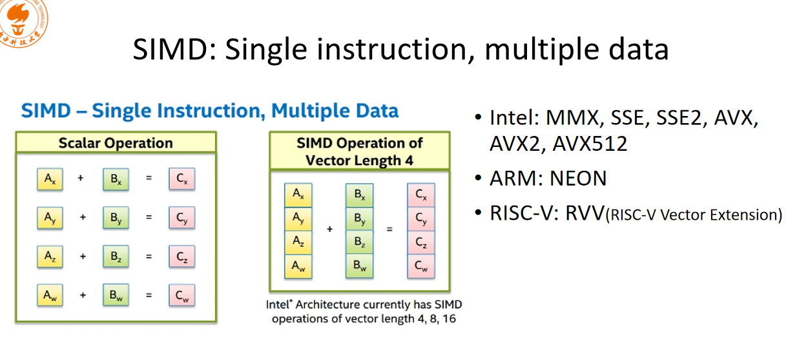
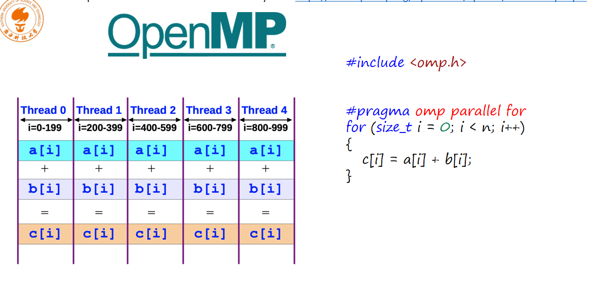
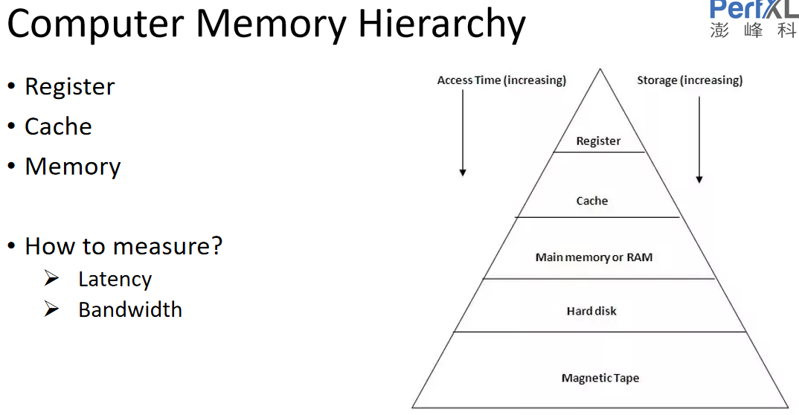

# HPC（高性能）

# 基础

## SIMD和OpenMp



SIMD: 一条命令执行多个数据的运算



openMP:数据分到各个核运算

# code optimization

## Register and Cache

register 

- register 寄存器
- latency 延迟 读写时间
- bandwidth 带宽 每次处理的数据大小

```c++
//利用cache加速 (空间局部性)

for(size_t i = 0; i < n; ++i)
{
    for(size_t j = 0; j < n; ++j)
        c[i][j] = A[i][j] + B[i][j];
}

for(size_t j = 0; j < n; ++j)
{
    for(size_t i = 0; i < n; ++i)
        c[i][j] = A[i][j] + B[i][j];
}

//利用k'j
//i-j循环更快 j的访问是连续的 数据会先放到cache cache的利用率会更高

```

## 局部性原理

- 时间局部性：访问的内存位置可能会再次访问
- 空间局部性：访问的内存位置，其附近的位置可能再次访问

```c++
for(size_t i = 0; i < n; ++i)
{
    for(size_t j = 0; j < n; ++j)
        c[i][j] = A[i][k] + B[i][j];
}

//优化 
for(size_t i = 0; i < n; ++i)
{
    int temp = A[i][k]
    for(size_t j = 0; j < n; ++j)
        c[i][j] = temp + B[i][j];
}

//复用数据提高时间局部性 简单的案列编译器会直接优化
```


