# HPC（高性能）

# 测试工具

## windows

### 检测内存泄漏

```c++
#define _CRTDBG_MAP_ALLOC
#include <stdlib.h>
#include <crtdbg.h>

int main()
{
    _CrtDumpMemoryLeaks();
  	fun();
    _CrtDumpMemoryLeaks();  
}

//输出{62} normal block at 0x0001ad, 40bytes long
int main()
{
    _CrtSetBreakAlloc(62); //可以定位到内存泄漏的位置
	_CrtDumpMemoryLeaks();
  	fun();
    _CrtDumpMemoryLeaks();  
}
```


# 基础

## SIMD和OpenMp


SIMD: 一条命令执行多个数据的运算


openMP:数据分到各个核运算

# code optimization

## Register and Cache

register 

- register 寄存器
- latency 延迟 读写时间
- bandwidth 带宽 每次处理的数据大小

```c++
//利用cache加速 (空间局部性)

for(size_t i = 0; i < n; ++i)
{
    for(size_t j = 0; j < n; ++j)
        c[i][j] = A[i][j] + B[i][j];
}

for(size_t j = 0; j < n; ++j)
{
    for(size_t i = 0; i < n; ++i)
        c[i][j] = A[i][j] + B[i][j];
}

//利用k'j
//i-j循环更快 j的访问是连续的 数据会先放到cache cache的利用率会更高

```

## 局部性原理

- 时间局部性：访问的内存位置可能会再次访问
- 空间局部性：访问的内存位置，其附近的位置可能再次访问

```c++
for(size_t i = 0; i < n; ++i)
{
    for(size_t j = 0; j < n; ++j)
        c[i][j] = A[i][k] + B[i][j];
}

//优化 
for(size_t i = 0; i < n; ++i)
{
    int temp = A[i][k]
    for(size_t j = 0; j < n; ++j)
        c[i][j] = temp + B[i][j];
}

//复用数据提高时间局部性 简单的案列编译器会直接优化
```


# 编译和cmake

- 多文件编译：将多个代码文件编译成二进制文件 最后再链接
- 库：
    - 静态库：相等于直接把代码插入到可执行文件中，只需要一个文件即可执行
    - 动态库：可执行文件被加载时会读取指定目录中的dll文件，加载到内存中去，函数被调用时会跳转到相应的地址上
- 头文件：预处理阶段会将头文件的声明替换到实现文件中

## 使用第三方库

- 纯头文件引入：只需将头文件通过include_directoris包含进来。函数实现再头文件里，编译时间长
- 子模块引入：作为CMake子模块映入，通过add_subdirectory

```
fmtlib/fmt - 格式化库，提供 std::format 的替代品
gabime/spdlog - 能适配控制台，安卓等多后端的日志库
ericniebler/range-v3 - C++20 ranges 库就是受到他启发
g-truc/glm - 模仿 GLSL 语法的数学矢量/矩阵库
abseil/abseil-cpp - 旨在补充标准库没有的常用功能
bombela/backward-cpp - 实现了 C++ 的堆栈回溯便于调试
google/googletest - 谷歌单元测试框架
google/benchmark - 谷歌性能评估框架
glfw/glfw - OpenGL 窗口和上下文管理
libigl/libigl - 各种图形学算法大合集
```

- 引用预安装的第三方库：通过find_package来寻找。CMake认为一个包可以提供多个库，又称组件

```cmake
find_package(fmt REQUIRED)
target_link_libraries(a.out PUBLIC fmt::fmt) #使用fmt中的fmt组件
```


# RAII和智能指针

## c++更新

- c++14的lambda运行用auto自动推断类型
- c++17 CTAD(compile-time argument deduction, 编译器参数推断): `vector v = {1,2,3,4};`
- c++20 引入模块、format、协程
- c++ 20 允许函数参数为自动推断(void fun(auto&& v))


## RAII(Resource Acquisition Is Initialization)

RAII: 资源获取即初始化，资源释放即销毁。对象推出后自动销毁，具有异常安全性


# 模板元编程和函数式

`__PRETTY_FUNCTION__`可以打印当前的函数名

## 模板

- 模板函数可以自动推导参数类型
- 对某一类型进行特化

```c++
template <class T>
T twice(T t){
    return t*12;
}

std::string twice(std::string t){
    return t+t;
}

int main()
{
	twice("hello"); //报错 会去调用twice<char*>("hello");
}
```


- template <class T = int> 可以设置默认参数类型
- template <int N> 整数也可作为模板参数 N将作为编译期常量
- template <typename T> sum(const std::vector<T>& arr); 模板参数部分特化

### 模板的特性

- 模板会在编译时确定实例

- 如果不调用，不会检测语法错误
- **注意：** 编译器对模板的编译时堕性的。将声明放在a.h，实现放在a.cpp里面，a.cpp里没有调用也不会有实例，所以main.cpp里只看到声明从而出错。解决方案：可以在a.pp显示实例化。

## 自动推导

- typeid推导类型时，类型需具有虚函数才能准确推导

- decltype(变量名) 获取变量定义时候的类型- 。
- decltype(func()) p = func() 类似完美转发，还会知晓类型的引用定义

## 函数式

函数可以为另一个函数的参数

```c++
void call_twice(void func(int))
{
    func(0);
    func(1);
}

int main()
{
    call_twice(say_hello);
    return 0;
}
```

lambda表达式作为返回值

```c++
auto make_twice(){
	return [](int n){
		return n*2;
	}
}

int main(){
	auto twice = make_twice();
    call_twice(twice);
    return 0;
}

//lambad+模板 参数自动推导
//带auto参数的lamda表达式和模板函数一样，同样有惰性和多次编译的特性

template <typename Func>
void call_twice(Func const& func)
{
    std::cout << func(3.14f) << std::endl;
    std::cout << func(21) << std::endl;
}

int main()
{
    auto twice = [](auto n){
        return n*2;
    };
    call_twice(twice);
    return 0;
}


```

# 汇编角度看编译器优化

## 汇编语言

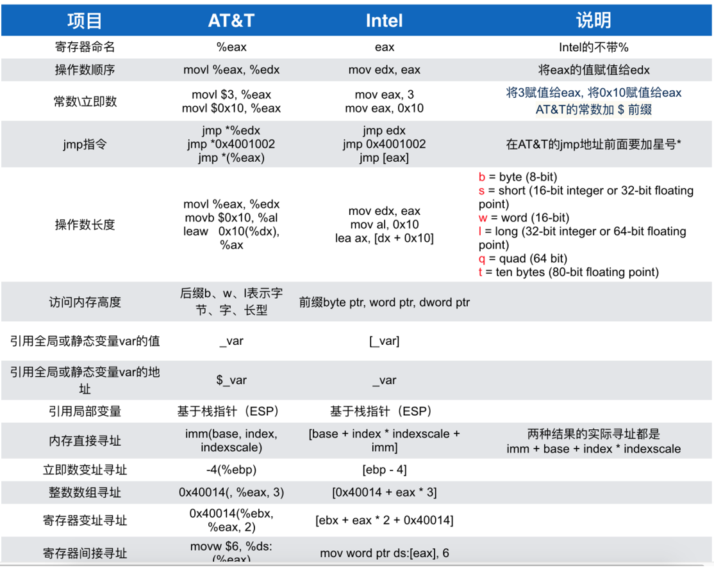

常见的汇编有AT&T、intel和arm，其区别如下：

- AT&T 通用的汇编各式，在各类cpu下都可以使用。gcc默认
- intel只能在x86系列cpu上运行
- arm：arm公司的汇编格式

## 汇编案例

编译一个汇编语言文件(.s)

```bash
objdump -D hello #反汇编hello
objdump -S hello #其反汇编并且将其 C 语言源代码混合
```


```bash
#生成汇编语言
gcc -fomit-frame-pointer -fverbose-asm -S main.cpp -o main.S
-fomit-frame-pointer(生成更简洁) -fverbose-asm(提升源代码在哪)

#使用-O3优化代码结构
gcc -O3 -fomit-frame-pointer -fverbose-asm -S main.cpp -o main.S
```

### 使用lead优化加乘运算

```cpp
int fun(int a, int b)
{
	return a + 8 * b;
}
//使用-O3优化成汇编如下
leal (%rdi, %rsi, 8), %eax # eax = rdi + rsi * 8
```

### 指针索引尽量使用size_t

```cpp
int fun(int* a, std::size_t b)
{
    return a[b]; //如果不是会将b放到寄存器上
}
```

### addss指令

addss指令含义：

- add表示加法操作
- 第一个 s 表示标量(scalar)，只对 xmm 的最低位进行运算；也可以是 p 表示矢量(packed)，一次对 xmm 中所有位进行运算。
- 第二个 s 表示单精度浮点数(single)，即 float 类型；也可以是 d 表示双精度浮点数(double)，即 double 类型。

> addss:一个float加法		addps:四个float加法
>
> addsd:一个double加法	addpd:两个double加法

## 编译器化简

编译器优化主要针对在栈上的变量。如：array, bitset, glm::vec, string_viewpair, tuple, optional, variant

### 常数化简

```cpp
int fun()
{
 	int a = 32;
 	int b = 10;
 	return a + b;
}
//化简后
movl $42, %eax //作为常数返回
    
int func()
{
    int ret = 0;
    for(int i = 1; i <= 100; ++i)
        ret += i;
   	return ret;
}

//简单的for循环可优化 返回成常数5050返回
```

## 内联

### 多个函数定义在不同文件

- @PLT 是 Procedure Linkage Table 的缩写，即函数链接表。链接器会查找其他 .o 文件中是否定义了 _Z5otheri 这个符号，如果定义了则把这个 @PLT 替换为他的地址。
- O3优化后可以将call编程jmp 直接跳转到地址

### 多个函数定义在同一个文件

- 如果 _Z5otheri 定义在同一个文件中，编译器会直接调用，没有 @PLT 表示未定义对象。减轻了链接器的负担。
- 内联：当编译器看得到被调用函数（other）实现的时候，会直接把函数实现贴到调用他的函数（func）里
- `call`（Call）指令也是跳转指令，但它是有条件的。`call` 指令将当前指令的地址压入栈中，并跳转到指定的地址(需要查找)。当被调用的程序执行完毕后，可以使用 `ret`（Return）指令返回到调用它的程序。
- `jmp`（Jump）指令是无条件跳转指令，它可以将程序执行的控制权转移到指定的地址，不考虑当前的程序状态。例如：
- O3优化可以使call优化成jmp

## 指针优化

```cpp
void func(int *a, int *b, int *c)
{
	*c = *a;
    *c = *b;
}
//是否优化*c = *b;
//如果b和c指向同一变量
优化前b=a;
优化后b=b;
```

### volatile（禁止优化）

加了 volatile 的对象，编译器会放弃优化对他的读写操作。直接从地址读取

### __restrict关键字（优先优化）

__restrict 是一个提示性的关键字，是程序员向编译器保证：这些指针之间不会发生重叠！从而他可以放心地优化成功：

## 矢量化

使用SIMD将多次运算变成一个矢量运算

**-march=native** 让编译器自动判断当前硬件支持的指令。

```cpp
for(int i = 0; i < n; ++i)
	a[i] = 0;
//优化成memcpy
```

### 指针对齐

C++20 引入了标准化的 std::assume_aligned

```cpp
a = std::assume_aligned<16>(a); //16子节对齐
```

## 循环

   对于不同类型的指针

```cpp
void func(float* a, float *b)
{
	for(int i = 0; i < 1024; ++i)
        a[i] = b[i] + 1;
}
```

考虑到func(a, a+1)的情况，不能simd化，所以编译器会生成两份代码：

- 没有重叠，跳转到SIMD高效运行
- 重叠，则会跳转到标量版本低效运行

为了强制矢量化，改成如下代码：

```cpp
void func(float* __restrict a, float * __restrict b)
{
	for(int i = 0; i < 1024; ++i)
        a[i] = b[i] + 1;
}

//或者使用宏处理
//编译加入 -fopenmp
void func(float* __restrict a, float * __restrict b)
{
#pragma omp simd
	for(int i = 0; i < 1024; ++i)
        a[i] = b[i] + 1;
}
```

### 循环中的if移动到外面

有 if 分支的循环体是难以 SIMD 矢量化的。

### 循环中的不变量挪到外面运算

```cpp
void func(float *a, float *b, float dt)
{
	for(int i = 0; i < 1024; ++i)
        a[i] = a[i] + b[i]*dt*dt;
}
```

然而只要去掉 (dt * dt) 的括号就会优化失败：因为乘法是左结合的，就相当于 (b[i] * dt) * dt编译器识别不到不变量，从而优化失败。

因此，要么帮编译器打上括号帮助他识别，要么手动提取不变量到循环体外

### 循环调用另一个文件的函数

循环调用另一个文件的函数会导致优化失败

避免在 for 循环体里调用外部函数，把他们移到同一个文件里，或者放在头文件声明为 static 函数。

```cpp
void other()
{

}

float func(float *a)
{
    float ret = 0;
    for(int i = 0; i < 1024; ++i)
    {
        ret += a[i];
        other;
    }
    return ret;
}
```

### 循环展开优化速度

背景：每次执行循环体 a[i] = 1后，都要进行一次判断 i < 1024。导致一部分时间花在判断是否结束循环，而不是循环体里

对于 GCC 编译器，可以用#pragma GCC unroll 4表示把循环体展开为4个

对小的循环体进行 unroll 可能是划算的，但最好不要 unroll 大的循环体，否则会造成指令缓存的压力反而变慢！

```cpp
void func(float* a)
{
#pragma GCC unroll 4
    for(int i = 0; i < 1024; ++i)
        a[i] = 1;
}

//gcc unrool 4后类似如下
void func(float* a)
{
    for(int i = 0; i < 1024; i += 4)
    {
        a[i+0]; a[i+1]; a[i+2]; a[i+3];
    }
}
```

## 结构体

如果结构体没有8子节或者16子节对齐可能无法矢量化

```cpp
//填充子节使之16子节对齐
struct MyVec{
    float x;
    float y;
    float z;
    char padding[4];
};

//c++11 使用alignas填充对齐
struct alignas(16) MyVec{
    float x;
    float y;
    float z;
};


//结构体定义在内部 会直接优化为返回 因为函数内不允许外部
#define N 1024
struct  Point{
    float x;
    float y;
    float z;
    char tmp[4];
};
void compute(int* a, int n){
    Point ps[N];
    for(int i = 0; i < N; ++i)
        ps[i].x = ps[i].x + ps[i].y + ps[i].z;
}
```

### 结构体的内存布局

- AOS（Array of Struct）单个对象的属性紧挨着存储
- SOA（Struct of Array）属性分离存储在多个数组

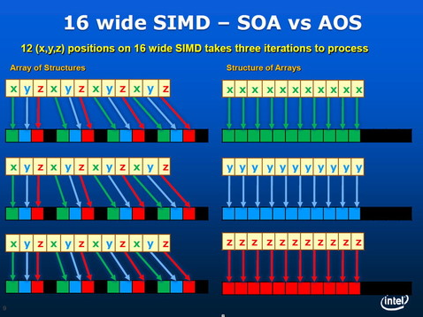

SOA不符合面向对象编程 (OOP) 的习惯，但常常有利于性能。又称之为面向数据编程 (DOP)。

```cpp
struct MyVec{
    float x[1024];
    float y[1024];
    float z[1024];
};

void func(){
	for(int i = 0; i < 1024; ++i)
		a.x[i] *= a.y[i];
}
```

## stl容器

stl容器也会存在指针别名问题，且restrict不可解决

使用pragma omp simd 或 pragma GCC ivdep让编译器优化

### vector也能实现SOA

```cpp
//需保证xyz三个vector是同样大小的
#include <vector>
struct MyVec{
  std::vector<float> x;
  std::vector<float> y;
  std::vector<float> z; 
};
MyVec a
void func()
{
    for(std::size_t i = 0; i < a.x.size(); ++i)
        a.x[i] *= a.y[i];
}

```

## 数学运算

- -ffast-math：选项让 GCC 更大胆地尝试浮点运算的优化，有时能带来 2 倍左右的提升。作为代价，他对 NaN 和无穷大的处理，可能会和 IEEE 标准（腐朽的）规定的不一致。如果你能保证，程序中永远不会出现 NaN 和无穷大，那么可以放心打开 -ffast-math。
- 数学函数请加 std:: 前缀

```cpp
sqrt //只接受double
sqrtf //只接受float
std::sqrt //自适应接受函数参数
```

```cpp
#include <cmath>


for (int j = 0; j < 1024; j++) {
	c[i] += a[i] * b[j]; //b
}

void func(float *a, float *b, float *c) {
    for (int i = 0; i < 1024; i++) {
        float tmp = c[i];
        for (int j = 0; j < 1024; j++) {
            tmp += a[i] * b[j]; //b
        }
        c[i] = tmp;
    }
}


void func(float *a, float *b, float *c) {
    for (int i = 0; i < 1024; i++) {
        float tmp = 0;
        for (int j = 0; j < 1024; j++) {
            tmp += a[i] * b[j];
        }
        c[i] += tmp; //精度会更高 0.00001加10000000000可能值不变
    }
}

```

## 对应cmake选项

| gcc opt                   | cmake opt                                                    |
| ------------------------- | ------------------------------------------------------------ |
| -O3                       | set(CMAKE_BUILD_TYPE Release)                                |
| -fopenmp                  | find_package(OpenMP REQUIRED)<br />target_link_libraries(main PUBLIC OpenMP::OpenMP_CXX) |
| -ffast-math/-march=native | target_compile_options(main PUBLIC -ffast-math -march=native) |


## 总结

- 函数尽量写在同一个文件内
- 避免在 for 循环内调用外部函数
- 非 const 指针加上 __restrict 修饰
- 试着用 SOA 取代 AOS
- 对齐到 16 或 64 字节
- 简单的代码，不要复杂化
- 试试看 #pragma omp simd
- 循环中不变的常量挪到外面来
- 对小循环体用 #pragma unroll
- -ffast-math 和 -march=native
- size_t访问下标

# c++11多线程编程

time

```cpp
//C++11映入std::chrono
//时间点类型：chrono::steady_clock::time_point 等
//时间段类型：chrono::milliseconds，chrono::seconds，chrono::minutes 等
//方便的运算符重载：时间点+时间段=时间点，时间点-时间点=时间段
#include <chrono>
auto t0 = chrono::steady_clock::now();                            // 获取当前时间点
auto t1 = t0 + chrono::seconds(30);                                 // 当前时间点的30秒后
auto dt = t1 - t0;                                                                // 获取两个时间点的差（时间段）
int64_t sec = chrono::duration_cast<chrono::seconds>(dt).count();  // 时间差的秒数

```


## 多线程

使用std::thread创建线程

```cpp
#include <thread>
void dowload(std::string file);
int main()
{
    std::thread t1([&]{
        download("hello.zip");
    });
    t1.detach(); //移到后台运行，分离后在线程退出以后自动销毁自己
    t1.join();	//等待该线程结束
}
```

构造一个线程池

```cpp
class Threadpool{
    std::vector<std::thread> m_pool;
public:
    void push_back(std::thread&& thr){
        m_pool.push_back(std::move(thr));
    }
    ~Threadpool(){
		for(auto &t : m_pool) t.join();
    }
}

Threadpool tpool;

void myfunc()
{
 	std::thread t1([&]{
        download("hello.zip");
    });
    tpool.push_back(std::move(t1));	//移交给线程池控制
}
```

c++20后引入了std::jthread类（符合RAII思想），解构自动join()


## 异步

- std::async接受一个带返回值的 lambda，自身返回一个 std::future 对象
- lambda 的函数体将在另一个线程里执行
- lambda会在后台运行，main函数可以执行其他任务
- 最后调用 future 的 get() 方法，如果此时 download 还没完成，会等待 download 完成，并获取 download 的返回值。

```cpp
#include <iostream>
#include <string>
#include <thread>
#include <future>

int download(std::string file) {
    for (int i = 0; i < 10; i++) {
        std::cout << "Downloading " << file
                  << " (" << i * 10 << "%)..." << std::endl;
        std::this_thread::sleep_for(std::chrono::milliseconds(400));
    }
    std::cout << "Download complete: " << file << std::endl;
    return 404;
}

void interact() {
    std::string name;
    std::cin >> name;
    std::cout << "Hi, " << name << std::endl;
}

int main() {
    std::future<int> fret = std::async([&] {
        return download("hello.zip"); 
    });
    interact();
    int ret = fret.get();
    std::cout << "Download result: " << ret << std::endl;
    return 0;
}

```

### future的一些方法

- get() 等待执行完毕，并返回函数值
- wait() 等待执行完毕，不返回函数值
- wait_for(time) 指定一个最长等待时间，没执行完future_status::timeout，执行完future_status::ready
- wait_untill()同上，参数为一个时间点

```cpp
#include <iostream>
#include <string>
#include <thread>
#include <future>

int download(std::string file) {
    for (int i = 0; i < 10; i++) {
        std::cout << "Downloading " << file
                  << " (" << i * 10 << "%)..." << std::endl;
        std::this_thread::sleep_for(std::chrono::milliseconds(400));
    }
    std::cout << "Download complete: " << file << std::endl;
    return 404;
}

void interact() {
    std::string name;
    std::cin >> name;
    std::cout << "Hi, " << name << std::endl;
}

int main() {
    std::future<int> fret = std::async([&] {
        return download("hello.zip"); 
    });
    interact();
    while (true) {
        std::cout << "Waiting for download complete..." << std::endl;
        auto stat = fret.wait_for(std::chrono::milliseconds(1000)); //设置最长等待时间
        if (stat == std::future_status::ready) {
            std::cout << "Future is ready!!" << std::endl;
            break;
        } else {
            std::cout << "Future not ready!!" << std::endl;
        }
    }
    int ret = fret.get();
    std::cout << "Download result: " << ret << std::endl;
    return 0;
}
```

### async惰性求值

std::async的第一个参数设置为deferred，此时lambda函数会推迟到get()调用时运行

`std::async(std::launch::deferred, [&] {return download("hello.zip"); `

```cpp
#include <iostream>
#include <string>
#include <thread>
#include <future>

int download(std::string file) {
    for (int i = 0; i < 10; i++) {
        std::cout << "Downloading " << file
                  << " (" << i * 10 << "%)..." << std::endl;
        std::this_thread::sleep_for(std::chrono::milliseconds(400));
    }
    std::cout << "Download complete: " << file << std::endl;
    return 404;
}

void interact() {
    std::string name;
    std::cin >> name;
    std::cout << "Hi, " << name << std::endl;
}

int main() {
    std::future<int> fret = std::async(std::launch::deferred, [&] {
        return download("hello.zip"); 
    });
    interact();
    int ret = fret.get();
    std::cout << "Download result: " << ret << std::endl;
    return 0;
}

```

### std::async 的底层实现：std::promise

如果不想让 std::async 帮你自动创建线程，想要手动创建线程，可以直接用 std::promise。

```cpp
int main() {
    std::promise<int> pret;
    std::thread t1([&] {
        auto ret = download("hello.zip");
        pret.set_value(ret); //设置返回值
    });
    std::future<int> fret = pret.get_future();

    interact();
    int ret = fret.get();
    std::cout << "Download result: " << ret << std::endl;

    t1.join();
    return 0;
}

//future不能直接拷贝，需要使用share_future
int main() {
    std::shared_future<void> fret = std::async([&] {
        download("hello.zip"); 
    });
    auto fret2 = fret;
    auto fret3 = fret;
    interact();
    fret3.wait();
    std::cout << "Download completed" << std::endl;
    return 0;
}
```

## 互斥量

多个线程同时访问同一个 vector 会出现数据竞争（data-race）现象。

vector 不是多线程安全（MT-safe）的容器

| mutex                                                        | lock（RAII）                                                 |
| ------------------------------------------------------------ | ------------------------------------------------------------ |
| std::mutex m;;<br />m.lock(); m.unlock();                    | std::lock_guard grd(m)<br />std::unique_lock grd(m); //可提前grd.unlock() |
| std::shared_mutex m;<br />m.lock_shared();m.unlock_shared(); | std::shared_lock grd(m) //读<br />std::unique_lock grd(m); //写 |


### std::mutex

lock()加锁，unlock()解锁

```c++
#include <mutex>
int main() {
    std::vector<int> arr;
    std::mutex mtx;
    std::thread t1([&] {
        for (int i = 0; i < 1000; i++) {
            mtx.lock();
            arr.push_back(1);
            mtx.unlock();
        }
    });
    std::thread t2([&] {
        for (int i = 0; i < 1000; i++) {
            mtx.lock();
            arr.push_back(2);
            mtx.unlock();
        }
    });
    t1.join();
    t2.join();
    return 0;
}
```

### std::lock_guard

根据 RAII 思想，可将锁的持有视为资源，上锁视为锁的获取，解锁视为锁的释放。

std::lock_guard 就是这样一个工具类，他的构造函数里会调用 mtx.lock()，解构函数会调用 mtx.unlock()。

```cpp
#include <mutex>
int main()
{
    std::mutex mtx;
    std::vector<int> arr;
    std::thread t1[&]{
        for(int i = 0; i < 100; ++i)
        {
            std::lock_guard grd(mtx);
            arr.push_back(1);
        }
    }
    std::thread t2[&]{
        for(int i = 0; i < 100; ++i)
        {
            std::lock_guard grd(mtx);
            arr.push_back(1);
        }
    }
}
```

### std::unique_lock

unique_lock相比较lock_guard可以提前unlock()

unique_lock可以加入defer_lock，需要手动加入lock

```cpp
int main() {
    std::vector<int> arr;
    std::mutex mtx;
    std::thread t1([&] {
        for (int i = 0; i < 1000; i++) {
            std::unique_lock grd(mtx);
            arr.push_back(1);
        }
    });
    std::thread t2([&] {
        for (int i = 0; i < 1000; i++) {
            std::unique_lock grd(mtx, std::defer_lock);
            printf("before the lock\n");
            grd.lock();
            arr.push_back(2);
            grd.unlock();
            printf("outside of lock\n");
        }
    });
    t1.join();
    t2.join();
    return 0;
}
```

### try_lock()和try_lock_for()无阻塞

- lock()会等待直到解锁
- try_lock()无阻塞，上锁失败直接返回false,成功返回true
- tyr_lock_for(times)会等待一段时间才返回

```cpp
#include <mutex>

int main()
{
    std::mutex mt1;
    if(mt1.try_lock())
        std::cout << "success";
   	else
        std::cout << "failed";
}
```

## 死锁

双方都在等着对方释放锁，但是因为等待而无法释放锁，从而要无限制等下去。这种现象称为死锁

### 解决1：永远不要同时持有两个锁

最为简单的方法，就是一个线程永远不要同时持有两个锁

### 解决2：保证双方上锁顺序一致

其实，只需保证双方上锁的顺序一致，即可避免死锁

### 解决3：用 std::lock 同时对多个上锁

如果没办法保证上锁顺序一致，可以用标准库的 std::lock(mtx1, mtx2, ...) 函数，一次性对多个 mutex 上锁

他接受任意多个 mutex 作为参数，并且他保证在无论任意线程中调用的顺序是否相同，都不会产生死锁问题

```cpp
#inlcude <thread>
#include <mutex>

int main()
{
    std::mutex mt1;
    std::mutex mt2;
    
    std::thread t1([&]{
        for(int i = 0; i < 100; ++i)
        {
            std::lock(mt1, mt2);
            mt1.unlock();
            mt2.unlock();
        }
    });
    std::thread t2([&]{
        for(int i = 0; i < 100; ++i)
        {
            std::lock(mt1, mt2);
            mt2.unlock();
            mt1.unlock();
        }
    });
    
    t1.join();
    t2.join();
    return 0;
}
```

### std::lock 的 RAII 版本：std::scoped_lock

和 std::lock_guard 相对应，std::lock 也有 RAII 的版本 std::scoped_lock。只不过他可以同时对多个 mutex 上锁。

```c++
#inlcude <thread>
#include <mutex>

int main()
{
    std::mutex mt1;
    std::mutex mt2;
    
    std::thread t1([&]{
        for(int i = 0; i < 100; ++i)
        {
            std::scoped_lock grd(mt1, mt2);
        }
    });
    std::thread t2([&]{
        for(int i = 0; i < 100; ++i)
        {
            std::scoped_lock grd(mt1, mt2);
        }
    });
    t1.join();
    t2.join;
    return 0;
}
```

### 同一个进程死锁

**同一线程重复调用lock()也造成死锁**

```c++
#include <mutex>

std::mutex mt1;

void other()
{
    mt1.lock();
    mt1.unlock();
}

void func()
{
    mt1.lock();
    other(); //函数里面上锁会无线等待
    mt1.unlock();
}

int main()
{
    func();
    return 0;
}
```

### 解决1：other 里不要再上锁

### 解决2：改用 std::recursive_mutex

如果实在不能改的话，可以用 std::recursive_mutex。他会自动判断是不是同一个线程 lock() 了多次同一个锁，如果是则让计数器加1，之后 unlock() 会让计数器减1，减到0时才真正解锁。但是相比普通的 std::mutex 有一定性能损失。

```c++
#include <mutex>
std::recursive_mutex mtx1;
void other()
{
    mt1.lock();//是同一个线程会让计数器加1
    mt1.unlock();
}

void func()
{
    mt1.lock();
    other(); 
    mt1.unlock();
}

int main()
{
    func();
    return 0;
}
```

## 数据结构

### 封装一个线程安全的vector

```c++
class MyVector{
    std::vector<int> arr;
    mutable std::mutex mtx; //在const函数里也可改变
public:
    void push_back(int val)
    {
        mtx.lock();
        arr.push_back(val);
        mtx.unlock();
    }
    size_t size() const
    {
        mtx.lock();
        size_t ret = arr.size();
        mtx.unlock();
        return ret;
	}
}
```

### 读写锁 std::shared_mutex

读可以共享，写必须独占，且写和读不能共存，这就是读写锁。

因此提供std::shared_mutex:

- 写：使用lock和unlock的组合
- 读：使用lock_shared和unlock_shared的组合

```cpp
class MyVector{
    std::vector<int> arr;
    mutable std::shared_mutex mtx; //在const函数里也可改变
public:
    void push_back(int val)
    {
        mtx.lock();
        arr.push_back(val);
        mtx.unlock();
    }
    size_t size() const
    {
        mtx.lock_shared();
        size_t ret = arr.size();
        mtx.unlock_shared();
        return ret;
	}
}
```


### std::shared_lock: 符合 RAII 思想的 lock_shared()

正如 std::unique_lock 针对 lock()，也可以用 std::shared_lock 针对 lock_shared()。

shared_lock 同样支持 defer_lock 做参数，owns_lock() 判断等

```cpp
class MyVector{
    std::vector<int> arr;
    mutable std::shared_mutex mtx; //在const函数里也可改变
public:
    void push_back(int val)
    {
        std::unique_lock grd(mtx); //unique
        arr.push_back(val);
    }
    size_t size() const
    {
        std::shared_lock grd(mtx); //shared
        size_t ret = arr.size();
        return ret;
	}
}
```

## 访问者模式

```cpp
#include <iostream>
#include <thread>
#include <vector>
#include <mutex>

class MTVector {
    std::vector<int> m_arr;
    std::mutex m_mtx;

public:
    class Accessor {
        MTVector &m_that;
        std::unique_lock<std::mutex> m_guard; 

    public:
        Accessor(MTVector &that)
            : m_that(that), m_guard(that.m_mtx)
        {}

        void push_back(int val) const {
            return m_that.m_arr.push_back(val);
        }

        size_t size() const {
            return m_that.m_arr.size();
        }
    };

    Accessor access() {
        return {*this};
    }
};

int main() {
    MTVector arr;

    std::thread t1([&] () {
        auto axr = arr.access(); //使用acc类访问 access类中的unique会z'd
        for (int i = 0; i < 1000; i++) {
            axr.push_back(i);
        }
    });

    std::thread t2([&] () {
        auto axr = arr.access();
        for (int i = 0; i < 1000; i++) {
            axr.push_back(1000 + i);
        }
    });

    t1.join();
    t2.join();

    std::cout << arr.access().size() << std::endl;

    return 0;
}

```

## 条件变量

### 基础

`std::condition_variable`和`std::unique_lock<std::mutex>`一起使用实现条件变量控制

```c++
#include <iostream>
#include <thread>
#include <mutex>
#include <condition_variable>

int main()
{
    std::condition_variable cv;
    std::mutex mtx;
    std::thread t1([&]{
        std::unique_lock lck(mtk);
        cv.wait(lck);
    });
    std::cout << "t1 is awake" << std::endl;
    cv.notify_one();	//唤醒线程
    t1.join();
    return 0;
}
```

- 还可以额外指定一个参数，变成 cv.wait(lck, expr) 的形式，其中 expr 是个 lambda 表达式，只有其返回值为 true 时才会真正唤醒，否则继续等待

```c++
int main()
{
    std::condition_variable cv;
    std::mutex mtx;
    bool ready = false;
    std::thread t1([&]{
        std::unique_lock lck(mtk);
        cv.wait(lck, [&] {return ready;});
        lck.unlock();
        std::cout << "t1 is awake" << std::endl;
    });;
    
    std::cout << "not ready" << std::endl;
    cv.notify_one();
    
    ready=ture;
    std::cout << "ready" << std::endl;
    cv.notif_one();
     
    t1.join();
    return 0;
}
```

### 多个等待者

- cv.notify_one() 只会唤醒其中一个等待中的线程，而 cv.notify_all() 会唤醒全部。
- 这就是为什么 wait() 需要一个 unique_lock 作为参数，因为要保证多个线程被唤醒时，只有一个能够被启动。如果不需要，在 wait() 返回后调用 lck.unlock() 即可
- 顺便一提，wait() 的过程中会暂停 unlock() 这个锁。

### 案例 实现生产者消费者模式

```cpp
#include <iostream>
#include <thread>
#include <vector>
#include <mutex>
#include <condition_variable>

template <typename T>
class MTQueue{
    std::condition_variable m_cv;
    std::mutex m_mtx;
    std::vector<T> m_arr;
public:
    T pop(){
        std::unique_lock lck(m_mtx);
        m_cv.wait(lck, [this] {return !m_arr.empty();});
        T ret = std::move(m_arr.back());
        m_arr.pop_back();
        return ret;
    }

    auto pop_hold(){
        std::unique_lock lck(m_mtx);
        m_cv.wait(lck, [this] {return !m_arr.empty();});
        T ret = std::move(m_arr.back());
        m_arr.pop_back();
        return std::pair(std::move(ret), std::move(lck));
    }

    void push(T val){
        std::unique_lock lck(m_mtx);
        m_arr.push_back(std::move(val));
        m_cv.notify_one();
    }

    void push_many(std::initializer_list<T> vals) {
        std::unique_lock lck(m_mtx);
        std::copy(
                 std::move_iterator(vals.begin()),
                 std::move_iterator(vals.end()),
                 std::back_insert_iterator(m_arr));
        m_cv.notify_all();
    }
};

int main(){
    MTQueue<int> foods;
    std::thread t1([&]{
        for(int i = 0; i < 2; ++i){
            auto food = foods.pop();
            std::cout << "t1 got food " << food << std::endl;
        }
    });

    std::thread t2([&]{
        for(int i = 0; i < 2; ++i){
            auto food = foods.pop();
            std::cout << "t2 got food " << food << std::endl;
        }
    });
    foods.push(42);
    foods.push(233);
    foods.push_many({666, 4399});

    t1.join();
    t2.join();
    return 0;
    
}
```


## 原子操作

原子操作即不可分离，多线程运行时必须执行完才会执行其他线程

```c++
//案列
//下面代码可以避免冲突问题
//问题：mutex 太过重量级，他会让线程被挂起，从而需要通过系统调用，进入内核层，调度到其他线程执行，有很大的内核态和用户态转换开销。
#include <iostream>
#include <thread>
#include <mutex>

int main() {
    std::mutex mtx;
    int counter = 0;

    std::thread t1([&] {
        for (int i = 0; i < 10000; i++) {
            mtx.lock();
            counter += 1;
            mtx.unlock();
        }
    });

    std::thread t2([&] {
        for (int i = 0; i < 10000; i++) {
            mtx.lock();
            counter += 1;
            mtx.unlock();
        }
    });

    t1.join();
    t2.join();

    std::cout << counter << std::endl;

    return 0;
}
```

### 使用atomic实现原子操作

因此可以用更轻量级的 atomic，对他的 += 等操作，会被编译器转换成专门的指令。

CPU 识别到该指令时，会锁住内存总线，放弃乱序执行等优化策略（将该指令视为一个同步点，强制同步掉之前所有的内存操作），从而向你保证该操作是原子 (atomic) 的（取其不可分割之意），不会加法加到一半另一个线程插一脚进来

对于程序员，只需把 int 改成 atomic<int> 即可，也不必像 mutex 那样需要手动上锁解锁，因此用起来也更直观。

原子型运算：

`+= -= &= |= ++ --`

```cpp
//使用原子操作
int main() {
    std::atomic<int> counter = 0;

    std::thread t1([&] {
        for (int i = 0; i < 10000; i++) {
            counter += 1;
        }
    });

    std::thread t2([&] {
        for (int i = 0; i < 10000; i++) {
            counter += 1;
        }
    });

    t1.join();
    t2.join();

    std::cout << counter << std::endl;

    return 0;
}
```

### atomic库的函数

可以看到其中 compare_exchange_strong 的逻辑最为复杂，一般简称 CAS (compare-and-swap)，他是并行编程最常用的原子操作之一。实际上任何 atomic 操作，包括 fetch_add，都可以基于 CAS 来实现：这就是 Taichi 实现浮点数 atomic_add 的方法

```c++
//简化的伪代码
std::atomic<size_t> a_size = 0;
a_size.loa

class AtomicInt{
    int cnt;
    
    int store(int val){
        cnt = val;
    }
    
    int load() const{
        return cnt;
    }
    
    int fetch_add(int val){
        int old = cnt;
        cnt += val;
        return old;
    }
    
    int exchange(int val){
        int old = cnt;
        cnt = val;
        return old;
    }
    
    bool compare_exchange_strong(int &old, int val){
        if(cnt == old)
        {
            cnt = val;
            return true;
        }
        else
        {
            old = cnt;
            return false;
        }
    }
}
```

# 从并发到并行

- 并发：单核处理器，操作系统通过时间片调度算法，轮换着执行着不同的线程，看起来就好像是同时运行一样，其实每一时刻只有一个线程在运行。目的：异步地处理多个不同的任务，避免同步造成的阻塞
- 并行：多核处理器，每个处理器执行一个线程，真正的同时运行。目的：将一个任务分派到多个核上，从而更快完成任务。

**注意： 并行的效率会受到数据量、核心数目、内存边界的影响，可能造成并行后的效率并不高**

## TBB简单介绍

TBB和线程的区别：TBB最多分配跟物理核心一样多的线程(待定),一个任务不一定对应一个线程，如果任务数量超过CPU最大的线程数，会由 TBB 在用户层负责调度任务运行在多个预先分配好的线程，而不是由操作系统负责调度线程运行在多个物理核心。

```cpp
int main0() {
    tbb::task_group tg;
    tg.run([&] {
        download("hello.zip");
    }); //类似与线程
    tg.run([&] {
        interact();
    });
    tg.wait();
    return 0;
}

int main()
{
    tbb::parallel_invoke([&]{
    download("hello.zip");}, 
    [&]{interact();}); //控制多个任务并行执行
    return 0;
}

```

## 时间复杂度和工作量复杂度

并行算法的评估指标主要为：

- 时间复杂度：程序所用的总时间（重点）

- 工作复杂度：程序所用的计算量（次要）

时间复杂度决定了快慢，工作复杂度决定了耗电量。

并行算法的复杂度取决于数据量 n，还取决于线程数量 c，比如 O(n/c)。不过要注意如果线程数量超过了 CPU 核心数量，通常就无法再加速了，这就是为什么要买更多核的电脑。

## 映射(map)

映射任务指： **i->sin(i)**

使用tbb遍历由两种方式，block_range或迭代器：

- tbb::blocked_range, tbb::blocked_range2d, tbb::blocked_range3d
- tbb::parallel_for_each(iterator.....);

```cpp
//并行映射
#include <iostream>
#include <tbb/parallel_for.h>
#include <vector>
#include <cmath>

int main() {
    size_t n = 1<<26;
    std::vector<float> a(n);
	
    //封装前 将任务分给4个线程处理
    size_t maxt = 4;
    tbb::task_group tg;
    for(size_t t = 0; t < maxt; ++t)
    {
        auto beg = t* n / maxt; // 8/4=2 每个线程计算两个任务
        auto end = std::min(n, (t+1)*n/maxt);
        tg.run([&, beg, end]{
           for(size_t i = beg; i < end; ++i)
               a[i] = std::min(i);
        });
    }
    tg.wait();
    
    //封装后
    tbb::parallel_for(tbb::blocked_range<size_t>(0, n), [&](tbb::blocked_range<size_t> r){
        for(size_t i = r.begin(); i < r.end(); ++i)
            a[i] = std::sin(i);
    });
    
    //基于迭代器区间
    tbb::parallel_for_each(a.begin(), a.end(), [&](float &f){
       f = std::sin(f); 
    });
    
    return 0;
}

```

## 缩并（reduce）

缩并一般指累加等操作，但先后顺序可变。

```cpp
#include <iostream>
#include <vector>
#include <cmath>

int main()
{
    for(size_t i = 0; i < n; ++i)
        res += std::min(i);
   return 0;
}
```

串行缩并的时间复杂度为 O(n)，工作复杂度为 O(n)，其中 n 是元素个数

### 并行缩并

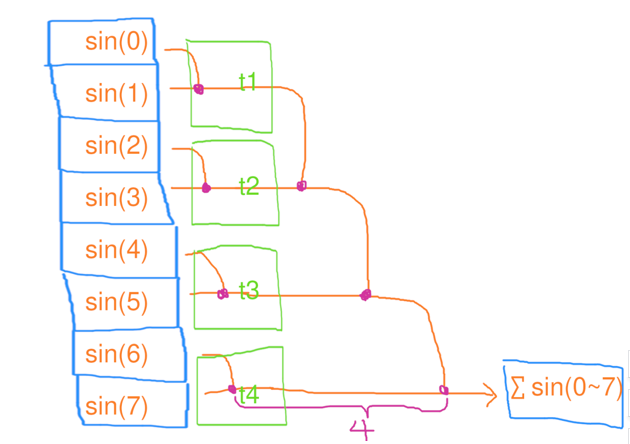

并行缩并的时间复杂度为 O(n/c+c)，工作复杂度为 O(n)，其中 n 是元素个数

```cpp
#include <iostream>
#include <tbb/task_group.h>
#include <vector>
#include <cmath>

int main(){
    size_t n = 1<<26;
    float res = 0;
    
    size_t maxt = 4;
    tbb::task_group tg;
    std::vector<float> tmp_res(maxt);
    for(size_t t = 0; t < maxt; ++t)
    {
        size_t beg = t* n/maxt;
        size_t end = std::min(n, (t+1)*n/maxt);
        tg.run([&, t, beg, end]{
           float local_res = 0;
           for(size_t i = beg; i < end; ++i)
               local_res += std::sin(i);
           tmp_res[t] = local_res;
        });
    }
    tg.wait();
    for(size_t t = 0; t<maxt; ++t)
    {
        res += tmp_res[t];
    }
    std::cout << res << std::endl;
    return 0;
}
```

### 改进的并行缩并(gpu)

采用归并的思想，一直归并到2次

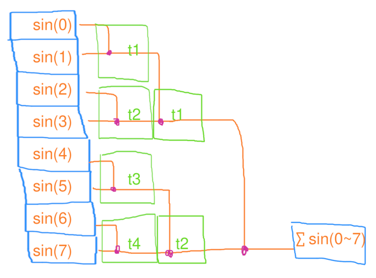

改进后的并行缩并的时间复杂度为 O(logn)，工作复杂度为 O(n)

### 封装后的并行缩并(parallel_reduce)

```cpp
#include <iostream>
#include <tbb/parallel_reduce.h>
#include <tbb/blocked_range.h>
#include <vector>
#include <cmath>

int main() {
    size_t n = 1<<26;
    float res = tbb::parallel_reduce(tbb::blocked_range<size_t>(0, n), (float)0,
    [&] (tbb::blocked_range<size_t> r, float local_res) {
        for (size_t i = r.begin(); i < r.end(); i++) {
            local_res += std::sin(i);
        }
        return local_res;
    }, [] (float x, float y) {
        return x + y;
    });

    //parallel_deterministic_reduce 保证每次运行结果一致
    
    std::cout << res << std::endl;
    return 0;
}
```

**并行缩并的好处**：串行的累加会造成运算前后操作数方差较大，而并行归并的方式方差小，精度高

## 扫描（scan）

扫描和缩并差不多，只不过他会把求和的中间结果存到数组里去

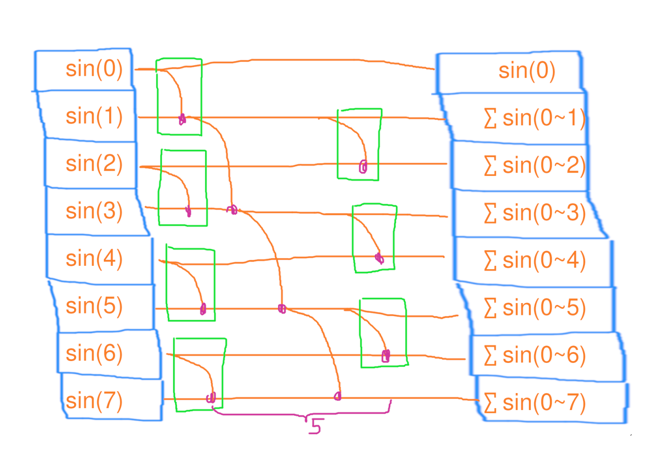

```cpp
#include <iostream>
#include <vector>
#include <cmath>

//串行扫描
int main() {
    size_t n = 1<<26;
    std::vector<float> a(n);
    float res = 0;

    for (size_t i = 0; i < n; i++) {
        res += std::sin(i);
        a[i] = res;
    }

    std::cout << a[n / 2] << std::endl;
    std::cout << res << std::endl;
    return 0;
}

#include <iostream>
#include <tbb/task_group.h>
#include <vector>
#include <cmath>

//归并扫描
int main() {
    size_t n = 1<<26;
    std::vector<float> a(n);
    float res = 0;

    size_t maxt = 4;
    tbb::task_group tg1;
    std::vector<float> tmp_res(maxt);
    for (size_t t = 0; t < maxt; t++) {
        size_t beg = t * n / maxt;
        size_t end = std::min(n, (t + 1) * n / maxt);
        tg1.run([&, t, beg, end] {
            float local_res = 0;
            for (size_t i = beg; i < end; i++) {
                local_res += std::sin(i);
            }
            tmp_res[t] = local_res;
        });
    }
    tg1.wait();
    for (size_t t = 0; t < maxt; t++) {
        tmp_res[t] += res;
        res = tmp_res[t];
    }
    tbb::task_group tg2;
    for (size_t t = 1; t < maxt; t++) {
        size_t beg = t * n / maxt - 1;
        size_t end = std::min(n, (t + 1) * n / maxt) - 1;
        tg2.run([&, t, beg, end] {
            float local_res = tmp_res[t];
            for (size_t i = beg; i < end; i++) {
                local_res += std::sin(i);
                a[i] = local_res;
            }
        });
    }
    tg2.wait();

    std::cout << a[n / 2] << std::endl;
    std::cout << res << std::endl;
    return 0;
}

//封装 parallel_scan
int main() {
    size_t n = 1<<26;
    std::vector<float> a(n);
    float res = tbb::parallel_scan(tbb::blocked_range<size_t>(0, n), (float)0,
    [&] (tbb::blocked_range<size_t> r, float local_res, auto is_final) {
        for (size_t i = r.begin(); i < r.end(); i++) {
            local_res += std::sin(i);
            if (is_final) {
                a[i] = local_res;
            }
        }
        return local_res;
    }, [] (float x, float y) {
        return x + y;
    });

    std::cout << a[n / 2] << std::endl;
    std::cout << res << std::endl;
    return 0;
}
```

## 任务域和嵌套

任务域即创建一个包含多个任务的结构体，并可以指定所使用的线程

`tbb::task_arena ta(4)`

```cpp
#include <iostream>
#include <tbb/parallel_for.h>
#include <tbb/task_arena.h>
#include <vector>
#include <cmath>

int main()
{
    size_t n = 1<<26;
    std::vector<float> a(n);
    tbb::task_arena ta(4); //指定使用4个线程
    ta.execute([&]{
       tbb::parallel_for((size_t)0, (size_t)n, [&](size_t i){
          a[i] = std::sin(i); 
       });
    });
    return 0;
}
```

### 嵌套for循环造成的死锁问题

pallel_for可以嵌套循环，但有可能造成死锁问题

```cpp
int main() {
    size_t n = 1<<13;
    std::vector<float> a(n * n);

    std::mutex mtx;
    tbb::parallel_for((size_t)0, (size_t)n, [&] (size_t i) {
        std::lock_guard lck(mtx);
        tbb::parallel_for((size_t)0, (size_t)n, [&] (size_t j) {
            a[i * n + j] = std::sin(i) * std::sin(j);
        });
    });

    return 0;
}
```

造成的原因：

- 因为 TBB 用了工作窃取法来分配任务：当一个线程 t1 做完自己队列里全部的工作时，会从另一个工作中线程 t2 的队列里取出任务，以免 t1 闲置浪费时间。
- 因此内部 for 循环有可能“窃取”到另一个外部 for 循环的任务，从而导致 mutex 被重复上锁。

### 死锁解决方法

- 用标准库的递归锁 std::recursive_mutex
- 创建另一个任务域，这样不同域之间就不会窃取工作
- 同一个任务域，但用 isolate 隔离，禁止其内部的工作被窃取（推荐）

```cpp

int main() {
    size_t n = 1<<13;
    std::vector<float> a(n * n);
    std::mutex mtx;
	
    //创建另一个域
    tbb::parallel_for((size_t)0, (size_t)n, [&] (size_t i) {
        std::lock_guard lck(mtx);
        tbb::task_arena ta;
        ta.execute([&] {
            tbb::parallel_for((size_t)0, (size_t)n, [&] (size_t j) {
                a[i * n + j] = std::sin(i) * std::sin(j);
            });
        });
    });
    
    //使用isolate隔离
    tbb::parallel_for((size_t)0, (size_t)n, [&] (size_t i) {
        std::lock_guard lck(mtx);
        tbb::this_task_arena::isolate([&] {
            tbb::parallel_for((size_t)0, (size_t)n, [&] (size_t j) {
                a[i * n + j] = std::sin(i) * std::sin(j);
            });
        });
    });

    return 0;
}
```

## 任务分配

- 并行计算，通常都是 CPU 有几个核心就开几个线程

- 并行的关键：如何均匀分配任务到每个线程？

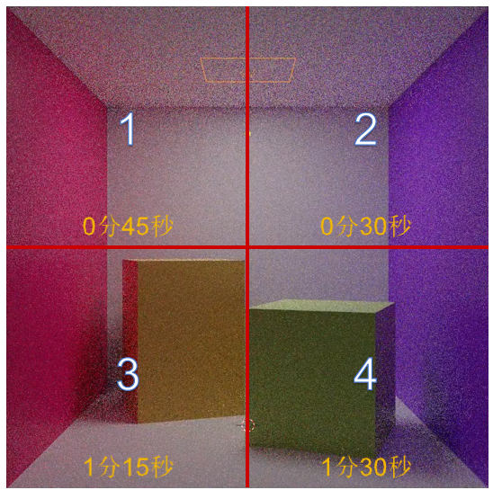

将任务均匀分配到四个线程上，但由于木桶效应，导致运行速度受限与最慢的第四个线程

### 解决1：线程数量超过CPU核心数量，让系统调度保证各个核心始终饱和

最简单的办法：只需要让线程数量超过CPU核心数量(切成16份，16个线程执行)，这时操作系统会自动启用时间片轮换调度，轮流执行每个线程。

- 思想：切得够多，方差越小
- 缺点：线程数量太多会造成调度的 overhead。

### 解决2：线程数量不变，但是用一个队列分发和认领任务

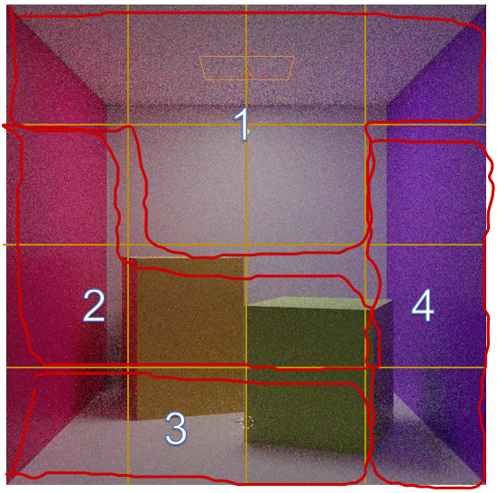

线程池的做法：我们仍是分配4个线程，但还是把图像切分为16份，作为一个“任务”推送到全局队列里去。每个线程空闲时会不断地从那个队列里取出数据，即“认领任务”。然后执行，执行完毕后才去认领下一个任务，从而即使每个任务工作量不一也能自动适应。

避免了线程需要保存上下文的开销。但是需要我们管理一个任务队列，而且要是线程安全的队列。

### 解决3：每个线程一个任务队列，做完本职工作后可以认领其他线程的任务

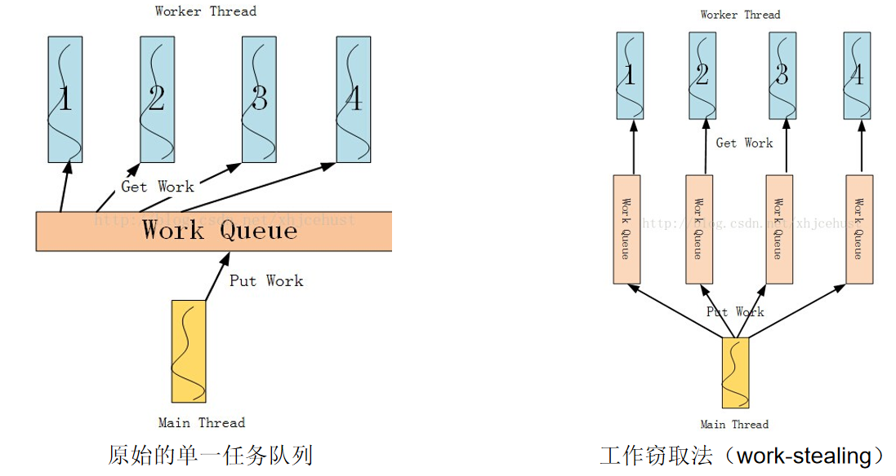

### 解决4：随机分配法（通过哈希函数或线性函数, 网格跨步循环（grid-stride loop）)

我们仍是分配4个线程，但还是把图像切分为16份。

把 (x,y) 那一份，分配给 (x + y * 3) % 4 号线程。这样总体来看每个线程分到的块的位置是随机的，从而由于正太分布数量越大方差越小的特点，每个线程分到的总工作量大概率是均匀的

## 任务分配的实现

### tbb::static_partitioner，指定区间的粒度

static_partitioner默认分配和线程一样多的任务 粒度为n/线程数

```cpp


int main(){
    size_t n = 32;
    tbb::task_arena ta(4);
    //创建了4个线程4个任务 每个任务包含 8 个元素
    ta.execute([&] {
        tbb::parallel_for(tbb::blocked_range<size_t>(0, n), // 32除4个任务=8个元素
        [&] (tbb::blocked_range<size_t> r) {
            mtprint("thread", tbb::this_task_arena::current_thread_index(), "size", r.size());
            std::this_thread::sleep_for(std::chrono::milliseconds(400));
        }, tbb::static_partitioner{});
    });
    
    ta.execute([&] {
        tbb::parallel_for(tbb::blocked_range<size_t>(0, n， 16), //16代表每个任务包含的元素 32除16个元素=2个任务 4个线程调度2个线程
        [&] (tbb::blocked_range<size_t> r) {
            mtprint("thread", tbb::this_task_arena::current_thread_index(), "size", r.size());
            std::this_thread::sleep_for(std::chrono::milliseconds(400));
        }, tbb::static_partitioner{});
    });  
}
```

### tbb::simple_partitioner

simple_partitioner默认每个任务粒度为1

```cpp
int main() {
    size_t n = 32;

    TICK(for);
    tbb::task_arena ta(4);
    ta.execute([&] {
        tbb::parallel_for(tbb::blocked_range<size_t>(0, n), //4个线程 每个任务粒度为1 32除1=32个任务
        [&] (tbb::blocked_range<size_t> r) {
            for (size_t i = r.begin(); i < r.end(); i++) {
                mtprint("thread", tbb::this_task_arena::current_thread_index(),
                        "size", r.size(), "begin", r.begin());
                std::this_thread::sleep_for(std::chrono::milliseconds(i * 10));
            }
        }, tbb::simple_partitioner{});
    });
    TOCK(for);
    
    ta.execute([&] {
        tbb::parallel_for(tbb::blocked_range<size_t>(0, n， 4), //指定每个任务包含4个元素
        [&] (tbb::blocked_range<size_t> r) {
            for (size_t i = r.begin(); i < r.end(); i++) {
                mtprint("thread", tbb::this_task_arena::current_thread_index(),
                        "size", r.size(), "begin", r.begin());
                std::this_thread::sleep_for(std::chrono::milliseconds(i * 10));
            }
        }, tbb::simple_partitioner{});
    });

    return 0;
}
```

> tbb::simple_partitioner 能够按照给定的粒度大小（grain）将矩阵进行分块。块内部小区域按照常规的两层循环访问以便矢量化，块外部大区域则以类似 Z 字型的曲线遍历，这样能保证每次访问的数据在地址上比较靠近，并且都是最近访问过的，从而已经在缓存里可以直接读写，避免了从主内存读写的超高延迟

### tbb::auto_partitioner（默认）

自动根据 lambda 中函数的执行时间判断采用何种分配方法。

### 总结

- tbb::static_partitioner 用于循环体均匀的情况 分得少且均匀
- tbb::simple_partitioner 用于循环体不均匀的情况效果很好 分得更多

## 并发容器

std::vector不是一个线程安全的容器，其指针和迭代器可能会被改变。

tbb提供tbb::concurrent_vector容器，特点如下：

- 他不保证元素在内存中是连续的。换来的优点是 push_back 进去的元素，扩容时不需要移动位置，从而指针和迭代器不会失效
-  push_back 会额外返回一个迭代器（iterator），指向刚刚插入的对象。
-  grow_by(n) 则可以一次扩充 n 个元素。他同样是返回一个迭代器（iterator），之后可以通过迭代器的 ++ 运算符依次访问连续的 n 个元素，* 运算符访问当前指向的元素。
- tbb::concurrent_vector 还是一个多线程安全的容器，能够被多个线程同时并发地 grow_by 或 push_back 而不出错。
- parallel_for 也支持迭代器

tbb对应stl也有其他容器，都以concurrent_开头的容器

## 并行筛选(filter)

筛选对容器进行遍历，选择中符合条件的值

### 筛选1

利用多线程安全的 concurrent_vector 动态追加数据基本没有加速>。内部可能频繁使用互斥锁导致效率不高

```cpp
int main()
{
    size_t n = 1<<27;
    tbb::concurrent_vector<float> a;
	tbb::parallel_for(tbb::blocked_range<size_t>(0, n),
    [&] (tbb::blocked_range<size_t> r) {
        for (size_t i = r.begin(); i < r.end(); i++) {
            float val = std::sin(i);
            if (val > 0) {
                a.push_back(val);
            }
        }
    });
}
```

### 筛选2

先推到线程局部（thread-local）的 vector最后一次性推入到 concurrent_vector可以避免频繁在 concurrent_vector 上产生锁竞争加速比：5.55 倍

```cpp
int main()
{
    tbb::parallel_for(tbb::blocked_range<size_t>(0, n),
    [&] (tbb::blocked_range<size_t> r) {
        std::vector<float> local_a;
        for (size_t i = r.begin(); i < r.end(); i++) {
            float val = std::sin(i);
            if (val > 0) {
                local_a.push_back(val);
            }
        }
        auto it = a.grow_by(local_a.size());
        for (size_t i = 0; i < local_a.size(); i++) {
            *it++ = local_a[i];
        }
    });
    return 0;
}
```

### 筛选3

线程局部的 vector 调用 reserve 预先分配一定内存避免 push_back 反复扩容时的分段式增长同时利用标准库的 std::copy 模板简化了代码加速比：5.94 倍

```cpp
int main()
{
    tbb::parallel_for(tbb::blocked_range<size_t>(0, n),
    [&] (tbb::blocked_range<size_t> r) {
        std::vector<float> local_a;
        local_a.reserve(r.size());
        for (size_t i = r.begin(); i < r.end(); i++) {
            float val = std::sin(i);
            if (val > 0) {
                local_a.push_back(val);
            }
        }
        auto it = a.grow_by(local_a.size());
        std::copy(local_a.begin(), local_a.end(), it);
    });
}
```

### 筛选4

采用std::vector作为数据结构,先对 a 预留一定的内存，避免频繁扩容影响性能。加速比：5.98 倍

```cpp
int main()
{
    size_t n = 1<<27;
    std::vector<float> a;
    std::mutex mtx;
    
	tbb::parallel_for(tbb::blocked_range<size_t>(0, n),
    [&] (tbb::blocked_range<size_t> r) {
        std::vector<float> local_a;
        local_a.reserve(r.size());
        for (size_t i = r.begin(); i < r.end(); i++) {
            float val = std::sin(i);
            if (val > 0) {
                local_a.push_back(val);
            }
        }
        std::lock_guard lck(mtx);
        std::copy(local_a.begin(), local_a.end(), std::back_inserter(a));
    });
}
```

### 筛选5 最快

彻底避免了互斥量，完全通过预先准备好的大小，配合 atomic 递增索引批量写入。同时用小彭老师拍脑袋想到的 pod 模板类，使得 vector 的 resize 不会零初始化其中的值。加速比：6.26 倍

```cpp
int main() {
    size_t n = 1<<27;
    std::vector<pod<float>> a;
    std::atomic<size_t> a_size = 0;

    TICK(filter);
    a.resize(n);
    tbb::parallel_for(tbb::blocked_range<size_t>(0, n),
    [&] (tbb::blocked_range<size_t> r) {
        std::vector<pod<float>> local_a(r.size());
        size_t lasize = 0;
        for (size_t i = r.begin(); i < r.end(); i++) {
            float val = std::sin(i);
            if (val > 0) {
                local_a[lasize++] = val;
            }
        }
        size_t base = a_size.fetch_add(lasize);
        for (size_t i = 0; i < lasize; i++) {
            a[base + i] = local_a[i];
        }
    });
    a.resize(a_size);
    TOCK(filter);

    return 0;
}
```

### 筛选6 gpu

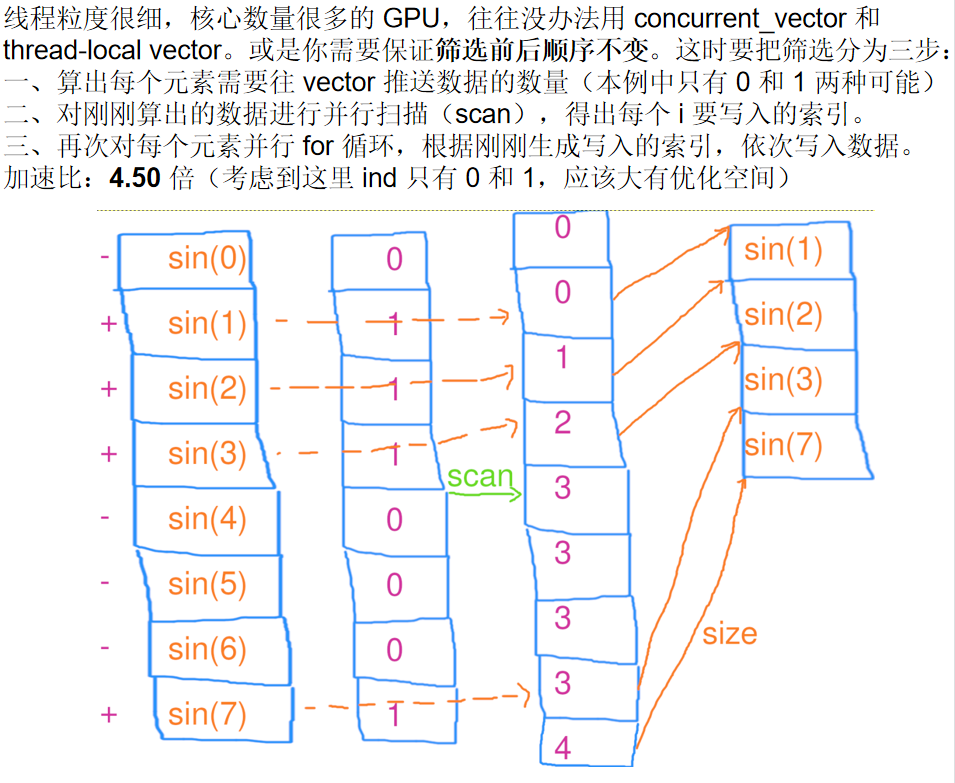

## 分治和排序

分治：将一个任务分成多个任务来执行，使用parallel_invoke来执行

优化：任务划分得够细时，转为串行，缓解调度负担（scheduling overhead）

```cpp
//斐波那契数列的优化
//tbb::parallel_invoke
int fib(int n)
{
    if(n < 2)
        return n;
    int a, b;
    tbb::parallel_invoke([&]{
        a = fib(n-1);
    }, [&]{
        b = fib(n-2);
    });
    return a + b;
}

int fib(int n)
{
    if(n < 2)
        return serial_fib(n); //串行执行
    int a, b;
    tbb::parallel_invoke([&]{
        a = fib(n-1);
    }, [&]{
        b = fib(n-2);
    });
    return a + b;
}
```

### 排序

递归函数可以使用并行来加速。同样数据足够小时，开始用标准库串行的排序

封装：tbb::parallel_sort

```cpp
int main()
{
    size_t n = 1<<24;
    std::generate(arr.begin(), arr.end(),std::rand);
    tbb::parallel_sort(arr.begin(), arr.end(), std::less<int>{});
    return 0;
}
```

## 流水线并行

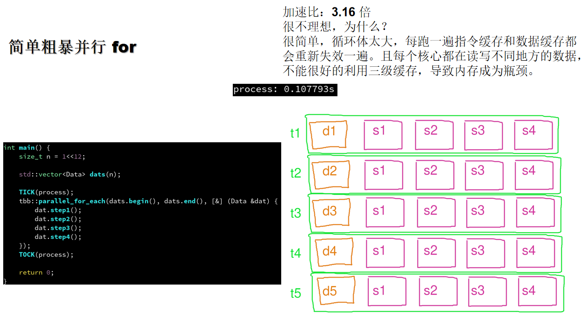

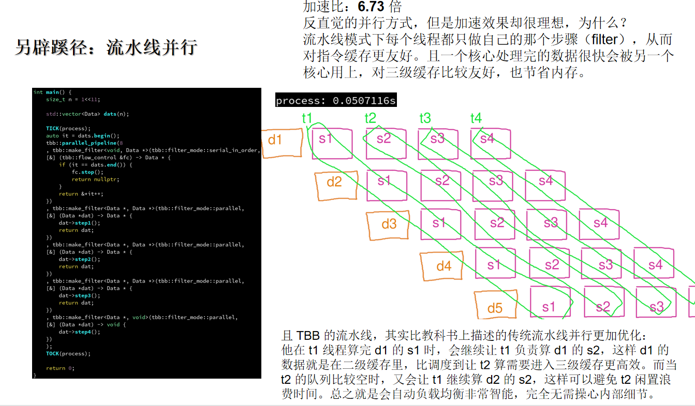

流水线并行参数：

- serial_in_order 表示当前步骤只允许串行执行，且执行的顺序必须一致。

- serial_out_of_order 表示只允许串行执行，但是顺序可以打乱。

- parallel 表示可以并行执行当前步骤，且顺序可以打乱。

- 每一个步骤（filter）的输入和返回类型都可以不一样。要求：流水线上一步的返回类型，必须和下一步的输入类型一致。且第一步的没有输入，最后一步没有返回，所以都为 void。

- TBB 支持嵌套的并行，因此流水线内部也可以调用 tbb::parallel_for 进一步并行。
- 流水线式的并行，因为每个线程执行的指令之间往往没有关系，主要适用于各个核心可以独立工作的 CPU，GPU 上则有 stream 作为替代

```cpp
int main() {
    size_t n = 1<<11;

    std::vector<Data> dats(n);
    std::vector<float> result;

    TICK(process);
    auto it = dats.begin();
    tbb::parallel_pipeline(8
    , tbb::make_filter<void, Data *>(tbb::filter_mode::serial_in_order,
    [&] (tbb::flow_control &fc) -> Data * {
        if (it == dats.end()) {
            fc.stop();
            return nullptr;
        }
        return &*it++;
    })
    , tbb::make_filter<Data *, Data *>(tbb::filter_mode::parallel,
    [&] (Data *dat) -> Data * {
        dat->step1();
        return dat;
    })
    , tbb::make_filter<Data *, Data *>(tbb::filter_mode::parallel,
    [&] (Data *dat) -> Data * {
        dat->step2();
        return dat;
    })
    , tbb::make_filter<Data *, Data *>(tbb::filter_mode::parallel,
    [&] (Data *dat) -> Data * {
        dat->step3();
        return dat;
    })
    , tbb::make_filter<Data *, float>(tbb::filter_mode::parallel,
    [&] (Data *dat) -> float {
        float sum = std::reduce(dat->arr.begin(), dat->arr.end());
        return sum;
    })
    , tbb::make_filter<float, void>(tbb::filter_mode::serial_out_of_order,
    [&] (float sum) -> void {
        result.push_back(sum);
    })
    );
    TOCK(process);

    return 0;
}
```


# 性能测试

### tbb提供的测试时间方法

```cpp
#include <tbb/tick_count.h>
#define TICK(x) auto bench__##x = tbb::tick_count::now();
#define TOCK(x) std::cout << #x " :" << (tbb::tick_count::now() - bench_##x).seconds() << "s" << std::endl;
```

### 评价指标

- 公式：加速比=串行用时÷并行用时
-  reduce 是内存密集型，for(sin) 是计算密集型

### googl benchmark

只需将你要测试的代码放在他的for (auto _: bm)里面即可。他会自动决定要重复多少次，保证结果是准确的，同时不浪费太多时间

```cpp
#include <iostream>
#include <vector>
#include <cmath>
#include <benchmark/benchmark.h>

constexpr size_t n = 1<<27;
std::vector<float> a(n);

void BM_for(benchmark::State &bm) {
    for (auto _: bm) {
        // fill a with sin(i)
        for (size_t i = 0; i < a.size(); i++) {
            a[i] = std::sin(i);
        }
    }
}
BENCHMARK(BM_for);

void BM_reduce(benchmark::State &bm) {
    for (auto _: bm) {
        // calculate sum of a
        float res = 0;
        for (size_t i = 0; i < a.size(); i++) {
            res += a[i];
        }
        benchmark::DoNotOptimize(res);
    }
}
BENCHMARK(BM_reduce);

BENCHMARK_MAIN();

```

# 访存优化

## 基本原理介绍

影响算法运行的有内存瓶颈和计算瓶颈。内存访问速度是远低于计算速度：

- 1次读写约等于8次加法，1次除法约等于2次加法

```cpp
int main()
{
    for(int i = 0; i < 64; ++i)
        a[i] = 1; // a[i] = func(i);
}

//上述代码计算非常简单，导致cpu大部分时间浪费在等内存延迟。
```

## 内存带宽

- 要想利用全部cpu核心，避免mem-bound，需要func里有足够的计算量。
- 当核心数量越多，CPU计算能力越强，相对之下来不及从内存读写数据，从而越容易mem-bound。
- 使用dmidecode查看内存信息 理论极限带宽=频率×宽度×数量

## 缓存和局域性

针对不同量度的数据量测试，可以发现在不同数据量下其带宽也不同

**lscpu #查看高速缓存大小**

```cpp
for(int i = 0; i < n; ++i)
    a[i] = 1;
//n为datasize
```

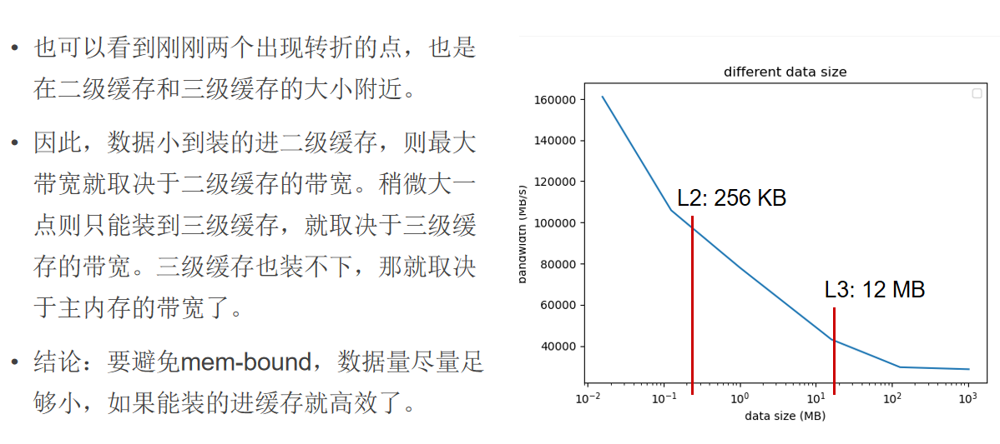

这是因为cpu内部有一片很小的存储器--缓存(cache):

- 当CPU访问某个地址时，会先查找缓存中是否有对应的数据。如果没有，则从内存中读取，并存储到缓存中；如果有，则直接使用缓存中的数据
- 读写时也都会通过cache来进行数据传输

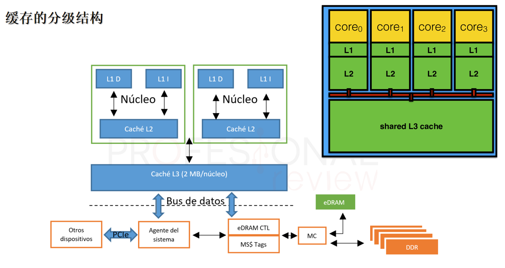

### 缓存的工作机制 读

当CPU读取一个地址时：

- 缓存会查找和该地址匹配的条目。如果找到，则给CPU返回缓存中的数据。如果找不到，则向主内存发送请求，等读取到该地址的数据，就创建一个新条目。
- 在 x86 架构中每个条目的存储 64 字节的数据，这个条目又称之为**缓存行（cacheline）**。
- **当访问 0x0048~0x0050 这 4 个字节时，实际会导致 0x0040~0x0080 的 64 字节数据整个被读取到缓存中**
- 这就是为什么我们喜欢把数据结构的起始地址和大小对齐到 64 字节，为的是不要浪费缓存行的存储空间。

### 缓存的工作机制 写

当CPU写入一个地址时：

- 缓存会查找和该地址匹配的条目。如果找到，则修改缓存中该地址的数据。如果找不到，则创建一个新条目来存储CPU写的数据，并标记为脏（dirty，缓存中改了内存没改）
- 当读和写创建的新条目过多，缓存快要塞不下时，他会把最不常用的那个条目移除，这个现象称为失效（invalid）。如果那个条目是被标记为脏的，则说明是当时打算写入的数据，那就需要向主内存发送写入请求，等他写入成功，才能安全移除这个条目。
- 如有多级缓存，则一级缓存失效后会丢给二级缓存。再依次丢给内存

### 缓存行决定数据的粒度

```cpp
int main()
{
    for(size_t i = 0; i < n; i += 1 )
    {
        a[i] = 1;
    }
    
    for(size_t i = 0; i < n; i += 2 )
    {
        a[i] = 1;
    }
    
    for(size_t i = 0; i < n; i += 4 )
    {
        a[i] = 1;
    }
    
    //上述小于64子节的跨步访问，其时间效率类似
}
```

**访问内存的用时，和访问的字节数量无关，和访问的每个字节所在的缓存行数量有关。**

**可见，能否很好的利用缓存，和程序访问内存的空间局域性有关。**

### 内存布局AOS和SOA

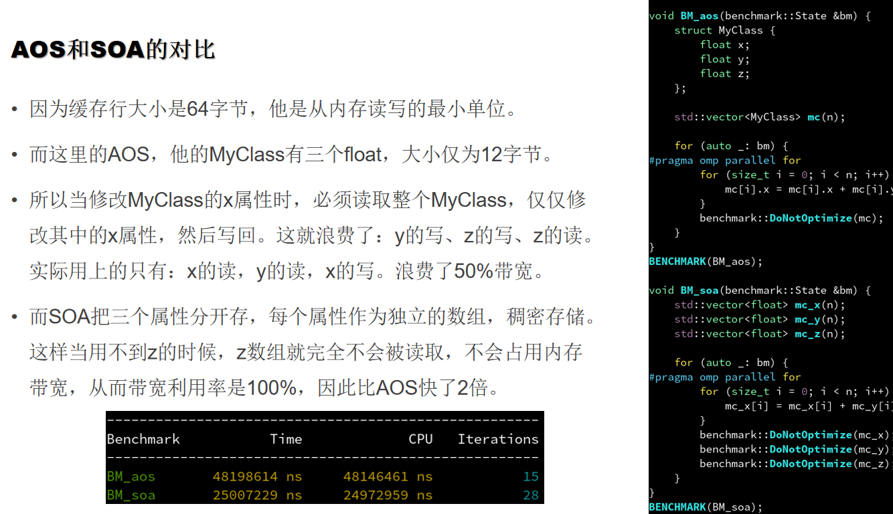

## 预取和直写

缓存行预取技术：当程序顺序访问 a[0], a[1] 时，CPU会智能地预测到你接下来可能会读取 a[2]，于是会提前给缓存发送一个读取指令，让他读取 a[2]、a[3]。缓存在后台默默读取数据的同时，CPU自己在继续处理 a[0] 的数据。这样等 a[0], a[1] 处理完以后，缓存也刚好读取完 a[2] 了，从而CPU不用等待，就可以直接开始处理 a[2]，避免等待数据的时候CPU空转浪费时间。**如果你的访存是随机的，那就没办法预测。**

> 64子节的随机访问比顺序访问慢的原因：
>
> 是因为顺序访问会提前预取，所以可以采用4096子节(页)的随机访问

### 页对齐的重要性

- 为什么要 4KB？原来现在操作系统管理内存是用分页（page），程序的内存是一页一页贴在地址空间中的，有些地方可能不可访问，或者还没有分配，则把这个页设为不可用状态，访问他就会出错，进入内核模式
- 因此硬件出于安全，**预取不能跨越页边界**，否则可能会触发不必要的 page fault。
- _mm_alloc 申请起始地址对齐到页边界的一段内存，真正做到每个块内部不出现跨页现象。

```cpp
void BM_random_4kb_aligned(benchmark::State& bm)
{
    float* a = (float*)_mm_alloc(n*sizeof(float), 4096);
    memset(a, 0, n*sizeof(float));
    for(auto _: bm)
    {
#pragma omp parallel for
        for(size_t i = 0; i < n/1024; ++i)
        {
         	size_t r = randomize(i) % (n/1024);
            for(size_t j = 0; j < 1024; j++)
                benchmark::DoNotOptimize(a[r*1024+j]);
        }
        benchmark::DoNotOptimize(a);
    }
    _mm_free(a);
}
```

### 手动预取（_mm_prefetch）

- 对于不得不随机访问很小一块的情况，还可以通过 _mm_prefetch 指令手动预取一个缓存行。
- 这里第一个参数是要预取的地址（最好对齐到缓存行），第二个参数 _MM_HINT_T0 代表预取数据到一级缓存，_MM_HINT_T1 代表只取到二级缓存，_MM_HINT_T2 代表三级缓存；_MM_HINT_NTA 则是预取到非临时缓冲结构中，可以最小化对缓存的污染，但是必须很快被用上。

```cpp
void BM_random_64B_prefetch(benchmark::State& bm)
{
    for(auto _: bm)
    {
#pragma omp parallel for
        for(size_t i = 0; i < n/16; ++i)
        {
            size_t next_r = randomize(i+64)%(n/16);
            _mm_prefetch(&a[next_r * 16], _MM_HINT_T0);
            size_t r = randomize(i) % (n/16);
            for(size_t j = 0; j < 16; j++)
                benchmark::DoNotOptimize(a[r*16+j]);
        }
    }
    benchmark::DoNotOptimize(a);
}
```

### 延迟隐藏

> 1次读写+0次加法”应该会比“1次读写+8次加法”快一点点吧，因为8次加法尽管比1次读写快很多，但是毕竟还是有时间的啊，为什么会几乎没有任何区别？

这都是得益于CPU的预取机制，他能够在等待a[i+1]的内存数据抵达时，默默地做着a[i]的计算，从而只要计算的延迟小于内存的延迟，延迟就被隐藏起来了，而不必等内存抵达了再算。

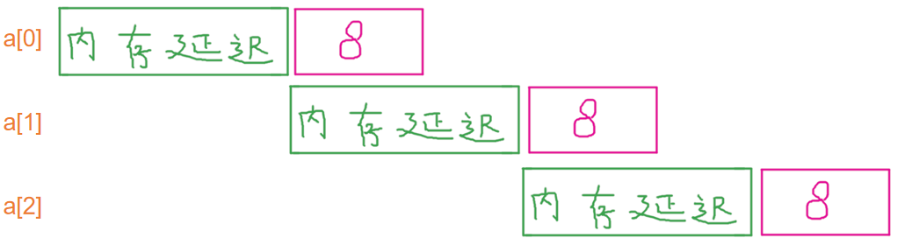

上图为延迟隐藏

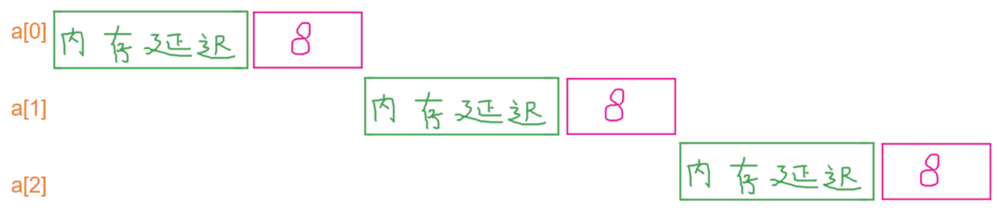

### 为什么写入比读取慢

注意到一个现象：写入花的时间似乎是读取的2倍？

> 原因：写入的粒度太小造成不必要的读取

- 这是因为缓存和内存通信的最小单位是缓存行：64字节。

- 当CPU试图写入4字节时，因为剩下的60字节没有改变，缓存不知道CPU接下来会不会用到那60字节，因此他只好从内存读取完整的64字节，修改其中的4字节为CPU给的数据，之后再择机写回。

- 这就导致了虽然没有用到读取数据，但实际上缓存还是从内存读取了，从而浪费了2倍带宽

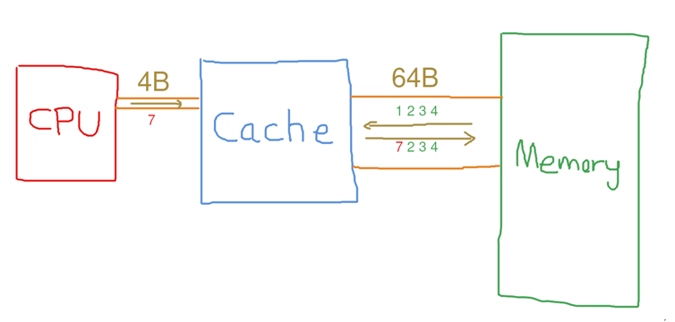

### 绕过缓存，直接写入：_mm_stream_si32

```cpp
void _mm_stream_si32(int* mem_addr, int a);
```


可以用 _mm_stream_si32 指令代替直接赋值的写入，他能够绕开缓存（缓存行），将一个4字节的写入操作，挂起到临时队列，等凑满**64字节**后，直接写入内存，从而完全避免读的带宽。

stream的特点：

- 因为 _mm_stream_si32 会绕开缓存，直接把数据写到内存，之后读取的话，反而需要等待 stream 写回执行完成，然后重新读取到缓存，反而更低效。
- 适用于： 该数组只有写入，之前完全没有读取过。之后没有再读取该数组的地方。

### 4倍矢量化的版本：_mm_stream_ps

```cpp
void _mm_stream_ps(float* mem_addr, __m128 a);
```

- _mm_stream_si32 可以一次性写入4字节到挂起队列。而 _mm_stream_ps 可以一次性写入 16 字节到挂起队列，更加高效了

- 不过，_mm_stream_ps 写入的地址**必须对齐到 16 字节**，否则会产生段错误等异常
- 需要注意，stream 系列指令写入的地址，必须是连续的，中间不能有跨步，否则无法合并写入，会产生有中间数据读的带宽

### intel关于_MM系列

https://www.intel.com/content/www/us/en/docs/intrinsics-guide/index.html

## 循环合并法

### 两个循环体的合并

```cpp
for(size_t i = 0; i < n; ++i)
    a[i] = a[i] * 2;
for(size_t i = 0; i < n; ++i)
    a[i] = a[i] + 1;

//上述代码执行了：读+写+读+写，每个元素都需要访问四遍内存。
//优化成一个循环体
for(size_t i = 0; i < n; ++i)
{
    a[i] = a[i] * 2;
    a[i] = a[i] + 1;
}
```

### 一维jacobi迭代

一些物理仿真中，常用到这种形式的迭代法：

for (i=0...n) b[i] = a[i + 1] + a[i - 1];  // 假装是jacobi

swap(a, b);   // 交换双缓冲

// 不断反复...

```cpp
int main()
{
    for(int step = 0; step < steps; step++)
    {
        for(size_t i = 1; i < n - 1; ++i)
            b[i] = (a[i-1] + a[i+1]) * 0.5f;
       	std::swap(a, b);
    }
}
```

**将递推公式优化**

既然递推公式 a’[i] = (a[i - 1] + a[i + 1]) * 0.5那么也应该有 a’’[i] = (a’[i - 1] + a’[i + 1]) * 0.5

不妨带入(1)式到(2)式，得到：a’’[i] = (a[i - 2] + a[i + 2]) * 0.25 + a[i] * 0.5

```cpp
int main()
{
    for(int step = 0; step < steps/2; step++)
    {
        for(size_t i = 2; i < n - 2; ++i)
        {
            b[i] = (a[i-2]+a[i+2])*0.25f + a[i]*0.5f; //一次迭代两次
        }
        std::swap(a, b);
    }
}
```

**一步抵16步**

- 注意到局部数组是64大小，这包含了中心的32个元素，还包含因为jacobi特性需要周围两个元素，导致迭代16次就需要往边缘扩张的16个元素
- 因为局部数组的大小远远小于一级缓存，这样迭代时读写的带宽就是一级缓存的速度，几乎没有影响。
- 这里一次循环体直接相当于16次迭代，两次就完了。但是可能加的有点过头变成cpu-bound了，所以只快了10倍左右，大家掌握里面的思想就好。

- 加入unroll和simd更一步优化
- 使用steam_ps防止写回操作污染缓存

```cpp
int main() {
#pragma omp parallel for
    for (intptr_t i = 0; i < n; i++) {
        a[i] = std::sin(i * 0.1f);
    }
    TICK(iter);
    for (int step = 0; step < steps; step++) {
        constexpr intptr_t BS = 128;
        constexpr intptr_t HS = 16;
#pragma omp parallel for
        for (intptr_t ibase = HS; ibase < n - HS; ibase += BS) {
            float ta[BS + HS * 2], tb[BS + HS * 2];
            for (intptr_t i = -HS; i < BS + HS; i++) {
                ta[HS + i] = a[ibase + i];
            }
#pragma GCC unroll 8
            for (intptr_t s = 2; s <= HS; s += 4) {
#pragma omp simd
                for (intptr_t i = -HS + 2; i < BS + HS - 2; i++) {
                    tb[HS + i] = (ta[HS + i - 2] + ta[HS + i] + ta[HS + i] + ta[HS + i + 2]) * 0.25f;
                }
#pragma omp simd
                for (intptr_t i = -HS + 4; i < BS + HS - 4; i++) {
                    ta[HS + i] = (tb[HS + i - 2] + tb[HS + i] + tb[HS + i] + tb[HS + i + 2]) * 0.25f;
                }
            }
            for (intptr_t i = 0; i < BS; i += 4) {
                _mm_stream_ps(&b[ibase + i], _mm_loadu_ps(&tb[HS + i]));
            }
        }
        std::swap(a, b);
    }
    TOCK(iter);
    float loss = 0;
#pragma omp parallel for reduction(+:loss)
    for (intptr_t i = 1; i < n - 1; i++) {
        loss += std::pow(a[i - 1] + a[i + 1] - a[i] * 2, 2);
    }
    loss = std::sqrt(loss);
    std::cout << "loss: " << loss << std::endl;
    return 0;
}
```

## 内存分配和分页

- vector 写入两次，时间都是一样
- malloc/new int[n] 写入两次，第一次明显比第二次慢
- new int[n]{} 写入两次，时间都是一样

**内存惰性分配**

- 原理：当调用 malloc 时，操作系统并不会实际分配那一块内存，而是将这一段内存标记为“不可用”。当用户试图访问（写入）这一片内存时，硬件就会触发所谓的缺页中断（page fault），进入操作系统内核，内核会查找当前进程的 malloc 历史记录。如果发现用户写入的地址是他曾经 malloc 过的地址区间，则执行实际的内存分配，并标记该段内存为“可用”，下次访问就不会再产生缺页中断了；而如果用户写入的地址根本不是他 malloc 过的地址，那就说明他确实犯错了，就抛出段错误（segmentation fault）
- **分配是按页面(4kb)来管理**

- 当一个尚且处于“不可用”的 malloc 过的区间被访问，操作系统不是把整个区间全部分配完毕，而是只把当前写入地址所在的页面（4KB 大小）给分配上。也就是说用户访问 a[0] 以后只分配了 4KB 的内存。等到用户访问了 a[1024]，也就是触及了下一个页面，他才会继续分配一个 4KB 的页面，这时才 8KB 被实际分配。比如这里我们分配了 16GB 内存，但是只访问了他的前 4KB，这样只有一个页被分配，所以非常快。

让vector不初始化：

```c++
template <typename T>
struct NoInit{
    T value;
    
    NoInit(){}
};

int main()
{
    std::vector<NoInit<int>> arr(n);
}
```

### 几种内存分配对齐

- tbb/cache_aligned_alocator 可以重复利用内存
- tbbmalloc 能保证64子节对齐
- new/malloc 只保证16子节对齐
- __mm_malloc(n, align) x86独有，保证align子节对齐
- aligned_alloc(align, n) 跨平台， 保证align子节对齐

### 手动池化

thread_local: 保证每个线程一个，这样重复调用的时候不会重复分配内存

```cpp
float func(int n)
{
    static thread_local std::vector<float> tmp;
    tmp.clear();	//对象析构
    return ret;
}
```

## 多维数组

### c语言静态数组

```cpp
array<array<float, n>, m> a;
float a[n][m];
```


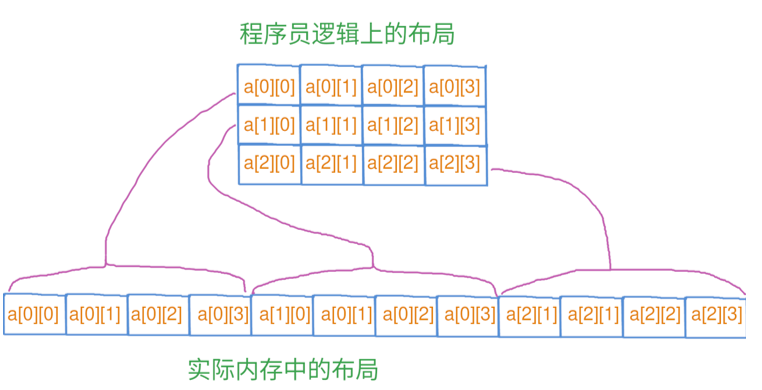

静态数组逻辑上是二维的，实际存储会扁平化以一维方式存储

### 动态数组

```cpp
//不好的分配方式
float **a = malloc(n * sizeof(float *));
for (int i = 0; i < m; i++) a[i] = malloc(m * sizeof(float));

for (int i = 0; i < m; i++) free(a[i]);
free(a);

//分配方式
float *a = malloc(n * m * sizeof(float));

```

### 行主序和列主序

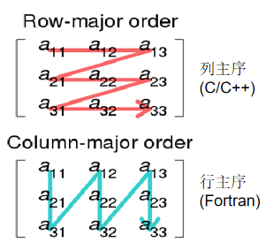

按照对应的存储方式去遍历，能保持时间上的连续性

因为行列仅限于二维数组（矩阵），对高维数组可以直接按照他们的 xyz 下标名这样称呼：

ZYX 序：(z * ny + y) * nx + xXYZ 序：z + nz * (y + x * ny)

## 插桩与循环分块

插桩：这个操作，就是说在结构网格中，从一个点往周围固定范围读取值，并根据一定权重累加，然后用于修改自身的值。

### X方向插桩

X 方向的插桩，因为最内层有另一个长度仅为 nblur*2+1 的顺序读取，让 CPU 误以为 t++ 是我们想要的顺序读取，然而 nblur*2+1 很快就执行完毕，顺序被打破，CPU 无法预判我们下一步要读哪里了。

使用_mm_prefetch 指令手动提示 CPU

```cpp
//使用prefetch预取缓存行
//_mm_prefetch 指令本身的执行也要花费不少时间。我们给预取提示给太频繁了，反而浪费了时间
void BM_x_blur_prefetch()
{
#pragma omp parallel for collapse(2)
    for(int y = 0; y < ny; ++y)
    {
        for(int x = 0; x < nx; ++x)
        {
            _mm_prefetch(&a(x+32, y), _MM_HINT_T0);
            floar res = 0;
            for(int t = -nblur; t <= nblur; ++t)
                	res += a(x+t, y);
           	b(x,y) = res;
        }
    }
}

//使用prefetch预取缓存行 并配合循环分块
//循环分块的目的 让每次prefetch达到64子节
void BM_x_blur_tiled_prefetched()
{
    for(auto _ : bm)
    {
#pragma omp parallel for collapse(2)
        for(int y = 0; y < ny; ++y)
        {
            for(int xBase = 0; xBase < nx; xBase += 16)
            {
                _mm_prefetch(&a(xBase+16, y), _MM_HINT_T0); //16个float = 64子节 缓存行的大小
                for(int x = xBase; x < xBase+16; ++x)
                {
                    float res = 0;
                    for(int t = -nblur; t <= nblur; ++t)
                		res += a(x+t, y);
                    b(x,y) = res;
                }
            }
        }
    }
}

//用stream直写， 进一步优化写入带宽
//分块+预取+直写
void BM_x_blur_tiled_prefetched_streamed()
{
    for(auto _ : bm)
    {
#pragma omp parallel for collapse(2)
        for(int y = 0; y < ny; ++y)
        {
            for(int xBase = 0; xBase < nx; xBase += 16)
            {
                _mm_prefetch(&a(xBase+16, y), _MM_HINT_T0); //16个float = 64子节 缓存行的大小
                for(int x = xBase; x < xBase+16; ++x)
                {
                    __m128 res = _mm_setzero_ps();
                    for(int t = -nblur; t <= nblur; ++t)
                		res = _mm_add_ps(res, _mm_loadu_ps(&a(x+t, y)));
                    _mm_stream_ps(&b(x, y), res);
                }
            }
        }
    }
}
```

### Y方向插桩

Y 方向的插桩比 X 方向慢好多：因为 X 方向的插桩所读取的数据，在内存中是连续的。而 Y 方向的插桩所读取的数据，在内存看来表现为跳跃 nx 大小来访问，是不连续的。

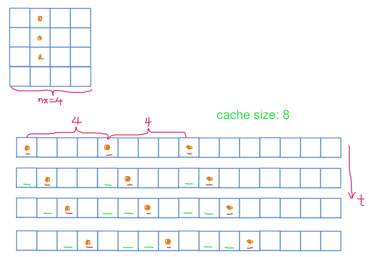

由于 Y 方向插桩的内存读取模式，有 nblur 次跳跃，每次跳跃的距离是 nx，从而缓存容量需要有 nx*nblur 那么大，才能利用全部的缓存，一级缓存只有 32KB 大

可以用循环分块（loop tiling），将外部两层循环变为 blockSize 为跨步的，而内部则在区间 [xBase, xBase + blockSize) 上循环.

```cpp
//y插桩
void BM_y_blur(benchmark::State &bm) {
    for (auto _: bm) {
#pragma omp parallel for collapse(2)
        for (int y = 0; y < ny; y++) {
            for (int x = 0; x < nx; x++) {
                float res = 0;
                for (int t = -nblur; t <= nblur; t++) {
                    res += a(x, y + t);
                }
                b(x, y) = res;
            }
        }
        benchmark::DoNotOptimize(a);
    }
}

//分块1 降低命中所需的缓存容量
void BM_y_blur_tiled(benchmark::State &bm)
{
    for(auto _: bm)
    {
        constexpr int blocksize = 32;
#pragma omp parallel for collapse(2)
        for(int yBase = 0; yBase < ny; yBase += blockSize)
        {
            for(int xBase = 0; xBase < nx; xBase += blockSize)
            {
                for(int y = yBase; y < yBase + blockSize; ++y)
                {
                    for(int x = xBase; x < xBase + blockSize; ++x)
                    {
                        float res = 0;
                        for(int t = -nblur; x < xBase + blockSize; ++x)
                        	res += a(x, y + t);
                       	b(x, y) = res;
                    }
                }
            }
        }
        benchmark::DoNotOptimize(a);
    }
}
```

**分块1：**YXyx 序，前两个大写 YX 表示外层大循环，后两个小写 yx 表示区间大小为 blockSize 的内层小循环。

但是这样有一个很大的问题，如果插桩的读取范围跨越了 block 的边界，反而会变得跨度更大，导致缓存彻底失效。

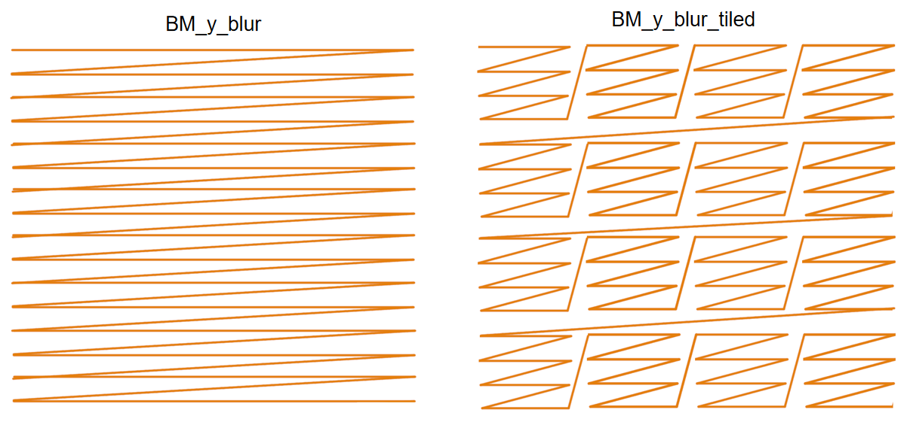

**分块2：**可以只对 X 循环分块，并且把外层改成 XY 序，形成 XYx 序。

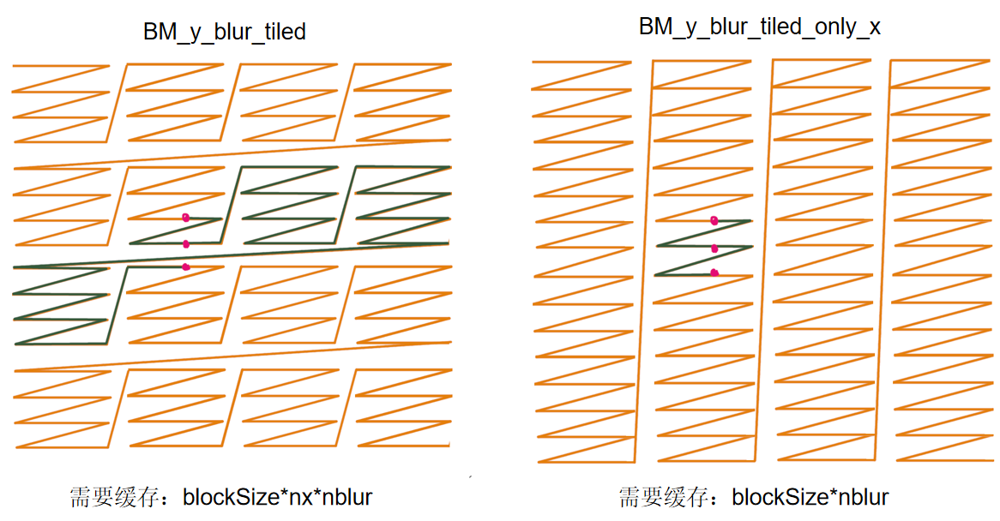

```cpp
//让直写指令在时空上尽可能靠拢
//把 res 变成数组暂时存一下，最后再一次性用 stream 写入。的确有正面效果！看来 stream 需要时空上集中一起效果才比较好
void BM_y_blur_tiled_only_x_prefetched_streamed_merged(benchmark::State &bm) {
    for (auto _: bm) {
        constexpr int blockSize = 32;
#pragma omp parallel for collapse(2)
        for (int xBase = 0; xBase < nx; xBase += blockSize) {
            for (int y = 0; y < ny; y++) {
                for (int x = xBase; x < xBase + blockSize; x += 16) {
                    _mm_prefetch(&a(x, y + nblur), _MM_HINT_T0);
                    float res[16];
                    for (int offset = 0; offset < 16; offset++) {
                        res[offset] = 0;
                        for (int t = -nblur; t <= nblur; t++) {
                            res[offset] += a(x + offset, y + t);
                        }
                    }
                    for (int offset = 0; offset < 16; offset++) {
                        _mm_stream_si32((int *)&b(x + offset, y), (int &)res);
                    }
                }
            }
        }
        benchmark::DoNotOptimize(a);
    }
}

//把一次写入4字节的 _mm_stream_si32 换成了一次写入16字节的 _mm_stream_ps
//顺便也把 res 换成了 __m128 的数组，并用 _mm 系列指令读取 a 和计算加法
//把 t 循环和 offset 循环交换一下（loop-interchange），把 offset 换到内层循环去。这样至少能让四个寄存器同时在进行加法运算 启动指令级并行
void BM_y_blur_tiled_only_x_prefetched_streamed_merged_vectorized_interchanged(benchmark::State &bm) {
    for (auto _: bm) {
        constexpr int blockSize = 32;
#pragma omp parallel for collapse(2)
        for (int xBase = 0; xBase < nx; xBase += blockSize) {
            for (int y = 0; y < ny; y++) {
                for (int x = xBase; x < xBase + blockSize; x += 16) {
                    _mm_prefetch(&a(x, y + nblur), _MM_HINT_T0);
                    __m128 res[4];
                    for (int offset = 0; offset < 4; offset++) {
                        res[offset] = _mm_setzero_ps();
                    }
                    for (int t = -nblur; t <= nblur; t++) {
                        for (int offset = 0; offset < 4; offset++) {
                            res[offset] = _mm_add_ps(res[offset],
                                _mm_load_ps(&a(x + offset * 4, y + t)));
                        }
                    }
                    for (int offset = 0; offset < 4; offset++) {
                        _mm_stream_ps(&b(x + offset * 4, y), res[offset]);
                    }
                }
            }
        }
        benchmark::DoNotOptimize(a);
    }
}

//循环展开
void BM_y_blur_tiled_only_x_prefetched_streamed_merged_vectorized_interchanged_unrolled(benchmark::State &bm) {
    for (auto _: bm) {
        constexpr int blockSize = 32;
#pragma omp parallel for collapse(2)
        for (int xBase = 0; xBase < nx; xBase += blockSize) {
            for (int y = 0; y < ny; y++) {
                for (int x = xBase; x < xBase + blockSize; x += 16) {
                    _mm_prefetch(&a(x, y + nblur), _MM_HINT_T0);
                    __m128 res[4];
#pragma GCC unroll 4
                    for (int offset = 0; offset < 4; offset++) {
                        res[offset] = _mm_setzero_ps();
                    }
                    for (int t = -nblur; t <= nblur; t++) {
#pragma GCC unroll 4
                        for (int offset = 0; offset < 4; offset++) {
                            res[offset] = _mm_add_ps(res[offset],
                                _mm_load_ps(&a(x + offset * 4, y + t)));
                        }
                    }
#pragma GCC unroll 4
                    for (int offset = 0; offset < 4; offset++) {
                        _mm_stream_ps(&b(x + offset * 4, y), res[offset]);
                    }
                }
            }
        }
        benchmark::DoNotOptimize(a);
    }
}

//__m128 一次处理四个float，改成 __m256 一次处理八个float，
//预取的地址太靠近了，可能还是会让CPU陷入等待， 增加预取的提前量
void BM_y_blur_tiled_only_x_prefetched_streamed_merged_vectorized_interchanged_unrolled_avx_forwarded(benchmark::State &bm) {
    for (auto _: bm) {
#pragma omp parallel for collapse(2)
        for (int x = 0; x < nx; x += 32) {
            for (int y = 0; y < ny; y++) {
                _mm_prefetch(&a(x, y + nblur + 40), _MM_HINT_T0);
                _mm_prefetch(&a(x + 16, y + nblur + 40), _MM_HINT_T0);
                __m256 res[4];
#pragma GCC unroll 4
                for (int offset = 0; offset < 4; offset++) {
                    res[offset] = _mm256_setzero_ps();
                }
                for (int t = -nblur; t <= nblur; t++) {
#pragma GCC unroll 4
                    for (int offset = 0; offset < 4; offset++) {
                        res[offset] = _mm256_add_ps(res[offset],
                            _mm256_load_ps(&a(x + offset * 8, y + t)));
                    }
                }
#pragma GCC unroll 4
                for (int offset = 0; offset < 4; offset++) {
                    _mm256_stream_ps(&b(x + offset * 8, y), res[offset]);
                }
            }
        }
        benchmark::DoNotOptimize(a);
    }
}

```

## 矩阵和莫顿码

### 案列：矩阵转置

循环是 YX 序的，虽然 b(x, y) 也是 YX 序的没问题，但是 a(y, x) 相当于一个 XY 序的二维数组，从而在内存看来访存是跳跃的，违背了空间局域性。因为每次跳跃了 nx，所以只要缓存容量小于 nx 就无法命中

```cpp
for(int y = 0; y < ny; ++y)
{
    for(int x = 0; x < nx; ++x)
        b(x, y) = a(y, x);
}
```

解决方法当然还是循环分块。即 YXyx 序。这样只需要块的大小 blockSize^2 小于缓存容量，即可保证全部命中。

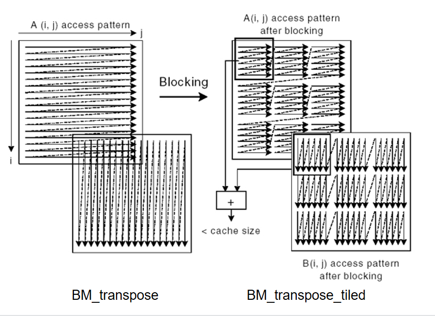

### 莫顿码

如 x=x1x2x3, y=y1y2y3则他们的莫顿码：m(x,y)=y1x1y2x2y3x3

二维莫顿编码可以把两个长度为n的二进制数，交错打包成一个长度2*n的二进制数。

而莫顿编码的逆运算，就是莫顿解码。

意义：可以用一维的 t 遍历二维的网格，然后用mdec(t) 求出要访问元素的 (x,y) 坐标，这样可以保证的数据在时间t上是接近的，同时二维空间上 (x,y) 也是接近的，有利于访存局域性。

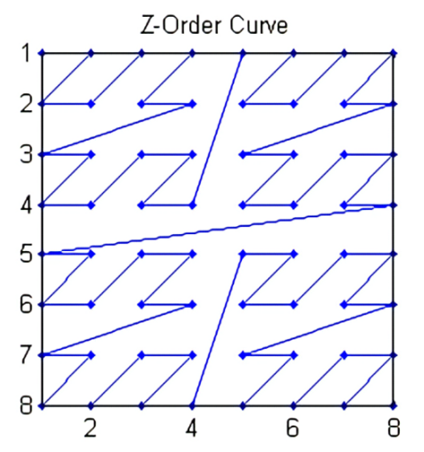

## 多核下的缓存

**伪共享**

需要注意，如果多个核心在写数据集时访问的地址非常接近，这时候会变得很慢！

假设一个核心修改了该缓存行的前32字节，另一个修改了后32字节，同时写回的话，结果要么是只有前32字节，要么是只有后32字节，而不能两个都正确写入。

所以CPU为了安全起见，同时只能允许一个核心写入同一地址的缓存行。从而导致读写这个变量的速度受限于三级缓存的速度，而不是一级缓存的速度。

```cpp
std::vector<float> a(n);
void BM_false_sharing(benchmark::State &bm) {
    for (auto _: bm) {
        std::vector<int> tmp(omp_get_max_threads());
#pragma omp parallel for
        for (int i = 0; i < n; i++) {
            tmp[omp_get_thread_num()] += a[i];
            benchmark::DoNotOptimize(tmp);
        }
        benchmark::DoNotOptimize(tmp);
    }
}
```

**消除伪共享**

要想消除错误共享很简单，只需要把每个核心写入的地址尽可能分散开了就行了。比如这里，我们把每个核心访问的地方跨越了 16KB，这样CPU就知道每个核心之间不会发生冲突，从而可以放心地放在一级缓存里，不用担心会不会和其他核心共用了一个缓存行了。

不过错误共享只会发生在写入的情况，如果多个核心同时读取两个很靠近的变量，是不会产生冲突的，也没有性能损失

```cpp
void BM_no_false_sharing(benchmark::State &bm) {
    for (auto _: bm) {
        std::vector<int> tmp(omp_get_max_threads() * 4096);
#pragma omp parallel for
        for (int i = 0; i < n; i++) {
            tmp[omp_get_thread_num() * 4096] += a[i];  //16kb 一级缓存大小
            benchmark::DoNotOptimize(tmp);
        }
        benchmark::DoNotOptimize(tmp);
    }
}
```


# 模型INT8量化

## 量化介绍

- **量化就是将我们训练好的模型，不论是权重、还是计算op，都转换为低精度去计算**。因为FP16的量化很简单，所以实际中我们谈论的量化更多的是**INT8的量化**

- FP32->FP16几乎是无损的(CUDA中使用`__float2half`直接进行转换)
- 量化就是将浮点型实数量化为整型数（FP32->INT8）
- 反量化就是将整型数转换为浮点型实数（INT8->FP32）

### 量化分类

- PTQ（Post-Training Static Quantization）训练后静态量化：模型训练完成后量化
- QAT(Quantization Aware Training) 量化训练：边量化边训练
- 线性量化和非线性量化，常为线性量化
- 对称量化和非对称量化，区间对称否

### 线性量化的对称量化

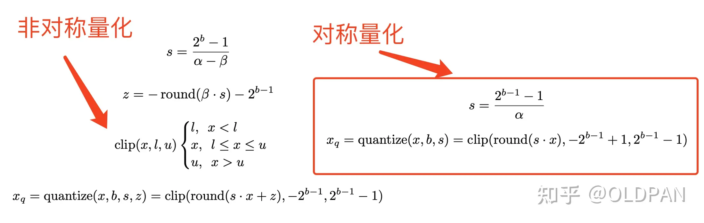

## 卷积量化

一般量化过程中，有`pre-tensor`和`pre-channel`两种方式，`pre-tensor`显而易见，就是对于同一块输入（比如某个卷积前的输入tensor）我们采用一个scale，该层所有的输入数据共享一个scale值；而`pre-channel`呢一般是作用于权重，比如一个卷积的权重维度是[64,3,3,3]（输入通道为3输出通道为64，卷积核为3x3），`pre-channel`就是会产生64个scale值，分别作用于该卷积权重参数的64个通道。

参考：![https://zhuanlan.zhihu.com/p/405571578]

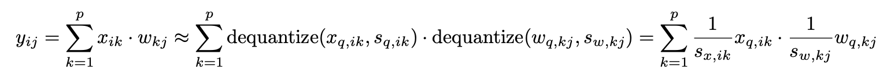

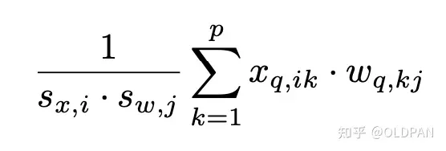

当把k去除将s取出来之后，我们发现sxi和swj分别代表输入的第i行的scale和权重的第j列的scale值，这样输入的每一行必须共享scale，而权重的每一列也必须共享scale

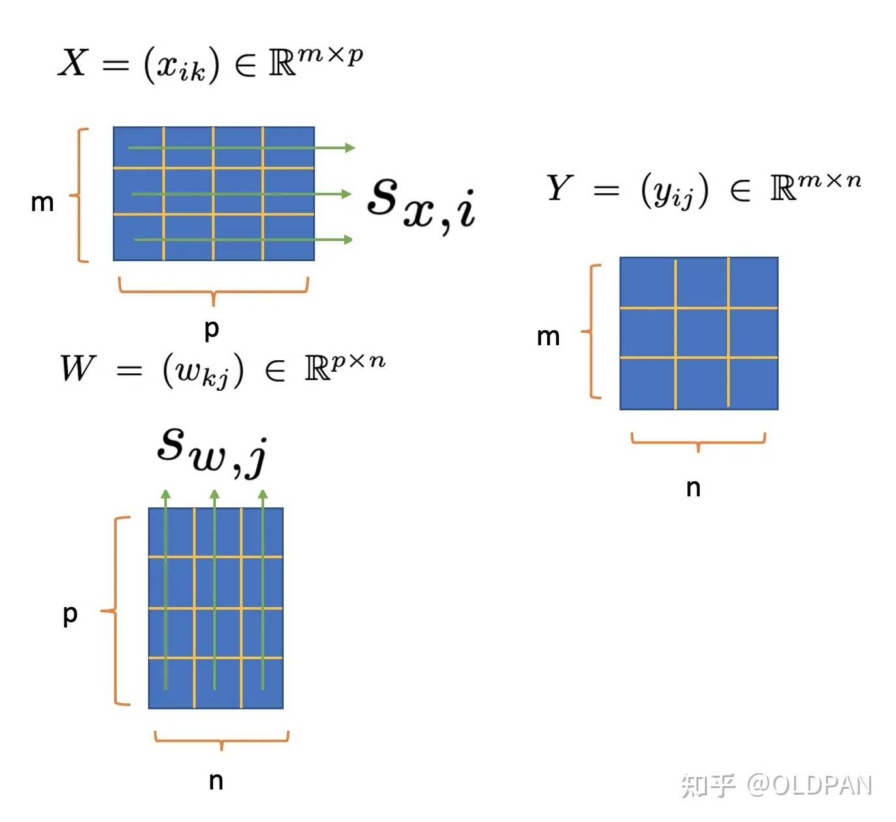

## ncnn量化

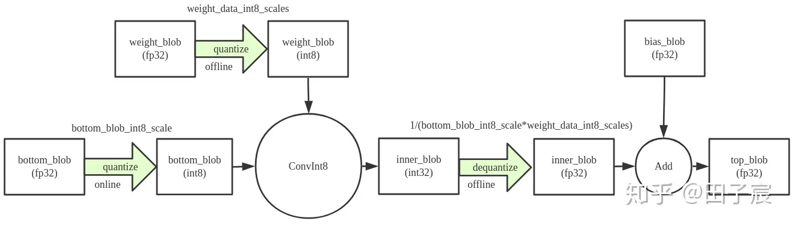

NCNN首先将输入(bottom_blob)和权重(weight_blob)量化成INT8，在INT8下计算卷积，然后反量化到fp32，再和未量化的bias相加，得到输出(top_blob)

采用非对称量化的方式，通过KL散度(相对熵)来衡量量化前和量化后的相似度，最后计算迭代得到最好的scale(127/T)

注意：scale也是按照pre-tensor的方式进行，每一行共享一个scale

```cpp
//量化核心代码
for (int i=0; i<size; i++)
{
 outptr[i] = float2int8(ptr[i] * scale);
}

static inline signed char float2int8(float v)
{
 int int32 = round(v);
 if (int32 > 127) return 127;
 if (int32 < -128) return -128;
 return (signed char)int32;
}
```


# CPU特性优化

## cpu cache

关于cpu cache：

- cpu的cache在cpu中是一种高速缓存寄存器。有三级(L1, L2, L3)依次速度降低。L1一般有64KB
- cache的写入策略：
    - 直写模式：数据更新时，同时写入内存和cache
    - 回写模式：数据更新时，只写入到cache中，数据弹出cache时，才写入到内存中
- 多个cpu对某块内存同时读写，会引起冲突问题，这被称为cache一致性问题

## if-else

- 流水线架构可以很好地压榨多个资源并行运行。

- 在if判断的分支预测中，如果失败需要清空流水线中的那些预测出来的指令，重新加载正确的指令到流水线中执行，效率很低。
- 减少分支的方法：位操作和表结构

```c++
for(int i = 0; i < 1000; ++i)
{
    for(int c = 0; c < ARRAY_SIZE; ++c)
    {
        if(data[c] >= 128)
            sum += data[c];
    }
}

//位操作
int t = (data[c] - 128)>>31;
sum += ~t & data[c];

//表结构
//在循环前计算 牺牲空间
int lookup[DATA_SIZE];
for(int c = 0; c < DATA_SIZE; ++c)
{
    lookup[c] = (c >= 128)?c
}
```

# CUDA

## 基础

CUDA 的语法，基本完全兼容 C++。包括 C++17 新特性，都可以用。甚至可以把任何一个 C++ 项目的文件后缀名全部改成 .cu，都能编译出来。

### 语法

- `__global__` 用于定义核函数，他在 GPU 上执行，从 CPU 端通过三重尖括号语法调用，可以有参数，不可以有返回值。
-  `__device__ `则用于定义设备函数，他在 GPU 上执行，但是从 GPU 上调用的，而且不需要三重尖括号，和普通函数用起来一样，可以有参数，有返回值。
- `__host__`将函数定义在cpu上，默认不带标注宏都是host
-  `cudaDeviceSynchronize()`，让 CPU 陷入等待，等 GPU 完成队列的所有任务后再返回
- CUDA编译器的内敛：`__inline__;  __forceinline__;//强制内联 `

```cpp
//案列 main.cu
#include <cstdio>
#include <cuda_runtime.h>

__device__ void say_hello(){
    printf(“Hello, world!\n”);
}

__global__ void kernel(){
    say_hello();
}

int main(){
    kernel<<<1, 1>>>();
    cudaDeviceSynchronize(); //cpu等待gpu队列上的任务完成后返回
    return 0;
}
```

**同时定义在cpu和gpu上**

会在cpu和gpu上生成两份实例：

- `__host__ __device__ `
- constexpr函数会自动变成`__host__ __device__ `

```cpp
__host__ __device__ void say_hello(){
    printf("Hello, world!\n");
}
```

分开实现：

- 一段代码他会先送到 CPU 上的编译器（通常是系统自带的编译器比如 gcc 和 msvc）生成 CPU 部分的指令码。然后送到真正的 GPU 编译器生成 GPU 指令码。最后再链接成同一个文件，看起来好像只编译了一次一样，实际上你的代码会被预处理很多次。
- 他在 GPU 编译模式下会定义 __CUDA_ARCH__ 这个宏，这个宏是一个版本号，利用 #ifdef 判断该宏是否定义，就可以判断当前是否处于 GPU 模式，从而实现一个函数针对 GPU 和 CPU 生成两份源码级不同的代码。

```cpp
__host__ __device__ void say_hello(){
#ifdef __CUDA_ARCH__
    printf("Hello, world from GPU!\n");
#else
    printf("Hello, world from CPU!\n");
#endif
}
```

### CMake设置

 可以用 CMAKE_CUDA_ARCHITECTURES 这个变量，设置要针对哪个架构(版本号)生成 GPU 指令

不同架构(版本号)编译的版本在不同环境下可能无法运行

```cmake
cmake_minimu_required(VERSION 3.10)

set(CMAKE_CUDA_ARCHITECTURES 75) #75->rtx2080
```

## 线程与板块

- 当前线程在板块中的编号：threadIdx
- 当前板块中的线程数量：blockDim
- 当前板块的编号：blockIdx
- 总的板块数量：gridDim
- 线程(thread)：并行的最小单位
- 板块(block)：包含若干个线程
- 网格(grid)：指整个任务，包含若干个板块
- 从属关系：线程＜板块＜
- 网格调用语法：<<<gridDim, blockDim>>>

> 类比，GPU的版块相当于CPU的线程，GPU的线程相当于CPU的SIMD

### 三维的板块和编号

dim3(x,y,z)的形式

```cpp
__global__ void kernel(){
    printf("hello\n");
}
int main(){
    kernel <<<dim3(2,1,1), dim3(2,2,2)>>>();
}
```

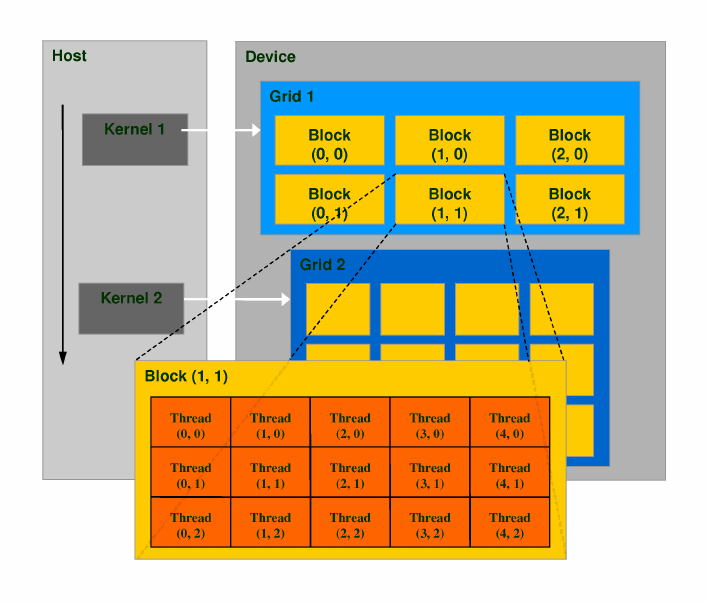

之所以会把 blockDim 和 gridDim 分三维主要是因为 GPU 的业务常常涉及到三维图形学和二维图像，觉得这样很方便，并不一定 GPU 硬件上是三维这样排列的。三维情况下同样可以获取总的线程编号（扁平化）。

如需总的线程数量：blockDim * gridDim

如需总的线程编号：blockDim * blockIdx + threadIdx

### gpu函数的分明错误

默认情况下 GPU 函数必须定义在同一个文件里。如果你试图分离声明和定义，调用另一个文件里的 __device__ 或 __global__ 函数，就会出错。

开启 CMAKE_CUDA_SEPARABLE_COMPILATION 选项（设为 ON），即可启用分离声明和定义的支持（建议放在一起）

## 内存管理

cpu和gpu间传递值需要注意：

- GPU 和 CPU 各自使用着独立的内存。CPU 的内存称为主机内存(host)。GPU 使用的内存称为设备内存(device)，他是显卡上板载的，速度更快，又称显存。
- 而不论栈还是 malloc 分配的都是 CPU 上的内存，所以自然是无法被 GPU 访问到
- 因此可以用用 cudaMalloc 分配 GPU 上的显存，这样就不出错了，结束时 cudaFree 释放

```cpp
#include <cstdio>
#include <cuda_runtime.h>
//需将CUDA toolkit中的helper_cuda.h和helper_string.h放到头文件目录
#include "helper_cuda.h" 

__global__ void kernel(int *pret){
    *pret = 42;
}

int main(){
    int* pret;
    checkCudaErrors(cudaMalloc(&pret, sizeof(int)));
    kernel<<<1, 1>>>(pret);
    checkCudaErrors(cudaDeviceSynchronize());
    cudaFree(pret);
    return 0;
}
```

### 跨GPU/CPU地址空间拷贝数据

- 可以用 cudaMemcpy，他能够在 GPU 和 CPU 内存之间拷贝数据。
- 第四个参数：cudaMemcpyDeviceToHost（设备内存到主机内存）
- 同理还有：cudaMemcpyHostToDevice 和 cudaMemcpyDeviceToDevice
- 注意：cudaMemcpy 会自动进行同步操作，即和 cudaDeviceSynchronize() 等价！因此前面的 cudaDeviceSynchronize() 实际上可以删掉了。

```cpp
__global__ void kernel(int *pret){
    *pret = 42;
}

int main(){
    int* pret;
    checkCudaErrors(cudaMalloc(&pret, sizeof(int)));
    kernel<<<1, 1>>>(pret);
    checkCudaErrors(cudaDeviceSynchronize());
    int ret;
    checkCudaErrors(cudaMemcpy(&ret, pret, sizeof(int), cudaMemcpyDeviceToHost)); //pret -> ret
    printf("result: %d\n", ret);
    return 0;
}
```

### 同一内存地址技术

还有一种在比较新的显卡上支持的特性，那就是统一内存(managed)，只需把 cudaMalloc 换成 cudaMallocManaged 即可，释放时也是通过 cudaFree。这样分配出来的地址，不论在 CPU 还是 GPU 上都是一模一样的，都可以访问。而且拷贝也会自动按需进行（当从 CPU 访问时），无需手动调用 cudaMemcpy，大大方便了编程人员，特别是含有指针的一些数据结构。

但是会有一定的开销，尽量使用分离的设备内存和主机内存

```cpp
int main(){
    int* pret;
    cudaMallocManaged(&pret, sizeof(int));
    kernel<<<1,1>>>(pret);
    cudaDeviceSynchronize();
    printf("result: %d\n", *pret);
    cudaFree(pret);
    return 0;
}
```

### 总结

主机内存(host)：malloc、free

设备内存(device)：cudaMalloc、cudaFree

统一内存(managed)：cudaMallocManaged、cudaFree

## 数组

如 malloc 一样，可以用 cudaMalloc 配合 n * sizeof(int)，分配一个大小为 n 的整型数组。这样就会有 n 个连续的 int 数据排列在内存中，而 arr 则是指向其起始地址。然后把 arr 指针传入 kernel，即可在里面用 arr[i] 访问他的第 i 个元素。

可以采用多线程的方式给数组赋值

```cpp
#include<cstdio>
#include<cuda_runtime.h>

__global__ void kernel(int* arr, int n){
    for(int i = 0; i < n; ++i)
        arr[i] = i;
}

//多个线程并行赋值
__global__ void kernel(int* arr, int n){
    int i = threadIdx.x;
    arr[i] = i;
}

//网格跨步循环 n=4 使用线程0,1赋值时处理
__global__ void kernel(int* arr, int n){
    for(int i = threadIdx.x; i < n; i += blockDim.x)
        	arr[i] = i;
}

int main(){
    int n = 32;
    int* arr;
    cudaMallocManaged(&arr, n*sizeof(int));
    kernel<<<1, ,1>>>(arr, n);
    cudaDeviceSynchronize();
    for(int i = 0; i < n; ++i)
        printf("arr[%d]: %d", i, arr[i]);
    cudaFree(arr);
    return 0;
}

```

### 从线程到板块

核函数内部，用之前说到的 blockDim.x + blockIdx.x + threadIdx.x 来获取线程在整个网格中编号。

外部调用者，则是根据不同的 n 决定板块的数量（gridDim），而每个板块具有的线程数量（blockDim）则是固定的 128

```cpp
__global__ void kernel(int* arr, int n){
    int i = blockDim.x * blockIdx.x + threadIdx.x;
    arr[i] = i;
}

int main(){
    int n = 65536;
    int* arr;
    cudaMallocManaged(&arr, n*sizeof(int));
    int nthreads = 128;
    int nblocks = n/nthreads;
    kernel<<<nblocks, nthreads>>>(arr, n);
    
    cudaFree(arr);
    return 0;
}
```

### 边角料难题

n如果不是128的整数倍时，会出现问题。

解决方法就是：采用向上取整的除法。 (n + nthreads + 1) / nthreads

```cpp
__global__ void kernel(int* arr, int n){
    int i = blockDim.x * blockIdx.x + threadIdx.x;
    if(i > n) return;
    arr[i] = i;
}

int main(){
    int n = 65536;
    int* arr;
    cudaMallocManaged(&arr, n*sizeof(int));
    int nthreads = 128;
    int nblocks = (n+nthreads+1)/nthreads;
    kernel<<<nblocks, nthreads>>>(arr, n);
    
    cudaFree(arr);
    return 0;
}
```

### 网格跨步循环

跨步循环，无论调用者指定每个板块多少线程（blockDim），总共多少板块（gridDim）。都能自动根据给定的 n 区间循环，不会越界，也不会漏掉几个元素。

```cpp
__global__ void kernel(int* arr, int n){
    for(int i = blockDim.x * blockIdx.x + threadIdx.x; i < n; i += blockDim.x*gridDim.x)
        arr[i] = ;
}

int main(){
    int n = 65536;
    int* arr;
    cudaMallocManaged(&arr, n*sizeof(int));
    
    kernel<<<32, 128>>>(arr, n);
    
    cudaFree(arr);
    return 0;
}
```

## c++封装

修改std容器的allocator，即可在gpu上使用std的容器.

可以通过给 allocator 添加 construct 成员函数，来魔改 vector 对元素的构造。默认情况下他可以有任意多个参数，而如果没有参数则说明是无参构造函数

因此我们只需要判断是不是有参数，然后是不是传统的 C 语言类型（plain-old-data），如果是，则跳过其无参构造，从而避免在 CPU 上低效的零初始化。

```cpp
template <class T>
struct CudaAllocator {
    using value_type = T;

    T *allocate(size_t size) {
        T *ptr = nullptr;
        checkCudaErrors(cudaMallocManaged(&ptr, size * sizeof(T)));
        return ptr;
    }

    void deallocate(T *ptr, size_t size = 0) {
        checkCudaErrors(cudaFree(ptr));
    }
	
    template <class ...Args>
    void construct(T *p, Args &&...args) {
        if constexpr (!(sizeof...(Args) == 0 && std::is_pod_v<T>))
            ::new((void *)p) T(std::forward<Args>(args)...);
    }
};
```

### 核函数也可为一个模板函数

 __global__ 修饰的核函数自然也是可以为模板函数的。

```cpp
template <int N, class T>
__global__ void kernel(T *arr) {
    for (int i = blockDim.x * blockIdx.x + threadIdx.x;
         i < N; i += blockDim.x * gridDim.x) {
        arr[i] = i;
    }
}

int main() {
    constexpr int n = 65536;
    std::vector<int, CudaAllocator<int>> arr(n);

    kernel<n><<<32, 128>>>(arr.data());

    checkCudaErrors(cudaDeviceSynchronize());
    for (int i = 0; i < n; i++) {
        printf("arr[%d]: %d\n", i, arr[i]);
    }

    return 0;
}
```

### 核函数的参数可以接受仿函数

不过要注意三点：

- 这里的 Func 不可以是 Func const &，那样会变成一个指向 CPU 内存地址的指针，从而出错。所以 CPU 向 GPU 的传参必须按值传。

- 做参数的这个函数必须是一个有着成员函数 operator() 的类型，即 functor 类。而不能是独立的函数，否则报错。

- 这个函数必须标记为 __device__，即 GPU 上的函数，否则会变成 CPU 上的函数。

```cpp
template <class Func>
__global__ void parallel_for(int n, Func func) {
    for (int i = blockDim.x * blockIdx.x + threadIdx.x;
         i < n; i += blockDim.x * gridDim.x) {
        func(i);
    }
}

struct MyFunctor {
    __device__ void operator()(int i) const {
        printf("number %d\n", i);
    }
};

int main() {
    int n = 65536;

    parallel_for<<<32, 128>>>(n, MyFunctor{});

    checkCudaErrors(cudaDeviceSynchronize());

    return 0;
}
```

### 核函数的参数可以接受lambda表达式

可以直接写 lambda 表达式，不过必须在 [] 后，() 前，插入 __device__ 修饰符。

而且需要开启 --extended-lambda 开关。

变量捕获：

- 如果试图用 [&] 捕获变量是会出错的，毕竟这时候捕获到的是堆栈（CPU内存）上的变量 arr 本身，而不是 arr 所指向的内存地址（GPU内存）。
- 正确的做法是先获取 arr.data() 的值到 arr_data 变量，然后用 [=] 按值捕获 arr_data，函数体里面也通过 arr_data 来访问 arr。

```cpp
int main() {
    int n = 65536;

    parallel_for<<<32, 128>>>(n, [] __device__ (int i) {
        printf("number %d\n", i);
    });
	
    //捕获变量
    int *arr_data = arr.data();
    parallel_for<<<32, 128>>>(n, [=] __device__ (int i) {
        arr_data[i] = i;
    });
    
    //或者
    parallel_for<<<32, 128>>>(n, [arr = arr.data()] __device__ (int i) {
        arr[i] = i;
    });
    
    checkCudaErrors(cudaDeviceSynchronize());

    return 0;
}


```

## 数字运算

类似与cpu上的数字运算，gpu上也有类似的接口：

- sin：double类型的正弦函数
- sinf：float类型的正弦函数
- __sinf:速度更快，但精度不完全准确的正弦函数

```cpp
template <class Func>
__global__ void parallel_for(int n, Func func){
    for(int i = blockDim.x*blockIdx.x+threadIdx.x; i < n; i += blockDim.x*gridDim.x){
        func(i);
    }
}

int main()
{
    int n = 1<<25;
    std::vector<float, CudaAllocator<float>> gpu(n);
    
    //进行多核并行计算
    parellel_for<<<32, 128>>>(n, [gpu = gpu.data()] __device__(int i){
      gpu[i] = sinf(i);  
    };);
    cudaDevicSynchronize();
    return 0;
}
```

编译器选项：

- 如果开启了 --use_fast_math 选项，那么所有对 sinf 的调用都会自动被替换成 __sinf。

- --ftz=true 会把极小数(denormal)退化为0。

- --prec-div=false 降低除法的精度换取速度。

- --prec-sqrt=false 降低开方的精度换取速度。

- --fmad 因为非常重要，所以默认就是开启的，会自动把 a * b + c 优化成乘加(FMA)指令。

- **开启 --use_fast_math 后会自动开启上述所有**

## thrust库

CUDA官方提供了相应的thtust库，包含相应的容器、算法和alloc：

- universal_vector: 类似vector
- device_vector: 则是在 GPU 上分配内存
- host_vector：则 在 CPU 上分配内存

```cpp 
#include <thrust/universal_vector.h>
int main(){
    thrust::universal_vector<float> x(n);
    thrust::host_vector<float> x_host(n);
    thrust::device_vector<float> x_host(n);
}
```

### thrust库的算法：

算法可以根据容器类型，自动决定在CPU和GPU上运行：

for_each 可以用于 device_vector 也可用于 host_vector。当用于 host_vector 时则函数是在 CPU 上执行的，用于 device_vector 时则是在 GPU 上执行的


# openmp和avx

## openmp

OpenMP 是一套 C++ 并行编程框架

gcc编译时加入 `-fopenmp`

### 并行前提

- 可拆分：代码和变量的前后不能相互依赖
- 独立运行：运行时，需拥有一定独有的资源

### 实例练习

```cpp
#include <omp.h>
int main()
{
    #pragma omp parallel for num_threads(4)
    for(int i = 0; i < 10; ++i)
    {
		std::cout << i << endl;
    }
    return 0;
}
```

在访问非独立资源时

reduction原句：reduction子句可以对一个或者多个参数指定一个操作符，然后每一个线程都会创建这个参数的私有拷贝，在并行区域结束后，迭代运行指定的运算符，并更新原参数的值。

```cpp
int sum = 0;
#pragma omp parallel for num_threads(32)
for(int i=0; i<100; i++)
{
    sum +=  i; 
}
// sum 可能不等于4950
// sum+=i 多个线程同时写时，可能会发生写冲突

// 加入reduce原语来实现
int sum = 0;
#pragma omp parallel for num_threads(32) reduction(+:sum)
for(int i=0; i<100; i++)
{
    sum +=  i; 
}
```

## avx

 AVX就是Intel提供的支持向量并行计算的C语言的一个库，是实现SIMD的一种方式。AMD也支持AVX。

用gcc编译的指令如下：

```cpp
gcc filename.c -mavx -mavx2 -mfma -msse -msse2 -msse3
```

### AVX入门

```cpp
//案例
#include <immintrin.h> //AVX
#include <stdio.h>
#include <sys/time.h>
#include <stdlib.h>
#include <time.h>
#define __VEC_LENGTH__ 10000000

double arr1[__VEC_LENGTH__];
double arr2[__VEC_LENGTH__];
double result[__VEC_LENGTH__];
__m256d vecarr1[__VEC_LENGTH__ / 4];
__m256d vecarr2[__VEC_LENGTH__ / 4];
__m256d temp[__VEC_LENGTH__ / 4];

//使用AVX计算10^7维向量加法，并返回i计算时间
long sum_avx(double *arr1, double *arr2, double *result);
//使用for循环计算向量加法，并返回计算时间
long sum_arr(double *arr1, double *arr2, double *result);

int main()
{
    srand(time(NULL));
    for(int i = 0; i < __VEC_LENGTH__; ++i)
    {
        arr1[i] = rand() / 1000;
        arr2[i] = rand() / 1000;
    }

    clock_t time1 = sum_avx(arr1, arr2, result);
    printf("Using avx takes %ld us\n",time1);
    clock_t time2 = sum_arr(arr1, arr2, result);
    printf("Using for loop takes %ld us\n", time2);

    return 0;
}

long sum_avx(double *arr1, double *arr2, double *result)
{
    //数据转换为AVX向量
    for(int i = 0; i < __VEC_LENGTH__; i += 4)
    {
        vecarr1[i / 4] = _mm256_setr_pd(arr1[i], arr1[i + 1], arr1[i + 2], arr1[i + 3]);
        vecarr2[i / 4] = _mm256_setr_pd(arr2[i], arr2[i + 1], arr2[i + 2], arr2[i + 3]);
    }
	
    //测试的时间仅包括AVX向量加法的时间
    struct timeval tv1, tv2;
    gettimeofday(&tv1, NULL);
    for(int i = 0; i < __VEC_LENGTH__ / 4; ++i)
    {
        temp[i] = _mm256_add_pd(vecarr1[i], vecarr2[i]); //计算
    }
    gettimeofday(&tv2, NULL);
	
    //数据转换为结果
    for(int i = 0; i < __VEC_LENGTH__ / 4; ++i)
    {
        result[i * 4] = temp[i][0];
        result[i * 4 + 1] = temp[i][1];
        result[i * 4 + 2] = temp[i][2];
        result[i * 4 + 3] = temp[i][3];
    }

    return (tv2.tv_sec - tv1.tv_sec) * 1000000 + tv2.tv_usec - tv1.tv_usec;
}

long sum_arr(double *arr1, double *arr2, double *result)
{
    struct timeval tv1, tv2;
    gettimeofday(&tv1, NULL);
    for(int i = 0; i < __VEC_LENGTH__; ++i)
    {
        result[i] = arr1[i] + arr2[i];
    }
    gettimeofday(&tv2, NULL);
    return (tv2.tv_sec - tv1.tv_sec) * 1000000 + tv2.tv_usec - tv1.tv_usec;
}
```

### 使用avx256求和

 _mm256_hadd_ps 计算方式参考 

![https://www.intel.com/content/www/us/en/docs/intrinsics-guide/index.html#text=_mm256_hadd_ps&ig_expand=3693]

![https://blog.csdn.net/just_sort/article/details/94393506]

```cpp
template <typename T>
T simpleSum(T* arr, uint64_t size)
{
    T sum = 0;
    for (uint64_t i = 0; i < size; i++)
        sum += arr[i];
    return sum;
}

float avx2Sum(float* arr, uint64_t size)
{
    float sum[8] = {0};
    __m256 sum256 = _mm256_setzero_ps();
    __m256 load256 = _mm256_setzero_ps();
    for (uint64_t i = 0; i < size; i += 8)
    {
        load256 = _mm256_loadu_ps(&arr[i]);
        sum256 = _mm256_add_ps(sum256, load256);
    }
    sum256 = _mm256_hadd_ps(sum256, sum256);
    sum256 = _mm256_hadd_ps(sum256, sum256);
    _mm256_storeu_ps(sum, sum256);
    sum[0] += sum[4];
    return sum[0];
}
```

### 案列优化

```cpp
for (int x = xBase; x < xBase + blockSize; x += 16) {
    _mm_prefetch(&a(x, y + nblur), _MM_HINT_T0);
    float res[16];
    for (int offset = 0; offset < 16; offset++) {
        res[offset] = 0;
        for (int t = -nblur; t <= nblur; t++) {
            res[offset] += a(x + offset, y + t);
        }
    }
    for (int offset = 0; offset < 16; offset++) {
        _mm_stream_si32((int *)&b(x + offset, y), (int &)res);
    }
}

//向量化后
for (int x = xBase; x < xBase + blockSize; x += 16) {
    _mm_prefetch(&a(x, y + nblur), _MM_HINT_T0);
    __m128 res[4];
    for (int offset = 0; offset < 4; offset++) {
        res[offset] = _mm_setzero_ps();
        for (int t = -nblur; t <= nblur; t++) {
            res[offset] = _mm_add_ps(res[offset],
                _mm_load_ps(&a(x + offset * 4, y + t)));
        }
    }
    for (int offset = 0; offset < 4; offset++) {
        _mm_stream_ps(&b(x + offset * 4, y), res[offset]);
    }
}
```


### AVX编程基础

**数据类型**

| 数据类型 | 描述                        |
| -------- | --------------------------- |
| __m128   | 包含4个float类型数字的向量  |
| __m128d  | 包含2个double类型数字的向量 |
| __m128i  | 包含若干个整型数字的向量    |
| __m256   | 包含8个float类型数字的向量  |
| __m256d  | 包含4个double类型数字的向量 |
| __m256i  | 包含若干个整型数字的向量    |

**函数命名**

```
_mm<bit_width>_<name>_<data_type>
```

- `<bit_width>` 表明了向量的位长度，对于128位的向量，这个参数为空，对于256位的向量，这个参数为256。
- `<name>`描述了内联函数的算术操作。
- `<data_type>` 标识函数主参数的数据类型。

```c++
//data_type
ps 包含float类型的向量
pd 包含double类型的向量
epi8/epi16/epi32/epi64 包含8位/16位/32位/64位的有符号整数
epu8/epu16/epu32/epu64 包含8位/16位/32位/64位的无符号整数
si128/si256 未指定的128位或者256位向量
m128/m128i/m128d/m256/m256i/m256d 当输入向量类型与返回向量的类型不同时，标识输入向量类型
```

**相关运算**

| 数据类型                                      | 描述                                                |
| --------------------------------------------- | --------------------------------------------------- |
| _mm256_add_ps/pd                              | 对两个浮点向量做加法                                |
| _mm256_sub_ps/pd                              | 对两个浮点向量做减法                                |
| (2)_mm256_add_epi8/16/32/64                   | 对两个整形向量做加法                                |
| (2)_mm256_sub_epi8/16/32/64                   | 对两个整形向量做减法                                |
| (2)_mm256_adds_epi8/16 (2)_mm256_adds_epu8/16 | 两个整数向量相加且考虑内存饱和问题                  |
| (2)_mm256_subs_epi8/16 (2)_mm256_subs_epu8/16 | 两个整数向量相减且考虑内存饱和问题                  |
| _mm256_hadd_ps/pd                             | 水平方向上对两个float类型向量做加法                 |
| _mm256_hsub_ps/pd                             | 垂直方向上最两个float类型向量做减法                 |
| (2)_mm256_hadd_epi16/32                       | 水平方向上对两个整形向量做加法                      |
| (2)_mm256_hsub_epi16/32                       | 水平方向上最两个整形向量做减法                      |
| (2)_mm256_hadds_epi16                         | 对两个包含short类型的向量做加法且考虑内存饱和的问题 |
| (2)_mm256_hsubs_epi16                         | 对两个包含short类型的向量做减法且考虑内存饱和的问题 |
| _mm256_addsub_ps/pd                           | 加上和减去两个float类型的向量                       |
| _mm256_mul_ps/pd                              | 对两个float类型的向量进行相乘                       |
| (2)_mm256_mul_epi32 (2)_mm256_mul_epu32       | 将包含32位整数的向量的最低四个元素相乘              |
| (2)_mm256_mullo_epi16/32                      | Multiply integers and store low halves              |
| (2)_mm256_mulhi_epi16 (2)_mm256_mulhi_epu16   | Multiply integers and store high halves             |
| (2)_mm256_mulhrs_epi16                        | Multiply 16-bit elements to form 32-bit elements    |
| _mm256_div_ps/pd                              | 对两个float类型的向量进行相除                       |

**数据转换到AVX向量**

| 数据类型                            | 描述                                        |
| ----------------------------------- | ------------------------------------------- |
| _mm256_setzero_ps/pd                | 返回一个全0的float类型的向量                |
| _mm256_setzero_si256                | 返回一个全0的整形向量                       |
| _mm256_set1_ps/pd                   | 用一个float类型的数填充向量                 |
| _mm256_set1_epi8/epi16/epi32/epi64x | 用整形数填充向量                            |
| _mm256_set_ps/pd                    | 用8个float或者4个double类型数字初始化向量   |
| _mm256_set_epi8/epi16/epi32/epi64x  | 用一个整形数初始化向量                      |
| _mm256_set_m128/m128d/m128i         | 用2个128位的向量初始化一个256位向量         |
| _mm256_setr_ps/pd                   | 用8个float或者4个double的转置顺序初始化向量 |
| _mm256_setr_epi8/epi16/epi32/epi64x | 用若干个整形数的转置顺序初始化向量          |

**从内存读取数据到寄存器**

| 数据类型                    | 描述                            |
| --------------------------- | ------------------------------- |
| _mm256_load_ps/pd           | 从对齐的内存地址加载浮点向量    |
| _mm256_load_si256           | 从对齐的内存地址加载整形向量    |
| _mm256_loadu_ps/pd          | 从未对齐的内存地址加载浮点向量  |
| _mm256_loadu_si256          | 从未对齐的内存地址加载整形向量  |
| _mm_maskload_ps/pd          | 根据掩码加载128位浮点向量的部分 |
| _mm256_maskload_ps/pd       | 根据掩码加载256位浮点向量的部分 |
| (2)_mm_maskload_epi32/64    | 根据掩码加载128位整形向量的部分 |
| (2)_mm256_maskload_epi32/64 | 根据掩码加载256位整形向量的部分 |

(2)代表只在AVX2中支持

**将寄存器的数据读取到内存中**

```c++
void _mm_store_ss (float *p, __m128 a)    
void _mm_store_ps (float *p, __m128 a)    
void _mm_store1_ps (float *p, __m128 a)    
void _mm_storeh_pi (__m64 *p, __m128 a)    
void _mm_storel_pi (__m64 *p, __m128 a)    
void _mm_storer_ps (float *p, __m128 a)    
void _mm_storeu_ps (float *p, __m128 a)    
void _mm_stream_ps (float *p, __m128 a)  
```

| 数据类型      | 描述                           |
| ------------- | ------------------------------ |
| _mm_store_ss  | 一条指令                       |
| _mm_store_ps  | 一条指令                       |
| _mm_store1_ps | 多条指令                       |
| _mm_storeh_pi | 只保存其高位                   |
| _mm_storel_pi | 只保存其低位                   |
| _mm_storer_ps | 反向，多条指令                 |
| _mm_storeu_ps | 一条指令 不要求16子节对齐 常用 |
| _mm_stream_ps | 直接写入内存 不改写cache的数据 |

# 卷积实战

相信大家对于卷积的概念都非常熟悉了，这里就不再重复提起了，我大概说一下我了解的卷积的计算方式有哪些吧。首先是暴力计算，这是最直观也是最简单的，但是这种方式访存很差，效率很低。其次是我在[基于NCNN的3x3可分离卷积再思考盒子滤波](https://mp.weixin.qq.com/s?__biz=MzA4MjY4NTk0NQ==&mid=2247488809&idx=1&sn=8fb2c0b60690cf580aadd6c6b7166201&scene=21#wechat_redirect)介绍过的手工展开某些特定的卷积核并且一次处理多行数据，这样做有个好处就是我们规避掉了一些在行方向进行频繁切换导致的Cache Miss增加，并且在列方向可以利用Neon进行加速。再然后就是比较通用的做法Im2Col+Sgemm+Pack，这种方式可以使得访存更好。其它常见的方法还有Winograd，FFT，Strassen等等。

技术栈：

- Sgemm: 单精度矩阵乘法
- Pack: 数据打包，就是在Im2Col获得的二维矩阵的高维度进行压缩，在宽维度进行膨胀。
- Winograd：以类似FFT一样降低计算量，它还不会引入复数
- Strassen：矩阵乘法加速手段
