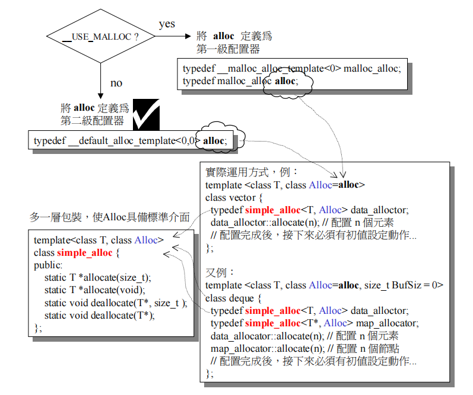

# 	STL剖析

> gnu 2.9

[TOC]

# STL思想

- 容器(Container)
- 分配器(Allocators)
- 算法(Algorithms)
- 迭代器(Iterators)
- 适配器(Adapters)
- 防函数(Functors)


- 迭代器或函数传递时的区间采用：“前闭后开”区间 [)

# 空间配置器(allocator)

空间配置器的思想：





## 空间配置的标准接口

根据STL标准，以下是allocator的必要接口

```c++
allocator::value_type;
allocator::pointer;
allocator::const_pointer;
allocator::reference;
allocator::const_reference;
allocator::size_type;
allocator::difference_type;

allocator::rebind();	//一个嵌套的class template,class rebind<U>拥有唯一成员：typedef allocator<U> other;
allocator::allocator();	//default constructor
allocator::allocator(const allocator&);	//copy constructor
allocator::~allocator();	//destructor
const_pointer allocator::address(reference x) const; //返回x的const对象地址

pointer allocator::allocate(size_type n, const void* = 0);	//配置空间 第二个参数是提示
void allocator::deallocate(pointer p, size_type n);	//归还之前的空间
size_type allocator::max_size() const;	//返回可配置空间的最大量
void allocator::construct(pointer p, const T& x); //new((void*)p) T(x);
void allocator::destroy(pointer p); //p->~T()
```

## SGI空间配置器

SGI空间配置器有两级，如下：

- 第一级配置器: std::allocator 标准malloc和free
- 第二级配置器: std::alloc 内存池

### 第一级配置器: std::allocator

设计思想：

- 第一级配置器采用malloc()、realloc()、free()等c函数来执行
- 并重新实现了new的c++ new_handler的机制（抛出异常前 会调用指定的处理例程）
- 以realloc()提供reallocate()接口

```c++
// 一个简单的分配器
// defalloc.h
template <class T>
inline T* allocate(ptrdiff_t size, T*) {
    set_new_handler(0);
    T* tmp = (T*)(::operator new((size_t)(size * sizeof(T))));
    if (tmp == 0) {
	cerr << "out of memory" << endl; 
	exit(1);
    }
    return tmp;
}


template <class T>
inline void deallocate(T* buffer) {
    ::operator delete(buffer);
}

template <class T>
class allocator {
public:
    typedef T value_type;
    typedef T* pointer;
    typedef const T* const_pointer;
    typedef T& reference;
    typedef const T& const_reference;
    typedef size_t size_type;
    typedef ptrdiff_t difference_type;
    
    pointer allocate(size_type n) { 
		return ::allocate((difference_type)n, (pointer)0);
    }
    
    void deallocate(pointer p) { ::deallocate(p); }
    
    pointer address(reference x) { return (pointer)&x; }
    
    const_pointer const_address(const_reference x) { 
		return (const_pointer)&x; 
    }
    
    size_type init_page_size() { 
		return max(size_type(1), size_type(4096/sizeof(T))); 
    }
    size_type max_size() const { 
		return max(size_type(1), size_type(UINT_MAX/sizeof(T))); 
    }
};

//特化版本
class allocator<void> {
public:
    typedef void* pointer;
};

//第一级分配器
template <int inst>
class __malloc_alloc_template 
{
private:

    static void *oom_malloc(size_t);

    static void *oom_realloc(void *, size_t);

    #ifndef __STL_STATIC_TEMPLATE_MEMBER_BUG
        static void (* __malloc_alloc_oom_handler)();
    #endif

public:

    static void * allocate(size_t n)
    {
        void *result = malloc(n);
        if (0 == result) result = oom_malloc(n);
        return result;
    }

    static void deallocate(void *p, size_t /* n */)
    {
        free(p);
    }

    static void * reallocate(void *p, size_t /* old_sz */, size_t new_sz)
    {
        void * result = realloc(p, new_sz);
        if (0 == result) result = oom_realloc(p, new_sz);
        return result;
    }

    static void (* set_malloc_handler(void (*f)()))()
    {
        void (* old)() = __malloc_alloc_oom_handler;
        __malloc_alloc_oom_handler = f;
        return(old);
    }

}; //class _malloc_alloc_template

// malloc_alloc out-of-memory handling

#ifndef __STL_STATIC_TEMPLATE_MEMBER_BUG
template <int inst>
void (* __malloc_alloc_template<inst>::__malloc_alloc_oom_handler)() = 0;
#endif

//oom_malloc
template <int inst>
void * __malloc_alloc_template<inst>::oom_malloc(size_t n)
{
    void (* my_malloc_handler)();
    void *result;

    for (;;) {
        my_malloc_handler = __malloc_alloc_oom_handler;
        if (0 == my_malloc_handler) { __THROW_BAD_ALLOC; }
        (*my_malloc_handler)();
        result = malloc(n);
        if (result) return(result);
    }
}

template <int inst>
void * __malloc_alloc_template<inst>::oom_realloc(void *p, size_t n)
{
    void (* my_malloc_handler)();
    void *result;

    for (;;) {
        my_malloc_handler = __malloc_alloc_oom_handler;
        if (0 == my_malloc_handler) { __THROW_BAD_ALLOC; }
        (*my_malloc_handler)();
        result = realloc(p, n);
        if (result) return(result);
    }
}

typedef __malloc_alloc_template<0> malloc_alloc;

template<class T, class Alloc>
class simple_alloc {

public:
    static T *allocate(size_t n)
                { return 0 == n? 0 : (T*) Alloc::allocate(n * sizeof (T)); }
    static T *allocate(void)
                { return (T*) Alloc::allocate(sizeof (T)); }
    static void deallocate(T *p, size_t n)
                { if (0 != n) Alloc::deallocate(p, n * sizeof (T)); }
    static void deallocate(T *p)
                { Alloc::deallocate(p, sizeof (T)); }
};
```

### 第二级配置器: std::alloc

SGI设计思想：

- 向system heap要求空间
- 考虑多线程状态
- 考虑内存不足的应变措施
- 考虑过多“小型区块”可能造成的内存碎片问题

内存池的思路：

- 使用allocate向内存池请求size大小的内存空间, 如果需要请求的内存大小大于128bytes, 直接使用malloc.
- 如果需要的内存大小小于128bytes, allocate根据size找到最适合的自由链表.
    　　a. 如果链表不为空, 返回第一个node, 链表头改为第二个node.
    　　b. 如果链表为空, 使用blockAlloc请求分配node.
    　　　　x. 如果内存池中有大于一个node的空间, 分配竟可能多的node(但是最多20个), 将一个node返回, 其他的node添加到链表中.
    　　　　y. 如果内存池只有一个node的空间, 直接返回给用户.
    　　　　z. 若果如果连一个node都没有, 再次向操作系统请求分配内存.
    　　　　　　①分配成功, 再次进行b过程
    　　　　　　②分配失败, 循环各个自由链表, 寻找空间
    　　　　　　　　I. 找到空间, 再次进行过程b
    　　　　　　　　II. 找不到空间, 抛出异常(代码中并未给出, 只是给出了注释)
- 用户调用deallocate释放内存空间, 如果要求释放的内存空间大于128bytes, 直接调用free.
- 否则按照其大小找到合适的自由链表, 并将其插入。

内存池特点：

- 刚开始初始化内存池的时候, 其实内存池中并没有内存, 同时所有的自由链表都为空链表.
- 只有用户第一次向内存池请求内存时, 内存池会依次执行上述过程的 1->2->b->z来完成内存池以及链表的首次填充, 而此时, 其他未使用链表仍然是空的.
- 所有已经分配的内存在内存池中没有任何记录, 释放与否完全靠程序员自觉.
- 释放内存时, 如果大于128bytes, 则直接free, 否则加入相应的自由链表中而不是直接返还给操作系统.
- deallocate对于小于128的bytes，函数接口并不是释放内存，而是放入自由链表中

> deallocate这种释放释放算内存泄漏
>
> 在单线程中，由于该Allocator中记录内存池起始的指针是静态类型，所以只要是你在同一个线程中，无论你创建多少个Allocator，记录内存池的变量都是同一个，换句话说，当下次再创建Vector时，还是使用上一次使用的那个。也就是说他的存在时有意义的，这也是cache或memory pool的意义所在！
>
> 该内存池不会疯狂野生长，一直存在持续到程序结束

```c++
// 8 16 24 ..... 128
enum {__ALIGN = 8}; //小型区块的上调边界
enum {__MAX_BYTES = 128}; //小型区块的上线
enum {__NFREELISTS = __MAX_BYTES/__ALIGN}; //free-lists的个数

template <bool threads, int inst>
class __default_alloc_template {
private:
    
    //上调至8的倍数
    static size_t ROUND_UP(size_t bytes) {
        return (((bytes) + __ALIGN-1) & ~(__ALIGN - 1));
    }
	//节点构造 
    union obj {
        union obj * free_list_link;
        char client_data[1];    /* The client sees this.        */
    };
    
private:
    
    //free-lists 内含16个节点 使用静态变量来声明
    static obj * __VOLATILE free_list[__NFREELISTS]; 
    
    // 根据区块大小 选择第n号free-lists
    static  size_t FREELIST_INDEX(size_t bytes) {
        return (((bytes) + __ALIGN-1)/__ALIGN - 1);
    }

  	// 分配一块大小为n的区块空间并返回
    static void *refill(size_t n);
    // 配置nobjs个大小为size的区块
    // nobjs可能会过程中该表
    static char *chunk_alloc(size_t size, int &nobjs);
private:
    // 内存池的数据
    static char *start_free;
    static char *end_free;
    static size_t heap_size;

public:
	
  //allocate分配内存
  static void * allocate(size_t n)
  {
    obj * __VOLATILE * my_free_list;
    obj * __RESTRICT result;
	
    //大于128就呼叫第一级配置器
    if (n > (size_t) __MAX_BYTES) {
        return(malloc_alloc::allocate(n));
    }
      
    my_free_list = free_list + FREELIST_INDEX(n);
    result = *my_free_list;
    if (result == 0) {
        //没有可用的free list 从新填充free list
        void *r = refill(ROUND_UP(n));
        return r;
    }
    *my_free_list = result -> free_list_link;
    return (result);
  };

  /* p may not be 0 */
  static void deallocate(void *p, size_t n)
  {
    obj *q = (obj *)p;
    obj * __VOLATILE * my_free_list;
	
    //大于128就呼叫第一级配置器
    if (n > (size_t) __MAX_BYTES) {
        malloc_alloc::deallocate(p, n);
        return;
    }
    my_free_list = free_list + FREELIST_INDEX(n);
    q -> free_list_link = *my_free_list;
    *my_free_list = q;
  }

  static void * reallocate(void *p, size_t old_sz, size_t new_sz);

}; // class __default_alloc_template


template <bool threads, int inst>
char *__default_alloc_template<threads, inst>::start_free = 0;

template <bool threads, int inst>
char *__default_alloc_template<threads, inst>::end_free = 0;

template <bool threads, int inst>
size_t __default_alloc_template<threads, inst>::heap_size = 0;

template <bool threads, int inst>
__default_alloc_template<threads, inst>::obj * __VOLATILE
__default_alloc_template<threads, inst> ::free_list[__NFREELISTS] 
    = {0, 0, 0, 0, 0, 0, 0, 0, 0, 0, 0, 0, 0, 0, 0, 0, };


// chunk_alloc
// 关键代码 分配内存空间
// 初始化时会分配size*nobjs*2的堆空间 其中size*nobjs返回 剩下的留在[start_free, end_free]里面
template <bool threads, int inst>
char*
__default_alloc_template<threads, inst>::chunk_alloc(size_t size, int& nobjs)
{
    char * result;
    size_t total_bytes = size * nobjs; // nobjs初始为20
    size_t bytes_left = end_free - start_free; // 内存池中剩余空间

    if (bytes_left >= total_bytes) { //内存池空间完全满足需求量
        result = start_free;
        start_free += total_bytes;
        return(result);
    } else if (bytes_left >= size) { // 内存池空间不能完全满足 但能提供一个以上的区块
        nobjs = bytes_left/size;
        total_bytes = size * nobjs;
        result = start_free;
        start_free += total_bytes;
        return(result);
    } else { // 内存池空间连一块空间都无法满足
        size_t bytes_to_get = 2 * total_bytes + ROUND_UP(heap_size >> 4);
        // 从内存池中残余空间中进行分配
        if (bytes_left > 0) {
            obj * __VOLATILE * my_free_list =
                        free_list + FREELIST_INDEX(bytes_left);

            ((obj *)start_free) -> free_list_link = *my_free_list;
            *my_free_list = (obj *)start_free;
        }
        
        // 从堆空间中分配新区块
        start_free = (char *)malloc(bytes_to_get);
        if (0 == start_free) {
            // 堆空间不足 利用剩余的东西搜索新空间
            int i;
            obj * __VOLATILE * my_free_list, *p;
            for (i = size; i <= __MAX_BYTES; i += __ALIGN) {
                my_free_list = free_list + FREELIST_INDEX(i);
                p = *my_free_list;
                if (0 != p) {
                    *my_free_list = p -> free_list_link;
                    start_free = (char *)p;
                    end_free = start_free + i;
                }
      		}
            end_free = 0;	// 山穷水尽 使用out of handler机制
            start_free = (char *)malloc_alloc::allocate(bytes_to_get);
        }
        heap_size += bytes_to_get;
        end_free = start_free + bytes_to_get;
        return(chunk_alloc(size, nobjs)); // 递归调用本身 为了修正nobjs
    }
}

// refill
// free list中没有可用空间时，会调用refill从新填充空间
// 返回的n*nobjs堆空间会将第一个返回，剩余的填充到free_list对应的链表中
template <bool threads, int inst>
void* __default_alloc_template<threads, inst>::refill(size_t n)
{
    int nobjs = 20;
    
    // 尝试使用chunk_alloc分配新空间 nobjs时pass by reference
    // 会返回n*nobjs的堆空间
    char * chunk = chunk_alloc(n, nobjs);
    obj * __VOLATILE * my_free_list;
    obj * result;
    obj * current_obj, * next_obj;
    int i;
	
    // 如果只有一个区块 直接返回使用
    if (1 == nobjs) return(chunk);
    
    // 否则从新调整区块空间
    my_free_list = free_list + FREELIST_INDEX(n);

   // 将除了第一个的n*nobjs的堆空间填充到free_list对应的链表中
    result = (obj *)chunk;
    *my_free_list = next_obj = (obj *)(chunk + n);
    for (i = 1; ; i++) {
        current_obj = next_obj;
        next_obj = (obj *)((char *)next_obj + n);
        if (nobjs - 1 == i) {
            current_obj -> free_list_link = 0;
            break;
        } else {
            current_obj -> free_list_link = next_obj;
        }
    }
    return(result);
}


template <bool threads, int inst>
void*
__default_alloc_template<threads, inst>::reallocate(void *p,
                                                    size_t old_sz,
                                                    size_t new_sz)
{
    void * result;
    size_t copy_sz;

    if (old_sz > (size_t) __MAX_BYTES && new_sz > (size_t) __MAX_BYTES) {
        return(realloc(p, new_sz));
    }
    if (ROUND_UP(old_sz) == ROUND_UP(new_sz)) return(p);
    result = allocate(new_sz);
    copy_sz = new_sz > old_sz? old_sz : new_sz;
    memcpy(result, p, copy_sz);
    deallocate(p, old_sz);
    return(result);
}
```

## 构造器(construct & destroy)

设计思想：

- 在对对象进行析构时，如果析构函数时默认的，将什么也不做。
- 判断是否trival的对象是指value_type而不是容器类型


```c++
template <class T>
inline void destroy(T* pointer) {
    pointer->~T();
}

template <class T1, class T2>
inline void construct(T1* p, const T2& value) {
  new (p) T1(value);
}

template <class ForwardIterator>
inline void
__destroy_aux(ForwardIterator first, ForwardIterator last, __false_type) {
  for ( ; first < last; ++first)
    destroy(&*first);
}

template <class ForwardIterator> 
inline void __destroy_aux(ForwardIterator, ForwardIterator, __true_type) {}

template <class ForwardIterator, class T>
inline void __destroy(ForwardIterator first, ForwardIterator last, T*) {
  typedef typename __type_traits<T>::has_trivial_destructor trivial_destructor;
  __destroy_aux(first, last, trivial_destructor());
}

template <class ForwardIterator>
inline void destroy(ForwardIterator first, ForwardIterator last) {
  __destroy(first, last, value_type(first));
}

inline void destroy(char*, char*) {}
inline void destroy(wchar_t*, wchar_t*) {}
```

## 内存基本处理工具(uninitialized_)

STL定于有5个全局函数，作用于未初始化空间上，这些功能对容器的实现非常有帮助：

- uninitialized_copy(InputIterator first, InputIterator last, ForwardIterator result)	将[first,last)指向的范围拷贝到result
- uninitialized_fill(ForwardIterator first, ForwardIterator last, const T& x)  将x值复制到[first,last)指向的范围
- uninitialized_fill_n(ForwardIterator first, Size n, const T& x)  将x值复制到[first, first + n)指向的范围
- POD指Plain Old Data, 也就是标量类型或传统类型，对POD类型将采取高阶的算法实现


> 为什么要区分未初始化空间？
>
> 在未初始空间上直接赋值或构造都是可行的
>
> 但是考虑内含指针的对象：在已构造空间上进行赋值，会造成内存泄漏。


```c++
// uninitialized_copy
template <class InputIterator, class ForwardIterator>
inline ForwardIterator 
__uninitialized_copy_aux(InputIterator first, InputIterator last,
                         ForwardIterator result,
                         __true_type) {
  return copy(first, last, result);
}

template <class InputIterator, class ForwardIterator>
ForwardIterator 
__uninitialized_copy_aux(InputIterator first, InputIterator last,
                         ForwardIterator result,
                         __false_type) {
  ForwardIterator cur = result;
  __STL_TRY {
    for ( ; first != last; ++first, ++cur)
      construct(&*cur, *first);
    return cur;
  }
  __STL_UNWIND(destroy(result, cur));
}


template <class InputIterator, class ForwardIterator, class T>
inline ForwardIterator
__uninitialized_copy(InputIterator first, InputIterator last,
                     ForwardIterator result, T*) {
  typedef typename __type_traits<T>::is_POD_type is_POD;
  return __uninitialized_copy_aux(first, last, result, is_POD());
}

template <class InputIterator, class ForwardIterator>
inline ForwardIterator
  uninitialized_copy(InputIterator first, InputIterator last,
                     ForwardIterator result) {
  return __uninitialized_copy(first, last, result, value_type(result));
}

// char* wchat* partilized
inline char* uninitialized_copy(const char* first, const char* last,
                                char* result) {
  memmove(result, first, last - first);
  return result + (last - first);
  
}

inline wchar_t* uninitialized_copy(const wchar_t* first, const wchar_t* last,
                                   wchar_t* result) {
  memmove(result, first, sizeof(wchar_t) * (last - first));
  return result + (last - first);
}

// uninitalized_copy_n
template <class InputIterator, class Size, class ForwardIterator>
pair<InputIterator, ForwardIterator>
__uninitialized_copy_n(InputIterator first, Size count,
                       ForwardIterator result,
                       input_iterator_tag) {
  ForwardIterator cur = result;
  __STL_TRY {
    for ( ; count > 0 ; --count, ++first, ++cur) 
      construct(&*cur, *first);
    return pair<InputIterator, ForwardIterator>(first, cur);
  }
  __STL_UNWIND(destroy(result, cur));
}

template <class RandomAccessIterator, class Size, class ForwardIterator>
inline pair<RandomAccessIterator, ForwardIterator>
__uninitialized_copy_n(RandomAccessIterator first, Size count,
                       ForwardIterator result,
                       random_access_iterator_tag) {
  RandomAccessIterator last = first + count;
  return make_pair(last, uninitialized_copy(first, last, result));
}

template <class InputIterator, class Size, class ForwardIterator>
inline pair<InputIterator, ForwardIterator>
uninitialized_copy_n(InputIterator first, Size count,
                     ForwardIterator result) {
  return __uninitialized_copy_n(first, count, result,
                                iterator_category(first));
}

// Valid if copy construction is equivalent to assignment, and if the
//  destructor is trivial.
template <class ForwardIterator, class T>
inline void
__uninitialized_fill_aux(ForwardIterator first, ForwardIterator last, 
                         const T& x, __true_type)
{
  fill(first, last, x);
}

template <class ForwardIterator, class T>
void
__uninitialized_fill_aux(ForwardIterator first, ForwardIterator last, 
                         const T& x, __false_type)
{
  ForwardIterator cur = first;
  __STL_TRY {
    for ( ; cur != last; ++cur)
      construct(&*cur, x);
  }
  __STL_UNWIND(destroy(first, cur));
}

template <class ForwardIterator, class T, class T1>
inline void __uninitialized_fill(ForwardIterator first, ForwardIterator last, 
                                 const T& x, T1*) {
  typedef typename __type_traits<T1>::is_POD_type is_POD;
  __uninitialized_fill_aux(first, last, x, is_POD());
                   
}

template <class ForwardIterator, class T>
inline void uninitialized_fill(ForwardIterator first, ForwardIterator last, 
                               const T& x) {
  __uninitialized_fill(first, last, x, value_type(first));
}

// Valid if copy construction is equivalent to assignment, and if the
//  destructor is trivial.
template <class ForwardIterator, class Size, class T>
inline ForwardIterator
__uninitialized_fill_n_aux(ForwardIterator first, Size n,
                           const T& x, __true_type) {
  return fill_n(first, n, x);
}

template <class ForwardIterator, class Size, class T>
ForwardIterator
__uninitialized_fill_n_aux(ForwardIterator first, Size n,
                           const T& x, __false_type) {
  ForwardIterator cur = first;
  __STL_TRY {
    for ( ; n > 0; --n, ++cur)
      construct(&*cur, x);
    return cur;
  }
  __STL_UNWIND(destroy(first, cur));
}

template <class ForwardIterator, class Size, class T, class T1>
inline ForwardIterator __uninitialized_fill_n(ForwardIterator first, Size n,
                                              const T& x, T1*) {
  typedef typename __type_traits<T1>::is_POD_type is_POD;
  return __uninitialized_fill_n_aux(first, n, x, is_POD());
                                    
}

template <class ForwardIterator, class Size, class T>
inline ForwardIterator uninitialized_fill_n(ForwardIterator first, Size n,
                                            const T& x) {
  return __uninitialized_fill_n(first, n, x, value_type(first));
}

// Copies [first1, last1) into [result, result + (last1 - first1)), and
//  copies [first2, last2) into
//  [result, result + (last1 - first1) + (last2 - first2)).

template <class InputIterator1, class InputIterator2, class ForwardIterator>
inline ForwardIterator
__uninitialized_copy_copy(InputIterator1 first1, InputIterator1 last1,
                          InputIterator2 first2, InputIterator2 last2,
                          ForwardIterator result) {
  ForwardIterator mid = uninitialized_copy(first1, last1, result);
  __STL_TRY {
    return uninitialized_copy(first2, last2, mid);
  }
  __STL_UNWIND(destroy(result, mid));
}

// Fills [result, mid) with x, and copies [first, last) into
//  [mid, mid + (last - first)).
template <class ForwardIterator, class T, class InputIterator>
inline ForwardIterator 
__uninitialized_fill_copy(ForwardIterator result, ForwardIterator mid,
                          const T& x,
                          InputIterator first, InputIterator last) {
  uninitialized_fill(result, mid, x);
  __STL_TRY {
    return uninitialized_copy(first, last, mid);
  }
  __STL_UNWIND(destroy(result, mid));
}

// Copies [first1, last1) into [first2, first2 + (last1 - first1)), and
//  fills [first2 + (last1 - first1), last2) with x.
template <class InputIterator, class ForwardIterator, class T>
inline void
__uninitialized_copy_fill(InputIterator first1, InputIterator last1,
                          ForwardIterator first2, ForwardIterator last2,
                          const T& x) {
  ForwardIterator mid2 = uninitialized_copy(first1, last1, first2);
  __STL_TRY {
    uninitialized_fill(mid2, last2, x);
  }
  __STL_UNWIND(destroy(first2, mid2));
}
```


# 迭代器(Iterator)和traits编程技术

STL中心思想将数据容器(container)和算法(algorithm)分开，彼此独立设计。中间通过迭代器连接(Iterator)

## traits编程技术

### traits设计思想

为了更好的封装性，会将迭代器的开发将给容器的设计者，算法再通过traits提取型别。

traits扮演特性萃取机的功能：

```c++
template <class I>
struct iterator_traits
{
	typedef typename I::value_type value_type;
}

// 针对指针类型的偏特化
template <class I>
struct iterator_traits<I*>
{
	typedef T value_type;
}

// 使用
template <class I>
typename iterator_traits<I>::value_type
fun(I iter)
{
    return *iter;
}
```

## type_traits

iterator_traits负责萃取迭代器的特性，type_traits负责萃取型别的特性。

type_traits萃取的型别包括：

```c++
__STL_TEMPLATE_NULL struct __type_traits<char> {
   typedef __true_type    has_trivial_default_constructor;
   typedef __true_type    has_trivial_copy_constructor;
   typedef __true_type    has_trivial_assignment_operator;
   typedef __true_type    has_trivial_destructor;
   typedef __true_type    is_POD_type;
};
```

针对type_traits方法，可以在设计算法时将传统型别和自定义的类别区别开来

## 迭代器

### 迭代器型别和类型

迭代器中会定义5种型别，通过traits萃取出来:

```c++
template <class I>
struct iterator_traits
{
    typedef typename I::iterator_category 	iterator_category;	
    typedef typename I::value_type			value_type;			//迭代器所值对象的型别
    typedef typename I::difference_type		difference_type;	//两个迭代器的距离 int8
    typedef typename I::pointer				pointer;			//迭代器所值对象的指针
    typedef typename I::reference			reference;			//迭代器所值对象的引用 分为const和非const
}
```

迭代器的类型：

- Input Iterator: 不允许外界改变，只读。
- Output Iterator: 只写
- Forward Iterator: 可读写
- Bidirectional Iterator: 可双向移动
- Random Access Iterator: 除前四种功能外，还可以：p+n, p1 - p2, p1 < p2


### 迭代器设计源码

```c++
struct input_iterator_tag {};
struct output_iterator_tag {};
struct forward_iterator_tag : public input_iterator_tag {};
struct bidirectional_iterator_tag : public forward_iterator_tag {};
struct random_access_iterator_tag : public bidirectional_iterator_tag {};

//自行开发的迭代器最好继承如下类
template <class Category, class T, class Distance = ptrdiff_t,
          class Pointer = T*, class Reference = T&>
struct iterator {
  typedef Category  iterator_category;
  typedef T         value_type;
  typedef Distance  difference_type;
  typedef Pointer   pointer;
  typedef Reference reference;
};

template <class Iterator>
struct iterator_traits {
  typedef typename Iterator::iterator_category iterator_category;
  typedef typename Iterator::value_type        value_type;
  typedef typename Iterator::difference_type   difference_type;
  typedef typename Iterator::pointer           pointer;
  typedef typename Iterator::reference         reference;
};

template <class T>
struct iterator_traits<T*> {
  typedef random_access_iterator_tag iterator_category;
  typedef T                          value_type;
  typedef ptrdiff_t                  difference_type;
  typedef T*                         pointer;
  typedef T&                         reference;
};

template <class T>
struct iterator_traits<const T*> {
  typedef random_access_iterator_tag iterator_category;
  typedef T                          value_type;
  typedef ptrdiff_t                  difference_type;
  typedef const T*                   pointer;
  typedef const T&                   reference;
};

//如下将产生一个临时对象来方便判断
template <class Iterator>
inline typename iterator_traits<Iterator>::iterator_category
iterator_category(const Iterator&) {
  typedef typename iterator_traits<Iterator>::iterator_category category;
  return category();
}

template <class Iterator>
inline typename iterator_traits<Iterator>::difference_type*
distance_type(const Iterator&) {
  return static_cast<typename iterator_traits<Iterator>::difference_type*>(0);
}

template <class Iterator>
inline typename iterator_traits<Iterator>::value_type*
value_type(const Iterator&) {
  return static_cast<typename iterator_traits<Iterator>::value_type*>(0);
}
```


# 序列式容器

## vector

### vector概述

vector的数据安排以及操作方式和array非常相似。它们都是连续空间，两者唯一差别：array是静态空间，vector是动态空间。


> G4.9


### vector定义

```c++
template <class T, class Alloc = alloc>
class vector {
public:
    typedef T value_type;
    typedef value_type* pointer;
    typedef const value_type* const_pointer;
    typedef value_type* iterator; //vector的迭代器是指针 也是random access iterator类型
    typedef const value_type* const_iterator;
    typedef value_type& reference;
    typedef const value_type& const_reference;
    typedef size_t size_type;
    typedef ptrdiff_t difference_type;
    
protected:
    typedef simple_alloc<value_type, Alloc> data_allocator;
    iterator start;
    iterator finish;
    iterator end_of_storage;
	
    void insert_aux(iterator position, const T& x);
    void deallocate() {
        if (start) data_allocator::deallocate(start, end_of_storage - start);
    }

    void fill_initialize(size_type n, const T& value) {
        start = allocate_and_fill(n, value);
        finish = start + n;
        end_of_storage = finish;
    }

public:
    iterator begin() { return start; }
    const_iterator begin() const { return start; }
    iterator end() { return finish; }
    const_iterator end() const { return finish; }
    reverse_iterator rbegin() { return reverse_iterator(end()); }
    const_reverse_iterator rbegin() const { 
        return const_reverse_iterator(end()); 
    }
    reverse_iterator rend() { return reverse_iterator(begin()); }
    const_reverse_iterator rend() const { 
        return const_reverse_iterator(begin()); 
    }
    size_type size() const { return size_type(end() - begin()); }
    size_type max_size() const { return size_type(-1) / sizeof(T); }
    size_type capacity() const { return size_type(end_of_storage - begin()); }
    bool empty() const { return begin() == end(); }
    reference operator[](size_type n) { return *(begin() + n); }
    const_reference operator[](size_type n) const { return *(begin() + n); }
    
    // ctor
    vector() : start(0), finish(0), end_of_storage(0) {}
    vector(size_type n, const T& value) { fill_initialize(n, value); }
    vector(int n, const T& value) { fill_initialize(n, value); }
    vector(long n, const T& value) { fill_initialize(n, value); }
    explicit vector(size_type n) { fill_initialize(n, T()); }
    
    // dctor
    ~vector() { 
        destroy(start, finish);
        deallocate();
    }
    
    // front back
    reference front() { return *begin(); }
    const_reference front() const { return *begin(); }
    reference back() { return *(end() - 1); }
    const_reference back() const { return *(end() - 1); }
    
    
    void push_back(const T& x) {
        if (finish != end_of_storage) {
            construct(finish, x);
            ++finish;
        }
        else
            insert_aux(end(), x);
    }
    
    void pop_back() {
        --finish;
        destroy(finish);
    }
    
    iterator erase(iterator position) {
        if (position + 1 != end())
            copy(position + 1, finish, position);
        --finish;
        destroy(finish);
        return position;
    }
    
    void resize(size_type new_size, const T& x) {
        if (new_size < size()) 
            erase(begin() + new_size, end());
        else
            insert(end(), new_size - size(), x);
    }
    void resize(size_type new_size) { resize(new_size, T()); }
    void clear() { erase(begin(), end()); }
    
}; // class vector
```


## list

### list概述

- list是一个环状双向链表
- list其物理结构：链表
- 对元素的插入和删除为常数时间
- list不能随机访问
- list和vector是两个最常用的容器

### list的定义

> list的节点

```c++
template <class T>
struct __list_node
{
	typedef void* void_pointer;
    void_pointer prev;	//指向前一元素指针
    void_pointer next;	//指向后一元素指针
    T data；	//数据节点
};
```

> list的迭代器
>
> - list_iterator是bidirectional_iterator_tag 即可前后，但不可随机访问
>
> - list.end()是尾后指针，本身指向一个空节点


```c++
template <class T, class Ref, class Ptr>
struct __list_iterator
{
	typedef __list_iterator<T, T&, T*>	iterator;
    typedef __list_iterator<T, Ref, Ptr> self;
    
    typedef bidirectional_iterator_tag iterator_category;
    typedef T value_type;
    typedef Ptr pointer;
    typedef Ref reference;
    typedef __list_node<T>* link_type;
    typedef size_t size_type;
    typedef ptrdiff_t difference_type;

    link_type node;

    __list_iterator(link_type x) : node(x) {}
    __list_iterator() {}
    __list_iterator(const iterator& x) : node(x.node) {}

    bool operator==(const self& x) const { return node == x.node; }
    bool operator!=(const self& x) const { return node != x.node; }
    reference operator*() const { return (*node).data; }
    
    pointer operator->() const { return &(operator*()); }
    self& operator++() { 
        node = (link_type)((*node).next);
        return *this;
    }
    self operator++(int) { 
        self tmp = *this;
        ++*this;
        return tmp;
    }
    self& operator--() { 
        node = (link_type)((*node).prev);
        return *this;
    }
    self operator--(int) { 
        self tmp = *this;
        --*this;
        return tmp;
    }
}
```


list中对++进行重载时需要注意：

`self tmp = *this;//这是一个拷贝构造的过程，不会调用operator*()`


## deque

### deque概述

- deque是双端队列
- deque在逻辑上是连续空间，所以迭代器类型是random_access_iterator_tag
- deque在物理上采用分段连续空间 类似于map的物理结构

### deque的迭代器


```c++
template <class T, class Ref, class Ptr, size_t BufSiz>
struct __deque_iterator {
    typedef __deque_iterator<T, T&, T*, BufSiz>             iterator;
    typedef __deque_iterator<T, const T&, const T*, BufSiz> const_iterator;
    static size_t buffer_size() {return __deque_buf_size(BufSiz, sizeof(T));} 
  		                             
    typedef random_access_iterator_tag iterator_category;
  	typedef T value_type;
  	typedef Ptr pointer;
  	typedef Ref reference;
  	typedef size_t size_type;
  	typedef ptrdiff_t difference_type;
  	typedef T** map_pointer;  
    
    T* cur;
  	T* first;
  	T* last;
  	map_pointer node;
    
    
}
    
```

### deque的定义

```c++
template <class T, class Alloc = alloc, size_t BufSiz = 0> 
class deque {
public:                         // Basic types
  typedef T value_type;
  typedef value_type* pointer;
  typedef const value_type* const_pointer;
  typedef value_type& reference;
  typedef const value_type& const_reference;
  typedef size_t size_type;
  typedef ptrdiff_t difference_type;
  
  typedef reverse_iterator<const_iterator, value_type, const_reference, 
  difference_type>  
      const_reverse_iterator;
  typedef reverse_iterator<iterator, value_type, reference, difference_type>
      reverse_iterator; 
    
protected:
    typedef pointer* map_pointer;
    typedef simple_alloc<value_type, Alloc> data_allocator;
    typedef simple_alloc<pointer, Alloc> map_allocator;

    static size_type buffer_size() {
        return __deque_buf_size(BufSiz, sizeof(value_type));
    }
    static size_type initial_map_size() { return 8; }
    
protected:
  iterator start;
  iterator finish;

  map_pointer map;
  size_type map_size;
    
public:
  iterator begin() { return start; }
  iterator end() { return finish; }
  const_iterator begin() const { return start; }
  const_iterator end() const { return finish; }

  reverse_iterator rbegin() { return reverse_iterator(finish); }
  reverse_iterator rend() { return reverse_iterator(start); }
  const_reverse_iterator rbegin() const {
    return const_reverse_iterator(finish);
  }
  const_reverse_iterator rend() const {
    return const_reverse_iterator(start);
  }

  reference operator[](size_type n) { return start[difference_type(n)]; }
  const_reference operator[](size_type n) const {
    return start[difference_type(n)];
  }

  reference front() { return *start; }
  reference back() {
    iterator tmp = finish;
    --tmp;
    return *tmp;
  }
  const_reference front() const { return *start; }
  const_reference back() const {
    const_iterator tmp = finish;
    --tmp;
    return *tmp;
  }

  size_type size() const { return finish - start;; }
  size_type max_size() const { return size_type(-1); }
  bool empty() const { return finish == start; }
    
  void resize(size_type new_size, const value_type& x) {
    const size_type len = size();
    if (new_size < len) 
      erase(start + new_size, finish);
    else
      insert(finish, new_size - len, x);
  }

  void resize(size_type new_size) { resize(new_size, value_type()); }
//...........
};
```

## stack / queue

### stack/queue概述

- stack/queue底层是以其他容器来完成所有工作，而具有“修改某物接口，形成另一种特性”的做法，称为**adapter(配接器)**
- stack/queue都不允许遍历，也不提供iterator
- stack/queue都可选择list或deque作为底层容器
- stack可选择vector作为底层容器，queue不可选择vector作为底层结构

### stack/queue实现

stack/queue与底层容器是一种包含关系

```c++
//stack

class stack {
  friend bool operator== __STL_NULL_TMPL_ARGS (const stack&, const stack&);
  friend bool operator< __STL_NULL_TMPL_ARGS (const stack&, const stack&);
public:
  typedef typename Sequence::value_type value_type;
  typedef typename Sequence::size_type size_type;
  typedef typename Sequence::reference reference;
  typedef typename Sequence::const_reference const_reference;
protected:
  Sequence c;
public:
  bool empty() const { return c.empty(); }
  size_type size() const { return c.size(); }
  reference top() { return c.back(); }
  const_reference top() const { return c.back(); }
  void push(const value_type& x) { c.push_back(x); }
  void pop() { c.pop_back(); }
};

template <class T, class Sequence = deque<T>>
class queue {
  friend bool operator== __STL_NULL_TMPL_ARGS (const queue& x, const queue& y);
  friend bool operator< __STL_NULL_TMPL_ARGS (const queue& x, const queue& y);
public:
  typedef typename Sequence::value_type value_type;
  typedef typename Sequence::size_type size_type;
  typedef typename Sequence::reference reference;
  typedef typename Sequence::const_reference const_reference;
protected:
  Sequence c;
public:
  bool empty() const { return c.empty(); }
  size_type size() const { return c.size(); }
  reference front() { return c.front(); }
  const_reference front() const { return c.front(); }
  reference back() { return c.back(); }
  const_reference back() const { return c.back(); }
  void push(const value_type& x) { c.push_back(x); }
  void pop() { c.pop_front(); }
};
```

## heap

### heap概述

heap不属于stl容器组件，是priority queue的助手：

- heap的性能介于queue和rb tree之间
- bineray heap逻辑上是一种complete binary tree(完全二叉树)，用来实现priority queue
- heap物理上采用数组来实现

## priority_queue

### priority_queue概述

- priority_queue是一个具有权值概念的queue
- 默认会使用max-heap来完成，max_heap是一个以vector表现的complete binary tree


## slist

### slist概述

slist是一个单向链表，这个容器并不在标准规格中。

- slist和list主要区别在于：slist的迭代器类型是单向的Forward_iterator, list的迭代器类型是双向的bidirectional Iterator
- slist的功能相对较少，所耗用的空间更小，某些操作更快


# 关联式容器

标准的stl关联容器分为set和map两大类，以及这两大类的衍生体multiset和multimap。这些容器的底层机制均已RB-tree(红黑树)来完成。

另外还提供一个不在标准规格之内的关联式容器；hash_set和hash_map是以hashtable为底层机制完成的

## 树的概览

- 二叉树：任何节点最多只允许两个字节点
- 二叉搜索树：任何节点的键值一定大于其左子树的每个节点的键值，并小于其右子树的每个节点的键值
- 平衡二叉搜索树：以一定平衡条件实现的二叉搜索树，比如：AVL-tree、RB-tree、AA-tree
    - AVL-tree：左右子树高度相差最多为1的二叉搜索树

## RB-tree（红黑树）

RB-tree不仅是一个二叉搜索树，还满足如下规则：

- 每个节点不是红色就是黑色
- 根节点为黑色
- 如果节点为红，其子节点必须为黑
- 任一节点至NULL的任何路径，所含之黑节点数目必须相同

### RB-tree的设计

```c++
template <class Key, class value, class KeyOfValue, class Compare, class Alloc = alloc>
class rb_tree
{
protected:
  typedef void* void_pointer;
  typedef __rb_tree_node_base* base_ptr;
  typedef __rb_tree_node<Value> rb_tree_node;
  typedef simple_alloc<rb_tree_node, Alloc> rb_tree_node_allocator;
  typedef __rb_tree_color_type color_type;
public:
  typedef Key key_type;
  typedef Value value_type;
  typedef value_type* pointer;
  typedef const value_type* const_pointer;
  typedef value_type& reference;
  typedef const value_type& const_reference;
  typedef rb_tree_node* link_type;
  typedef size_t size_type;
  typedef ptrdiff_t difference_type;
protected:
  link_type get_node() { return rb_tree_node_allocator::allocate(); }
  void put_node(link_type p) { rb_tree_node_allocator::deallocate(p); }

  link_type create_node(const value_type& x) {
    link_type tmp = get_node();
    __STL_TRY {
      construct(&tmp->value_field, x);
    }
    __STL_UNWIND(put_node(tmp));
    return tmp;
  }

  link_type clone_node(link_type x) {
    link_type tmp = create_node(x->value_field);
    tmp->color = x->color;
    tmp->left = 0;
    tmp->right = 0;
    return tmp;
  }

  void destroy_node(link_type p) {
    destroy(&p->value_field);
    put_node(p);
  }

protected:
  //rb_tree中的数据：
  size_type node_count; // 追踪记录树的大小(节点数量)
  link_type header;  // 树的根节点的父节点 是一种实现技巧
  Compare key_compare; //节点间的键值大小比较准则 应该是个function object

  link_type& root() const { return (link_type&) header->parent; }
  link_type& leftmost() const { return (link_type&) header->left; }
  link_type& rightmost() const { return (link_type&) header->right; }

  static link_type& left(link_type x) { return (link_type&)(x->left); }
  static link_type& right(link_type x) { return (link_type&)(x->right); }
  static link_type& parent(link_type x) { return (link_type&)(x->parent); }
  static reference value(link_type x) { return x->value_field; }
  static const Key& key(link_type x) { return KeyOfValue()(value(x)); }
  static color_type& color(link_type x) { return (color_type&)(x->color); }

  static link_type& left(base_ptr x) { return (link_type&)(x->left); }
  static link_type& right(base_ptr x) { return (link_type&)(x->right); }
  static link_type& parent(base_ptr x) { return (link_type&)(x->parent); }
  static reference value(base_ptr x) { return ((link_type)x)->value_field; }
  static const Key& key(base_ptr x) { return KeyOfValue()(value(link_type(x)));} 
  static color_type& color(base_ptr x) { return (color_type&)(link_type(x)->color); }

  static link_type minimum(link_type x) { 
    return (link_type)  __rb_tree_node_base::minimum(x);
  }
  static link_type maximum(link_type x) {
    return (link_type) __rb_tree_node_base::maximum(x);
  }
   
}
```


> 元素的操作

rb_tree提供两种插入操作：

- insert_unique(): 表示插入的节点独一无二，如果树中存在相同的键值，会返回相应的节点
- insert_equal()：表示插入的节点在树中可以重复

## set

set的特性是：

- 所有元素都会根据元素的键值自动被排序
- set的键值就是实值
- set是以rb_tree为底层机制
- 插入操作是以insert_unique()为接口

## map

map的特性是：

- 所有元素都会根据元素的键值自动被排序
- map的所有元素都是pair
- map是以rb_tree为底层机制
- 插入操作是以insert_unique()为接口

> 注意：map的迭代器可以改变元素的实值，不可改变元素的键值

## multimap/multiset

其特性和map/set一致，只是插入操作采用了insert_equal()

## hashtable

hashtable(散列表)和二叉搜索树在插入、删除、搜索等操作上也具有"常数平均时间"的表现。

其设计思想和构成：

- 哈希函数(hash function): 负责将某一元素映射为一个索引
- 碰撞解决：即当不同元素被映射到相同位置的解决方案：线性探测、二次探测、开链
- 散列：即负载因数超过0.5后就要重新配置

## hash_set/hash_map(unordered_set/unordered_map)

hash_set/hash_map是以hashtable为底层实现的，所以相较与set/map有如下特点：

- hashtable没有自动排序功能
- hashtable相较与rb_tree的空间和时间效率会更高

# 算法

## 算法概要

stl的算法通过迭代器来访问容器。即获取的一切信息都从迭代器中进行提取。

- 算法的输入接口都为迭代器
- **算法其内部最终涉及元素的操作无非就是比大小**

## 迭代器类型对算法的影响

迭代器的类型：

- Input Iterator: 不允许外界改变，只读。
- Output Iterator: 只写
- Forward Iterator: 可读写
- Bidirectional Iterator: 可双向移动
- Random Access Iterator: 除前四种功能外，还可以：p+n, p1 - p2, p1 < p2

> 而不同的类型在具体算法中的表现形式不一样，效率也不一样：
>
> 迭代器类型设计为class的原因：
>
> - 只需为特定的迭代器类型编写算法功能
> - 其他的迭代器类型可以通过继承的方式来借用代码

```c++
// distance algorithm

template <class InputIter>
inline iterator_traits<InputIterator>::difference_type
__distance(InputIterator first, InputIterator last, input_iterator_tag) //InputIterator的命名方式只是一种提示 而不是强制性要求
{
	while(first != last)
    {
        ++fist;
        ++n;
    }
}

template <class RandomAccessIterator>
inline iterator_traits<InputIterator>::difference_type
 __distance(RandomAccessIterator first, RandomAccessIterator last, random_access_iterator_tag)
{
	return last - first;
}

// client impl
template <class InputIterator>
inline iterator_traits<InputIterator>::difference_type
distance(InputIterator first, InputIterator last)
{
	typedef typename iterator_traits<InputIterator>::iterator_category category;
    return __distance(first, last, category());
}


```

### 算法中具体的实现

- 泛化：generalization,最基础的迭代器
- 特化：specialization，针对某些可以提升效率或者需要其他操作的迭代器
- 强化：refinement，主要是看是否为trival类型(基础类型)，基础类型的某些操作会更加高效或者不用destroy操作等


> 注：使用memove()有两个原因：高效；指针类型可能存在覆盖的可能


## 常见的算法剖析

###  accumulate

accumulate: 对[first,last)所指的范围通过某种操作累计到初值上

```c++
template <class InputIterator, class T>
T accumulate(InputIterator first, InputIterator last, T init)
{
    for(; first != last; ++first)
        init = init + *first;
    return init;
}

template <class InputIterator, class T, class BinaryOperation>
T accumulate(InputIterator first, InputIterator last, T init, BinaryOperation binary_op)
{
    for(; first != last; ++first)
        init = binary_op(intit, *first);
    return init;
}


// test
#include <iostream>
#include <functional> //std::minus
#include <numeric>   //std::accumulate
int myfunc(int x, int y) {return  x + 2*y;}
struct myclass{
    int operator()(int x, int y){return x + 3*y;}
}myobj;

int main()
{
    int init = 100;
    int nums[] = {10, 20, 30};
    cout << accumulate(nums, nums + 3, init, minus<int>());
    cout << accumulate(nums, nums + 3, init, myfunc);
    cout << accumulate(nums + 1, nums + 3, init, myobj);
    return 0;
}
```

### for_each

for_each对迭代器指向的[first, last)进行functinon操作

```c++
template <class InputIterator, class Function>
Function for_each(InputIterator first, InputIterator last, Function f)
{
	for(; first != last; ++first)
    {
        f(*first);
    }
    return f;
}
```

> c++11的`for(decl : coll)算法`

```
for(auto i : {2,3,4,5})
{
	cout << i << endl;
}
```


### replace

replace: 如果旧值和新值相同，则替换为新值

- replace(Iterator first, Iterator last, const T& old_value, const T& new_value):将范围内所有等同于old_value都已new_value取代
- replace_if(Iterator first, Iterator last, Predicate Pred, const T& new_value):pred()为true的替换为新值
- replace_copy(Iterator first, Iterator last, OutputIterator result const T& old_value, const T& new_value): 将所有等同于old_value都已new_value放置新区间，不符合的则放入原值

```c++
template <class ForwardIterator, class T>
void replace(ForwardIterator first, ForwardIterator last,
            const T& old_value, const T& new_value)
{
	for(; first != last; ++first)
        if(*first == old_value)
             *first = new_value;
}

template <class ForwardIterator, class Predicate, class T>
void replace_if(ForwardIterator first, ForwardIterator last,
            Predicate pred, const T& new_value)
{
	for(; first != last; ++first)
        if(pred(*first))
             *first = new_value;
}

template <class ForwardIterator, class OutputIterator class T>
OutputIterator replace_copy(ForwardIterator first, ForwardIterator last,
            	  OutputIterator result,
                  const T& old_value, const T& new_value)
{
	for(; first != last; ++first)
        *result = *first == old_value?new_value:*first;
	return result;
}

```

### count

count: 计数范围内等于value的个数，注意：

- 容器不带成员函数count(): array,vector,list, forward_list, deque
- 容器带有成员函数count(): set/map, unordered_set/unoreder_map(关于需要遍历的算法，关联容器都有其成员函数来实现)

```c++
template <class InputIterator, class T>
typename iterator_traits<InputIterator>::differnece_type
count(InputIterator first, InputIterator last, const T& value)
{
    typename iterator_traits<InputIterator>::differnece_type n = 0;
    for(; first != last; ++first)
    {
        if(*first == value)
            ++n;
    }
    return n;
}

template <class InputIterator, class Predicate>
typename iterator_traits<InputIterator>::differnece_type
count_if(InputIterator first, InputIterator last, Predicate pred)
{
    typename iterator_traits<InputIterator>::differnece_type n = 0;
    for(; first != last; ++first)
    {
        if(pred(*first))
            ++n;
    }
    return n;
}
```

### find

find: 查找值所在的迭代器，查找失败返回last迭代器

- 容器不带成员函数find(): array,vector,list, forward_list, deque
- 容器带有成员函数find(): set/map, unordered_set/unoreder_map

```c++
template <class InputIterator, class T>
InputIterator find(InputIterator first, InputIterator last, const T& value)
{
	while(first != last && *first != value)
        ++first;
    return first;
}

template <class InputIterator, class Predicate>
InputIterator find_if(InputIterator first, InputIterator last, Predicate pred)
{
	while(first != last && !pred(*first))
        ++first;
    return first;
}

```

### sort

sort:对范围内进行排序，默认采用升序的形式

- 容器不带成员函数find(): array,vector,l, deque， set/map, unordered_set/unoreder_map
- 容器带有成员函数find(): list, forward_list( 直接插入修改)

```c++
int myints[] = {13,55, 11,67,79}
vector<int> myvec(myints, myintts + 8);

sort(myvec.begin(), myvec.end());
sort(myvec.begin(), myvec.end(), myfunc);
sort(myvec.rbegin(), myvec.rend()); //使用反向迭代器实现降序
```

### binary_search

binary_search:  判读已经排好序的容器是否存在值。

lower_bount: 返回值靠前的迭代器

upper_bount:返回值靠后的迭代器


# 仿函数(functors)

## 仿函数概要

仿函数：意思是指行为类似函数的类，如下：

```c++
//仿函数算法
template <class T>
struct plus : public binary_function<T,T,T>
{
    T operator()(const T& x, const T& y)
    {return x + y;}
};

template <class T>
struct minus : public binary_function<T,T,T>
{
    T operator()(const T& x, const T& y)
    {return x - y;}
};
```

## 仿函数的可适配条件

stl算法的仿函数都会继承两个类：

```c++
template <class Arg, class Result>
struct unary_function	//单元操作
{
    typedef Arg argument_type;
    typedef Result result_type;
};

template <class Arg1, class Arg2, class Result>
struct binary_function	//双元操作
{
    typedef Arg1 first_argument_type;
    typedef Arg2 second_argument_type;
    typedef Result result_type;
}

template <class T>
struct less : public binary_function<T,T,bool> //less会继承二元操作
{
	bool operator()(const T& x, const T& y) const
    {
        return x < y;
    }
};
```

通过继承这两个类，适配器使用时才能访问到仿函数的类型

# 适配器(adapter)

## 适配器概述


如上图所示:

- 适配器有三种类型：迭代器适配器、容器适配器、仿函数适配器
- 适配器和适配者是一种内含的关系，比如：stack的实现是内含了容器deque
- 适配器也会询问适配者一些问题

## binder2nd

binder2nd用于绑定仿函数的第二参数。


```c++
//binder2nd的实现如下
template <class Operation, class T>
inline binder2nd<Operation> bind2nd(const Operation& op, const T& x)
{
	typedef typename Operation::second_argument_type arg2_type;
    return binder2nd<Operation>(op, arg2_type(x));
}

template <class Operation>
class binder2nd 
: public unary_function<typename Operation::first_argument_type, typename Operation::result_type>
{
protected:
    Operation op;
    typename Operation::second_argument_type value;
public:
    binder2nd(const Operation& x, const typename Operation::second_argument_type& y) : op(x), value(y)
    {}
    
    typename Operationr::result_type operator()(const typename Operation::first_argument_type& x) const
    {
        return op(x, value);
    }
};
```

## not1

not1对一元仿函数的结果取反

```c++
//not1具体实现
template <class Predicate>
inline unary_negate<Predicate> not1(const Predicate& pred)
{
	return unary_negate<Predicate>(pred);
}

template <class Predicate>
class unary_negate 
: public unary_function<typename Predicate::argument_type, bool>
{
protected:
    Predicate pred;
    explicit unary_negate(const Predicate& x) : pred(x) {}
    bool operator()(const typename Predicate::argument_type& x) const
    {return !pred(x);}
};
```

## bind和占位符

bind(c++11):可以绑定：

- functions
- function objects
- member functions 必须是某个object的地址
- data members 必须是某个object的地址

```c++
using namespace std::placeholders; // add _1, _2, _3等占位符

double my_divide(double x, double y)
{
    return x / y;
}

struct Mypair
{
    double a, b;
    double multiply(){return a * b;}
};

auto fn_five = bind(my_divide, 10, 2);	// return 10 / 2;
cout << fn_fice() << '\n';	// 5

auto fn_half = bind(my_divide, _1, 2);	// return x / 2;
cout << fn_half(10) << '\n';	// 5

auto fn_invert = bind(my_divide, _2, _1);	// return y / x;
cout << fn_invert(10, 2) << '\n';	// 0.2

auto fn_rounding = bind<int>(my_divide, _1, _2);	// return (int)10 / 2;
cout << fn_rounding(10, 3) << '\n';	// 3


// 绑定成员函数和成员
// 注意传入的参数是一个对象
// 返回的是绑定的对象
Mypair ten_two {10, 2};

auto bound_memfn = bind(&Mypair::multiply, _1);
cout << bound_memfn(ten_two) << '\n'; //20 

auto bound_memdata = bind(&Mypair::a, ten_two);
cout << bound_memdata << '\n'; //10

auto bound_memdata2 = bind(&Mypair::b, _1);
cout << bound_memdata2(ten_two) << '\n'; //2
```

## 迭代器适配器大部分会对赋值操作重载

## reverse_iterator


## inserter

inserter接受一个容器和迭代器：

- inserter将赋值操作转变为插入操作
- 具体使用容器的insert插入到迭代器后
- ++不进行操作，只返回本事


```c++
template <class Container>
class insert_iterator {
protected:
  Container* container;
  typename Container::iterator iter;
public:
  typedef output_iterator_tag iterator_category;
  typedef void                value_type;
  typedef void                difference_type;
  typedef void                pointer;
  typedef void                reference;

  insert_iterator(Container& x, typename Container::iterator i) 
    : container(&x), iter(i) {}
  insert_iterator<Container>&
  operator=(const typename Container::value_type& value) { 
    iter = container->insert(iter, value);
    ++iter;
    return *this;
  }
  insert_iterator<Container>& operator*() { return *this; }
  insert_iterator<Container>& operator++() { return *this; }
  insert_iterator<Container>& operator++(int) { return *this; }
};
```

# STL之外的常用技术

## 一个万用的hash_function

### hash_function实现为什么是一个类


如果用函数来实现，则在调用时候需要给出函数的定义式和具体函数的地址

### 万用hash_function的具体实现

```c++
#include <functional>
template <typename T>
inline void hash_combine(size_t& seed, const T& val)
{
    seed ^= std::hash<T>()(val) + 0x9e3779b9 	//黄金比例
        	+ (seed<<6) + (seed>>2);
}

// ending functions
template <typename T>
inline void hash_val(size_t& seed, const T& val)
{
	hash_combine(seed, val);
}

// recursion 递归调用
template <typename T, typename... Types>
inline void hash_val(size_t& seed, const T& val, const Types&... args)
{
	hash_combine(seed, val);
    hash_val(seed, args...);
}

// client impl
template <typename... Types>
inline size_t hash_val(const Types&.. args)
{
	size_t seed = 0;
    hash_val(seed, args...);
    return seed;
}


//具体使用
class CustomerHash
{
public:
    std::size_t operator()(const Customer& c) const
    {
        return hash_val(c.fname, c.lname, c.no);
    }
}
```

### struct hash偏特化的形式实现hash function

为了unordered_set/unordered_map中能使用自定义的类型，需要在std名称空间中定义自己的hash函数


 如下图所示：如果使用MyString，需要在std中定义自己的hash_function

## tuple

### tuple介绍


注意如下用法：

- `tuple_size<TypleType>::value` 返回tuple中的变量个数
- `tuple_element<1, TupleType>::type` 表示tuple中第一个参数的类型
- `tie(i1,f1,s1) = t3` 表示将t3中的值依次赋给tie中的变量

### tuple实现


# 泛型编程技术

## template

```c++
template <...>;
//template里面可以是一个模板参数，也可以是一个具体类型(int),也可以是一个变量

// v是一个具体变量
template <class T, T v>
struct m_integral_constant
{
    static constexpr T value = v;
};
```

## ostream_iterator

ostream_iterator:

- 第一个参数为输出流，第二个为每次输出后添加的字符串
- 重载赋值操作为输出cout
- ++操作返回*this


## istream_iterator

istream_iterator:

- 初始化会调用++操作进行标准输入操作
- 会使用默认构造函数来创建一个结束标志迭代器
- 重载++操作，会输入并对输入结果进行判断


## 泛型编程常见库

### std::enable_if() 

enable_if 的主要作用就是当某个 condition 成立时，enable_if可以提供某种类型。enable_if在标准库中通过结构体模板实现的。

表现一种：编译期的分支逻辑。函数原型：

```c++
template<bool B, class T = void>
struct enable_if {};

template<class T>
struct enable_if<true, T> { typedef T type; };

//只有当第一个模板参数为true时，enable_if会包含一个type=T的公有成员，否则没有该公有成员。
```

> 使用场景

```c++
#include <iostream>
#include <type_traits>
 
// 1. the return type (bool) is only valid if T is an integral type:

template <class T>
typename std::enable_if<std::is_integral<T>::value,bool>::type
 is_odd (T i) {return bool(i%2);}
```

 

## trait技术

C++ 的 traits 技术，是一种约定俗称的技术方案，用来为同一类数据（包括自定义数据类型和内置数据类型）提供统一的操作函数，例如 advance(), swap(), encode()/decode() 等。

[理解trait技术](https://zhuanlan.zhihu.com/p/85809752)

[trait基础](https://zhuanlan.zhihu.com/p/413864991#:~:text=C%2B%2B%20%E7%9A%84%20traits%20%E6%8A%80%E6%9C%AF%EF%BC%8C%E6%98%AF%E4%B8%80%E7%A7%8D%E7%BA%A6%E5%AE%9A%E4%BF%97%E7%A7%B0%E7%9A%84%E6%8A%80%E6%9C%AF%E6%96%B9%E6%A1%88%EF%BC%8C%E7%94%A8%E6%9D%A5%E4%B8%BA%E5%90%8C%E4%B8%80%E7%B1%BB%E6%95%B0%E6%8D%AE%EF%BC%88%E5%8C%85%E6%8B%AC%E8%87%AA%E5%AE%9A%E4%B9%89%E6%95%B0%E6%8D%AE%E7%B1%BB%E5%9E%8B%E5%92%8C%E5%86%85%E7%BD%AE%E6%95%B0%E6%8D%AE%E7%B1%BB%E5%9E%8B%EF%BC%89%E6%8F%90%E4%BE%9B%E7%BB%9F%E4%B8%80%E7%9A%84%E6%93%8D%E4%BD%9C%E5%87%BD%E6%95%B0%EF%BC%8C%E4%BE%8B%E5%A6%82%20advance%20%28%29%2C,swap%20%28%29%2C%20encode%20%28%29%2Fdecode%20%28%29%20%E7%AD%89%E3%80%82)

## std::enable_if()

`std::enable_if` 顾名思义，满足条件时类型有效。作为选择类型的小工具，其广泛的应用在 C++ 的模板元编程（meta programming）中。它的定义也异常的简单：

```c++
template <bool, typename T=void>
struct enable_if {
};
 
template <typename T>
struct enable_if<true, T> {
  using type = T;
};

std::enable_if< (3 > 2)>::type* mypoint1 = nullptr;	//相当于 void *mypoint1 = nullptr
std::enable_if< (3 < 2)>::type* mypoint1 = nullptr;	//参数为false，没有type类型，编译报错
```

由上可知：

- 可接受两个参数，只有当第一个参数为true时，type才有定义。
- 可接受一个参数，当参数为true时，type才有定义为void

### std::enable_if()的引用原因

enable_if()的出现体现c++的SFINAE规则，所谓的***SFINAE规则***就是在编译时进行查找替换，对于重载的函数，如果能够找到合适的就会替换，如果第一个不合适并不会报错，而会使用下一个替换直到最后一个，如果都不满足要求，那么才会报错。出现二义性的话也会报错。

### std::enable_if()的用法

> 在使用模板编程时，经常会用到根据模板参数的某些特性进行不同类型的选择，或者在编译时校验模板参数的某些特性
>
> enable_if常和其他方法一起使用 std::is_trivially等

- 用法一: 类型偏特化

在使用模板编程时，经常会用到根据模板参数的某些特性进行不同类型的选择，或者在编译时校验模板参数的某些特性

```c++
template <typename T, typename Enable=void>
struct check{};
 
template <typename T>
struct check<T, typename std::enable_if<T::value>::type> {
  static constexpr bool value = T::value;
}; 
```

上述的check会根据传入的类型T进行判断：T为true执行下面的check，反之执行上面的。

- 用法二: 控制函数返回类型

对于模板函数，有时希望根据不同的模板参数返回不同类型的值，进而给函数模板也赋予类型模板特化的性质.

由于[函数模板不能偏特化](http://www.gotw.ca/publications/mill17.htm)，通过 `enable_if` 便可以根据 `k` 值的不同情况选择调用哪个 `get`，进而实现函数模板的多态。

```c++
template <std::size_t k, class T, class... Ts>
typename std::enable_if<k==0, typename element_type_holder<0, T, Ts...>::type&>::type
get(tuple<T, Ts...> &t) {
  return t.tail; 
}
 
template <std::size_t k, class T, class... Ts>
typename std::enable_if<k!=0, typename element_type_holder<k, T, Ts...>::type&>::type
get(tuple<T, Ts...> &t) {
  tuple<Ts...> &base = t;
  return get<k-1>(base); 
}

get<i>(t);

```

- 用法三：校验函数模板参数类型

一个通过返回值，一个通过默认模板参数，都可以实现校验模板参数是整型的功能。

函数模板不能偏特化，所以检验函数参数类型时需要`typename = typename std::enable_if<>`或者`typename std::enable_if<!t, int>::type=0`

```c++
template <typename T>
typename std::enable_if<std::is_integral<T>::value, bool>::type
is_odd(T t) {
  return bool(t%2);
}
 
template <typename T, typename = typename std::enable_if<std::is_integral<T>::value>::type>
bool is_even(T t) {
  return !is_odd(t); 
}

// 根据类型选择check
template <bool t, class T, typename = typename std::enable_if<!t>::type>
void check(T value)
{
    std::cout << "false" << std::endl;
}
 

template<bool t, class T, typename = typename std::enable_if<t>::type> 
void check_true(T value)
{
    std::cout << "true" << std::endl;
}

int main()
{
    int i = 1;
    check_true<true>(i);
    check<false>(i);
    system("pause");
    return 0;
}

// 第二种方式
template <bool t, class T, typename std::enable_if<!t, int>::type=0>
void check(T value)
{
    std::cout << "false" << std::endl;
}
 

template<bool t, class T, typename std::enable_if<t, int>::type=0> 
void check_true(T value)
{
    std::cout << "true" << std::endl;
}

int main()
{
    int i = 1;
    check_true<true>(i);
    check<false>(i);
    system("pause");
    return 0;
}
```

## 判断类里面是否含有某个类型

使用了c++的特性如下：

- `type* ptr = 0;` 一个指针类型可以直接赋值0
- `...` 可以接受任意参数

```c++
// to judge iterator has iterator
template <class T>
struct has_iterator_cat			
{
private:
  struct two { char a; char b; };
  template <class U> static two test(...);
  template <class U> static char test(typename U::iterator_category* = 0);	//iterator::iterator_category* tmp = 0; 声明一个临时类指针并赋值为0
public:
  static const bool value = sizeof(test<T>(0)) == sizeof(char);
};
```

