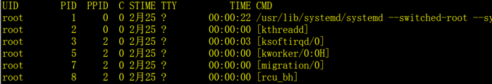
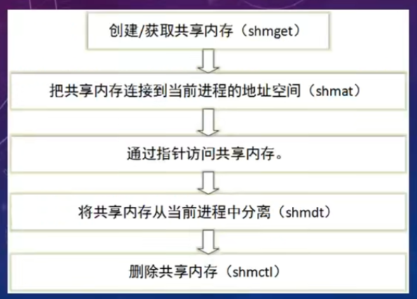
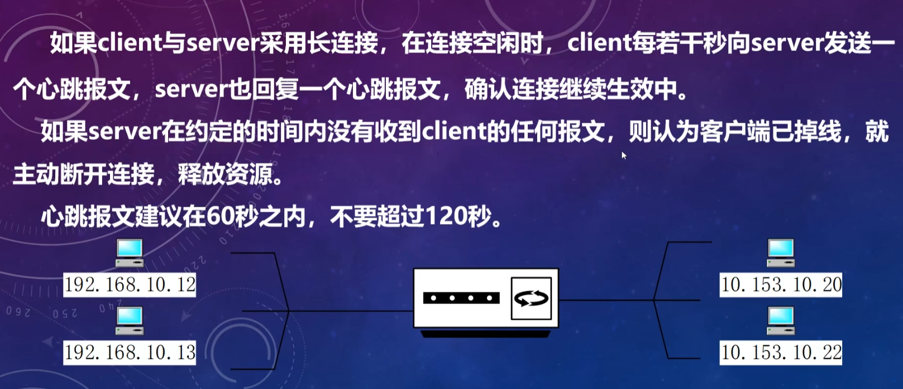
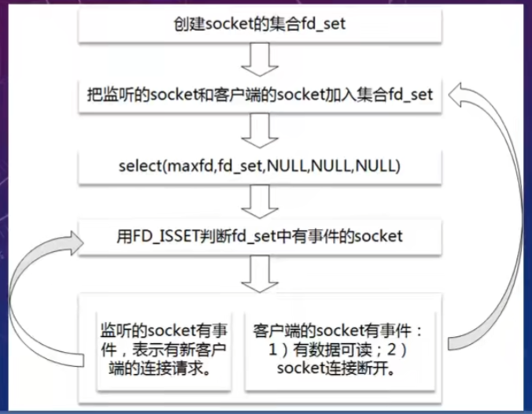
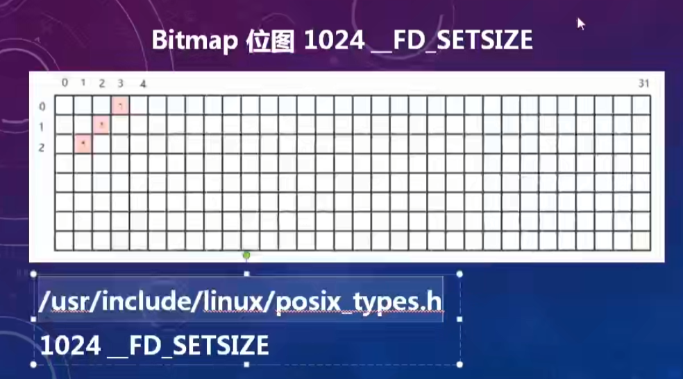
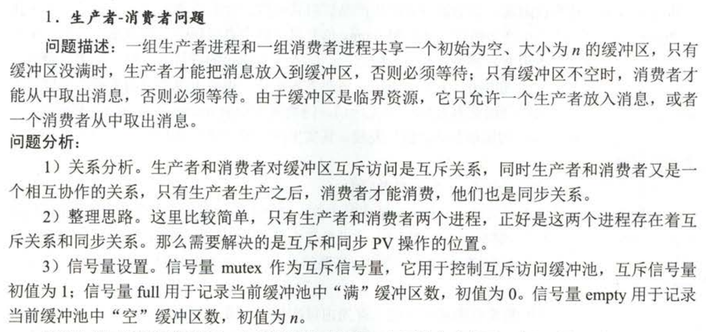
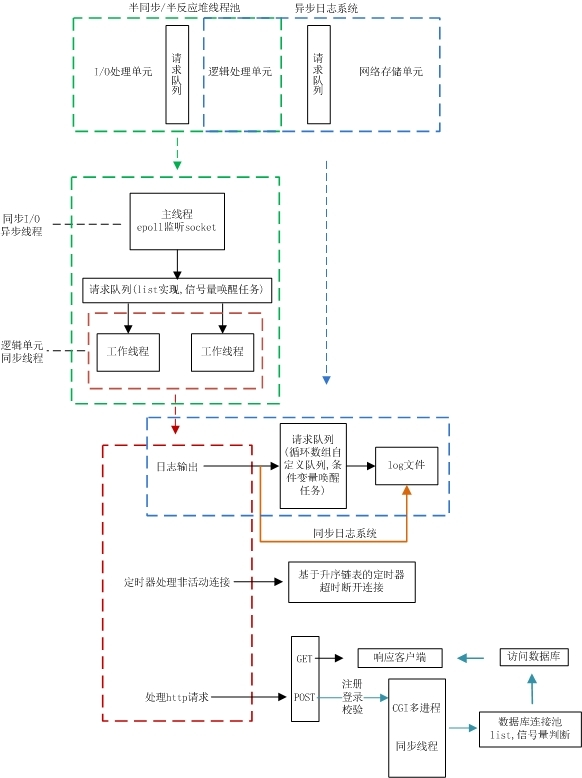
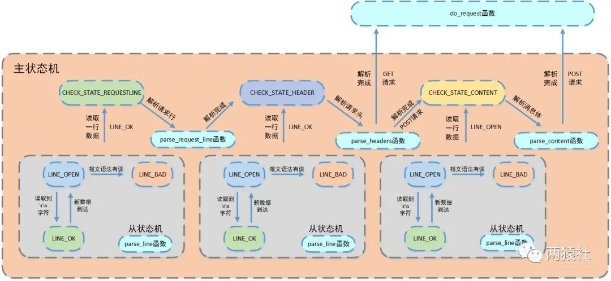
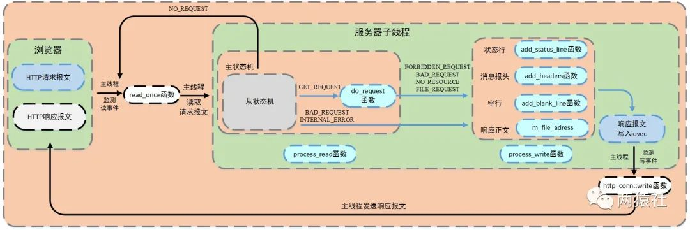

# linux高性能网络编程

[TOC]

Linux中的服务一般都是常见的，**一直在运行的命令**，其独立于控制终端，不受前台和终端的控制，在后台周期性地执行某种任务或等待处理某些发生的事件。运行服务的进程通常被成为后台进程（守护进程）。服务由service启动，并配置。使用上通常由systemctl命令进行控制。

# 网络编程接口

## epoll接口

### epoll结构体

```c++
struct epoll_event {
__uint32_t events; /* Epoll events */
epoll_data_t data; /* User data variable */
};
```

- events描述事件类型，其中epoll事件类型有以下几种

- - EPOLLIN：表示对应的文件描述符可以读（包括对端SOCKET正常关闭）
    - EPOLLOUT：表示对应的文件描述符可以写
    - EPOLLPRI：表示对应的文件描述符有紧急的数据可读（这里应该表示有带外数据到来）
    - EPOLLERR：表示对应的文件描述符发生错误
    - EPOLLHUP：表示对应的文件描述符被挂断；
    - EPOLLET：将EPOLL设为边缘触发(Edge Triggered)模式，这是相对于水平触发(Level Triggered)而言的
    - EPOLLONESHOT：只监听一次事件，当监听完这次事件之后，如果还需要继续监听这个socket的话，需要再次把这个socket加入到EPOLL队列里

### epoll操作接口


```c++
#include <sys/epoll.h> //头文件

//创建一个指示epoll内核事件表的文件描述符
//size: epoll要监听的文件描述符数量
//return: epoll的文件描述符
int epoll_create(int size);


//该函数用于操作内核事件表监控的文件描述符上的事件：注册、修改、删除
//epfd: epoll的文件描述符
//op: 新增(EPOLL_CTL_ADD：1), 删除(EPOLL_CTL_DEL：2), 更新(EPOLL_CTL_MOD：3)
//fd: 本次要操作的文件描述符
//epoll_event: 需要监听的事件：读写事件
//return: 调用成功返回0,不成功返回-1
int epoll_ctl(int epfd, int op, int fd, struct epoll_event* event);


//该函数用于等待所监控文件描述符上有事件的产生，返回就绪的文件描述符个数
//epfd: epoll的文件描述符
//event: 用于回传就绪的事件
//maxevents 每次能处理的的最大事件数
//timeout 等待I/O事件发生的超时时间;-1相当于阻塞，0相当于非阻塞; >0，指定毫秒
//return 大于0：已就绪的文件描述符；等于0：超时；小于：出错
int epoll_wait(int epfd, struct epoll_event *events, int maxevents, int timeout)  
```

## http接口

```c++
 #include <sys/types.h>
 #include <sys/stat.h>
 #include <unistd.h>

//获取文件属性，存储在statbuf中
struct stat
{
	mode_t st_mode;	//文件类型和权限
    off_t st_size;	//文件大小，子节数
};
//stat函数用于取得指定文件的文件属性，并将文件属性存储在结构体stat
int stat(const char *pathname, struct stat *statbuf);

//mmap 用于将一个文件或其他对象映射到内存，提高文件的访问速度
void* mmap(void* start, size_t length, int prot, int flags, int fd, off_t offset);
int munmap(void* start, size_t length); //解除内存映射

//iovec 定义一个向量元素，通常这个结构用作一个多元素的数组
struct iovec{
   void *iov_base;	/* starting address of buffer */
   size_t iov_len; /* size of buffer */
}

//writev 函数用于在一次函数调用中写多个非连续缓冲区，有时也将这该函数称为聚集写
//filedes表示文件描述符
//iov为前述io向量机制结构体iovec
//iovcnt为结构体的个数

#include <sys/uio.h>
size_t writev(int filedes, const struct iovec *iov, int iovcnt);
```

# 网络编程的基本概念

## socket

socket就是插座（中文翻译成套接字有点莫名其妙），运行在计算机中的两个程序通过socket建立起一个通道，数据在通道中传输。
socket把复杂的TCP/IP协议族隐藏了起来，对程序员来说只要用好socket相关的函数，就可以完成网络通信。

socket的分类：socket提供了流和数据报两种通信机制

- 流socket:基于TCP协议，是一个有序、可靠、双向字节流的通道，传输数据不会丢失，不会重复，顺序也不会错乱。
- 数据报socket:基于UDP协议，不需要建立和维持连接，可能会丢失或错乱。UDP不是一个可靠的协议，对数据的长度有限制，但是它的效率比较高。数据报socket的应用场景已经逐渐被替换掉


注意：

- 客户端在listen后就已经连接了
- accept只是为了定位接收的fd和客户端的ip
- 服务端在accept函数中等待连接
- 服务端后续的recv和send都是使用accept返回的sockfd进行传输

### 详解析socket

socket函数用于创建一个新的socket，也就是向系统申请一个socket资源。socket函数用户客户端和服务端。

```c++
int socket(int domain, int type, int protocol);
```

- domain:协议域，常见的有AF_INET(IPV4)、AF_INET6(IPV6)、AF_LOCAL等
- type: 指定socket类型，常用的有SOCK_STREAM(数据流)、SOCK_DGRAM(数据报)、SOCK_RAW等
- protocol:指定协议，常用的协议有IPPROTO_TCP(0)、IPPROTO_UDP、IPPROTO_STCP、IPPROTO_TIPC等，分别对应TCP传输协议、UDP传输协议、STCP传输协议、TIPC传输协议。
- return：成功则返回一个socket，失败返回-1，错误原因存于errno 中。

注意：

- socket的数量在debug和release模型下都不同
- 同一个模型下多次允许的socket都是同一值
- socketfd的数量受限于单进程可以打开的文件数量:使用ulimit -a查看或ulimit -HSn 2000设置数量

## 主机子节序和网络子节序

### 大端和小端字节序

- 大端：高子节放在起始地址
- 小端：低字节放在起始地址


### 主机子节序和网络子节序

- 网络子节序：网络子节序是TCP/IP中规定好的一种数据表示格式，采用大端排序方式
- 主机子节序：不同的主机子节序不相同，与cpu设计有关和操作系统无关
- 不同语言的通信也要考虑子节序的问题，比如c和java

> 转换接口
>
> htons();	ntohs(); 	htonl();	ntohl();
>
> htons() -> host to network short long


**字节序的存储直接采用四字节的整数。**

## 网络通信的常用结构体和接口

服务端和客户端会用到的结构体和接口

### 结构体

地址信息的结构体：sockaddr和sockaddr_in

```c++
//旧地址
struct sockaddr{
	unsigned short sa_family; 	// 地址类型，AF_xxx
    char sa_data[14];			// 14子节的端口和地址
};

//新地址，所占用子节与sockaddr一样
struct sockaddr_in{
    short int sin_family;		 //地址类型
    unsigned short int sin_port; //端口号
    struct in_addr sin_addr;	 //地址
    unsigned char sin_zero[8];	 //填充，为了保持和sockaddr一样的长度	
};

struct in_addr{
    unsigned long s_addr;	//地址
}

//注意
//sockaddr_in在使用bind接口时，需强制转换成(struct sockaddr *)类型
bind(listenfd,(struct sockaddr *)&servaddr,sizeof(servaddr))；
```

### 接口

```c++
//gethostbyname函数可以使用字符串格式的域名获得IP网络子节顺序地址
struct hostent* gethostbyname(const char* name);

struct hostent{
    char* h_name;		//主机名	
    char** h_aliase;	//主机私有别名构成的字符串数组，同一IP可绑定多个域名
    int h_addrtype;		//主机IP地址的类型
    int h_length;		//主机IP地址的长度
    char** h_addr_list;	//主机的IP地址，以网络子节序存储
};
//for backward compatibility
//实际常使用 hostent->h_addr来使用ip地址
#define h_addr h_addr_list[0] 


//将一个字符串ip地址转换为一个32位的网络子节序ip地址
//return：成功返回非零；地址不正确返回零；
int inet_aton(const char* cp, struct in_addr* inp);

//将一个点分十进制的IP地址字符串转换为网络字节序ip地址
//字符串非法返回NADDR_NONE
int inet_addr(constr char* cp);

in_addr ipAddr;
ipAddr.S_un.S_addr = inet_addr("127.0.0.1");
```

## bind函数

bind功能：服务端把用于通信的地址和端口绑定到socket上

```c++
int bind(int sockfd, const struct sockaddr *addr,socklen_t addrlen);
//bind超过1024的端口时需要root权限
//超过65535的端口不会报错 只是连接通信不会响应
```

- sockfd: 需要绑定的socket
- addr：存放服务端用于通信的地址和端口
- addrlen：表示addr结构体的大小
- return: 成功返回0；失败返回-1，错误原因存放在errno中。注意端口号超过65535不会报错，只是无法使用该端口通信

> 关于addr的端口：
>
> 一般用到的是0~65535。其中0不使用，1-1023为系统端口，也叫BSD保留端口。
>
> - 0-1023： BSD保留端口，也叫系统端口，这些端口只有系统特许的进程才能使用；
>
> - 1024~65535为用户端口，又分为：BSD临时端口(1024-5000)和BSD服务器(非特权)端口(5001-65535)。其中：
>
>     - 1024-5000： BSD临时端口，一般的应用程序使用1024到4999来进行通讯；
>
>     - 5001-65535：BSD服务器(非特权)端口，用来给用户自定义端口。

### 服务端socket的SO_REUSEADDR属性

服务端程序的端口释放后可能处于TIME_WAIT状态，等待两分钟后才能再被使用

SO_REUSEADDR属性可以让端口释放后立即就可以被再次使用

```c++
int opt = 1;
unsigned int len = sizeof(opt);
setsockopt(listenfd, SOL_SOCKET, SO_REUSEADDR, &opt, len);
```

## 服务端监听过程

服务端使用一个listenfd监听多个过程，每成功监听一个就放入到请求队列中

accept从请求队列中拿出一个进程并分配clientfd，之后利用clientfd进行传输

在listen到accept过程中可以监听多个请求并放入到请求队列中

```c++
int listen(int sockfd, int backlog);
// sockfd:  使用sockfd监听多个请求
// backlog: tcp三次连接中ESTABLISH的队列长度为backlog + 1


//案列
if (listen(listenfd,5) != 0 ) { perror("listen"); close(listenfd); return -1; }
  //sleep("111"); // can work
      printf("222\n");
      
  // 第4步：接受客户端的连接。
  int  clientfd;                  // 客户端的socket。
  int  socklen=sizeof(struct sockaddr_in); // struct sockaddr_in的大小
  struct sockaddr_in clientaddr;  // 客户端的地址信息。
  
  sleep(10); 
  while(1){
    //从已准备好的连接队列中获取一个请求，如果队列为空，accept函数将阻塞等待
    clientfd=accept(listenfd,(struct sockaddr *)&clientaddr,(socklen_t*)&socklen);
    printf("客户端（%s）已连接。\n",inet_ntoa(clientaddr.sin_addr));
    printf("listenfd: %d, clientfd: %d\n", listenfd, clientfd);
    printf("333\n");
  }
```


## accept函数 服务端接收过程

accept功能：服务端接收客户端的连接

```c++
int accept(int sockfd,struct sockaddr *addr,socklen_t *addrlen);
```

- 参数sockfd是已经被listen过的socket。

- 参数addr用于存放客户端的地址信息，用sockaddr结构体表达，如果不需要客户端的地址，可以填0。

- 参数addrlen用于存放addr参数的长度，如果addr为0，addrlen也填0。
- 成功返回创建的clientfd，失败返回-1

## tcp三次连接

客户端使用connect开启tcp三次握手连接，服务端listen后完成连接，socket状态变成establish。

tcp三次握手是由客户端主动发起的连接

**关于SYN_RECV和ESTABLISH状态：**

- SYB_RECV表示不完全连接或半连接状态，该状态下的socket将放入相应的一个队列中去，长度在`/proc/sys/net/ipv4/tcp_max_syn_backlog`文件里
- ESTABLISH状态表示已连接状态，该状态下的socket将放入相应的一个队列中去（等待accept建立socket的队列），长度为`int listen(int sockfd, int backlog);`的backlog+1


netstat查看socket连接情况

```c++
netstat -na|more

netstat -na|grep 5005
```


> 这里的外部地址可以理解为发送的目的地址

## send和recv

### 函数接口

send函数用于把数据通过socket发送给对端。不论是客户端还是服务端，应用程序都用send函数来向TCP连接的另一端发送数据。

```c++
ssize_t send(int sockfd, const void *buf, size_t len, int flags);
```

- sockfd为已建立好连接的socket。

- buf为需要发送的数据的内存地址，可以是C语言基本数据类型变量的地址，也可以数组、结构体、字符串，内存中有什么就发送什么。

- len需要发送的数据的长度，为buf中有效数据的长度。

- flags填0, 其他数值意义不大。

- 函数返回已发送的字符数。出错时返回-1，错误信息errno被标记。

- 注意，就算是网络断开，或socket已被对端关闭，send函数不会立即报错，要过几秒才会报错。如果send函数返回的错误（<=0），表示通信链路已不可用


recv函数用于接收对端通过socket发送过来的数据。

```c++
ssize_t recv(int sockfd, void *buf, size_t len, int flags);
```

- sockfd为已建立好连接的socket。

- buf为用于接收数据的内存地址，可以是C语言基本数据类型变量的地址，也可以数组、结构体、字符串，只要是一块内存就行了。

- len需要接收数据的长度，不能超过buf的大小，否则内存溢出。

- flags填0, 其他数值意义不大。

- 函数返回已接收的字符数。出错时返回-1，失败时不会设置errno的值。

- 如果socket的对端没有发送数据，recv函数就会等待，如果对端发送了数据，函数返回接收到的字符数。出错时返回-1。**如果socket被对端关闭，返回值为0**
- 如果recv函数返回的错误（<=0），表示通信通道已不可用。

### 原理和注意事项

- send和recv过程会在本机子节序和网络字节序中切换，在发送一个以上字节时应注意

- 原理：


​	在send和recv过程有三个缓冲区，所以在高并发情况下，send缓冲区满时，也会阻塞。

## TCP粘包和分包

### 粘包和分包的概念

粘包：如果一次请求发送的数据量比较小，没达到缓冲区大小，TCP则会将多个请求合并为同一个请求进行发送，这就形成了粘包问题

分包：如果一次请求发送的数据量比较大，超过了缓冲区大小，TCP就会将其拆分为多次发送，这就是分包。

发送的场景：

- 要发送的数据大于TCP发送缓冲区剩余空间大小，将会发生分包。

- 待发送数据大于MSS（最大报文长度），TCP在传输前将进行分包。

- 要发送的数据小于TCP发送缓冲区的大小，TCP将多次写入缓冲区的数据一次发送出去，将会发生粘包。

- 接收数据端的应用层没有及时读取接收缓冲区中的数据，将发生粘包。


### 解决方案

- 发送端将每个包都封装成固定的长度，比如100字节大小。如果不足100字节可通过补0或空等进行填充到指定长度;
- 发送端在每个包的末尾使用固定的分隔符，例如\r\n。如果发生拆包需等待多个包发送过来之后再找到其中的\r\n进行合并;例如，FTP协议;
- 将消息分为头部和消息体，头部中保存整个消息的长度，只有读取到足够长度的消息之后才算是读到了一个完整的消息;
- 通过自定义协议进行粘包和拆包的处理。

# linux信号详解

## 后台程序

在真实的项目中，后台服务程序不受终端控制常驻内存中，没有交互的界面。可以周期性或通过事件唤醒的方式执行任务

### 后台程序的执行

想让程序在后台运行，有两种方式：一种是加“&”符号，一种是使用fork

运行时加“&”符号

```bash
#使用"&"符号
./book &

ps -ef|grep book
wucz 12612 12718 0 00:00:00 ./book #12612代表当前进程 12718代表父进程

#如果终端退出了
ps -ef|grep book
wucz 12612 1 0 00:00:00 ./book #12612代表当前进程 1代表父进程，表示由系统托管
```

代码中加入fork

```c++
//在home函数后增加：
if (fork()>0) return 0;

ps -ef|grep book
wucz 126669 1 0 00:00:00 ./book 
```

### 后台程序的终止

使用kill命令

```bash
killall book #kill程序名
kill 12612 #kill 进程b
killall -9 book #强制杀死进程 杀死有关book的所有进程(父进程和子进程)
```

## 信号

### 信号概述

signal信号是进程之间相互传递消息的一种方法，信号全称为软中断信号，也有人称作软中断，从它的命名可以看出，它的实质和使用很象中断。

程序在运行过程中，用ctrl+c,kill,killall终止其本质时**向程序发送信号，再对信号进行响应产生缺省行为终止程序**

注意，信号只是用来通知某进程发生了什么事件，无法给进程传递任何数据，进程对信号的处理方法有三种：

1）第一种方法是，忽略某个信号，对该信号不做任何处理，就象未发生过一样。

2）第二种是设置中断的处理函数，收到信号后，由该函数来处理。

3）第三种方法是，对该信号的处理采用系统的默认操作，大部分的信号的默认操作是终止进程。

### 信号类型

| 信号名      | 信号值       | 缺省行为 | 发出信号的原因                                       |
| ----------- | ------------ | -------- | ---------------------------------------------------- |
| **SIGINT**  | **2**        | **A**    | **键盘中断Ctrl+c**                                   |
| **SIGKILL** | **9**        | **AEF**  | **采用kill  -9 进程编号 强制杀死程序。**             |
| **SIGSEGV** | **11**       | **C**    | **无效的内存引用**                                   |
| **SIGTERM** | **15**       | **A**    | **采用“kill  进程编号”或“killall 程序名”通知程序。** |
| **SIGCHLD** | **20,17,18** | **B**    | **子进程结束信号**                                   |

缺省行为中的字母含义如下：

- A 缺省的动作是终止进程。

- B 缺省的动作是忽略此信号，将该信号丢弃，不做处理。

- C 缺省的动作是终止进程并进行内核映像转储（core dump），内核映像转储是指将进程数据在内存的映像和进程在内核结构中的部分内容以一定格式转储到文件系统，并且进程退出执行，这样做的好处是为程序员 提供了方便，使得他们可以得到进程当时执行时的数据值，允许他们确定转储的原因，并且可以调试他们的程序。

- D 缺省的动作是停止进程，进入停止状况以后还能重新进行下去。

- E 信号不能被捕获。

- F 信号不能被忽略。

### 信号作用

服务程序运行在后台，如果想让中止它，强行杀掉不是个好办法，因为程序被杀的时候，程序突然死亡，没有释放资源，会影响系统的稳定，用Ctrl+c中止与杀程序是相同的效果。

如果能向后台程序发送一个信号，后台程序收到这个信号后，调用一个函数，在函数中编写释放资源的代码，程序就可以有计划的退出，安全而体面。

信号还可以用于网络服务程序抓包等，这是较复杂的应用场景，暂时不介绍。

```c++
//实际案列

//main函数开始的位置，会先屏蔽掉全部的信号
for (int ii=0;ii<100;ii++) signal(ii,SIG_IGN);

//kill时先释放资源
#include <stdio.h>
#include <unistd.h>
#include <stdlib.h>
#include <signal.h>

void EXIT(int sig)
{
  	printf("收到了信号%d, 程序退出\n", sig);
    //释放资源代码
    exit(0);
}


int main()
{
	for(int i = 0; i < 100; ++i)
        signal(i, SIG_IGN);
    
    //设置SIGINT和SIGTERM的处理函数
  	signal(SIGINT, EXIT);
    signal(SIGTERM, EXIT);
    
    while(1)
    {
        sleep(10);
    }
}


//case
//第一次SIGINT会输出信息，并将信号处理设置成缺省行为
//第二次SIGINT使用q

void fun()
{
    printf("收到了信号%d, 程序退出\n", sig);
    signal(sig, SIG_DFL);
}

int main()
{
	for(int i = 0; i < 100; ++i)
        signal(i, SIG_IGN);
    
    //设置SIGINT和SIGTERM的处理函数
  	signal(SIGINT, fun);
    
    while(1)
    {
        sleep(10);
    }
}
```


### signal库函数接口

**signal：可以设置程序对信号的处理方式**

```c++
sighandler_t signal(int signum, sighandler_t handler);
```

- signum表示信号的编号或名字
- handler表示信号的处理方式，有三种情况：
    - SIG_IGN：忽略参数signum所指的信号。
    - 一个自定义的处理信号的函数，信号的编号为这个自定义函数的参数。
    - SIG_DFL：恢复参数signum所指信号的处理方法为默认值。 
    - 信号处理函数是运行在用户态的

**kill: 向程序发送信号**

```c++
int kill(pid_t pid, int sig);
```

kill函数将参数sig指定的信号给参数pid 指定的进程

- pid指定的进程
    - pid>0 将信号传给进程号为pid 的进程。
    - pid=0 将信号传给和目前进程相同进程组的所有进程，常用于父进程给子进程发送信号，注意，发送信号者进程也会收到自己发出的信号。
    - pid=-1 将信号广播传送给系统内所有的进程，例如系统关机时，会向所有的登录窗口广播关机信息。
- sig发送的信号
- return: 成功执行时，返回0；失败返回-1

 ## 信号详解

### 可靠信号和不可靠信号概念

- 不可靠信号（1-32）：每次信号处理后，就会恢复成默认处理(早期的signal函数，在linuxr2.6.35.6内核后不会恢复默认动作)；                                     			存在信号丢失问题(即同时传输多个信号，可能响应少数几个)
- 可靠信号（34-64）：不存在信号丢失问题

### 信号处理函数被中断

中断的情况：

- 当一个信号到达后调用处理函数，如果这时有其他的信号发生，会中断之前的处理函数，等新的信号处理函数执行完成后再继续处理之前的处理函数
- 如果是同一个信号，则会排队阻塞

## 信号的阻塞

信号的阻塞：如果希望在收到信号时中断当前的处理函数，也不希望忽略该信号。而是延时一段时间再处理，这种情况可以通过阻塞信号实现

### 阻塞的接口

通过创建一个信号集，并对信号集里的信号设置阻塞和非阻塞来实现。

```c++
#include <signal.h>
int sigemptyset(sigset_t* set); //将信号集清空
int sigfillset(sigset_t* set);	//将所有信号放入信号集
int sigaddset(sigset_t* set, int signum);	//将指定信号添加到信号集里
int sigdelset(sigset_t* set, int signum);	//将指定信号从信号集中删除
int sigismember(const sigset_t* set, int signum);	//判断指定信号是否在信号集中

int sigprocmask(int how, const sigset_t* set, sigset_t* oldset); //对信号进行操作
//how：操作类型 SIG_BLOCK阻塞 SIG_UNBLOCK非阻塞
//set：操作集合
//oldset：保存以前的集合，null表示不保存

```

案列

信号集设置成block只是主断信号的传递，并不是把信号忽略掉

```c++
//收到信号15后不会立即做出反应
//而是在程序运行20秒后才会响应
void func(int sig)
{
    printf("sig=%d\n", sig);
    for(int j = 1; j <= 5; j++)
    {
        printf("j(sig %d)=%d\n", sig, j);
        sleep(1);
    }
}

int main()
{
    signal(15, func);
    signal(34, func);

    sigset_t set;
    sigemptyset(&set);
    sigaddset(&set, 15);
    sigprocmask(SIG_BLOCK, &set, NULL);

    for(int i = 1; i < 100; ++i)
    {
        printf("i = %d\n", i);
        sleep(1);
        if(i > 20)
            sigprocmask(SIG_UNBLOCK, &set, NULL);
    }
    return 0;
}

//保证信号2能完整运行完
void fun1(int sig)
{
    sigset_t set;
    sigemptyset(&set);
    sigaddset(&set, 15); //sigfillset(&set); 关闭所有的信号
    sigprocmask(SIG_BLOCK, &set, NULL);

    printf("sig=%d\n", sig);
    for(int j = 1; j <= 5; j++)
    {
        printf("j(sig %d)=%d\n", sig, j);
        sleep(1);
    }

    sigprocmask(SIG_UNBLOCK, &set, NULL);
}

void fun2(int sig)
{
    printf("sig=%d\n", sig);
    for(int j = 1; j <= 5; j++)
    {
        printf("j(sig %d)=%d\n", sig, j);
        sleep(1);
    }
}


int main()
{
    signal(2, fun1);
    signal(15, fun2);

    sigset_t set;
    sigemptyset(&set);
    sigaddset(&set, 15);
    sigprocmask(SIG_BLOCK, &set, NULL);

    for(int i = 1; i < 100; ++i)
    {
        printf("i = %d\n", i);
        sleep(1);
        if(i > 20)
            sigprocmask(SIG_UNBLOCK, &set, NULL);
    }
    return 0;
}
```

## 功能更强的sigaction库

sigaction作为signal的升级版，带来许多功能

**sigaction函数的功能是检查或修改与指定信号相关联的处理动作,接口如下**

````c++
#include <signal.h>

//sigaction结构体
struct sigaction {
    void    (*sa_handler)(int);    //信号调用后的处理函数
    sigset_t    sa_mask;           //阻塞的信号集
    int    sa_flags;               //信号配置项

    /* alternate handler */
    void    (*sa_sigaction)(int, siginfo_t *, void *);
};

int sigaction(int signum, const struct sigaction *act, struct sigaction *oldact);
````


### 案列

```c++
//当使用信号中断程序的scanf赋值后，程序能恢复到scanf赋值状态
//需要将sa_flag设置为SA_RESTART

#include <signal.h>

void hdfunc(int sig)
{
	printf("sig = %d\n", sig);
    for(i = 1; i <= 5; ++i)
    {
        printf("j(sig %d) = %d\n", sig, i);
        sleep(1);
    }
}

int main()
{
    struct sigaction stact;
    memset(&stact, 0, sizeof(stact));	//结构体初始化
    stact.sa_handler = hdfunc;			//指定信号处理函数
    
    sigaddset(&stact.sa_mask, 15); 		//指定需要阻塞的信号 无需sigprocmask设置成block
    //sigprocmask(SIG_BLOCK, &stact.sa_mask, NULL); 
    
    stact.sa_flags = SA_RESTART;		//如果信号中断了进程的某个系统调用，则系统自动启动该系统调用
    
    sigaction(2, &stact, NULL);			//设置信号2的处理行为
    sigaction(15,&stact, NULL);			//设置信号15的处理行为
    
    char str[51];
    memset(str, 0, sizeof(str));
    scanf("%s", str);
    printf("str = %s\n", str);
    /*
    for(int i = 1; i < 100; ++i)
    {
    	printf("i = %d\n", i);
    	sleep(1);
    }
    */
}
```

# linux多进程详解

## 进程概述

进程这个概念是针对系统而不是针对程序员的，对程序员来说，我们面对的概念是程序，当输入指令执行一个程序的时候，对系统而言，它将启动一个进程。

**进程就是正在内存中运行中的程序**，Linux下一个进程在内存里有三部分的数据，就是“代码段”、”堆栈段”和”数据段”。”代码段”，顾名思义，就是存放了程序代码。“堆栈段”存放的就是程序的返回地址、程序的参数以及程序的局部变量。而“数据段”则存放程序的全局变量，常数以及动态数据分配的数据空间（比如用new函数分配的空间）。

系统如果同时运行多个相同的程序，它们的“代码段”是相同的，“堆栈段”和“数据段”是不同的（相同的程序，处理的数据不同）。 

Linux中的**服务**一般都是常见的，**一直在运行的命令**，其独立于控制终端，不受前台和终端的控制，在后台周期性地执行某种任务或等待处理某些发生的事件。运行服务的进程通常被成为后台进程（守护进程）。服务由service启动，并配置。使用上通常由systemctl命令进行控制。

### 查看进程

使用`ps`查看进程信息：

```basic
ps 查看当前终端的进程。
ps -ef 查看系统全部的进程。
ps -ef |more 查看系统全部的进程，结果分页显示。
```



- UID   ：启动进程的操作系统用户。

- PID   ：进程编号。

- PPID  ：进程的父进程的编号。

- C     ：CPU使用的资源百分比。
- STIME ：进程启动时间。
- TTY   ：进程所属的终端。
- TIME  ：使用掉的CPU时间。
- CMD  ：执行的是什么指令。

> 函数接口

```c++
pid_t getpid(); //返回进程的编号

#include <stdio.h>
#include <sys/types.h>
#include <unistd.h>

int main()
{
    printf("进程编号：%d\n", getpid());
    sleep(10);
}
```

注意：

1）进程的编号是系统动态分配的，相同的程序在不同的时间执行，进程的编号是不同的。

2）进程的编号会循环使用，但是，在同一时间，进程的编号是唯一的，也就是说，不管任何时间，系统不可能存在两个编号相同的进程。

3）父进程与子进程运行互不影响，父进程退出后，子进程依然可以正常运行(此时的父进程编号为1)

## 多进程的基础知识

### 僵尸进程

僵尸进程是当子进程比父进程先结束，而父进程又没有回收子进程，释放子进程占用的资源，此时子进程将成为一个僵尸进程。

如果父进程先退出 ，子进程被init接管，子进程退出后init会回收其占用的相关资源

一个子进程在调用exit命令结束自己的生命时候，其实它没有真正的被销毁，而是留下一个称为僵尸进程的数据结构（系统调用exit，它的作用是使进程退出，但也仅仅限于将一个正常的进程变成一个僵尸进程，并不能将其完全销毁）。在Linux进程的状态中，僵尸进程是非常特殊的一种，它已经放弃了几乎所有的内存空间，没有任何可执行代码，也不能被调度，仅仅在进程列表中保留一个位置，记录在进程的退出状态等信息供其他进程收集，除此之外，僵尸进程不在占有任何内存空间。

> 解决方式

```c++
int main()
{
    signal(SIGCHLD,SIG_IGN);	//忽略子进程退出的信号，避免产生僵尸进程
}
```

### 多进程框架下关闭多余的socket

服务端要求：

- 父进程关闭多余的通信socket
- 子进程关闭多余的监听socket

**注意：在父/子进程关闭多余的socker并不影响程序的执行，因为子进程会对父进程所有资源进行拷贝，所以两者的资源是独立的**

```c++
int main()
{
    while(true)
    {
        if (fork() > 0)
        {
            TcpServer.CloseClient(); 	//父进程关闭通信socker
            continue;
        }
        else
        	TcpServer.CloseListent();	//子进程关闭监听socker
    }
}
```

## 程序的退出和资源的释放

在多进程服务端程序中，资源的释放需注意：

- 类中的析构函数需要分配对应的资源
- 对于信号(SIGINT, SIGTERM)需要编写完整的调用函数

```c++
//服务端对信号的处理


//父进程退出函数
void FathEXIT(int sig)
{
    //先屏蔽所有的信号处理 避免再次调用退出函数
	if(sig > 0)
    {
        signal(sig, SIG_IGN);
        signal(SIGINT, SIG_IGN);
        signal(SIFTERM, SIG_IGN);
    }
    kill(0, 15);	//给子进程传递退出信号
    
    //释放资源代码
    
    printf("父进程退出\n");
    exit(0)；
}

//子进程退出函数
void ChLdEXIT(int sig)
{
    //先屏蔽所有的信号处理 避免再次调用退出函数
	if(sig > 0)
    {
        signal(sig, SIG_IGN);
        signal(SIGINT, SIG_IGN);
        signal(SIFTERM, SIG_IGN);
    }
	
    //释放资源代码
    
    printf("子进程退出\n");
    exit(0)；
}


int main()
{
	for(int i = 0; i < 100 ++i)
        signal(i, SIG_IGN);
    
    //设置信号，在shell状态下可用"kill + 进程号"正常终止这些进程
   	//注意不要使用"kill -9 进程号"强行终止
    signal(SIGINT, FathEXIT);
    signal(SIFTERM, FathEXIT);

}
```

# liunx进程间通信(共享内存和信号量)

## 进程通信概述

进程通信的方式大概分为六种。

1）管道：包括无名管道（pipe）及命名管道（named pipe），无名管道可用于具有父进程和子进程之间的通信。命名管道克服了管道没有名字的限制，因此，除具有管道所具有的功能外，它还允许无亲缘关系进程间的通信。

2）消息队列（message）：进程可以向队列中添加消息，其它的进程则可以读取队列中的消息。

3）信号（signal）：信号用于通知其它进程有某种事件发生。

4）共享内存（shared memory）：多个进程可以访问同一块内存空间。

5）信号量（semaphore）：也叫信号灯，用于进程之间对共享资源进行加锁。

6）套接字（socket）：可用于不同计算机之间的进程间通信。

开发经验：

1）管道和消息队列太过时了，实在没什么应用价值，了解概念就行。

2）socket可以用于不同系统之间的进程通信，完全可以代替只能在同一系统中进程之间通信的管道和消息队列。

3）信号的应用场景非常多，主要用于进程的控制，例如通知正在运行中的后台服务程序退出。

4）同一系统中，进程之间采用**共享内存**交换数据的效率是最高的，但是，共享内存没有加锁的机制，所以经常与信号灯结合一起来使用，在高性能的网络服务端程序中，可以用共享内存作为的数据缓存（cache）。

5）在企业IT系统内部，消息队列已经逐渐成为通信的核心手段，它具有低耦合、可靠投递、广播、流量控制、一致性等一系列功能。当今市面上有很多主流的**消息中间件**有Redis、RabbitMQ、Kafka、ActiveMQ、ZeroMQ，阿里巴巴自主开发RocketMQ等。

> 管道和消息队列都要求实时通信
>
> 消息中间件则不需要，发送消息时服务端可以不用在线

## 共享内存

共享内存（Shared Memory）就是允许多个进程访问同一个内存空间，是在多个进程之间共享和传递数据最高效的方式。操作系统将不同进程之间共享内存安排为同一段物理内存，进程可以将共享内存连接到它们自己的地址空间中，如果某个进程修改了共享内存中的数据，其它的进程读到的数据也将会改变。

共享内存并未提供锁机制，也就是说，在某一个进程对共享内存的进行读写的时候，不会阻止其它的进程对它的读写。如果要对共享内存的读/写加锁，可以使用信号灯。

   

### 共享内存api接口

包含头文件如下：

```c++
#include <sys/ipc.h>
#include <sys/shm.h>
```


```c++
//shmget函数用来获取或者创建共享内存
int shmget(ket_t key, size_t size, int shmflg);
```

- key: 共享内存在系统的编号，具有唯一性。key建议使用十六机制
- size: 是待创建的共享内存大小，以子节为单位
- shmflg: 是共享内存的访问权限，0666|IPC_CREAT表示全部用户对它可读写
- return: 返回共享内存标识


```c++
//shmat把共享内存连接到当前进程的地址空间
void *shmat(int shm_id, const void *shm_addr, int shmflg);
```

- 参数shm_id是由shmget函数返回的共享内存标识。

- 参数shm_addr指定共享内存连接到当前进程中的地址位置，通常为空，表示让系统来选择共享内存的地址。

- 参数shm_flg是一组标志位，通常为0。

- return: 调用成功时返回一个指向共享内存第一个字节的指针，如果调用失败返回-1


```c++
//该函数用于将共享内存从当前进程中分离，相当于shmat函数的反操作
int shmdt(const void *shmaddr);
```

- 参数shmaddr是shmat函数返回的地址。

- 调用成功时返回0，失败时返回-1.


```c++
//shmctl是控制共享内存的函数 一般用于删除共享内存
int shmctl(int shm_id, int command, struct shmid_ds *buf);
```

- 参数shm_id是shmget函数返回的共享内存标识符。

- 参数command填IPC_RMID。

- 参数buf填0。

**用root创建的共享内存，不管创建的权限是什么，普通用户无法删除**

### 操作命令

```c++
ipcs -m //查看系统的共享内存
ipcrm -m 共享内存编号 //删除共享内存
```

nattch表示当前使用内存的进程个数（分离后就不再占用了）

### 案列

```c++
#include <stdio.h>
#include <string.h>
#include <unistd.h>
#include <sys/ipc.h>
#include <sys/shm.h> 

int main()
{
  int shmid; // 共享内存标识符
 
  // 创建共享内存，键值为0x5005，共1024字节。
  if ( (shmid = shmget((key_t)0x5005, 1024, 0640|IPC_CREAT)) == -1)
  { printf("shmat(0x5005) failed\n"); return -1; }
   
  char *ptext=0;   // 用于指向共享内存的指针
 
  // 将共享内存连接到当前进程的地址空间，由ptext指针指向它
  ptext = (char *)shmat(shmid, 0, 0);
 
  // 操作本程序的ptext指针，就是操作共享内存
  printf("写入前：%s\n",ptext);
  sprintf(ptext,"本程序的进程号是：%d",getpid());
  printf("写入后：%s\n",ptext);
 
  // 把共享内存从当前进程中分离
  shmdt(ptext);
   
  // 删除共享内存
  // if (shmctl(shmid, IPC_RMID, 0) == -1)
  // { printf("shmctl(0x5005) failed\n"); return -1; }
}
```

## 信号量

信号量（信号灯）本质上是一个计数器，用于协调多个进程（包括但不限于父子进程）对共享数据对象的读/写。它不以传送数据为目的，主要是用来保护共享资源（共享内存、消息队列、socket连接池、数据库连接池等），保证共享资源在一个时刻只有一个进程独享。

最简单的信号量时取值0和1的二元信号量

通用信号量(可用取多个正真数值)

### 函数接口

操作信号量包含头文件如下

```c
#include <sys/types.h>
#include <sys/ipc.h>
#include <sys/sem.h>
```

#### semget

```c++
//semget函数用来获取或创建信号量集
//先获取再创建
int semget(key_t key, int nsems, int semflg);
```

1）参数key是信号量的键值，typedef unsigned int key_t，是信号量在系统中的编号，不同信号量的编号不能相同，这一点由程序员保证。key用十六进制表示比较好。
2）参数nsems是创建信号量集中信号量的个数，该参数只在创建信号量集时有效，这里固定填1。
3）参数sem_flags是一组标志，如果希望信号量不存在时创建一个新的信号量，可以和值IPC_CREAT做按位或操作。如果没有设置IPC_CREAT标志并且信号量不存在，就会返错误（errno的值为2，No such file or directory）。
4）如果semget函数成功，返回信号量集的标识；失败返回-1，错误原因存于error中。


#### semctl

```c++
// 该函数用来控制信号量（常用于设置信号量的初始值和销毁信号量），它的原型如下：
int semctl(int semid, int sem_num, int command, ...);
```

1）参数semid是由semget函数返回的信号量标识。

2）参数sem_num是信号量集数组上的下标，表示某一个信号量时填0。

3）参数cmd是对信号量操作的命令种类，常用的有以下两个：

**IPC_RMID**：销毁信号量，不需要第四个参数；

**SETVAL**：初始化信号量的值（信号量成功创建后，需要设置初始值），这个值由第四个参数决定。第四参数是一个自定义的共同体，如下：

```c
  // 用于信号灯操作的共同体。
  union semun
  {
    int val;
    struct semid_ds *buf;
    unsigned short *arry;
  };
```

4）如果semctl函数调用失败返回-1；如果成功，返回值比较复杂，暂时不关心它。

```c++
//销毁信号量  
semctl(semid,0,IPC_RMID);

//初始换信号量为1
union semun sem_union;
sem_union.val = 1;
semctl(semid,0,SETVAL,sem_union);
```


#### semop

```c
//该函数有两个功能：1）等待信号量的值变为1，如果等待成功，立即把信号量的值置为0，这个过程也称之为等待锁；2）把信号量的值置为1，这个过程也称之为释放锁。
int semop(int semid, struct sembuf *sops, unsigned nsops);
```

1）参数semid是由semget函数返回的信号量标识。

2）参数nsops是操作信号量的个数，即sops结构变量的个数，设置它的为1（只对一个信号量的操作）。

3）参数sops是一个结构体，如下：

```c++
struct sembuf
{
  short sem_num;   // 信号量集的个数，单个信号量设置为0。
  short sem_op;    // 信号量在本次操作中需要改变的数据：-1-等待操作；1-发送操作。
  short sem_flg;   // 把此标志设置为SEM_UNDO，操作系统将跟踪这个信号量。
                   // 如果当前进程退出时没有释放信号量，操作系统将释放信号量(不是销毁)，避免资源被死锁。
};
```

### 操作命令

```c++
ipcs -s //查看系统的信号量
ipcrm sem 信号量标号 //删除信号量
```

### 案列

注意：如果程序在运行时被异常退出，且semop的操作sem_flg为SEM_UNDO。则程序在退出时系统将释放信号量

```c++
#include <stdio.h>
#include <string.h>
#include <unistd.h>
#include <errno.h>
#include <sys/ipc.h>
#include <sys/sem.h>

class SEM
{

private:
    union semun
    {
        int val;
        struct semid_ds* buf;
        unsigned short* array;
    };
    int sem_id; //信号量描述符

public:
    bool init(key_t key);   //如果信号量已存在，获取信号量；如果信号量不存在，则创建信号量并初始化
    bool wait();            //等待信号量
    bool post();            //释放信号量
    bool destroy();         //销毁信号量

};  //class sem

bool SEM::init(key_t key)
{
    // 获取信号量
    if( (sem_id = semget(key, 1, 0640)) == -1)
    {
        // 如果信号量不存在，创建它
        if(errno == 2)
        {
            if((sem_id = semget(key, 1, 0640|IPC_CREAT)) == -1)
            {
                perror("init 1 semget()");
                return false;
            }

            //信号量创建成功后 还需要把它初始化可用的状态
            union semun sem_union;
            sem_union.val = 1; //信号量的初始值
            if(semctl(sem_id, 0, SETVAL, sem_union) < 0)
            {
                perror("init semctl()");
                return false;
            }
        }
        else
        {
            perror("init 2 semget()");
            return false;
        }

    }
    return true;
}

bool SEM::destroy()
{
    if(semctl(sem_id, 0, IPC_RMID) == -1)
    {
        perror("destroy semctl()");
        return false;
    }

    return true;
}

bool SEM::wait()
{
    struct sembuf sem_b;
    sem_b.sem_num  = 0;
    sem_b.sem_op = -1;
    sem_b.sem_flg = SEM_UNDO;
    if(semop(sem_id, &sem_b, 1) == -1)
    {
        perror("wait semop()");
        return false;
    }
    return true;
}

bool SEM::post()
{
    struct sembuf sem_b;
    sem_b.sem_num = 0;
    sem_b.sem_op - 1;
    sem_b.sem_flg = SEM_UNDO;
    if(semop(sem_id, &sem_b, 1) == -1)
    {
        perror("wait semop()");
        return false;
    }
    return true;
}


int main()
{
    SEM sem;

    if(sem.init(0x5000) == false)
    {
        printf("sem.init failed\n");
        return -1;
    }
    printf("sem.init ok\n");
    
    //等待信号挂出
    if(sem.wait() == false)
    {
        printf("sem.wait failed\n");
        return -1;
    }
    printf("sem wait ok\n");

    sleep(5);

    if(sem.post() == false)
    {
        printf("sem.post failed\n");
    }
    printf("sem.post ok\n");

    // if(sem.destroy() == false)
    //  {
    //     printf("sem.destroy failed\n");
    // }
    // printf("sem.destroy ok\n");

    return 0;
}

```

# linux多线程

## 线程概述

线程：多进程的数据空间时独立的，同一进程中的多个线程的数据空间是共享的，线程消耗的资源比进程要少

### 创建线程

在Linux下，采用pthread_create函数来创建一个新的线程，函数声明：

```c++
int pthread_create(pthread_t *thread, const pthread_attr_t *attr,void *(*start_routine) (void *), void *arg);
```

- 参数thread为为指向线程[标识符](http://baike.baidu.com/view/390932.htm)的地址。
- 参数attr用于设置线程属性，一般为空，表示使用默认属性。
- 参数start_routine是线程运行函数的地址，填函数名就可以了。
- 参数arg是线程运行函数的参数。新创建的线程从start_routine函数的地址开始运行，该函数只有一个无类型指针参数arg。若要想向start_routine传递多个参数，可以将多个参数放在一个结构体中，然后把结构体的地址作为arg参数传入，**但是要非常慎重，程序员一般不会这么做。**
- 在编译时注意加上-lpthread参数，以调用静态链接库。因为pthread并非Linux系统的默认库。

### 线程的终止

```c++
void pthread_exit(void *retval); //retval一般填0
```

 如果进程中的任一线程调用了exit，则整个进程会终止，所以，在线程的start_routine函数中，不能采用exit。

线程的终止有三种方式：

1）线程的start_routine函数代码结束，自然消亡。

2）线程的start_routine函数调用pthread_exit结束。

3）被主进程或其它线程中止。

### 线程的查看

```bash
top -H	#每一行显示的不是进程而是线程
ps -xH
ps -xH|grep book
```

## 线程参数的传递

进程的运行是同步的，而线程的运行是异步的，及每次运行的顺序可能不一样

参数的传递使用`pthread_create(&pthid1, NULL, func1, (void*)(long)var); //第四个参数来实现传递`

```c++
//数值到地址的转换
int i = 10;
void* ptr = (void*)(long)i; //int是4子节 void*是8子节 所以需要转换为long
int j = (int)(long)ptr;

//案列
var = 0;
int main()
{
    pthread_t pthid1, pthid2;

    if(pthread_create(&pthid1, NULL, mainfunc1, (void*)var) != 0)
    {
        printf("创建线程失败， 程序退出\n");
        return -1;
    }
    
    if(pthread_create(&pthid2, NULL, mainfunc2, (void*)var) != 0)
    {
        printf("创建线程失败， 程序退出\n");
        return -1;
    }
}
```

## 线程资源的回收

线程有joinable（非分离的）和unjoinable（分离的）两种状态。

- 线程是joinable状态，子线程的主函数终止(即create参数的函数自己退出或调用pthread_exit退出)时不会释放线程所占用的内存资源，这种线程被称为“僵尸线程”
- unjoinable状态，可以自动释放

回收线程资源的方式：

- 方法一：创建线程后，在创建线程的程序中调用pthread_join等待线程退出，一般不会采用这种方法，因为pthread_join会发生阻塞。

```c++
pthread_join(pthid,NULL);
```

- 方法二：创建线程前，调用pthread_attr_setdetachstate将线程设为detached，这样线程退出时，系统自动回收线程资源。

```c++
  pthread_attr_t attr;
  pthread_attr_init(&attr);
  pthread_attr_setdetachstate(&attr,PTHREAD_CREATE_DETACHED);  // 设置线程的属性。
  pthread_create(&pthid,&attr,pth_main,(void*)((long)TcpServer.m_clientfd);
```

- 方法三：创建线程后，在创建线程的程序调用pthread_detach将新创建的线程设置为detached状态。

```c++
pthread_detach(pthid);
```

- 方法四：在线程主函数中调用pthread_detach改变自己的状态。

```c++
pthread_detach(pthread_self());
```

## 线程返回的状态

通过pthread_join的第二个参数返回线程调用的值

```c++
int main()
{
    pthread_t pthid;
    
    if(pthread_create(&pthid, NULL, mainfunc, NULL) != 0)
    {
        printf("创建线程失败， 程序退出\n");
        return -1;
    }
    
    int ival;
    printf("等待子线程退出\n");
    int iret = pthread_join(pthid, (void**)&ival);
    //iret是函数返回值，ival是线程返回值
    printf("子线程已退出(iret = %d, ival = %d)\n", iret, ival);
   
    return 0;
}

```

## 线程的取消和清理

### 线程的取消

线程取消并不是等待线程终止，它只提出请求，超过取消会调用线程清理函数。可以采用三种方式取消：

- pthread_cancel：发送终止信号给thread线程，如果成功则返回0，否则为非0值。发送成功并不意味着thread会终止
- pthread_setcancelstate：设置pthread_cancle的请求的响应方式 立即取消或不取消
- pthread_setcanceltype：设置本线程取消动作的执行时机 立即取消或延迟取消

子线程在运行的过程中，在主进程或其它线程中可以调用`pthread_cancel`取消它，此时线程退出值为-1

```c++
//接口详解

//指定thread线程取消
int pthread_cancel(pthread_t thread); 


//设置cancel取消的方式
int pthread_setcancelstate(int state,   int *oldstate)  
// state:
// PTHREAD_CANCEL_ENABLE(缺省) 立即取消
// PTHREAD_CANCEL_DISABLE 不取消
    
//设置cancel取消的状态
int pthread_setcanceltype(int type, int *oldtype)
// type:
// PTHREAD_CANCEL_ASYNCHRONOUS 立即取消
// PTHREAD_CANCEL_DEFERRED 延迟取消 在取消点取消(sleep printf)
```

### 线程清理

子线程退出时可能需要执行善后的工作，如释放资源和锁、回滚事务等，此时需要线程取消函数来执行资源的释放。

- 清理的代码不适合写在线程主函数中，一般放在清理函数中
- 清理函数cleanup_push和cleanup_pop必须成对配合使用
- 当执行线程取消函数cancel，会弹出清理函数，并且执行它
- 当执行pthread_exit,也会弹出清理函数，并且执行它
- pop弹出时会按照栈数据结构，先入后出的方式弹出

```c++
// 注册清理函数
// 第一个参数为清理函数，第二个参数为传入清理函数的参数
void pthread_cleanup_push(void (*routine)(void *),void *arg);

// 执行弹出函数
// excute: 0(弹出不执行)， 1(弹出且执行)
void pthread_cleanup_pop(int execute);
```

## 线程和信号

关于线程和信号：

- 信号到达时会中断系统调用，不会影响线程运行，进程会中断。
- 多个线程程序中，在某一个线程中调用signal会改变所有线程中的信号处理函数
- 主进程调用pthread_kill函数可以中断线程的运行，当信号处理函数和和其他线程执行完，才会继续执行中断的线程
- 不存在对不同的线程设置不同处理函数的做法
- 当使用pthread_kill函数对子线程中断，缺省情况下将停止整个进程（fork()创建了多个进程，只会停止一个)

## 互斥锁

互斥锁机制是同一时刻只允许一个线程占有共享的资源

### 初始化锁

```c++
int pthread_mutex_init(pthread_mutex_t *mutex,const pthread_mutex_attr_t *mutexattr);
```

- mutex: 互斥锁的标识
- mutexattr: 指定锁的属性，如果为NULL则使用缺省属性
- mutexattr的值：
  - PTHREAD_MUTEX_TIMED_NP，这是缺省值，也就是普通锁。当一个线程加锁以后，其余请求锁的线程将形成一个等待队列，并在解锁后按优先级获得锁。这种锁策略保证了资源分配的公平性。
  - PTHREAD_MUTEX_RECURSIVE_NP，嵌套锁，允许同一个线程对同一个锁成功获得多次，并通过多次unlock解锁。
  - PTHREAD_MUTEX_ERRORCHECK_NP，检错锁，如果同一个线程请求同一个锁，则返回EDEADLK，否则与PTHREAD_MUTEX_TIMED_NP类型动作相同。
  - PTHREAD_MUTEX_ADAPTIVE_NP，适应锁，动作最简单的锁类型，等待解锁后重新竞争。

### 阻塞加锁

```c++
int pthread_mutex_lock(pthread_mutex *mutex);
```

如果是锁是空闲状态，本线程将获得这个锁；如果锁已经被占据，本线程将排队等待，直到成功的获取锁。

### 非阻塞加锁

```c++
int pthread_mutex_trylock( pthread_mutex_t *mutex);
```

该函数语义与 pthread_mutex_lock() 类似，不同的是在锁已经被占据时立即返回 EBUSY，不是挂起等待。

### 解锁

```c++
int pthread_mutex_unlock(pthread_mutex *mutex);
```

线程把自己持有的锁释放。

### 销毁锁

````c++
int pthread_mutex_destroy(pthread_mutex *mutex);
````

销毁锁之前，锁必需是空闲状态（unlock）。

### 案列

```c++
#include <stdio.h>
#include <string.h>
#include <unistd.h>
#include <netdb.h>
#include <sys/types.h>
#include <sys/socket.h>
#include <arpa/inet.h>
#include <pthread.h>
 
//xx pthread_mutex_t mutex; // 申明一个互斥锁
 
// 与客户端通信线程的主函数
void *pth_main(void *arg)
{
  int pno=(long)arg;   // 线程编号
 
  pthread_detach(pthread_self());
 
  char strbuffer[1024];
 
  for (int ii=0;ii<3;ii++)    // 与服务端进行3次交互。
  {
    //xx pthread_mutex_lock(&mutex);  // 加锁
    memset(strbuffer,0,sizeof(strbuffer));
    sprintf(strbuffer,"线程%d：这是第%d个超级女生，编号%03d。",pno,ii+1,ii+1);
    if (TcpClient.Send(strbuffer,strlen(strbuffer))<=0) break;
    printf("发送：%s\n",strbuffer);
 
    memset(strbuffer,0,sizeof(strbuffer));
    if (TcpClient.Recv(strbuffer,sizeof(strbuffer))<=0) break;
    printf("线程%d接收：%s\n",pno,strbuffer);
    //xx pthread_mutex_unlock(&mutex);  // 释放锁
    // usleep(100);   // usleep(100)，否则其它的线程无法获得锁。
  }
 
  pthread_exit(0);
}
 
int main()
{
  // 向服务器发起连接请求
  if (TcpClient.ConnectToServer("172.16.0.15",5051)==false)
  { printf("TcpClient.ConnectToServer(\"172.16.0.15\",5051) failed,exit...\n"); return -1; }
 
  //xx pthread_mutex_init(&mutex,0); // 创建锁
 
  pthread_t pthid1,pthid2;
  pthread_create(&pthid1,NULL,pth_main,(void*)1);   // 创建第一个线程
  pthread_create(&pthid2,NULL,pth_main,(void*)2);   // 创建第二个线程
 
  pthread_join(pthid1,NULL);    // 等待线程1退出。
  pthread_join(pthid2,NULL);    // 等待线程2退出。
 
  //xx pthread_mutex_lock(&mutex);   // 销毁锁
}
```

## 条件变量

条件变量必须配合着[互斥锁](https://so.csdn.net/so/search?q=互斥锁&spm=1001.2101.3001.7020)使用

- 条件变量是什么：
  本身不是锁，满足某个条件，像加锁一样，造成阻塞，与互斥量配合，给多线程提供会所。

- 为什么要用条件变量：
  在线程抢占互斥锁时，线程A抢到了互斥锁，但是条件不满足，线程A就会让出互斥锁让给其他线程，然后等待其他线程唤醒他；一旦条件满足，线程就可以被唤醒，并且拿互斥锁去访问共享区。经过这中设计能让进程运行更稳定。

### 接口

```c++
// 初始化一个条件变量
int pthread_cond_init(pthread_cond_t *restrict cond,
    const pthread_condattr_t *restrict attr);
// 等待条件满足
int pthread_cond_wait(pthread_cond_t *restrict cond,
    pthread_mutex_t *restrict mutex);

// 唤醒至少一个等待条件的线程
int pthread_cond_signal(pthread_cond_t *cond);

// 唤醒所有等待条件的线程
int pthread_cond_broadcast(pthread_cond_t *cond);

// 释放一个条件变量
int pthread_cond_destroy(pthread_cond_t *cond);
```

### 案例

```c++
pthread_cond_t cond;
pthread_mutex_t mutex;
/*
线程工作函数--消费者
*/
void *thread_work_func(void *dev)
{
    int i=(int)dev;
    printf("第%d个线程等待运行...\n",i);

    //互斥锁上锁
    pthread_mutex_lock(&mutex);
    printf("互斥锁上锁成功.%d \n",i);
    pthread_cond_wait(&cond,&mutex); //内部先解锁再加锁
    pthread_mutex_unlock(&mutex);
    printf("第%d个线程开始运行...\n",i);
}

//信号工作函数---生产者
void signal_work_func(int sig)
{
    printf("正在唤醒休眠的线程.\n");
    pthread_mutex_lock(&mutex);
    pthread_cond_broadcast(&cond); //广播唤醒
    //pthread_cond_signal (&cond); //唤醒单个休眠的线程
    pthread_mutex_unlock(&mutex);
}

int main(int argc,char **argv)
{   
    //注册要捕获的信号
    signal(SIGINT,signal_work_func);

    //初始化条件变量
    pthread_cond_init(&cond,NULL);
    //初始化互斥锁
    pthread_mutex_init(&mutex,NULL);
    
    /*创建子线程*/
    pthread_t thread_id;
    int i;
    for(i=0;i<10;i++)
    {
        if(pthread_create(&thread_id,NULL,thread_work_func,(void*)i)!=0)
        {
            printf("子线程%d创建失败.\n",i);
            return -1;
        }
        //设置线程的分离属性
        pthread_detach(thread_id);
        sleep(1);
    }

    while(1)
    {

    }

    //销毁条件变量
    pthread_cond_destroy(&cond);
    //销毁互斥锁
    pthread_mutex_destroy(&mutex);

    return 0;
}
```


# I/O多路复用

## 基础概念

### socket和FD

- socket:套接字。对网络中不同主机上的应用进程之间进行双向通信的端点的抽象。例子：客户端将数据通过网线发送到服务端，客户端发送数据需要一个出口，服务端接收数据需要一个入口，这两个“口子”就是Socket。
- FD(file descriptor): 文件描述符，非负整数。“一切皆文件”，linux 中的一切资源都可以通过文件的方式访问和管理。而 FD 就类似文件的索引（符号），指向某个资源，内核（kernel）利用 FD 来访问和管理资源。

### 客户端和服务器连接过程


### 连接模式的区别

例子：你是一个老师，让学生做作业，学生做完作业后收作业。

- 同步阻塞：逐个收作业，先收A，再收B，接着是C、D，如果有一个学生还未做完，则你会等到他写完，然后才继续收下一个。
- 同步非阻塞：逐个收作业，先收A，再收B，接着是C、D，如果有一个学生还未做完，则你会跳过该学生，继续去收下一个。
- select/poll：学生写完了作业会举手，但是你不知道是谁举手，需要一个个的去询问。
- epoll：学生写完了作业会举手，你知道是谁举手，你直接去收作业。

## 同步阻塞IO


总结：

- 单线程：某个 socket 阻塞，会影响到其他 socket 处理。

- 多线程：客户端较多时，会造成资源浪费，全部 socket 中可能每个时刻只有几个就绪。同时，线程的调度、上下文切换乃至它们占用的内存，可能都会成为瓶颈。

## 同步非阻塞

如下图所示：服务端在监听端口时，如果没有socket连接会直接跳过并不会阻塞，在继续循环直到客户端有连接请求


总结：

- 优点：单个socket阻塞不会影响到其他socket
- 缺点：需要不断的遍历进行系统调用，有一定的开销

## select

### 实现


> select模式：
>
> 内核空间会遍历fd，如果检查到fd就绪就会返回就绪的数量
>
> ​								  如果遍历完没有就绪的fd，一种方法是不断遍历直到就绪，但十分消耗cpu资源(同步非阻塞)
>
> ​																				另一种方法是将当前用户进程给阻塞起来，网卡通过DMA的方式将数据包写入到指定的内存中，
>
> ​																				然后处理完成后会通过中断信号告诉cpu有新的数据包到达，cpu响应中断然后调用中断处理程序处理
>
>  																			   唤醒等待的阻塞进程，用户进程唤醒后，内核空间会继续检查一边FD集合，检查到就绪后结束阻塞返回用户																				空间
>
> 

### api接口

```c++
int select(int nfds, fd_set* readfds, fd_set* writefds, fd_set* exceptfds, struct timeval* timeout);
/**
获取就绪事件.
@param nfds 	 3个监听集合的文件描述符最大值+1
@param readfds 	 要监听的可读文件描述符集合
@param writefds  要监听的可写文件描述符集合
@param exceptfds 要监听的异常文件描述符集合
@param timeval	 本次调用的超时时间
@return			 大于0:已就绪的文件描述符数;等于0:超时;小于:出错
*/

```

通过fd_set来监听FD或者查看哪些FD就绪了


### 总结

- 将socket是否就绪检查逻辑下沉到操作系统层面，避免大量的系统调用。告诉你有事件就绪，但没告诉你具体是那个FD/

- 优点：不需要每个 FD 都进行一次系统调用，解决了频繁的用户态内核态切换问题
- 缺点：
    - 单进程监听的 FD 存在限制，默认1024
    - 每次调用需要将 FD 从用户态拷贝到内核态
    - 不知道具体是哪个文件描述符就绪，需要遍历全部文件描述符
    - 入参的3个 fd_set 集合每次调用都需要重置

## poll

总结：

- 跟select基本相似，主要优化了监听1024的限制

- 优点：不需要每个FD都进行一次系统调用，导致频繁的用户态内核态切换；单进程监听的FD不存在限制(内核空间实际是以链表来存储)
- 缺点：每次调用需要将 FD 从用户态拷贝到内核态；不知道具体是哪个文件描述符就绪，需要遍历全部文件描述符；

```c++
int poll(struct pollfd* fds, unsigned int nfds, int timeout);

struct pollfd{
    int fd; //监听的文件描述符
    short events; //监听的事件
    short revents; //就绪的事件
}

/*
获取就绪事件
@param pollfd 要监听的文件描述符集合
@param nfds 文件描述符数量
@param timeout 本次调用的超时时间
@return大于0:已就绪的文件描述符数;等于0:超时;小于:出错
*/

```


## epoll


> 通过epoll_ctreate创建一个event_epoll,通过红黑树高效的增添删除


> epoll_ctl会将用户空间的fd复制到内核空间并创建一个epitem结构体，ep_poll_callback会在数据就绪时唤醒进程


> epoll_wait会对就绪队列进行一个判断，如果为空会将当前进程添加到等待队列中去。如果不为空则返回就绪事件


> 当客户端有数据传入时，会将socket插入到就绪队列中去，再唤醒等待队列的进程。唤醒完成后会继续检查就绪队列是否有就绪进程

```c++
/*
创建一个epoll
size: epoll要监听的文件描述符数量
return: epoll的文件描述符
*/
int epoll_create(int size);


/*
事件注册
epfd: epoll的文件描述符
op: 新增(1), 删除(2), 更新(3)
fd: 本次要操作的文件描述符
epoll_event: 需要监听的事件：读写事件
return: 调用成功返回0,不成功返回-1
*/
int epoll_ ctl(int epfd, int op, int fd, struct epoll_event* event);


/*
获取就绪的事件
epfd: epoll的文件描述符
event: 用于回传就绪的事件
maxevents 每次能处理的的最大事件数
timeout 等待I/O事件发生的超时时间，-1相当于阻塞，0相当于非阻塞
return 大于0：已就绪的文件描述符；等于0：超时；小于：出错
*/
int epoll_wait(int epfd, struct epoll_event* event, int maxevents, int timeout);
```

### 总结


## LT ET EPOLLONESHOT

- LT水平触发模式

- - epoll_wait检测到文件描述符有事件发生，则将其通知给应用程序，应用程序可以不立即处理该事件。
    - 当下一次调用epoll_wait时，epoll_wait还会再次向应用程序报告此事件，直至被处理

- ET边缘触发模式

- - epoll_wait检测到文件描述符有事件发生，则将其通知给应用程序，应用程序必须立即处理该事件
    - 必须要一次性将数据读取完，使用非阻塞I/O，读取到出现eagain

- EPOLLONESHOT

- - 一个线程读取某个socket上的数据后开始处理数据，在处理过程中该socket上又有新数据可读，此时另一个线程被唤醒读取，此时出现两个线程处理同一个socket
    - 我们期望的是一个socket连接在任一时刻都只被一个线程处理，通过epoll_ctl对该文件描述符注册epolloneshot事件，一个线程处理socket时，其他线程将无法处理，**当该线程处理完后，需要通过epoll_ctl重置epolloneshot事件**

注意：

- select和poll都只能工作在相对低效的LT模式下
- epoll则可以工作在ET高效模式，并且epoll还支持EPOLLONESHOT事件，该事件能进一步减少可读、可写和异常事件被触发的次数。 

# HTTP协议

HTTP报文分为请求报文和响应报文两种，每种报文必须按照特有格式生成，才能被浏览器端识别。

其中，浏览器端向服务器发送的为请求报文，服务器处理后返回给浏览器端的为响应报文。

- 请求报文：get和post
- 响应报文

## 请求报文和响应报文格式

### 请求报文


```http
 1    GET /562f25980001b1b106000338.jpg HTTP/1.1
 2    Host:img.mukewang.com
 3    User-Agent:Mozilla/5.0 (Windows NT 10.0; WOW64)
 4    AppleWebKit/537.36 (KHTML, like Gecko) Chrome/51.0.2704.106 Safari/537.36
 5    Accept:image/webp,image/*,*/*;q=0.8
 6    Referer:http://www.imooc.com/
 7    Accept-Encoding:gzip, deflate, sdch
 8    Accept-Language:zh-CN,zh;q=0.8
 9    空行
10    请求数据为空
```


- **请求行**，用来说明请求类型,要访问的资源以及所使用的HTTP版本。
    GET说明请求类型为GET，/562f25980001b1b106000338.jpg(URL)为要访问的资源，该行的最后一部分说明使用的是HTTP1.1版本。

- **请求头部**，紧接着请求行（即第一行）之后的部分，用来说明服务器要使用的附加信息。

- - HOST，给出请求资源所在服务器的域名。
    - User-Agent，HTTP客户端程序的信息，该信息由你发出请求使用的浏览器来定义,并且在每个请求中自动发送等。
    - Accept，说明用户代理可处理的媒体类型。
    - Accept-Encoding，说明用户代理支持的内容编码。
    - Accept-Language，说明用户代理能够处理的自然语言集。
    - Content-Type，说明实现主体的媒体类型。
    - Content-Length，说明实现主体的大小。
    - Connection，连接管理，可以是Keep-Alive或close。

- **空行**，请求头部后面的空行是必须的即使第四部分的请求数据为空，也必须有空行。

- **请求数据**也叫主体，可以添加任意的其他数据。

```http
1    POST / HTTP1.1
2    Host:www.wrox.com
3    User-Agent:Mozilla/4.0 (compatible; MSIE 6.0; Windows NT 5.1; SV1; .NET CLR 2.0.50727; .NET CLR 3.0.04506.648; .NET CLR 3.5.21022)
4    Content-Type:application/x-www-form-urlencoded
5    Content-Length:40
6    Connection: Keep-Alive
7    空行
8    name=Professional%20Ajax&publisher=Wiley
```

- **请求行**，用来说明请求类型,要访问的资源以及所使用的HTTP版本。
    GET说明请求类型为GET，/562f25980001b1b106000338.jpg(URL)为要访问的资源，该行的最后一部分说明使用的是HTTP1.1版本。

- **请求头部**，紧接着请求行（即第一行）之后的部分，用来说明服务器要使用的附加信息。

- - HOST，给出请求资源所在服务器的域名。
    - User-Agent，HTTP客户端程序的信息，该信息由你发出请求使用的浏览器来定义,并且在每个请求中自动发送等。
    - Accept，说明用户代理可处理的媒体类型。
    - Accept-Encoding，说明用户代理支持的内容编码。
    - Accept-Language，说明用户代理能够处理的自然语言集。
    - Content-Type，说明实现主体的媒体类型。
    - Content-Length，说明实现主体的大小。
    - Connection，连接管理，可以是Keep-Alive或close。

- **空行**，请求头部后面的空行是必须的即使第四部分的请求数据为空，也必须有空行。

- **请求数据**也叫主体，可以添加任意的其他数据

### 响应报文

HTTP响应也由四个部分组成，分别是：状态行、消息报头、空行和响应正文。


```
HTTP/1.1 200 OK
Date: Fri, 22 May 2009 06:07:21 GMT
Content-Type: text/html; charset=UTF-8
空行
<html>
      <head></head>
      <body>
            <!--body goes here-->
      </body>
</html>
```

- 状态行，由HTTP协议版本号， 状态码， 状态消息 三部分组成。
    第一行为状态行，（HTTP/1.1）表明HTTP版本为1.1版本，状态码为200，状态消息为OK。
- 消息报头，用来说明客户端要使用的一些附加信息。
    第二行和第三行为消息报头，Date:生成响应的日期和时间；Content-Type:指定了MIME类型的HTML(text/html),编码类型是UTF-8。
- 空行，消息报头后面的空行是必须的。
- 响应正文，服务器返回给客户端的文本信息。空行后面的html部分为响应正文。

HTTP有5种类型的状态码，具体的：

- 1xx：指示信息--表示请求已接收，继续处理。

- 2xx：成功--表示请求正常处理完毕。

- - 200 OK：客户端请求被正常处理。
    - 206 Partial content：客户端进行了范围请求。

- 3xx：重定向--要完成请求必须进行更进一步的操作。

- - 301 Moved Permanently：永久重定向，该资源已被永久移动到新位置，将来任何对该资源的访问都要使用本响应返回的若干个URI之一。
    - 302 Found：临时重定向，请求的资源现在临时从不同的URI中获得。

- 4xx：客户端错误--请求有语法错误，服务器无法处理请求。

- - 400 Bad Request：请求报文存在语法错误。
    - 403 Forbidden：请求被服务器拒绝。没有权限
    - 404 Not Found：请求不存在，服务器上找不到请求的资源。

- 5xx：服务器端错误--服务器处理请求出错。

- - 500 Internal Server Error：服务器在执行请求时出现错误。

# 定时器

## 概述


面向的工程问题：

买火车票，如果45分钟没有付款，订单将取消

- 最简单的方式：不断查询数据库，把时间超过45分钟的事件删除
- 添加中间键，直接删除整行数据

## 流程


- 信号的接收

- - 接收信号的任务是由内核代理的，当内核接收到信号后，会将其放到对应进程的信号队列中，同时向进程发送一个中断，使其陷入内核态。注意，此时信号还只是在队列中，对进程来说暂时是不知道有信号到来的。

- 信号的检测

- - 进程从内核态返回到用户态前进行信号检测
    - 进程在内核态中，从睡眠状态被唤醒的时候进行信号检测
    - 进程陷入内核态后，有两种场景会对信号进行检测：
    - 当发现有新信号时，便会进入下一步，信号的处理。

- 信号的处理

- - ( **内核** )信号处理函数是运行在用户态的，调用处理函数前，内核会将当前内核栈的内容备份拷贝到用户栈上，并且修改指令寄存器（eip）将其指向信号处理函数。
    - ( **用户** )接下来进程返回到用户态中，执行相应的信号处理函数。
    - ( **内核** )信号处理函数执行完成后，还需要返回内核态，检查是否还有其它信号未处理。
    - ( **用户** )如果所有信号都处理完成，就会将内核栈恢复（从用户栈的备份拷贝回来），同时恢复指令寄存器（eip）将其指向中断前的运行位置，最后回到用户态继续执行进程。

### 服务器事件

服务器事件大致可分为如下三类：

- 网络事件：http协议传输的数据
- 定时事件：定时器中的事件
- 信号事件：ctrl+c停止信号，log日志满了的信号

## 定时器

定时事件的组成可简单归纳为：延时任务-定时事件-回调 

`add_timer(expire, callback) #即expire终止时间到了后，会调用回调函数`

## 衔接网络模块和定时模块

利用reactor模型来实现：


# linux多进程服务端客户端

## TCP短连接和长连接

短连接：client/,serverl间只进行一次或连续多次通信，通信完成后马上断开了。管理起来比较简单，不需要额外的控制手段。

长连接：client/,serverl间需要多次通信，通信的频率和次数不确定，所以clienti和server需要保持特这个连接。

### 长连接的实现

利用心跳机制来实现



# 性能测试

主要的性能指标如下：

- 服务端的并发能力
- 服务端的业务能力
- 客户端业务响应时效
- 网络带宽

## 服务端性能测试

主要涉及如下几个指标：

- 服务端最大并发量：可接收客户端连接的最大数量
- cpu和内存使用率变化(磁盘I/O、网络I/O)
- 网络带宽

测试方式：

- 测试最大并发量时，运行多个客户端，客户端发送请求不能太频繁，
- 测试系统资源时，运行100个客户端，客户端发送多个请求，每个请求时间间隔时间较短
- 每秒中的业务量，可以查询日志中同一时间的接收报文数量来计算
- 网络带宽
    - 只发送数据，不接收回应；上行(上传)和下行(下载)分开测试
    - 要求测试环境的各环节不能存在性能瓶颈，唯一瓶颈只有网络带宽

### 查看系统资源指令

```bash
top #查看cpu
free -m #查看内存

ps -ef|grep demo|wc #计算进程数量
```

# select

## select概述

select是一种非阻塞水平触发的I/O复用方法

### 传统网络I/O


服务端的的线程阻塞在了两个地方：accept函数和read函数

read函数展开，其阻塞在两个阶段：


### 非阻塞I/O

- 一种方法：每次创建一个新的进程或线程，去调用read函数，不会阻塞主线程对客户端的监听和其他操作

    ```c++
    // read 函数的效果是，如果没有数据到达时（到达网卡并拷贝到了内核缓冲区），立刻返回一个错误值（-1），而不是阻塞地等待
    fcntl(connfd, F_SETFL, O_NONBLOCK);
    int n = read(connfd, buffer) != SUCCESS);
    ```

- 上种方法为每个客户端创建一个线程，服务器的资源很任意耗光.所以可以每 accept 一个客户端连接后，将这个文件描述符（connfd）放到一个数组里。然后弄一个新的线程去不断遍历这个数组，**调用每一个元素的非阻塞 read 方法来判断是否就绪**。

    

```c
// 非阻塞的 read，指的是在数据到达前，即数据还未到达网卡，或者到达网卡但还没有拷贝到内核缓冲区之前，这个阶段是非阻塞的。

// 当数据已到达内核缓冲区，此时调用 read 函数仍然是阻塞的，需要等待数据从内核缓冲区拷贝到用户缓冲区，才能返回。
```

- select:可以把一个文件描述符的数组发给操作系统， 让操作系统去遍历，确定哪个文件描述符可以读写， 然后告诉我们去处理


```c++
while(1) {
  nready = select(list); //系统调用遍历完，确定哪个可以使用
  // 用户层依然要遍历，只不过少了很多无效的系统调用
  for(fd <-- fdlist) {
    if(fd != -1) {
      // 只读已就绪的文件描述符
      read(fd, buf);
      // 总共只有 nready 个已就绪描述符，不用过多遍历
      if(--nready == 0) break;
    }
  }
}
```

## select流程

### 流程概述




这种方式，既做到了一个线程处理多个客户端连接（文件描述符），又减少了系统调用的开销（多个文件描述符只有一次 select 的系统调用 + n 次就绪状态的文件描述符的 阻塞read 系统调用）

### FD_SET(位图bitmap)

集合FD_SET存放需要监听的socket，其数据结构采用位图bitmap来组织：



```c++
//将clientsock(1)加入到readfdset的过程
//就是将位图中第1位设置为1
FD_SET(clientsock, &readfdset);

fd_set readfdset;
FD_ZERO(&readfdset); // 初始化结构体，把listensock添加到集合中
FD_SET(listensock,&readfdset); //添加结构体到集合中

// 注意
// 调用select函数时，会改变socket集合的内容，所以要把socket集合保存下来，传一个临时的给select。
fd_set tmpfdset = readfdset;
int infds = select(maxfd+1,&tmpfdset,NULL,NULL,NULL);

for (int eventfd=0; eventfd <= maxfd; eventfd++)
{
      if (FD_ISSET(eventfd,&tmpfdset)<=0) continue; //事件没发生跳过

      if (eventfd==listensock) //如果事件发送
      { 
          
      }
}

```

### select的水平触发

select采用水平触发的方式，如果报告了fd后事件没有被处理或数据没有被全部读取，那么下次select会再次报告该fd

- 水平触发（Level Trigger）：如果报告了fd后事件没有处理或者数据没有被全部读取，那么epoll会**立即**再报告该fd 水平触发读取一次就好
- 边缘触发（Edge Trigger）：如果报告了fd后事件没有处理或者数据没有被全部读取，那么epoll会**下次**再报告该fd(**边沿触发工作模式下，只有下一个新的I/O事件到来时，才会再次发送通知**) 边缘触发需要while循环读取

## select的api接口

```c++
int select(int nfds, fd_set* readfds, fd_set* writefds, fd_set* exceptfds, struct timeval* timeout);
/**
获取就绪事件.
@param nfds 	 监听集合的文件描述符最大值+1
@param readfds 	 要监听的可读文件描述符集合
@param writefds  要监听的可写文件描述符集合
@param exceptfds 要监听的异常文件描述符集合
@param timeval	 本次调用的超时时间
@return			 大于0:已就绪的文件描述符数;等于0:超时;小于:出错
*/
```


## select总结

- select先对于传统IO的优化在于：
    - 让read事件独立为一个线程来处理
    - 对socket的监听采取：拷贝一份到内核态监听，然后返回触发的数量给用户态

- select 调用需要传入 fd 数组，需要拷贝一份到内核，高并发场景下这样的拷贝消耗的资源是惊人的。（可优化为不复制）
- select 在内核层仍然是通过遍历的方式检查文件描述符的就绪状态，是个同步过程，只不过无系统调用切换上下文的开销。（内核层可优化为异步事件通知）
- select 仅仅返回可读文件描述符的个数，具体哪个可读还是要用户自己遍历。（可优化为只返回给用户就绪的文件描述符，无需用户做无效的遍历）

# poll

## poll概述

poll和select本质上没有区别，管理多个描述符也是轮询的，根据描述符的状态进行处理

但是poll采用数组来传递，poll没有最大文件描述符数量的限制

## poll原理

```c++
int poll(struct pollfd *fds, nfds_tnfds, int timeout);
/*
获取就绪事件
@param pollfd 要监听的文件描述符集合
@param nfds 文件描述符数量
@param timeout 本次调用的超时时间
@return大于0:已就绪的文件描述符数;等于0:超时;小于:出错
*/

struct pollfd {
  intfd; /*文件描述符*/
  short events; /*监控的事件*/
  short revents; /*监控事件中满足条件返回的事件 有事件会修改此标志位*/
};

//案例
int main()
{
    int listensock = initserver(atoi(argv[1]));
    int maxfd;   // fds数组中需要监视的socket的大小。
    struct pollfd fds[MAXNFDS];  // fds存放需要监视的socket。
    for (int ii=0;ii<MAXNFDS;ii++) fds[ii].fd=-1; // 初始化数组，把全部的fd设置为-1。
    
    // 把listensock添加到数组中。
    fds[listensock].fd=listensock;
    fds[listensock].events=POLLIN;  // 设置监听的事件类型
    maxfd=listensock;
    
    while(1)
    {
        int infds = poll(fds, maxfd + 1, 5000);
        
        // 返回失败。
        if (infds < 0)
        {
          printf("poll() failed.\n"); perror("poll():"); break;
        }

        // 超时。
        if (infds == 0)
        {
          printf("poll() timeout.\n"); continue;
        }
        
        // 检查有事情发生的socket，包括监听和客户端连接的socket。
        // 这里是客户端的socket事件，每次都要遍历整个集合，因为可能有多个socket有事件。
        for (int eventfd=0; eventfd <= maxfd; eventfd++)
        {
          if (fds[eventfd].fd<0) continue;

          if ((fds[eventfd].revents&POLLIN)==0) continue;

          fds[eventfd].revents=0;  // 先把revents清空。
			
          //如果发生事件的是listensock，表示有新的客户端连上来
          if (eventfd==listensock)
          {
              //客户端连接
          }
          else
          {
              // 客户端有数据过来或客户端的socket连接被断开。
          }
        }
        
    }

}
```

## poll总结

- 去掉了 select 只能监听 1024 个文件描述符的限制。
- poll不需要拷贝一份数据，poll函数本身就有revents参数，可以根据revents参数来判断是否有事件发生

# epoll

## epoll接口

```c++
/*
创建一个epoll
size: epoll要监听的文件描述符数量
return: epoll的文件描述符
*/
int epoll_create(int size);


/*
事件注册
epfd: epoll的文件描述符
op: 新增(1), 删除(2), 更新(3)
fd: 本次要操作的文件描述符
epoll_event: 需要监听的事件：读写事件
return: 调用成功返回0,不成功返回-1
*/
int epoll_ ctl(int epfd, int op, int fd, struct epoll_event* event);


/*
获取就绪的事件
epfd: epoll的文件描述符
event: 用于回传就绪的事件
maxevents 每次能处理的的最大事件数
timeout 等待I/O事件发生的超时时间，-1相当于阻塞，0相当于非阻塞
return 大于0：已就绪的文件描述符；等于0：超时；小于：出错
*/
int epoll_wait(int epfd, struct epoll_event* event, int maxevents, int timeout);
```


## epoll原理

- 内核中保存一份文件描述符集合，无需用户每次都重新传入，只需告诉内核修改的部分即可。
- 内核不再通过轮询的方式找到就绪的文件描述符，而是通过异步 IO 事件唤醒。
- 内核仅会将有 IO 事件的文件描述符返回给用户，用户也无需遍历整个文件描述符集合。


## epoll的水平触发和边沿触发

- 水平触发（Level Trigger）：如果报告了fd后事件没有处理或者数据没有被全部读取，那么epoll会**立即**再报告该fd
- 边缘触发（Edge Trigger）：如果报告了fd后事件没有处理或者数据没有被全部读取，那么epoll会**下次**再报告该fd
- epoll缺省情况下会水平触发，边缘触发使用场景较少
- nginx边沿触发 redis水平触发

### 设置边沿触发

```c++
  struct epoll_event ev;
  ev.data.fd = listensock;
  ev.events = EPOLLIN|EPOLLET; //设置成边沿触发
  epoll_ctl(epollfd,EPOLL_CTL_ADD,listensock,&ev);
```

> 注意：边沿触发的事件(read recv aceept)要采用非阻塞的模式

## 案例

```c++
int main()
{
    // 初始化服务端用于监听的socket。
    int listensock = initserver(atoi(argv[1]));
    printf("listensock=%d\n",listensock);

    // 创建一个描述符
    epollfd = epoll_create(1);

    // 添加监听描述符事件
    struct epoll_event ev;
    ev.data.fd = listensock;
    ev.events = EPOLLIN;
    epoll_ctl(epollfd,EPOLL_CTL_ADD,listensock,&ev);
    
    while(1)
    {
        struct epoll_event events[MAXEVENTS]; // 存放有事件发生的结构数组。
        // 等待监视的socket有事件发生。
        int infds = epoll_wait(epollfd, events, MAXEVENTS, -1);

        // 返回失败。
        if (infds < 0)
        {
            printf("epoll_wait() failed.\n"); perror("epoll_wait()"); break;
        }

        // 超时。
        if (infds == 0)
        {
            printf("epoll_wait() timeout.\n"); continue;
        }
        
         // 遍历有事件发生的结构数组。
        for (int ii=0;ii<infds;ii++)
        {
            if ((events[ii].data.fd == listensock) &&(events[ii].events & EPOLLIN))
            {
                // 如果发生事件的是listensock，表示有新的客户端连上来。
                struct sockaddr_in client;
                socklen_t len = sizeof(client);
                int clientsock = accept(listensock,(struct sockaddr*)&client,&len);

                // 把新的客户端添加到epoll中。
                ev.data.fd = clientsock;
                ev.events = EPOLLIN;
                epoll_ctl(epollfd,EPOLL_CTL_ADD,clientsock,&ev);
                continue;
            }
            else if (events[ii].events & EPOLLIN)
            {
                // 客户端有数据过来或客户端的socket连接被断开。
                char buffer[1024];
                memset(buffer,0,sizeof(buffer));

                // 读取客户端的数据。
                ssize_t isize=read(events[ii].data.fd,buffer,sizeof(buffer));
                // 发生了错误或socket被对方关闭。
                if (isize <=0)
                {
                    printf("client(eventfd=%d) disconnected.\n",events[ii].data.fd);
                    // 把已断开的客户端从epoll中删除。
                    memset(&ev,0,sizeof(struct epoll_event));
                    ev.events = EPOLLIN;
                    ev.data.fd = events[ii].data.fd;
                    epoll_ctl(epollfd,EPOLL_CTL_DEL,events[ii].data.fd,&ev);
                    close(events[ii].data.fd);
                    continue;
                }
                printf("recv(eventfd=%d,size=%d):%s\n",events[ii].data.fd,isize,buffer);
                // 把收到的报文发回给客户端。
                write(events[ii].data.fd,buffer,strlen(buffer));
            }
        }
    }

}
```

# 进程同步理论

## 生产者消费者问题



```c++
//生产者
int mutex = 1;
int empty = n;
int full = 0;
producer()
{
    while(1)
    {
        produce an item in nextp; //生产数据
        P(empty);	//获取空缓冲区
        P(mutex);	//互斥夹紧
        add nextp to bufffer;	//将数据放入缓冲区中
        V(mutex);	//互斥夹紧
        V(full);	//满缓冲区个数
    }
}

//消费者
consumer()
{
    while(1)
    {
        P(full);	//获取满缓冲区单元
        P(mutex);	//互斥夹紧
        remove an item from buffer;	//从缓冲区中取出数据
        V(mutex);	//互斥夹紧
        V(empty);	//空缓冲区数加1
        consume the item;	//消费sh
    }
}
```


# linux接口

## 基础api

### stat

stat函数用于取得指定文件的文件属性，并将文件属性存储在结构体stat里

```c++
#include <sys/types.h>
#include <sys/stat.h>
#include <unistd.h>

//获取文件属性，存储在statbuf中
int stat(const char* pathname, struct stat* statbuf);

struct stat
{
    mode_t st_mode;	//文件类型和权限
    off_t st_size;	//文件大小 字节数
}
```

### mmap

mmap用于将一个文件或其他对象映射到内存，提高文件的访问速度

**mmap也设置了两种机制：共享和私有**，如果是共享映射，那么在内存中对文件进行修改，磁盘中对应的文件也会被修改，相反，磁盘中的文件有了修改，内存中的文件也被修改。

```c++
#include <sys/mman.h>

//对象映射到内存
void *mmap(void* addr, size_t length, int prot, int flags, int fd, off_t offset);

//从内存中取消映射
int munmap(void* start, size_t length);
```

- start：映射区的开始地址，设置为0时表示由系统决定映射区的起始地址

- length：映射区的长度

- prot：期望的内存保护标志，不能与文件的打开模式冲突

- - PROT_READ 表示页内容可以被读取

- flags：指定映射对象的类型，映射选项和映射页是否可以共享

- - MAP_PRIVATE 建立一个写入时拷贝的私有映射，内存区域的写入不会影响到原文件

- fd：有效的文件描述符，一般是由open()函数返回

- off_toffset：被映射对象内容的起点

### iovec

定义一个向量元素，通常，这个结构用作一个多元素的数组

```c++
struct iovec{
	void *iov_base;	//指向数据的地址
    size_t iov_len;	//表示数据的长度
};
```

### writev

writev函数用于在一次函数调用中写多个非连续缓冲区，有时也将这该函数称为聚集写

```c++
#include <sys/uio.h>
ssize_t writev(int filedes, const struct iovec* iov, int iovcnt);

// filedes表示文件描述符
// iov为前述io向量机制结构体iovec
// iovcnt为结构体的个数
```

若成功则返回已写的字节数，若出错则返回-1。`writev`以顺序`iov[0]`，`iov[1]`至`iov[iovcnt-1]`从缓冲区中聚集输出数据。`writev`返回输出的字节总数，通常，它应等于所有缓冲区长度之和。

**特别注意：** 循环调用writev时，需要重新处理iovec中的指针和长度，该函数不会对这两个成员做任何处理。writev的返回值为已写的字节数，但这个返回值“实用性”并不高，因为参数传入的是iovec数组，计量单位是iovcnt，而不是字节数，我们仍然需要通过遍历iovec来计算新的基址，另外写入数据的“结束点”可能位于一个iovec的中间某个位置，因此需要调整临界iovec的io_base和io_len。

# Tiny_web_server



## 半同步半反应堆线程池

### 同步I/O模拟proactor模式

- reactor模式：主线程(I/O处理单元)只负责监听文件描述符是否有事件发生，有的话立即通知工作线程(**逻辑单元** )，读写数据、接受新连接及处理客户请求均在工作线程中完成。通常由**同步I/O**实现。
- proactor模式：主线程和内核负责处理读写数据、接受新连接等I/O操作，工作线程仅负责业务逻辑，如处理客户请求。通常由**异步I/O**实现。

由于异步I/O并不成熟，实际使用较少，本项目使用的是同步I/O模拟实现proactor模式:

>- 主线程往epoll内核事件表注册socket上的读就绪事件。
>- 主线程调用epoll_wait等待socket上有数据可读
>- 当socket上有数据可读，epoll_wait通知主线程,主线程从socket循环**读取数据**，直到没有更多数据可读，然后将读取到的数据封装成一个请求对象并插入请求队列。
>- 睡眠在请求队列上某个工作线程被唤醒，它获得请求对象并处理客户请求，然后往epoll内核事件表中注册该socket上的**写就绪事件**
>- 主线程调用epoll_wait等待socket可写。
>- 当socket上有数据可写，epoll_wait通知主线程。主线程往socket上写入服务器处理客户请求的结果。

### 半同步/半反应堆

半同步/半反应堆是一种并发编程模式，并发编程模式有半同步/半异步模式、领导者/追随者模式

半同步/半反应堆模式工作流程

>- 主线程充当异步线程，负责监听所有socket上的事件
>- 若有新请求到来，主线程接收之以得到新的连接socket，然后往epoll内核事件表中注册该socket上的读写事件
>- 如果连接socket上有读写事件发生，主线程从socket上接收数据，并将数据封装成请求对象插入到请求队列中
>- 所有工作线程睡眠在请求队列上，当有任务到来时，通过竞争（如互斥锁）获得任务的接管权
>- 请求队列将通知某个工作在**同步模式的工作线程**来读取并处理该请求对象

## http连接处理

### http连接基础知识

有限状态机，是一种抽象的理论模型，它能够把有限个变量描述的状态变化过程，以可构造可验证的方式呈现出来。比如，封闭的有向图。

有限状态机可以通过if-else,switch-case和函数指针来实现，从软件工程的角度看，主要是为了封装逻辑。

### http报文处理流程

- 浏览器端发出http连接请求，主线程创建http对象接收请求并将所有数据读入对应buffer，将该对象插入任务队列，工作线程从任务队列中取出一个任务进行处理。
- 工作线程取出任务后，调用process_read函数，通过主、从状态机对请求报文进行解析。
- 解析完之后，跳转do_request函数生成响应报文，通过process_write写入buffer，返回给浏览器端。

### 读取报文流程(process_read)



- parese_line(): 分析当前读取到的一行内容的状态

- parse_request_line():对当前行内容进行解析，request_line会将m_check_state变换到下一个处理状态

- do_request(): 解析完成后生成响应报文

    - NO_REQUEST

    - - 请求不完整，需要继续读取请求报文数据

    - GET_REQUEST

    - - 获得了完整的HTTP请求

    - BAD_REQUEST

    - - HTTP请求报文有语法错误

    - INTERNAL_ERROR

    - - 服务器内部错误，该结果在主状态机逻辑switch的default下，一般不会触发

### 读写报文流程(process)



- 主线程监测读写事件，调用`read_once`和`http_conn::write`完成数据的读取与发送。
- 其中，服务器子线程完成报文的解析与响应，调用`process_read`对其进行解析，根据解析结果`HTTP_CODE`，进入相应的逻辑和模块。
- process_write() 根据`do_request`的返回状态，服务器子线程调用`process_write`向`m_write_buf`中写入响应报文。
- http_conn::write 服务器子线程调用`process_write`完成响应报文，随后注册`epollout`事件。服务器主线程检测写事件，并调用`http_conn::write`函数将响应报文发送给浏览器端。

## 定时器处理

### 信号处理函数

信号处理函数中仅仅通过管道发送信号值，不处理信号对应的逻辑，缩短异步执行时间，减少对主程序的影响。

```c++
//信号处理函数
void sig_handler(int sig)
{
    //为保证函数的可重入性，保留原来的errno
    //可重入性表示中断后再次进入该函数，环境变量与之前相同，不会丢失数据
    int save_errno = errno;
    int msg = sig;

    //将信号值从管道写端写入，传输字符类型，而非整型
    send(pipefd[1], (char *)&msg, 1, 0);

    //将原来的errno赋值为当前的errno
    errno = save_errno;
}

//设置信号处理函数
void addsig(int sig, void(handler)(int), bool restart = true)
{
    //创建sigaction结构体变量
    struct sigaction sa;
    sa.sa_handler = handler;
    if(restart)
        sa.sa_falgs |= SA_RESTART;
    sigfillset(&sa.sa_mask);
    
    //执行sigaction函数
    assert(sigaction(sig, &sa, NULL) != -1);
    
}
```

信号通知逻辑

```c++
 1//创建管道套接字
 2ret = socketpair(PF_UNIX, SOCK_STREAM, 0, pipefd);
 3assert(ret != -1);
 4
 5//设置管道写端为非阻塞，为什么写端要非阻塞？
 6setnonblocking(pipefd[1]);
 7
 8//设置管道读端为ET非阻塞
 9addfd(epollfd, pipefd[0], false);
10
11//传递给主循环的信号值，这里只关注SIGALRM和SIGTERM
12addsig(SIGALRM, sig_handler, false);
13addsig(SIGTERM, sig_handler, false);
14
15//循环条件
16bool stop_server = false;
17
18//超时标志
19bool timeout = false;
20
21//每隔TIMESLOT时间触发SIGALRM信号
22alarm(TIMESLOT);
23
24while (!stop_server)
25{
26    //监测发生事件的文件描述符
27    int number = epoll_wait(epollfd, events, MAX_EVENT_NUMBER, -1);
28    if (number < 0 && errno != EINTR)
29    {
30        break;
31    }
32
33    //轮询文件描述符
34    for (int i = 0; i < number; i++)
35    {
36        int sockfd = events[i].data.fd;
37
38        //管道读端对应文件描述符发生读事件
39        if ((sockfd == pipefd[0]) && (events[i].events & EPOLLIN))
40        {
41            int sig;
42            char signals[1024];
43
44            //从管道读端读出信号值，成功返回字节数，失败返回-1
45            //正常情况下，这里的ret返回值总是1，只有14和15两个ASCII码对应的字符
46            ret = recv(pipefd[0], signals, sizeof(signals), 0);
47            if (ret == -1)
48            {
49                // handle the error
50                continue;
51            }
52            else if (ret == 0)
53            {
54                continue;
55            }
56            else
57            {
58                //处理信号值对应的逻辑
59                for (int i = 0; i < ret; ++i)
60                {
61                    //这里面明明是字符
62                    switch (signals[i])
63                    {
64                    //这里是整型
65                    case SIGALRM:
66                    {
67                        timeout = true;
68                        break;
69                    }
70                    case SIGTERM:
71                    {
72                        stop_server = true;
73                    }
74                    }
75                }
76            }
77        }
78    }
79}
```

### 定时器使用

服务器首先创建定时器容器链表，然后用统一事件源将异常事件，读写事件和信号事件统一处理，根据不同事件的对应逻辑使用定时器。

具体的，

- 浏览器与服务器连接时，创建该连接对应的定时器，并将该定时器添加到链表上
- 处理异常事件时，执行定时事件，服务器关闭连接，从链表上移除对应定时器
- 处理定时信号时，将定时标志设置为true
- 处理读事件时，若某连接上发生读事件，将对应定时器向后移动，否则，执行定时事件
- 处理写事件时，若服务器通过某连接给浏览器发送数据，将对应定时器向后移动，否则，执行定时事件

```
1//定时处理任务，重新定时以不断触发SIGALRM信号
  2void timer_handler()
  3{
  4    timer_lst.tick();
  5    alarm(TIMESLOT);
  6}
  7
  8//创建定时器容器链表
  9static sort_timer_lst timer_lst;
 10
 11//创建连接资源数组
 12client_data *users_timer = new client_data[MAX_FD];
 13
 14//超时默认为False
 15bool timeout = false;
 16
 17//alarm定时触发SIGALRM信号
 18alarm(TIMESLOT);
 19
 20while (!stop_server)
 21{
 22    int number = epoll_wait(epollfd, events, MAX_EVENT_NUMBER, -1);
 23    if (number < 0 && errno != EINTR)
 24    {
 25        break;
 26    }
 27
 28    for (int i = 0; i < number; i++)
 29    {
 30        int sockfd = events[i].data.fd;
 31
 32        //处理新到的客户连接
 33        if (sockfd == listenfd)
 34        {
 35            //初始化客户端连接地址
 36            struct sockaddr_in client_address;
 37            socklen_t client_addrlength = sizeof(client_address);
 38
 39            //该连接分配的文件描述符
 40            int connfd = accept(listenfd, (struct sockaddr *)&client_address, &client_addrlength);
 41
 42            //初始化该连接对应的连接资源
 43            users_timer[connfd].address = client_address;
 44            users_timer[connfd].sockfd = connfd;
 45
 46            //创建定时器临时变量
 47            util_timer *timer = new util_timer;
 48            //设置定时器对应的连接资源
 49            timer->user_data = &users_timer[connfd];
 50            //设置回调函数
 51            timer->cb_func = cb_func;
 52
 53            time_t cur = time(NULL);
 54            //设置绝对超时时间
 55            timer->expire = cur + 3 * TIMESLOT;
 56            //创建该连接对应的定时器，初始化为前述临时变量
 57            users_timer[connfd].timer = timer;
 58            //将该定时器添加到链表中
 59            timer_lst.add_timer(timer);
 60        }
 61        //处理异常事件
 62        else if (events[i].events & (EPOLLRDHUP | EPOLLHUP | EPOLLERR))
 63        {
 64            //服务器端关闭连接，移除对应的定时器
 65            cb_func(&users_timer[sockfd]);
 66
 67            util_timer *timer = users_timer[sockfd].timer;
 68            if (timer)
 69            {
 70                timer_lst.del_timer(timer);
 71            }
 72        }
 73
 74        //处理定时器信号
 75        else if ((sockfd == pipefd[0]) && (events[i].events & EPOLLIN))
 76        {
 77            //接收到SIGALRM信号，timeout设置为True
 78        }
 79
 80        //处理客户连接上接收到的数据
 81        else if (events[i].events & EPOLLIN)
 82        {
 83            //创建定时器临时变量，将该连接对应的定时器取出来
 84            util_timer *timer = users_timer[sockfd].timer;
 85            if (users[sockfd].read_once())
 86            {
 87                //若监测到读事件，将该事件放入请求队列
 88                pool->append(users + sockfd);
 89
 90                //若有数据传输，则将定时器往后延迟3个单位
 91                //对其在链表上的位置进行调整
 92                if (timer)
 93                {
 94                    time_t cur = time(NULL);
 95                    timer->expire = cur + 3 * TIMESLOT;
 96                    timer_lst.adjust_timer(timer);
 97                }
 98            }
 99            else
100            {
101                //服务器端关闭连接，移除对应的定时器
102                cb_func(&users_timer[sockfd]);
103                if (timer)
104                {
105                    timer_lst.del_timer(timer);
106                }
107            }
108        }
109       else if (events[i].events & EPOLLOUT)
110       {
111           util_timer *timer = users_timer[sockfd].timer;
112           if (users[sockfd].write())
113           {
114                //若有数据传输，则将定时器往后延迟3个单位
115                //并对新的定时器在链表上的位置进行调整
116                if (timer)
117                {
118                    time_t cur = time(NULL);
119                    timer->expire = cur + 3 * TIMESLOT;
120                    timer_lst.adjust_timer(timer);
121                }
122            }
123            else
124            {
125                //服务器端关闭连接，移除对应的定时器
126                cb_func(&users_timer[sockfd]);
127                if (timer)
128                {
129                    timer_lst.del_timer(timer);
130                }
131            }
132       }
133    }
134    //处理定时器为非必须事件，收到信号并不是立马处理
135    //完成读写事件后，再进行处理
136    if (timeout)
137    {
138        timer_handler();
139        timeout = false;
140    }
141}
```

### 总结

- addfd(epollfd, pipefd[0], false); 首先将管道通信端口给epoll监听
- addsig(SIGALRM, sig_handler, false); 设置alarm发生的SIGALRM信号处理函数
    - sig_handler: send(pipefd[1], (char *)&msg, 1, 0); 先管道发生信号字符串
- epoll监听到sockfd == pipefd[0]时
    - ret = recv(pipefd[0], signals, sizeof(signals), 0); 从管道读取结果
    - signals == SIGALRM 判断并处理对应逻辑
- 最后收到信号 进行处理time_handler() 删除定时器容器中对应的事件 

```c++
//主线程调用
void WebServer::eventLoop()
{
    bool timeout = false;
    bool stop_server = false;

    while (!stop_server)
    {
        int number = epoll_wait(m_epollfd, events, MAX_EVENT_NUMBER, -1);
        if (number < 0 && errno != EINTR)
        {
            LOG_ERROR("%s", "epoll failure");
            break;
        }

        for (int i = 0; i < number; i++)
        {
            int sockfd = events[i].data.fd;

            //处理新到的客户连接
            if (sockfd == m_listenfd)
            {
                bool flag = dealclinetdata();
                if (false == flag)
                    continue;
            }
            else if (events[i].events & (EPOLLRDHUP | EPOLLHUP | EPOLLERR))
            {
                //服务器端关闭连接，移除对应的定时器
                util_timer *timer = users_timer[sockfd].timer;
                deal_timer(timer, sockfd);
            }
            //处理信号
            else if ((sockfd == m_pipefd[0]) && (events[i].events & EPOLLIN))
            {
                bool flag = dealwithsignal(timeout, stop_server);
                if (false == flag)
                    LOG_ERROR("%s", "dealclientdata failure");
            }
            //处理客户连接上接收到的数据
            else if (events[i].events & EPOLLIN)
            {
                dealwithread(sockfd);
            }
            else if (events[i].events & EPOLLOUT)
            {
                dealwithwrite(sockfd);
            }
        }
        //处理定时器为非必须事件，收到信号并不是立马处理
	   //完成读写事件后，再进行处理
        if (timeout)
        {
            utils.timer_handler();

            LOG_INFO("%s", "timer tick");

            timeout = false;
        }
    }
}

//定时器的time_handler
void sort_timer_lst::tick()
{
    if(!head)
        return;
    time_t cur = time(NULL);
    util_timer* tmp = head;
    while(tmp)
    {
        if(cur < tmp->expire)
            break;
        tmp->cb_func(tmp->user_data);
        head = tmp->next;
        if(head)
        {
            head->prev = NULL;
        }
        delete tmp;
        tmp = head;
    }
}

//定时处理任务，重新定时以不断触发SIGALRM信号
//tick会将触发的定时事件删除
void Utils::timer_handler()
{
    m_timer_lst.tick();
    alarm(m_TIMESLOT);
}
```

## 日志系统

### 日志介绍

日志：由服务器自动创建，并记录运行状态，错误信息，访问数据的文件

使用单例模式创建日志系统，对服务器运行状态、错误信息和访问数据进行记录，该系统可以实现按天分类，超行分类功能，可以根据实际情况分别使用同步和异步写入两种方式。

其中异步写入方式，将生产者-消费者模型封装为阻塞队列，创建一个写线程，工作线程将要写的内容push进队列，写线程从队列中取出内容，写入日志文件。

### 单例模式

单例模式作为最常用的设计模式之一，保证一个类仅有一个实例，并提供一个访问它的全局访问点，该实例被所有程序模块共享。

实现思路：

- 懒汉模式，即非常懒，不用的时候不去初始化，所以在第一次被使用时才进行初始化
- 饿汉模式，即迫不及待，在程序运行时立即初始化‘

```c++
//懒汉模式

//不使用加锁和解锁操作 
//该方法 按C++11之前的标准，还是需要加锁
class single{
private:
    single(){}
    ~single(){}
public:
    static single* getinstance();
}

single* single::getinstance()
{
    static single obj;
    return &obj;
}

//饿汉模式
class single{
private:
    single(){}
    ~single(){}
public:
    static single* getinstance();
}

single* single::p = new single();
single* single::getinstance(){
    return p;
}
int main()
{
    
    
}
```


## 数据库连接池

### 功能介绍

连接池的功能主要有：

- 初始化
- 获取连接 : 由于多线程操作连接池，会造成竞争，这里使用互斥锁完成同步
- 释放连接
- 销毁连接池：通过迭代器遍历连接池链表，关闭对应数据库连接，清空链表并重置空闲连接和现有连接

**使用RAII机制完成主动释放**

RAII是C++语法体系中的一种常用的合理管理资源避免出现内存泄漏的常用方法。以对象管理资源，利用的就是C++构造的对象最终会被对象的析构函数销毁的原则。RAII的做法是使用一个对象，在其构造时获取对应的资源，在对象生命期内控制对资源的访问，使之始终保持有效，最后在对象析构的时候，释放构造时获取的资源。

```c++
class connection_pool
{
public:
    static connection_pool* GetInstance();
private:
    connection_pool();
    ~connection_pool();
}

connection_pool *connection_pool::GetInstance()
{
	static connection_pool connPool;
	return &connPool;
}

connection_pool::~connection_pool()
{
	DestroyPool();
}
```


