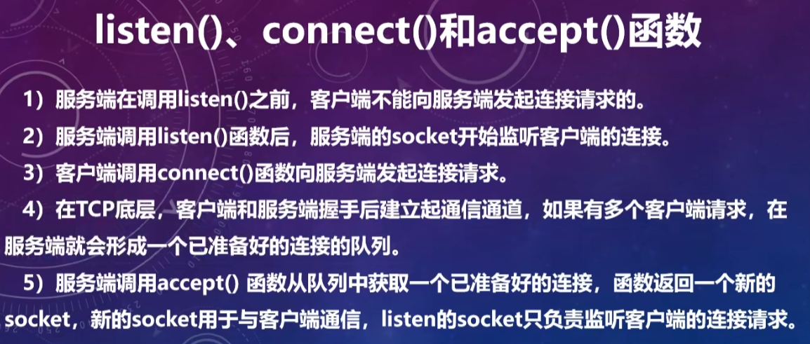
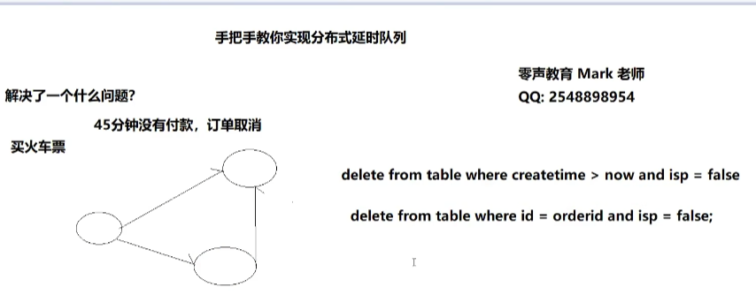

# linux高性能网络编程

[TOC]

# 网络编程接口

## epoll接口

### epoll结构体

```c++
struct epoll_event {
__uint32_t events; /* Epoll events */
epoll_data_t data; /* User data variable */
};
```

- events描述事件类型，其中epoll事件类型有以下几种

- - EPOLLIN：表示对应的文件描述符可以读（包括对端SOCKET正常关闭）
    - EPOLLOUT：表示对应的文件描述符可以写
    - EPOLLPRI：表示对应的文件描述符有紧急的数据可读（这里应该表示有带外数据到来）
    - EPOLLERR：表示对应的文件描述符发生错误
    - EPOLLHUP：表示对应的文件描述符被挂断；
    - EPOLLET：将EPOLL设为边缘触发(Edge Triggered)模式，这是相对于水平触发(Level Triggered)而言的
    - EPOLLONESHOT：只监听一次事件，当监听完这次事件之后，如果还需要继续监听这个socket的话，需要再次把这个socket加入到EPOLL队列里

### epoll操作接口


```c++
#include <sys/epoll.h> //头文件

//创建一个指示epoll内核事件表的文件描述符
//size: epoll要监听的文件描述符数量
//return: epoll的文件描述符
int epoll_create(int size);


//该函数用于操作内核事件表监控的文件描述符上的事件：注册、修改、删除
//epfd: epoll的文件描述符
//op: 新增(EPOLL_CTL_ADD：1), 删除(EPOLL_CTL_DEL：2), 更新(EPOLL_CTL_MOD：3)
//fd: 本次要操作的文件描述符
//epoll_event: 需要监听的事件：读写事件
//return: 调用成功返回0,不成功返回-1
int epoll_ctl(int epfd, int op, int fd, struct epoll_event* event);


//该函数用于等待所监控文件描述符上有事件的产生，返回就绪的文件描述符个数
//epfd: epoll的文件描述符
//event: 用于回传就绪的事件
//maxevents 每次能处理的的最大事件数
//timeout 等待I/O事件发生的超时时间;-1相当于阻塞，0相当于非阻塞; >0，指定毫秒
//return 大于0：已就绪的文件描述符；等于0：超时；小于：出错
int epoll_wait(int epfd, struct epoll_event *events, int maxevents, int timeout)  
```

## http接口

```c++
 #include <sys/types.h>
 #include <sys/stat.h>
 #include <unistd.h>

//获取文件属性，存储在statbuf中
struct stat
{
	mode_t st_mode;	//文件类型和权限
    off_t st_size;	//文件大小，子节数
};
//stat函数用于取得指定文件的文件属性，并将文件属性存储在结构体stat
int stat(const char *pathname, struct stat *statbuf);

//mmap 用于将一个文件或其他对象映射到内存，提高文件的访问速度
void* mmap(void* start, size_t length, int prot, int flags, int fd, off_t offset);
int munmap(void* start, size_t length); //解除内存映射

//iovec 定义一个向量元素，通常这个结构用作一个多元素的数组
struct iovec{
   void *iov_base;	/* starting address of buffer */
   size_t iov_len; /* size of buffer */
}

//writev 函数用于在一次函数调用中写多个非连续缓冲区，有时也将这该函数称为聚集写
//filedes表示文件描述符
//iov为前述io向量机制结构体iovec
//iovcnt为结构体的个数

#include <sys/uio.h>
size_t writev(int filedes, const struct iovec *iov, int iovcnt);
```

# 网络编程的基本概念

## socket

socket就是插座（中文翻译成套接字有点莫名其妙），运行在计算机中的两个程序通过socket建立起一个通道，数据在通道中传输。
socket把复杂的TCP/IP协议族隐藏了起来，对程序员来说只要用好socket相关的函数，就可以完成网络通信。

socket的分类：socket提供了流和数据报两种通信机制

- 流socket:基于TCP协议，是一个有序、可靠、双向字节流的通道，传输数据不会丢失，不会重复，顺序也不会错乱。
- 数据报socket:基于UDP协议，不需要建立和维持连接，可能会丢失或错乱。UDP不是一个可靠的协议，对数据的长度有限制，但是它的效率比较高。数据报socket的应用场景已经逐渐被替换掉


注意：

- 客户端在listen后就已经连接了
- accept只是为了定位接收的fd和客户端的ip
- 服务端在accept函数中等待连接
- 服务端后续的recv和send都是使用accept返回的listenfd进行传输

### 详解析socket

socket函数用于创建一个新的socket，也就是向系统申请一个socket资源。socket函数用户客户端和服务端。

```
int socket(int domain, int type, int protocol);
```

- domain:协议域，常见的有AF_INET(IPV4)、AF_INET6(IPV6)、AF_LOCAL等
- type: 指定socket类型，常用的有SOCK_STREAM(数据报)、SOCK_DGRAM(数据流)、SOCK_RAW等
- protocol:指定协议，常用的协议有IPPROTO_TCP(0)、IPPROTO_UDP、IPPROTO_STCP、IPPROTO_TIPC等，分别对应TCP传输协议、UDP传输协议、STCP传输协议、TIPC传输协议。
- return：成功则返回一个socket，失败返回-1，错误原因存于errno 中。

注意：

- socket的数量在debug和release模型下都不同
- 同一个模型下多次允许的socket都是同一值
- socket的数量受限于单进程可以打开的数量:使用ulimit -a查看或ulimit -HSn 2000设置数量

## 主机子节序和网络子节序

### 大端和小端字节序

- 大端：低子节放在起始地址
- 小段：高字节放在起始地址


### 主机子节序和网络子节序

- 网络子节序：网络子节序是TCP/IP中规定好的一种数据表示格式，采用大端排序方式
- 主机子节序：不同的主机子节序不相同，与cpu设计有关和操作系统无关
- 不同语言的通信也要考虑子节序的问题，比如c和java

> 转换接口
>
> htons();	ntohs(); 	htonl();	ntohl();
>
> htons() -> host to network short long


**字节序的存储直接采用四字节的整数。**

## 网络通信的常用结构体和接口

服务端和客户端会用到的结构体和接口

### 结构体

地址信息的结构体：sockaddr和sockaddr_in

```c++
//旧地址
struct sockaddr{
	unsigned short sa_family; 	// 地址类型，AF_xxx
    char sa_data[14];			// 14子节的端口和地址
};

//新地址，所占用子节与sockaddr一样
struct sockaddr_in{
    short int sin_family;		 //地址类型
    unsigned short int sin_port; //端口号
    struct in_addr_sin_addr;	 //地址
    unsigned char sin_zero[8];	 //填充，为了保持和sockaddr一样的长度	
};

struct in_addr{
    unsigned long s_addr;	//地址
}

//注意
//sockaddr_in在使用bind接口时，需强制转换成(struct sockaddr *)类型
bind(listenfd,(struct sockaddr *)&servaddr,sizeof(servaddr))；
```

### 接口

```c++
//gethostbyname函数可以使用字符串格式的域名获得IP网络子节顺序地址
struct hostent* gethostbyname(const char* name);

struct hostent{
    char* h_name;		//主机名	
    char** h_aliase;	//主机私有别名构成的字符串数组，同一IP可绑定多个域名
    int h_addrtype;		//主机IP地址的类型
    int h_length;		//主机IP地址的长度
    char** h_addr_list;	//主机的IP地址，以网络子节序存储
};
//for backward compatibility
//实际常使用 hostent->h_addr来使用ip地址
#define h_addr h_addr_list[0] 


//将一个字符串ip地址转换为一个32位的网络子节序ip地址
//return：成功返回非零；地址不正确返回零；
int inet_aton(const char* cp, struct in_addr* inp);

//将一个点分十进制的IP地址字符串转换为网络字节序ip地址
//字符串非法返回NADDR_NONE
int inet_addr(constr char* cp);

in_addr ipAddr;
ipAddr.S_un.S_addr = inet_addr("127.0.0.1");
```

## bind函数

bind功能：服务端把用于通信的地址和端口绑定到socket上

```c++
int bind(int sockfd, const struct sockaddr *addr,socklen_t addrlen);
//bind超过1024的端口时需要root权限
//超过65535的端口不会报错 只是连接通信不会响应
```

- sockfd: 需要绑定的socket
- addr：存放服务端用于通信的地址和端口
- addrlen：表示addr结构体的大小
- return: 成功返回0；失败返回-1，错误原因存放在errno中

> 关于addr的端口：
>
> 一般用到的是0~65535。其中0不使用，1-1023为系统端口，也叫BSD保留端口。
>
> - 0-1023： BSD保留端口，也叫系统端口，这些端口只有系统特许的进程才能使用；
>
> - 1024~65535为用户端口，又分为：BSD临时端口(1024-5000)和BSD服务器(非特权)端口(5001-65535)。其中：
>
>     - 1024-5000： BSD临时端口，一般的应用程序使用1024到4999来进行通讯；
>
>     - 5001-65535：BSD服务器(非特权)端口，用来给用户自定义端口。

### 服务端socket的SO_REUSEADDR属性

服务端程序的端口释放后可能处于TIME_WAIT状态，等待两分钟后才能再被使用

SO_REUSEADDR属性可以让端口释放后立即就可以被再次使用

```c++
int opt = 1;
unsigned int len = sizeof(opt);
setsockopt(listenfd, SOL_SOCKET, SO_REUSEADDR, &opt, len);
```

## accept函数 服务端接收过程

accept功能：服务端接收客户端的连接

```c++
int accept(int sockfd,struct sockaddr *addr,socklen_t *addrlen);
```

- 参数sockfd是已经被listen过的socket。

- 参数addr用于存放客户端的地址信息，用sockaddr结构体表达，如果不需要客户端的地址，可以填0。

- 参数addrlen用于存放addr参数的长度，如果addr为0，addrlen也填0。
- 成功返回创建的clientfd，失败返回-1

### 服务端监听过程

服务端使用一个listenfd监听多个过程，每成功监听一个就放入到请求队列中

accept从请求队列中拿出一个进程并分配clientfd，之后利用clientfd进行传输

在listen到accept过程中可以监听多个请求并放入到请求队列中

```c++
if (listen(listenfd,5) != 0 ) { perror("listen"); close(listenfd); return -1; }
  //sleep("111"); // can work
      printf("222\n");
      
  // 第4步：接受客户端的连接。
  int  clientfd;                  // 客户端的socket。
  int  socklen=sizeof(struct sockaddr_in); // struct sockaddr_in的大小
  struct sockaddr_in clientaddr;  // 客户端的地址信息。
  
  sleep(10); 
  while(1){
    //从已准备好的连接队列中获取一个请求，如果队列为空，accept函数将阻塞等待
    clientfd=accept(listenfd,(struct sockaddr *)&clientaddr,(socklen_t*)&socklen);
    printf("客户端（%s）已连接。\n",inet_ntoa(clientaddr.sin_addr));
    printf("listenfd: %d, clientfd: %d\n", listenfd, clientfd);
    printf("333\n");
  }
```



## tcp三次连接

客户端使用connect开启tcp三次握手连接，服务端listen后完成连接，socket状态变成establish。

tcp三次握手是由客户端主动发起的连接

关于SYN_RECV和ESTABLISH状态：

- SYB_RECV表示不完全连接或半连接状态，该状态下的socket将放入相应的一个队列中去，长度在`/proc/sys/net/ipv4/tcp_max_syn_backlog`文件里
- ESTABLISH状态表示已连接状态，该状态下的socket将放入相应的一个队列中去（等待accept建立socket的队列），长度为`int listen(int sockfd, int backlog);`的backlog+1


netstat查看socket连接情况

```c++
netstat -na|more

netstat -na|grep 5005
```


> 这里的外部地址可以理解为发送的目的地址

## send和recv

### 函数接口

send函数用于把数据通过socket发送给对端。不论是客户端还是服务端，应用程序都用send函数来向TCP连接的另一端发送数据。

```c++
ssize_t send(int sockfd, const void *buf, size_t len, int flags);
```

- sockfd为已建立好连接的socket。

- buf为需要发送的数据的内存地址，可以是C语言基本数据类型变量的地址，也可以数组、结构体、字符串，内存中有什么就发送什么。

- len需要发送的数据的长度，为buf中有效数据的长度。

- flags填0, 其他数值意义不大。

- 函数返回已发送的字符数。出错时返回-1，错误信息errno被标记。

- 注意，就算是网络断开，或socket已被对端关闭，send函数不会立即报错，要过几秒才会报错。如果send函数返回的错误（<=0），表示通信链路已不可用


recv函数用于接收对端通过socket发送过来的数据。

```c++
ssize_t recv(int sockfd, void *buf, size_t len, int flags);
```

- sockfd为已建立好连接的socket。

- buf为用于接收数据的内存地址，可以是C语言基本数据类型变量的地址，也可以数组、结构体、字符串，只要是一块内存就行了。

- len需要接收数据的长度，不能超过buf的大小，否则内存溢出。

- flags填0, 其他数值意义不大。

- 函数返回已接收的字符数。出错时返回-1，失败时不会设置errno的值。

- 如果socket的对端没有发送数据，recv函数就会等待，如果对端发送了数据，函数返回接收到的字符数。出错时返回-1。**如果socket被对端关闭，返回值为0**
- 如果recv函数返回的错误（<=0），表示通信通道已不可用。

### 原理和注意事项

- send和recv过程会在本机子节序和网络字节序中切换，在发送一个以上字节时应注意

- 原理：


​	在send和recv过程有三个缓冲区，所以在高并发情况下，send缓冲区满时，也会阻塞。

## TCP粘包和分包

### 粘包和分包的概念

粘包：如果一次请求发送的数据量比较小，没达到缓冲区大小，TCP则会将多个请求合并为同一个请求进行发送，这就形成了粘包问题

分包：如果一次请求发送的数据量比较大，超过了缓冲区大小，TCP就会将其拆分为多次发送，这就是分包。

发送的场景：

- 要发送的数据大于TCP发送缓冲区剩余空间大小，将会发生分包。

- 待发送数据大于MSS（最大报文长度），TCP在传输前将进行分包。

- 要发送的数据小于TCP发送缓冲区的大小，TCP将多次写入缓冲区的数据一次发送出		     去，将会发生粘包。

- 接收数据端的应用层没有及时读取接收缓冲区中的数据，将发生粘包。


### 解决方案

- 发送端将每个包都封装成固定的长度，比如100字节大小。如果不足100字节可通过补0或空等进行填充到指定长度;
- 发送端在每个包的末尾使用固定的分隔符，例如\r\n。如果发生拆包需等待多个包发送过来之后再找到其中的\r\n进行合并;例如，FTP协议;
- 将消息分为头部和消息体，头部中保存整个消息的长度，只有读取到足够长度的消息之后才算是读到了一个完整的消息;
- 通过自定义协议进行粘包和拆包的处理。

# I/O多路复用

## 基础概念

### socket和FD

- socket:套接字。对网络中不同主机上的应用进程之间进行双向通信的端点的抽象。例子：客户端将数据通过网线发送到服务端，客户端发送数据需要一个出口，服务端接收数据需要一个入口，这两个“口子”就是Socket。
- FD(file descriptor): 文件描述符，非负整数。“一切皆文件”，linux 中的一切资源都可以通过文件的方式访问和管理。而 FD 就类似文件的索引（符号），指向某个资源，内核（kernel）利用 FD 来访问和管理资源。

### 客户端和服务器连接过程


### 连接模式的区别

例子：你是一个老师，让学生做作业，学生做完作业后收作业。

- 同步阻塞：逐个收作业，先收A，再收B，接着是C、D，如果有一个学生还未做完，则你会等到他写完，然后才继续收下一个。
- 同步非阻塞：逐个收作业，先收A，再收B，接着是C、D，如果有一个学生还未做完，则你会跳过该学生，继续去收下一个。
- select/poll：学生写完了作业会举手，但是你不知道是谁举手，需要一个个的去询问。
- epoll：学生写完了作业会举手，你知道是谁举手，你直接去收作业。

## 同步阻塞IO


总结：

- 单线程：某个 socket 阻塞，会影响到其他 socket 处理。

- 多线程：客户端较多时，会造成资源浪费，全部 socket 中可能每个时刻只有几个就绪。同时，线程的调度、上下文切换乃至它们占用的内存，可能都会成为瓶颈。

## 同步非阻塞

如下图所示：服务端在监听端口时，如果没有socket连接会直接跳过并不会阻塞，在继续循环直到客户端有连接请求


总结：

- 优点：单个socket阻塞不会影响到其他socket
- 缺点：需要不断的遍历进行系统调用，有一定的开销

## select

### 实现


> select模式：
>
> 内核空间会遍历fd，如果检查到fd就绪就会返回就绪的数量
>
> ​								  如果遍历完没有就绪的fd，一种方法是不断遍历直到就绪，但十分消耗cpu资源(同步非阻塞)
>
> ​																				另一种方法是将当前用户进程给阻塞起来，网卡通过DMA的方式将数据包写入到指定的内存中，
>
> ​																				然后处理完成后会通过中断信号告诉cpu有新的数据包到达，cpu响应中断然后调用中断处理程序处理
>
>  																			   唤醒等待的阻塞进程，用户进程唤醒后，内核空间会继续检查一边FD集合，检查到就绪后结束阻塞返回用户																				空间
>
> 

### api接口

```c++
int select(int nfds, fd_set* readfds, fd_set* writefds, fd_set* exceptfds, struct timeval* timeout);
/**
获取就绪事件.
@param nfds 	 3个监听集合的文件描述符最大值+1
@param readfds 	 要监听的可读文件描述符集合
@param writefds  要监听的可写文件描述符集合
@param exceptfds 要监听的异常文件描述符集合
@param timeval	 本次调用的超时时间
@return			 大于0:已就绪的文件描述符数;等于0:超时;小于:出错
*/

```

通过fd_set来监听FD或者查看哪些FD就绪了


### 总结

- 将socket是否就绪检查逻辑下沉到操作系统层面，避免大量的系统调用。告诉你有事件就绪，但没告诉你具体是那个FD/

- 优点：不需要每个 FD 都进行一次系统调用，解决了频繁的用户态内核态切换问题
- 缺点：
    - 单进程监听的 FD 存在限制，默认1024
    - 每次调用需要将 FD 从用户态拷贝到内核态
    - 不知道具体是哪个文件描述符就绪，需要遍历全部文件描述符
    - 入参的3个 fd_set 集合每次调用都需要重置

## poll

总结：

- 跟select基本相似，主要优化了监听1024的限制

- 优点：不需要每个FD都进行一次系统调用，导致频繁的用户态内核态切换；单进程监听的FD不存在限制(内核空间实际是以链表来存储)
- 缺点：每次调用需要将 FD 从用户态拷贝到内核态；不知道具体是哪个文件描述符就绪，需要遍历全部文件描述符；

```c++
int poll(struct pollfd* fds, unsigned int nfds, int timeout);

struct pollfd{
    int fd; //监听的文件描述符
    short events; //监听的事件
    short revents; //就绪的事件
}

/*
获取就绪事件
@param pollfd 要监听的文件描述符集合
@param nfds 文件描述符数量
@param timeout 本次调用的超时时间
@return大于0:已就绪的文件描述符数;等于0:超时;小于:出错
*/

```


## epoll


> 通过epoll_ctreate创建一个event_epoll,通过红黑树高效的增添删除


> epoll_ctl会将用户空间的fd复制到内核空间并创建一个epitem结构体，ep_poll_callback会在数据就绪时唤醒进程


> epoll_wait会对就绪队列进行一个判断，如果为空会将当前进程添加到等待队列中去。如果不为空则返回就绪事件


> 当客户端有数据传入时，会将socket插入到就绪队列中去，再唤醒等待队列的进程。唤醒完成后会继续检查就绪队列是否有就绪进程

```c++
/*
创建一个epoll
size: epoll要监听的文件描述符数量
return: epoll的文件描述符
*/
int epoll_create(int size);


/*
事件注册
epfd: epoll的文件描述符
op: 新增(1), 删除(2), 更新(3)
fd: 本次要操作的文件描述符
epoll_event: 需要监听的事件：读写事件
return: 调用成功返回0,不成功返回-1
*/
int epoll_ ctl(int epfd, int op, int fd, struct epoll_event* event);


/*
获取就绪的事件
epfd: epoll的文件描述符
event: 用于回传就绪的事件
maxevents 每次能处理的的最大事件数
timeout 等待I/O事件发生的超时时间，-1相当于阻塞，0相当于非阻塞
return 大于0：已就绪的文件描述符；等于0：超时；小于：出错
*/
int epoll_wait(int epfd, struct epoll_event* event, int maxevents, int timeout);
```

### 总结


## LT ET EPOLLONESHOT

- LT水平触发模式

- - epoll_wait检测到文件描述符有事件发生，则将其通知给应用程序，应用程序可以不立即处理该事件。
    - 当下一次调用epoll_wait时，epoll_wait还会再次向应用程序报告此事件，直至被处理

- ET边缘触发模式

- - epoll_wait检测到文件描述符有事件发生，则将其通知给应用程序，应用程序必须立即处理该事件
    - 必须要一次性将数据读取完，使用非阻塞I/O，读取到出现eagain

- EPOLLONESHOT

- - 一个线程读取某个socket上的数据后开始处理数据，在处理过程中该socket上又有新数据可读，此时另一个线程被唤醒读取，此时出现两个线程处理同一个socket
    - 我们期望的是一个socket连接在任一时刻都只被一个线程处理，通过epoll_ctl对该文件描述符注册epolloneshot事件，一个线程处理socket时，其他线程将无法处理，**当该线程处理完后，需要通过epoll_ctl重置epolloneshot事件**

注意：

- select和poll都只能工作在相对低效的LT模式下
- epoll则可以工作在ET高效模式，并且epoll还支持EPOLLONESHOT事件，该事件能进一步减少可读、可写和异常事件被触发的次数。 

# HTTP协议

HTTP报文分为请求报文和响应报文两种，每种报文必须按照特有格式生成，才能被浏览器端识别。

其中，浏览器端向服务器发送的为请求报文，服务器处理后返回给浏览器端的为响应报文。

- 请求报文：get和post
- 响应报文

## 请求报文和响应报文格式

### 请求报文


```http
 1    GET /562f25980001b1b106000338.jpg HTTP/1.1
 2    Host:img.mukewang.com
 3    User-Agent:Mozilla/5.0 (Windows NT 10.0; WOW64)
 4    AppleWebKit/537.36 (KHTML, like Gecko) Chrome/51.0.2704.106 Safari/537.36
 5    Accept:image/webp,image/*,*/*;q=0.8
 6    Referer:http://www.imooc.com/
 7    Accept-Encoding:gzip, deflate, sdch
 8    Accept-Language:zh-CN,zh;q=0.8
 9    空行
10    请求数据为空
```


- **请求行**，用来说明请求类型,要访问的资源以及所使用的HTTP版本。
    GET说明请求类型为GET，/562f25980001b1b106000338.jpg(URL)为要访问的资源，该行的最后一部分说明使用的是HTTP1.1版本。

- **请求头部**，紧接着请求行（即第一行）之后的部分，用来说明服务器要使用的附加信息。

- - HOST，给出请求资源所在服务器的域名。
    - User-Agent，HTTP客户端程序的信息，该信息由你发出请求使用的浏览器来定义,并且在每个请求中自动发送等。
    - Accept，说明用户代理可处理的媒体类型。
    - Accept-Encoding，说明用户代理支持的内容编码。
    - Accept-Language，说明用户代理能够处理的自然语言集。
    - Content-Type，说明实现主体的媒体类型。
    - Content-Length，说明实现主体的大小。
    - Connection，连接管理，可以是Keep-Alive或close。

- **空行**，请求头部后面的空行是必须的即使第四部分的请求数据为空，也必须有空行。

- **请求数据**也叫主体，可以添加任意的其他数据。

```http
1    POST / HTTP1.1
2    Host:www.wrox.com
3    User-Agent:Mozilla/4.0 (compatible; MSIE 6.0; Windows NT 5.1; SV1; .NET CLR 2.0.50727; .NET CLR 3.0.04506.648; .NET CLR 3.5.21022)
4    Content-Type:application/x-www-form-urlencoded
5    Content-Length:40
6    Connection: Keep-Alive
7    空行
8    name=Professional%20Ajax&publisher=Wiley
```

- **请求行**，用来说明请求类型,要访问的资源以及所使用的HTTP版本。
    GET说明请求类型为GET，/562f25980001b1b106000338.jpg(URL)为要访问的资源，该行的最后一部分说明使用的是HTTP1.1版本。

- **请求头部**，紧接着请求行（即第一行）之后的部分，用来说明服务器要使用的附加信息。

- - HOST，给出请求资源所在服务器的域名。
    - User-Agent，HTTP客户端程序的信息，该信息由你发出请求使用的浏览器来定义,并且在每个请求中自动发送等。
    - Accept，说明用户代理可处理的媒体类型。
    - Accept-Encoding，说明用户代理支持的内容编码。
    - Accept-Language，说明用户代理能够处理的自然语言集。
    - Content-Type，说明实现主体的媒体类型。
    - Content-Length，说明实现主体的大小。
    - Connection，连接管理，可以是Keep-Alive或close。

- **空行**，请求头部后面的空行是必须的即使第四部分的请求数据为空，也必须有空行。

- **请求数据**也叫主体，可以添加任意的其他数据

### 响应报文

HTTP响应也由四个部分组成，分别是：状态行、消息报头、空行和响应正文。


```
HTTP/1.1 200 OK
Date: Fri, 22 May 2009 06:07:21 GMT
Content-Type: text/html; charset=UTF-8
空行
<html>
      <head></head>
      <body>
            <!--body goes here-->
      </body>
</html>
```

- 状态行，由HTTP协议版本号， 状态码， 状态消息 三部分组成。
    第一行为状态行，（HTTP/1.1）表明HTTP版本为1.1版本，状态码为200，状态消息为OK。
- 消息报头，用来说明客户端要使用的一些附加信息。
    第二行和第三行为消息报头，Date:生成响应的日期和时间；Content-Type:指定了MIME类型的HTML(text/html),编码类型是UTF-8。
- 空行，消息报头后面的空行是必须的。
- 响应正文，服务器返回给客户端的文本信息。空行后面的html部分为响应正文。

HTTP有5种类型的状态码，具体的：

- 1xx：指示信息--表示请求已接收，继续处理。

- 2xx：成功--表示请求正常处理完毕。

- - 200 OK：客户端请求被正常处理。
    - 206 Partial content：客户端进行了范围请求。

- 3xx：重定向--要完成请求必须进行更进一步的操作。

- - 301 Moved Permanently：永久重定向，该资源已被永久移动到新位置，将来任何对该资源的访问都要使用本响应返回的若干个URI之一。
    - 302 Found：临时重定向，请求的资源现在临时从不同的URI中获得。

- 4xx：客户端错误--请求有语法错误，服务器无法处理请求。

- - 400 Bad Request：请求报文存在语法错误。
    - 403 Forbidden：请求被服务器拒绝。没有权限
    - 404 Not Found：请求不存在，服务器上找不到请求的资源。

- 5xx：服务器端错误--服务器处理请求出错。

- - 500 Internal Server Error：服务器在执行请求时出现错误。

# 定时器

## 概述



面向的工程问题：

买火车票，如果45分钟没有付款，订单将取消

- 最简单的方式：不断查询数据库，把时间超过45分钟的事件删除
- 添加中间键，直接删除整行数据

## 流程


- 信号的接收

- - 接收信号的任务是由内核代理的，当内核接收到信号后，会将其放到对应进程的信号队列中，同时向进程发送一个中断，使其陷入内核态。注意，此时信号还只是在队列中，对进程来说暂时是不知道有信号到来的。

- 信号的检测

- - 进程从内核态返回到用户态前进行信号检测
    - 进程在内核态中，从睡眠状态被唤醒的时候进行信号检测
    - 进程陷入内核态后，有两种场景会对信号进行检测：
    - 当发现有新信号时，便会进入下一步，信号的处理。

- 信号的处理

- - ( **内核** )信号处理函数是运行在用户态的，调用处理函数前，内核会将当前内核栈的内容备份拷贝到用户栈上，并且修改指令寄存器（eip）将其指向信号处理函数。
    - ( **用户** )接下来进程返回到用户态中，执行相应的信号处理函数。
    - ( **内核** )信号处理函数执行完成后，还需要返回内核态，检查是否还有其它信号未处理。
    - ( **用户** )如果所有信号都处理完成，就会将内核栈恢复（从用户栈的备份拷贝回来），同时恢复指令寄存器（eip）将其指向中断前的运行位置，最后回到用户态继续执行进程。

### 服务器事件

服务器事件大致可分为如下三类：

- 网络事件：http协议传输的数据
- 定时事件：定时器中的事件
- 信号事件：ctrl+c停止信号，log日志满了的信号

## 定时器

定时事件的组成可简单归纳为：延时任务-定时事件-回调 

`add_timer(expire, callback) #即expire终止时间到了后，会调用回调函数`

## 衔接网络模块和定时模块

利用reactor模型来实现：


