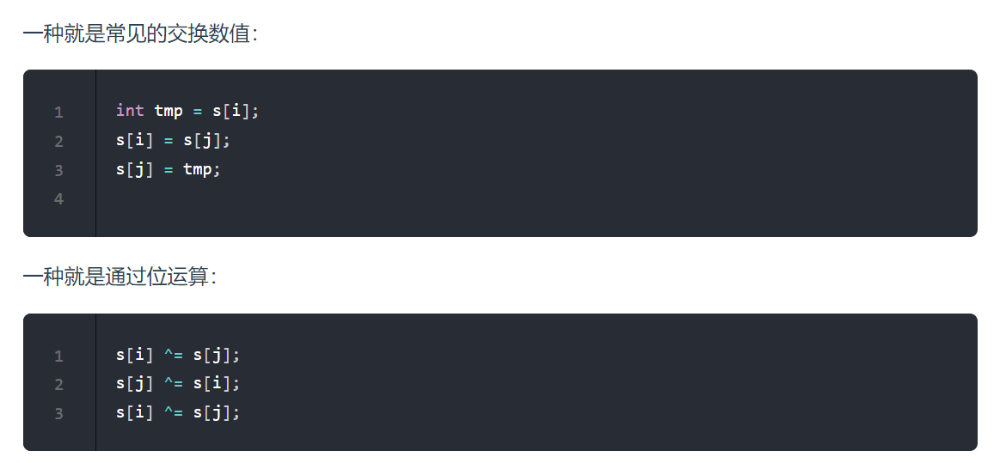

# 算法刷题

# 数组

## 数组特性和介绍

- **数组下标都是从0开始的。**
- **数组内存空间的地址是连续的**

## 二分查找

注意：**对区间的定义没有想清楚，区间的定义就是不变量**。要在二分查找的过程中，保持不变量，就是在while寻找中每一次边界的处理都要坚持根据区间的定义来操作，这就是**循环不变量**规则。

### 第一种写法

第一种写法，我们定义 target 是在一个在左闭右闭的区间里，**也就是[left, right] （这个很重要非常重要）**。

区间的定义这就决定了二分法的代码应该如何写，**因为定义target在[left, right]区间，所以有如下两点：**

- while (left <= right) 要使用 <= ，因为left == right是有意义的，所以使用 <=
- if (nums[middle] > target) right 要赋值为 middle - 1，因为当前这个nums[middle]一定不是target，那么接下来要查找的左区间结束下标位置就是 middle - 1

### 第二种写法

如果说定义 target 是在一个在左闭右开的区间里，也就是[left, right) ，那么二分法的边界处理方式则截然不同。

有如下两点：

- while (left < right)，这里使用 < ,因为left == right在区间[left, right)是没有意义的
- if (nums[middle] > target) right 更新为 middle，因为当前nums[middle]不等于target，去左区间继续寻找，而寻找区间是左闭右开区间，所以right更新为middle，即：下一个查询区间不会去比较nums[middle]

## 移除元素(快慢指针)

给你一个数组 nums 和一个值 val，你需要 原地 移除所有数值等于 val 的元素，并返回移除后数组的新长度。

双指针法（快慢指针法）： **通过一个快指针和慢指针在一个for循环下完成两个for循环的工作。**

定义快慢指针

- 快指针：寻找新数组的元素 ，新数组就是不含有目标元素的数组
- 慢指针：指向更新 新数组下标的位置

```c++
// 时间复杂度：O(n)
// 空间复杂度：O(1)
class Solution {
public:
    int removeElement(vector<int>& nums, int val) {
        int slowIndex = 0;
        for (int fastIndex = 0; fastIndex < nums.size(); fastIndex++) {
            if (val != nums[fastIndex]) {
                nums[slowIndex++] = nums[fastIndex];
            }
        }
        return slowIndex;
    }
};

/**
* 相向双指针方法，基于元素顺序可以改变的题目描述改变了元素相对位置，确保了移动最少元素
* 时间复杂度：O(n)
* 空间复杂度：O(1)
*/
class Solution {
public:
    int removeElement(vector<int>& nums, int val) {
        int leftIndex = 0;
        int rightIndex = nums.size() - 1;
        while (leftIndex <= rightIndex) {
            // 找左边等于val的元素
            while (leftIndex <= rightIndex && nums[leftIndex] != val){
                ++leftIndex;
            }
            // 找右边不等于val的元素
            while (leftIndex <= rightIndex && nums[rightIndex] == val) {
                -- rightIndex;
            }
            // 将右边不等于val的元素覆盖左边等于val的元素
            if (leftIndex < rightIndex) {
                nums[leftIndex++] = nums[rightIndex--];
            }
        }
        return leftIndex;   // leftIndex一定指向了最终数组末尾的下一个元素
    }
};

```


## 长度最小的子数组(滑动窗口)

给定一个含有 n 个正整数的数组和一个正整数 s ，找出该数组中满足其和 ≥ s 的长度最小的 连续 子数组，并返回其长度。如果不存在符合条件的子数组，返回 0。

示例：

输入：s = 7, nums = [2,3,1,2,4,3] 输出：2 解释：子数组 [4,3] 是该条件下的长度最小的子数组。

### 滑动窗口

滑动窗口，**就是不断的调节子序列的起始位置和终止位置，从而得出我们要想的结果**。

在本题中实现滑动窗口，主要确定如下三点：

- 窗口内是什么？ 窗口就是 满足其和 ≥ s 的长度最小的 连续 子数组。
- 如何移动窗口的起始位置？ 如果当前窗口的值大于s了，窗口就要向前移动了（也就是该缩小了）。
- 如何移动窗口的结束位置？窗口的结束位置就是遍历数组的指针，也就是for循环里的索引。

**滑动窗口的精妙之处在于根据当前子序列和大小的情况，不断调节子序列的起始位置。从而将O(n^2)暴力解法降为O(n)。**

```c++
class Solution {
public:
    int minSubArrayLen(int s, vector<int>& nums) {
        int result = INT32_MAX;
        int sum = 0; // 滑动窗口数值之和
        int i = 0; // 滑动窗口起始位置
        int subLength = 0; // 滑动窗口的长度
        for (int j = 0; j < nums.size(); j++) {
            sum += nums[j];
            // 注意这里使用while，每次更新 i（起始位置），并不断比较子序列是否符合条件
            while (sum >= s) {
                subLength = (j - i + 1); // 取子序列的长度
                result = result < subLength ? result : subLength;
                sum -= nums[i++]; // 这里体现出滑动窗口的精髓之处，不断变更i（子序列的起始位置）
            }
        }
        // 如果result没有被赋值的话，就返回0，说明没有符合条件的子序列
        return result == INT32_MAX ? 0 : result;
    }
};
```

## 螺旋矩阵(边界条件)

给定一个正整数 n，生成一个包含 1 到 n^2 所有元素，且元素按顺时针顺序螺旋排列的正方形矩阵。

示例:

输入: 3 输出: [ [ 1, 2, 3 ], [ 8, 9, 4 ], [ 7, 6, 5 ] ]

而求解本题依然是要坚持**循环不变量原则**。

模拟顺时针画矩阵的过程:

- 填充上行从左到右
- 填充右列从上到下
- 填充下行从右到左
- 填充左列从下到上

由外向内一圈一圈这么画下去。

```c++
class Solution {
public:
    vector<vector<int>> generateMatrix(int n) {
        vector<vector<int>> martix(n, vector<int>(n, 0));
        int startx = 0, starty = 0;
        int count = 1; //赋值的值
        int loop = n /2; //循环的圈数
        int mid = n / 2;
        int i = 0, j = 0;
        for(int circle = 0; circle < loop; circle++)
        {
            i = j = 0;
            for(; i < n - circle*2 - 1; ++i)
            {
                martix[starty+j][startx+i] = count++;
            }

            for(; j < n - circle*2 - 1; ++j)
            {
                martix[starty+j][startx+i] = count++;
            }


            for(; i > 0; --i)
            {
                martix[starty+j][startx+i] = count++;
            }

            for(; j > 0; --j)
            {
                martix[starty+j][startx+i] = count++;
            }

            startx += 1;
            starty += 1;
        }
        if(n % 2 != 0)
            martix[mid][mid] = count;
        return martix;
    }
};
```

# 实践细则

## 函数库的巧妙设计

### swap



