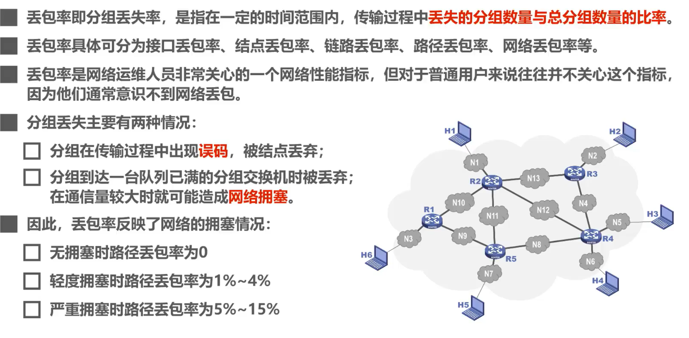
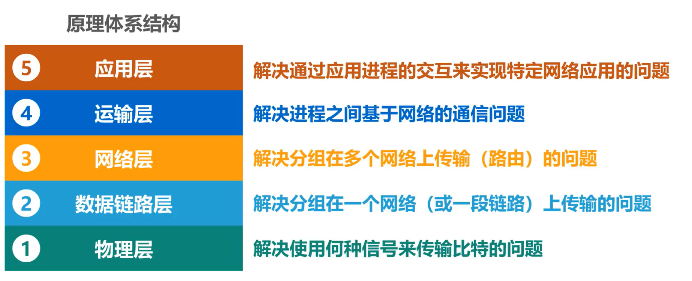
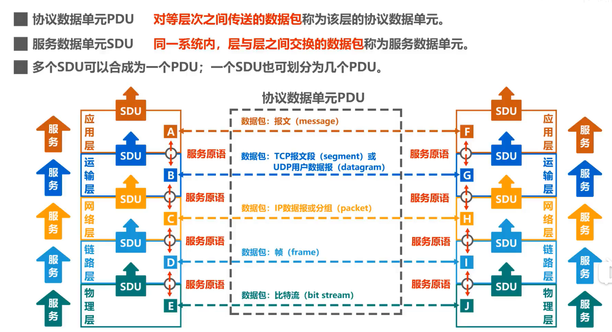
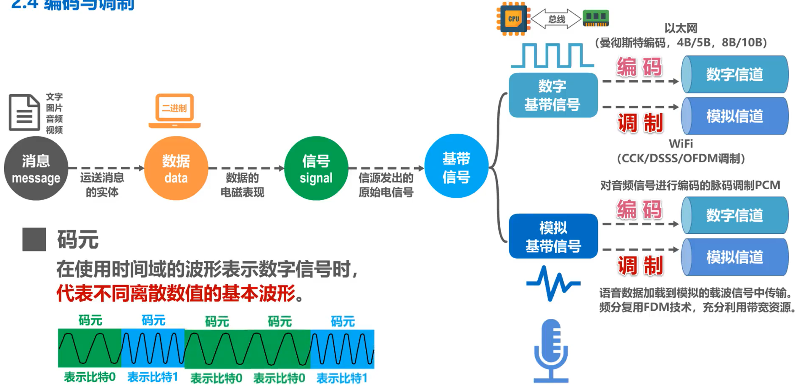
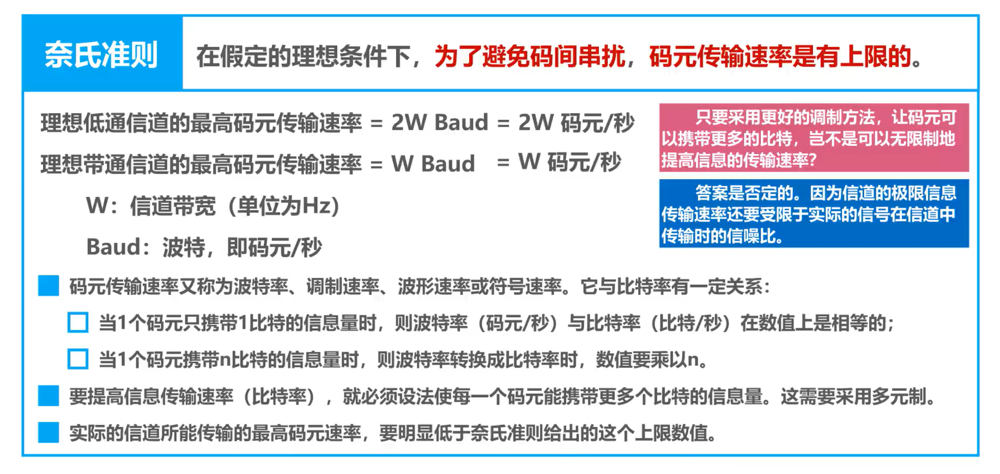
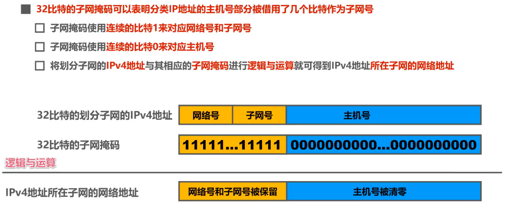
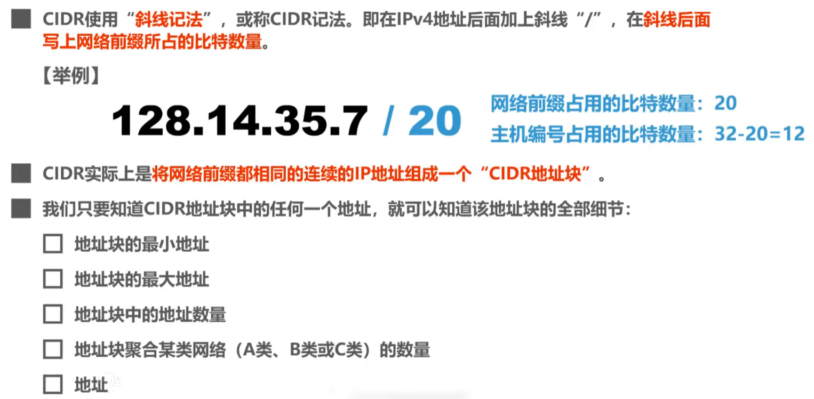
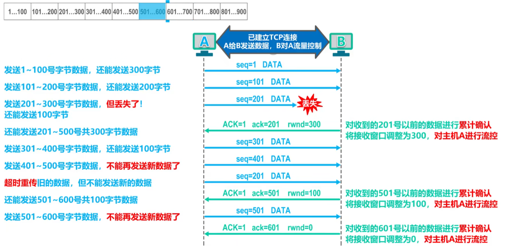
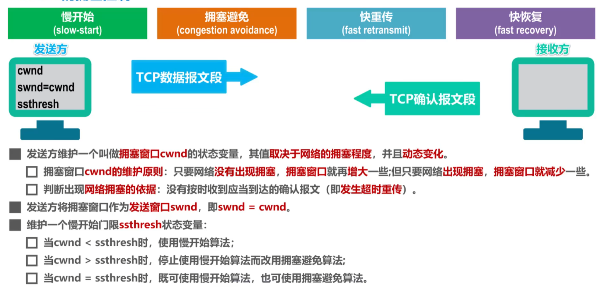
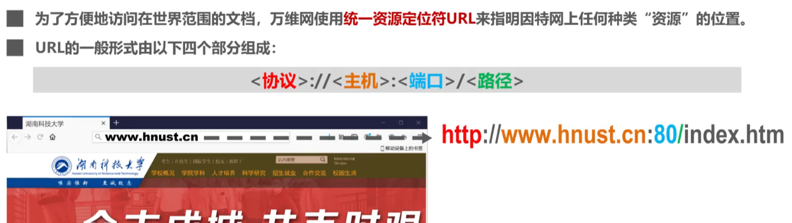

# 计算机网络

[TOC]

# 概述

## 因特网概述

### 网络发展史

网络的定义：网络(Network)由若干节点(Node)和连接这些节点的链路(link)组成

发展史：

- 起源于美国的因特网现已发展成为世界上最大的国际性计算机互联网
- 互联网是“网络的网络”(network of networks):多个网络通过路由器互连起来，这样就构成了一个覆盖范围更大的网络，
- 连接在因特网上的计算机都称为主机(host)。
- 网络与因特网
  - 网络(internet)把许多计算机连接在一起。
  - 因特网(Internet)则把许多网络连接在一起,是世界上最大的互连网络。

### 因特网服务提供者(ISP Internet Service Provider)

ISP即提供网络服务的运营商，比如：中国电信、中国移动、中国联通。

> 基于ISP的三层结构的因特网

一旦某个用户能够接入到因特网，那么他也可以成为一个ISP，所需要做的就是购买一些如调制解调器或路由器这样的设备，让其他用户可以和他相连。

三层结构的因特网只是以前的结构，现在的因特网结构较之更加复杂。

### 因特网的组成

- 边缘部分

  由所有连接在因特网上的**主机**组成（台式电脑，大型服务器，笔记本电脑，平板，智能手机等）。这部分是**用户直接使用**的，用来进行**通信**（传送数据、音频或视频）和**资源共享**。

- 核心部分

  由**大量网络**和连接这些网络的**路由器**组成。这部分是**为边缘部分提供服务**的（提供连通性和交换）。

### 端系统之间的通信

**客户-服务器方式：**

- 客户 (client) 和服务器 (server) 都是指通信中所涉及的两个应用进程。
- 客户 - 服务器方式所描述的是进程之间服务和被服务的关系。
- 客户是服务的请求方，服务器是服务的提供方。

**对等连接方式：**

- **对等连接** (peer-to-peer，简写为 **P2P** ) 是指两个主机在通信时并不区分哪一个是服务请求方还是服务提供方。
- 只要两个主机都运行了对等连接软件 ( P2P 软件) ，它们就可以进行**平等的、对等连接通信**。
- 双方都可以下载对方已经存储在硬盘中的共享文档。

## 三种交换方式（电路交换机、分组交换、报文交换）

网络中的核心部分要向网络边缘中的大量主机提供连通性，使边缘部分中的任何一个主机都能够向其他主机通信（即传送或接收各种形式的数据）。

在网络核心部分起特殊作用的是**路由器**(router)。**路由器**是实现**分组交换** (packet switching) 的关键构件，其任务是**转发**收到的分组，这是网络核心部分最重要的功能。

### 电路交换（Circuit Switching）

定义：电话交换机接通电话线的方式称为电路交换，从通信资源的分配角度来看，交换（Switching）就是按照某种方式动态地分配传输线路的资源。

电路交换的三个步骤：

1、建立连接（分配通信资源）

2、通话（一直占用通信资源）

3、释放连接（归还通信资源）

### 报文交换

报文交换中的交换结点也采用存储转发方式，但报文交换对报文的大小没有限制，这就要求交换结点需要较大的缓存空间。报文交换主要用于早期的电报通信网，现在较少使用，**通常被较先进的分组交换方式所取代**。

### 分组交换

通常我们把表示**该消息的整块数据**成为一个**报文**。

在发送报文之前，先把较长的报文划分成一个个更小的**等长数据段**，在每一个数据段前面。加上一些由必**要的控制信息组成的首部**后，就构成一个分组，也可简称为“包”，相应地，首部也可称为“包头”。首部包含了**分组的目的地址**

分组从源主机到目的主机，可走不同的路径。

在路由器中的输入和输出端口之间没有直接连线。

路由器处理分组的过程是：

1. 把收到的分组先**放入缓存（暂时存储）；**
2. **查找转发表**，找出到某个目的地址应从哪个端口转发；
3. 把分组送到适当的端口**转发**出去。

### 三种交换方式的对比

电路交换：

- 通信之前首先要建立连接；连接建立好之后，就可以使用已建立好的连接进行数据传送；数据传送后，需释放连接，以归还之前建立连接所占用的通信线路资源。
- 一旦建立连接，中间的各结点交换机就是直通形式的，比特流可以直达终点；

报文交换：

- 可以随时发送报文，而不需要事先建立连接；整个报文先传送到相邻结点交换机，全部存储下来后进行查表转发，转发到下一个结点交换机。
- 整个报文需要在各结点交换机上进行存储转发，由于不限制报文大小，因此需要各结点交换机都具有较大的缓存空间。

分组交换：

- 可以随时发送分组，而不需要事先建立连接。构成原始报文的一个个分组，依次在各结点交换机上存储转发。各结点交换机在发送分组的同时，还缓存接收到的分组。
- 构成原始报文的一个个分组，在各结点交换机上进行存储转发，相比报文交换，减少了转发时延，还可以避免过长的报文长时间占用链路，同时也有利于进行差错控制。

## 计算机网络的定义和分类

> 定义

- 计算机网络的最简单的定义是：一些互相连接的、自治的计算机的集合。
  - 互连：是指计算机之间可以通过有线或无线的方式进行数据通信；
  - 自治：是指独立的计算机，他有自己的硬件和软件，可以单独运行使用；
  - 集合：是指至少需要两台计算机；

- 计算机网络的较好的定义是：计算机网络主要是由一些**通用的，可编程的硬件（一定包含有中央处理机CPU）互连**而成的，而这些硬件并非专门用来实现某一特定目的（例如，传送数据或视频信号）。这些可编程的硬件能够用来**传送多种不同类型的数据**，并能**支持广泛的和日益增长的应用**。

> 分类

**按交换技术分类：**

- 电路交换网络
- 报文交换网络
- 分组交换网络

**按使用者分类：**

- 公用网
- 专用网

**按传输介质分类：**

- 有线网络
- 无线网络

**按覆盖范围分类：**

- **广域网WAN（Wide Area Network）**

作用范围通常为几十到几千公里，因而有时也称为远程网（long haul network）。广域网是互联网的核心部分，其任务是通过长距离（例如，跨越不同的国家）运送主机所发送的数据。

- 城域网MAN

作用范围一般是一个城市，可跨越几个街区甚至整个城市

- **局域网LAN**

一般用微型计算机或工作站通过高速通信线路相连（速率通常在 10 Mbit/s 以上），但地理上范围较小（1 km 左右）

- 个域网PAN

就是在个人工作的地方把个人使用的电子设备用无线技术连接起来的网络。

## 计算机网络的性能指标

### 速率

连接在计算机网络的主机或数字信道上传输比特的速率，称为比特率或数据率。

注意其单位

### 带宽

带宽在模拟信号中指：信号的不同频率成分所占据的频率范围

带宽在计算机网络总指：单位时间内从网络的某一点到另一点的最高数据率。即带宽反应了数据率的上界

### 吞吐量

吞吐量(throughput)表示在单位时间内通过某个网络（或信道、接口）的数据量。

### 时延

时延时指数据（一个报文或分组，甚至比特）从网络（或链路）的一端传送到另一端所需的时间。

网络时延由几部分组成：

- 发送时延

主机或路由器发送数据帧所需要的时间，也就是从发送数据帧的第一个比特算起，到该帧的最后一个比特发送完毕所需的时间。

- 传播时延

电磁波在信道中传播一定的距离需要花费的时间。

- 处理时延

主机或路由器在收到分组时要花费一定时间进行处理

> 当处理时延忽略不计时，发送时延 和 传播时延谁占主导，要具体情况具体分析。数据量大发送时延主导

### 时延带宽积

链路的时延带宽积又称为以比特为单位的链路长度，等于传播时延乘以带宽。

### 往返时间(RRT)

互联网上的信息不仅仅单方向传输而是双向交互的。因此，我们有时很需要知道**双向交互一次所需的时间**

### 利用率

利用率有**信道利用率**和**网络利用率**两种。

### 丢包率

## 计算机网络体系结构

### 常见的体系结构

- OSI体系机构：法律上的体系结构，包含：应用层、表示层、会话层、运输层、网络层、数据链路层、物理层

- TCP/IP体系结构：实际上的体系结构，包含：应用层、运输层、网际层、网络接口层（数据链路层、物理层）

  

> TCP/IP体系结构相当于将OSI体系结构的**物理层**和**数据链路层**合并为了**网络接口层**，并去掉了**会话层**和**表示层**。
>
> TCP/IP在网络层使用的协议是IP协议，IP协议的意思是网际协议，因此**TCP/IP体系结构的网络层称为网际层**

### TCP/IP体系结构

> 简单介绍

- 应用层：这层包含了大量的应用层协议，如 HTTP , DNS 等。

- 运输层：TCP和UDP是这层的两个重要协议。

- 网际层（IP协议）：核心是IP协议，可以将不同的网络接口（网络接口层）进行互连，并向其上的TCP协议和UDP协议（运输层）提供网络互连服务

TCP协议在享受IP协议提供的网络互连服务的基础上，可向应用层的相应协议提供可靠的传输服务。

UDP协议在享受IP协议提供的网络互连服务的基础上，可向应用层的相应协议提供不可靠的传输服务。

TCP/IP体系结构中最重要的是IP协议和TCP协议，因此用TCP和IP来表示整个协议大家族。

- 网络接口层：并没有规定具体内容，这样做的目的是可以互连全世界各种不同的网络接口，例如：有线的以太网接口，无线局域网的WIFI接口等。

### 体系结构各层的作用

#### 物理层

- 使用怎样的信号传输
- 采用怎样的物理接口

#### 数据链路层

- 如何标识网络中的各主机(MAC地址)
- 如何从信号所表示的一连串比特流中区分出地址和数据
- 如何协调主机争用总线问题

#### 网络层

- 如何表示各网络中的各主机(网络和主机共同编址问题，例如IP地址)
- 路由器如何转发分组，如何进行路由选择

#### 运输层

- 如何解决进程之间网络的通信问题
- 出现传输错误是，如何处理

#### 应用层

- 通过应用进程间的交互完成特定的网络应用

#### 总结

### 计算机网络结构的专用术语

#### 实体

- 实体：任何可发送或接受信息的硬件或软件进程
- 对等实体：收发双方相同层次的实体

#### 协议

协议：控制两个对等实体进行逻辑通信的规则的集合

协议三要素：

- 语法：定义所交换信息的格式
- 语义：定义收发双方所要完成的操作
- 同步：定义收发双发的时序关系

#### 服务

- 在协议的控制下，两个对等实体的逻辑通信使得本层能向上一层提供服务
- 要实现本次协议，还要使用下一层提供的服务
- 协议是水平的，服务是垂直的。

# 物理层

物理层考虑的是怎样在连接各计算机的传输媒体上传输数据比特流

## 传输媒体(传输媒介)

**传输媒体**也称为传输介质或传输媒介，他就是数据传输系统中在发送器和接收器之间的物理通路。

**传输媒体**课分为两大类，即**导引型传输媒体**和**非导引型传输媒体**

传输媒体不属于计算机网络体系结构的任何一层。如果非要将它添加到体系结构中，那只能将其放置到物理层之下。

## 传输方式

### 串行传输和并行传输

**串行传输**：

- 数据是一个比特一个比特依次发送的，因此在发送端与接收端之间，只需要一条数据传输线路即可

**并行传输**：

- 一次发送n个比特，因此，在发送端和接收端之间需要有n条传输线路
- 并行传输的优点是比串行传输的速度n倍，但成本高

> 数据在传输线路上的传输采用是**串行传输**，计算机内部的数据传输常用**并行传输**

### 同步传输和异步传输

**同步传输**：

- 数据块以稳定的比特流的形式传输。字节之间没有间隔
- 接收端在每个比特信号的中间时刻进行检测，以判别接收到的是比特0还是比特1
- 由于不同设备的时钟频率存在一定差异，不可能做到完全相同，在传输大量数据的过程中，所产生的判别时刻的累计误差，会导致接收端对比特信号的判别错位

所以要使收发双发时钟保持同步

**异步传输**：

- 以字节为独立的传输单位，字节之间的时间间隔不是固定
- 字节中的每个比特仍然同步
- 接收端仅在每个字节的起始处对字节内的比特实现同步
- 通常在每个字节前后分别加上起始位和结束位

### 单工、半双工和全双工

**单向通信**

​		又称为**单工通信**，即只能有一个方向的通信而没有反方向的交互。无线电广播或有线电以及电视广播就属于这种类型

**双向交替通信**：

​		又称为**半双工通信**，即通信的双方可以发送信息，但不能双方同时发送（当然也就不能同时接收）。这种通信方式使一方发送另一方接收，过一段时间后可以再反过来

**双向同时通信**：

​		又称为**全双工通信**，即通信的双发可以同时发送和接收信息。

## 编码和调制

- 调制：将数字信号转换为模拟信号
- **码元 (code)** —— 在使用时间域（或简称为时域）的波形表示数字信号时，代表不同离散数值的基本波形
- **基带信号**（即基本频带信号）—— 来自信源的信号。像计算机输出的代表各种文字或图像文件的数据信号都属于基带信号。

## 信道的极限容量

信道的容量：

- 任何实际的信道都不是理想的，在传输信号时会产生各种失真以及带来多种干扰。
- 码元传输的速率越高，或信号传输的距离越远，或传输媒体质量越差，在信道的输出端的波形的失真就越严重。

失真的原因：

- 码元传输的速率越高
- 信号传输的距离越远
- 噪声干扰越大
- 传输媒体质量越差

# 数据链路层

**链路**是从一个结点到相邻结点的一段物理线路，**数据链路**则是在链路的基础上增加了一些必要的硬件（如网络适配器）和软件（如协议的实现）

**网络中的主机、路由器等都必须实现数据链路层**

数据链路层属于计算机网路的低层。**数据链路层使用的信道主要有以下两种类型：**

- 点对点信道：一对一
- 广播信道：一对多

## 三个问题

**封装成帧**

- **封装成帧** (framing) 就是在一段数据的前后分别添加首部和尾部，然后就构成了一个帧。
- 首部和尾部的一个重要作用就是进行**帧定界**。

**差错控制**

- 在传输过程中可能会产生**比特差错**：1 可能会变成 0， 而 0 也可能变成 1。

**可靠传输**

- 确保传输的是什么，接受的就是什么。

- 如果数据链路层向其上层提供的是不可靠服务，那么丢弃就丢弃了，不会再有更多措施

- 如果数据链路层向其上层提供的是可靠服务，那就还需要其他措施，来确保接收方主机还可以重新收到被丢弃的这个帧的正确副本。

> 数据碰撞问题
>
> 在共享式网络中，传输方同时发送数据可能造成数据在信道中碰撞。
>
> 解决方式:以太网的媒体接入控制协议(CSMA/CD)

## 封装成帧

- ppp帧会在头部和尾部加入一个标志，让接收方识别出帧

- FCS:差错检验码

- 前导码：物理层会在数据帧上加上一个前导码。里面包含有如下内容：

  - 前同步码：作用是使接收方的时钟同步

  - 帧开始定界符：表明其后面紧跟着的就是MAC帧

### 透明传输

透明传输是指**数据链路层对上层交付的传输数据没有任何限制**，即无需要对上层数据进行限制。

> 存在协议数据单元中，恰好包好帧界标注。

- **解决方法**：面向字节的物理链路使用**字节填充** (byte stuffing) 或**字符填充** (character stuffing)，面向比特的物理链路使用比特填充的方法实现透明传输
- 发送端的数据链路层在数据中出现控制字符“SOH”或“EOT”的前面**插入一个转义字符“ESC”**(其十六进制编码是1B)。
- 接收端的数据链路层在将数据送往网络层之前删除插入的转义字符。
- 如果转义字符也出现在数据当中，那么应在转义字符前面插入一个转义字符 ESC。当接收端收到连续的两个转义字符时，就删除其中前面的一个。

## 差错检测

实际的通信链路都不是理想的，比特在传输过程中，可能会发送错误，这称为比特差错。

使用差错检测吗来检测数据在传输过程中是否发生了比特差错，是数据链路要解决的重要问题。

### 奇偶检验

### 循环冗余检验CRC

## 可靠传输

可靠传输:发送端发送什么，接收端就收到什么。

### 停止等待协议

停止等待协议主要功能：

- 发送的数据会进行编号
- 超时重传：发送时间超过一个界限后，还没有收到确认信号，将会重传数据
- 为了避免确认丢失，也会给数据端进行编号。
- 为了避免确认迟到，会给ACK进行编号。

- 接收端检测到数据分组有无码时，将其丢弃并等待发送方的超时重传。但由于误码率较高的点对点链路，为使发送方尽早重传，也可给发送方发送NAK分组。
- 为了让发送方能够判断所收到的ACK分组是否是重复的，需要给ACK分组编号，所用比特数量与数据分组编号所用比特数量- -样。数据链路层- -般不会出现ACK分组迟到的情况，因此在数据链路层实现停止-等待协议可以不用给ACK分组编号。
- 超时计时器设置的重传时间应仔细选择。- -般可将重传时间选为略大于“从发送方到接收方的平均往返时间"。
  - 在数据链路层点对点的往返时间比较确定，重传时间较好设定
  - 然而在传输层，由于端到端的往返时间非常不确定，设置合适的重返时间并不容易。

> 信道利用率

### 回退N帧协议GBN

相同时间内，使用停止-等待协议的发送方只能发送一个数据分组，而采用流水线传输的发送方，可以发送多个数据分组。

具体流程：

- 利用发送窗口来限制发送方可连续发送数据分组的个数，接收窗口只有一个。
- 发送方将发送窗口中的数据分组依次连续发送出去。
- 接收方按序接受它们，每接受一个，接受窗口就向前滑动一个位置，并给发送方发送确认分组。
- 发送方每接受一个确认分组、发送窗口就向前滑动一个位置，这样就有新的序号落入发送窗口，发送方可以将收到确认的数据分组从缓存中删除了，而接收方可以择机将已接收的数据分组交付上层处理

> 累计确认

累计确认：接收方不一定对收到的数据分组逐个发送确认分组，而是对按序到达的最后一个数据分组发送确认。

即ACK_N 代表序号未之前的所有分组都已正确接受。

> 有差错情况

如上图所示：

- 当分组5发送误码，接受方比较传输分组发现不匹配，于是传输上一个确认分组ACK4
- 发送方收到确认分组ACK4后，重传数据分组。
- 这既是回退N帧。

> **为什么不能超过2^n - 1（重复传输）**

> 如果窗口大小为8，传输0-7数据分组；
>
> 接收方发送确认信号ACK7, AKC7在传输过程中丢失了
>
> 发送方再发送数据分组，而接收方无法区分新旧数据分组，发送重复传输问题。

特点：

- 回退N帧协议在流水线传输的基础上利用发送窗口来限制发送方连续发送数据分组的数量，是一种连续ARQ协议
- 在协议的工作过程中发送窗口和接收窗口不断向前滑动，因此这类协议又称为滑动窗口协议
- 由于回退N帧协议的特性，当通信线路质量不好时，其信道利用率并不比停止-等待协议高

### 选择重传协议

选择重传协议：为了进一步提高性能和设法重传出现误码的数据分组。因此，接受窗口的尺寸Wr不再是1，而应大于1。且接受信号不是累计确认形式。

接收方先收下失序到达但无误码并且序号落在接收窗口的数据分组，待所缺数据分组收齐后一并上传提交。这就是选择重传协议。

> 具体传输过程

- 发送方发送0123四个分组，传输过程中，2分组丢失。

- 接收方只收到013三个分组，依次发送01确认信号，并向前移动两个窗口。

- 遇到3号分组时，不移动，发送3确认信号。

- 发送方收到01接受信号后，向前移动两个窗口
- 发送方收到3接受信号后，不移动窗口，因为是未按序到达的，继续传输45分组。
- 因为2号分组重传超时了，再发送2号分组

待接收方收到所有分组后，进行下一次迭代。

> 重复传输

当窗口大小超过界限时，会发送重复传输问题：

- 接受收到所有分组后，接受窗口先前移动，发送接收信号
- 接受信号传输过程中，接受信号0丢失
- 再发送0分组
- 接受方无法区分新旧数据分组，出现重复传输问题。

## 点对点协议（PPP）

- 点对点协议PPP（Point-to-Point Protocol）是目前使用最广泛的点对点数据链路层协议
- PPP协议是因特网工程任务组IEIF在1992年制定的。经过1993年和1994年的修订，现在的PPP协议已成为因特网的正式标准[RFC1661，RFC1662]
- 数据链路层使用的一种协议，它的特点是：简单；只检测差错，而不是纠正差错；不使用序号，也不进行流量控制；可同时支持多种网络层协议
- 1999年发布的以太网上运行的协议，PPP over net协议简称PPPOE协议，PPPoE 是为宽带上网的主机使用的链路层协议

## 媒体接入协议

### 基本概念

媒体接入控制(介质访问控制MAC):共享信道着重考虑的一个问题是如何协调多个发送和接受站点对一个共享传输媒体的占用。

### 媒体接入控制(CSMA/CD协议)

CSMA/CD协议主要用于有线网，是数据链路层的内容。

- 使用 CSMA/CD 协议的以太网不能进行全双工通信而**只能进行双向交替通信（半双工通信）。**
- 每个站在发送数据之后的一小段时间内，存在着遭遇碰撞的可能性。
- 这种**发送的不确定性**使整个以太网的平均通信量远小于以太网的最高数据率。

> CSMA/CD协议曾经用于各种总线结构以太网和双绞线以太网的早起版本中。
>
> 现在的以太网基于交换机和全双工连接，不会有碰撞，因此没有必要使用CSMA/CS协议
>
> 无线局域网使用协议：CSMA/CA

### 媒体接入控制(CSMA/CA协议)

CSMA/CA协议主要用于无线网，是数据链路层的内容。

> 无线局域网不能使用碰撞检测CD的原因：
>
> - 无线信道传输的信号强度动态范围大，无线网卡接受到的信号远远小于发送信号的强度
> - 如果要在无线网卡实现碰撞检测CD，对硬件的要求非常高
> - 即使能实现，由于无线电波传输的特殊性，进行碰撞检测的意义也不大。

## MAC地址、IP地址、ARP协议

### MAC地址

- MAC 地址是链路层地址，长度为 6 字节（48 位），用于唯一标识网络适配器（网卡）。
- 一台主机拥有多少个网络适配器就有多少个 MAC 地址。例如笔记本电脑普遍存在无线网络适配器和有线网络适配器，因此就有两个 MAC 地址。
- MAC地址也称为物理地址，但不代表MAC地址属于网络体系结构的物理层
- 严格来说，MAC地址是对网络上各接口的唯一标识，而不是对网络上各设备的唯一标识

因为固定的MAC地址会暴露地址信息，所以各操作系统都更新了随机MAC地址技术

### IP地址

IP地址是因特网上的主机和路由器使用的地址，用于标识两部分信息：

- 网络编号：标识网络上数以百计的网络
- 主机编号：标识同一网络上不同主机(或路由接口)

> 数据包转发过程中IP地址和MAC地址的变化情况

### ARP协议

ARP协议只能一段链路或一个网络中传输，不能跨网络传输。具体内容：

- 主机b向主机c发送信息，已知主机c的ip地址，不知道mac地址
- 主机b会查看主机的ARP缓存表，看是否有主机c的mac地址
- 没有发送ARP请求报文(广播)
- 主机c收到广播后，向主机b发送MAC地址（单播）

## 集线器和交换机的区别

### 集线器

- 传统以太网最初是使用粗同轴电缆，后来演进到使用比较便宜的细同轴电缆，最后发展为使用更便宜和更灵活的双绞线。
- 采用双绞线的以太网采用星形拓扑，在星形的中心则增加了一种可靠性非常高的设备，叫做**集线器** (hub)。
- **集线器**是也可以看做多口中继器，每个端口都可以成为一个中继器，中继器是对减弱的信号进行放大和发送的设备
- **集线器**的以太网在逻辑上仍是个总线网，需要使用CSMA/CD协议来协调各主机争用总线，只能工作在半双工模式，收发帧不能同时进行

### 交换机

- 1990 年问世的交换式集线器 (switching hub) 可明显地提高以太网的性能。
- 交换式集线器常称为**以太网交换机** (switch) 或**第二层交换机** (L2 switch)，强调这种交换机工作在数据链路层。
- 以太网交换机实质上就是一个**多接口的网桥**
- 存储转发方式
  - 把整个数据帧**先缓存**后再进行处理。
- 直通 (cut-through) 方式
  - 接收数据帧的同时就**立即按数据帧的目的 MAC 地址决定该帧的转发接口**，因而提高了帧的转发速度。
  - **缺点**是它不检查差错就直接将帧转发出去，因此有可能也将一些无效帧转发给其他的站。

### 区别

> 使用**集线器**互连而成的共享总线式以太网上的某个主机，要给另一个主机发送单播帧，该单播帧会通过共享总线传输到**总线上的其他各个主机**。使用交换机互连而成的交换式以太网上的某个主机，要给另一个主机发送单播帧，该单播帧进入交换机后，交换机会将该单播帧转发给目的主机，**而不是网络中的其他各个主机**
>
> **这个例子的前提条件是忽略ARP过程，并假设交换机的帧交换表已经学习或配置好了**

## 虚拟局域网VLAN

为了分割广播域，即一次广播将传递给所有主机，消耗资源较多。所以虚拟局域网VLAN技术诞生。

### 概念

- 利用以太网交换机可以很方便地实现虚拟局域网 VLAN (Virtual LAN)。
- IEEE 802.1Q 对虚拟局域网 VLAN 的**定义**： **虚拟局域网 VLAN** 是由一些局域网网段构成的**与物理位置无关的逻辑组**，而这些网段具有某些共同的需求。每一个 VLAN 的帧都有一个明确的标识符，指明发送这个帧的计算机是属于哪一个 VLAN。
- 同一个VLAN内部可以广播通信，不同VLAN不可以广播通信
- **虚拟局域网其实只是局域网给用户提供的一种服务，而并不是一种新型局域网。**
- 由于虚拟局域网是用户和网络资源的逻辑组合，因此可按照需要将有关设备和资源非常方便地重新组合，使用户从不同的服务器或数据库中存取所需的资源。

### 端口内容

- **Access端口**：交换机与用户计算机之间的互连

- **Truck端口**：交换机之间或交换机与路由器之间的互连

- **华为交换机私有的Hybrid端口类型**

# 网络层

- 网络层的主要任务是**实现网络互连**，进而**实现数据包在各网络之间的传输**

- 要实现网络层任务，需要解决一下主要问题：

  - 网络层向运输层提供怎样的服务（“可靠传输”还是“不可靠传输”）

  - 网络层寻址问题

  - 路由选择问题

## 网络层提供的两种服务

网络层会提供两种服务：面向连接的虚电路服务和无连接的数据报服务

网络层提供的是无连接的数据报服务

### 面向连接的虚电路服务

- 这种观点认为，应借助于电信网的成功经验，让网络负责可靠交付，计算机网络应模仿电信网络，使用**面向连接**的通信方式。
- 通信之前先建立**虚电路** (Virtual Circuit)，以保证双方通信所需的一切网络资源。
- 如果再使用可靠传输的网络协议，就可使所发送的分组无差错按序到达终点，不丢失、不重复。

### 无连接的数据报服务

- 互联网的先驱者提出了一种崭新的网络设计思路。
- 网络层向上只提供简单灵活的、**无连接的**、**尽最大努力交付**的**数据报服务**。
- 网络在发送分组时不需要先建立连接。每一个分组（即 IP 数据报）独立发送，与其前后的分组无关（不进行编号）。
- **网络层不提供服务质量的承诺**。即所传送的分组可能出错、丢失、重复和失序（不按序到达终点），当然也不保证分组传送的时限。

### 两者的对比

| **对比的方面**                 | **虚电路服务**                                     | **数据报服务**                                         |
| ------------------------------ | -------------------------------------------------- | ------------------------------------------------------ |
| **思路**                       | **可靠通信应当由网络来保证**                       | **可靠通信应当由用户主机来保证**                       |
| **连接的建立**                 | **必须有**                                         | **不需要**                                             |
| **终点地址**                   | **仅在连接建立阶段使用，每个分组使用短的虚电路号** | **每个分组都有终点的完整地址**                         |
| **分组的转发**                 | **属于同一条虚电路的分组均按照同一路由进行转发**   | **每个分组独立选择路由进行转发**                       |
| **当结点出故障时**             | **所有通过出故障的结点的虚电路均不能工作**         | **出故障的结点可能会丢失分组，一些路由可能会发生变化** |
| **分组的顺序**                 | **总是按发送顺序到达终点**                         | **到达终点时不一定按发送顺序**                         |
| **端到端的差错处理和流量控制** | **可以由网络负责，也可以由用户主机负责**           | **由用户主机负责**                                     |

## IPV4

### 概述

TCP/IP体系中，IP地址是一个基本概念。

IPV4地址就是因特网上的每一台主机的每一个接口分配在一个在全世界范围内是唯一的32比特标识符。经历了三个阶段：

- 分类编址
- 划分子网
- 无分类编址

### 分类编址的IPv4地址

具体内容：

- 每一类地址都由两个固定长度的字段组成，其中一个字段是**网络号 net-id**，它标志主机（或路由器）所连接到的网络，而另一个字段则是**主机号 host-id**，它标志该主机（或路由器）。
- 主机号在它前面的网络号所指明的网络范围内必须是唯一的。
- 由此可见，**一个 IP 地址在整个互联网范围内是唯一的**。

> 简单区分网络ABC类地址，根据地址左起第一个十进制的值：
>
> - 小于127的为A类
> - 128~191的为B类
> - 192~223的为C类

**IP地址的一些特点：**

(1) **IP 地址是一种分等级的地址结构**。分两个等级的好处是：

- **第一**，IP 地址管理机构在分配 IP 地址时只分配网络号，而剩下的主机号则由得到该网络号的单位自行分配。这样就方便了 IP 地址的管理。
- **第二**，路由器仅根据目的主机所连接的网络号来转发分组（而不考虑目的主机号），这样就可以使路由表中的项目数大幅度减少，从而减小了路由表所占的存储空间。

(2) **实际上 IP 地址是标志一个主机（或路由器）和一条链路的接口**。

- 当一个主机同时连接到两个网络上时，该主机就必须同时具有两个相应的 IP 地址，其网络号 net-id 必须是不同的。这种主机称为**多归属主机** (multihomed host)。
- 由于一个路由器至少应当连接到两个网络（这样它才能将 IP 数据报从一个网络转发到另一个网络），因此**一个路由器至少应当有两个不同的 IP 地址**。

(3) **用转发器或网桥连接起来的若干个局域网仍为一个网络**，因此这些局域网都具有同样的网络号 net-id。

(4) **所有分配到网络号 net-id 的网络，无论是范围很小的局域网，还是可能覆盖很大地理范围的广域网，都是平等的。**

### 划分子网的IPv4地址

在 ARPANET 的早期，IP 地址的设计确实不够合理：

- IP 地址空间的利用率有时很低。
- 给每一个物理网络分配一个网络号会使路由表变得太大因而使网络性能变坏。
- 两级的 IP 地址不够灵活。

#### 子网的划分规则

- 划分子网纯属一个**单位内部的事情**。单位对外仍然表现为没有划分子网的网络。
- 从主机号**借用**若干个位作为**子网号** subnet-id，而主机号 host-id 也就相应减少了若干个位。

- 凡是从其他网络发送给本单位某个主机的 IP 数据报，仍然是根据 IP 数据报的**目的网络号** net-id，先找到连接在本单位网络上的路由器。
- 然后**此路由器**在收到 IP 数据报后，再按**目的网络号** net-id 和**子网号** subnet-id 找到目的子网。
- 最后就将 IP 数据报直接交付目的主机。

#### 子网特点

- 优点
  1. 减少了 IP 地址的浪费
  2. 使网络的组织更加灵活
  3. 更便于维护和管理
- **划分子网纯属一个单位内部的事情，对外部网络透明**，对外仍然表现为没有划分子网的一个网络。

#### 子网掩模

> 子网掩模特点

- 子网掩码是一个网络或一个子网的重要属性。
- 路由器在和相邻路由器交换路由信息时，必须把自己所在网络（或子网）的子网掩码告诉相邻路由器。
- 路由器的路由表中的每一个项目，除了要给出目的网络地址外，还必须同时给出该网络的子网掩码。
- 若一个路由器连接在两个子网上，就拥有两个网络地址和两个子网掩码。

### 无分类编址的IPv4地址

因为划分子网虽然在一定程度上缓解了因特网在发展中遇到的困难，但是数量巨大的C类网仍然在损耗。

所以IETF提出了无分类域间路由选择CIDR。

- CIDR消除了传统的A类、B类和C类地址，以及划分子网的概念
- CIDR可以更加有效地分配IPv4的地址空间，并且可以在

#### 路由聚合

两个网络如何通过路由器交换信息：

- 可以将一个子网内所有的ip地址取与找共同前缀
- 这个共同前缀即是路由表中的目的网络。

### IPV4地址的引用规划

IPV4地址有采用定长的子网掩模和变长的子网掩码。

- 定长的子网掩码(FLSM)：使用同一个子网掩码来划分子网；每个子网划分的IP地址相同，造成浪费
- 变长的子网掩码(VLSM)：使用不同的子网掩码来划分子网；每个子网划分的IP地址不同，减少浪费

## IP数据包的发送和转发过程

IP数据报的发送和转发包含以下两个部分：

- 主机发送IP数据报
- 路由器转发IP数据报

### 具体过程

- 先判断源主机和目的主机是否在同一个网络中
- 如果是，将数据报发送给默认网关(路由器)。
- 再由默认网关进行查表转发

> 路由器根据目的地址，与路由表中的地址掩码相与进行判读查找。

### 广播地址的转发

- 当发现目的地址的主机号全为1，即传输广播地址
- 路由器将隔离报文传输到另一个主机。

## 静态路由配置及其存在的问题

静态路由的改善：

- 特定主机路由
- 默认路由
- 黑洞路由:为了解决路由闭环问题，下一跳将设置为NULL
- 多条路由可选时，会根据最长前缀进行匹配

## 路由选择协议

路由选择协议有两种方式：静态路由选择和动态路由选择

### 因特网的路由选择

因特网采用的使动态路由选择，在路由器间交换路由信息。并将整个因特网划分为许多较小的自治系统AS。其特点如下：

- 自适应性
- 分布式
- 分层次

### 常见的路由选择协议

### 路由信息协议RIP

RIP认为好的的路由就是距离短的路由，也就是所通过路由器数量最少的路由

当到达同一个目的的网络有多条“距离相等的”路由时，可以进行等价负载均衡。

RIP包含如下三个要点：

- 和谁交换信息： 仅和相邻路由交换信息
- 交换什么信息：自己的路由表
- 何时交换信息：周期性交换

> 解决坏消息传播得慢的问题

### 开放最短路径OSPF的基本工作原理

OSPF相邻路由器之间通过交互问候分组，建立和维护邻居关系。

使用OSPF的每个路由器都会参数链路状态通告LSA(Link State Advertisement).LSA中包含如下内容：

- 直连网络的链路状态信息
- 邻居路由器的链路状态信息

LSA被封装在链路状态更新分组LSU中，采用洪范法发送。

使用OSPF的每个路由器都有一个链路状态LSDB,用于存储LSA.

> OSPF的工作流程

OSPF通过发送LSU来更新链路状态信息库LSDB，再采取最短路径算法，更新出最短路径。

对于大型网络的使用如下：

### 边界网关协议BGP

> BGP适用与多级结构的因特网。

## IPV4数据报格式

- 一个 IP 数据报由**首部**和**数据**两部分组成。
- **首部的前一部分是固定长度，共 20 字节，是所有 IP 数据报必须具有的。**
- 在首部的固定部分的后面是一些可选字段，其长度是可变的。

## 网际控制报文协议ICMP

架构IP网络时需要特别注意两点：

- 确认网络是否正常工作
- 遇到异常时进行问题诊断

**而ICMP就是实现这些问题的协议**

ICMP的主要功能包括：

- 确认IP包是否成功送达目标地址
- 通知在发送过程当中IP包被废弃的具体原因
- 改善网络设置等
- ICMP不是高层协议，而是IP层的协议

### ICMP的差错报告报文

- 终点不可达
- 源点抑制
- 时间超过
- 参数问题
- 改变路由(重定向)

### ICMP的应用

> 分组网间探测ping

- 用来测试主机或路由器的连通性
- 应用层直接使用网际层的ICMP
- 使用ICMP回送请求和回答报文

> 跟踪路由traceroute

用来测试从源主机到目的主机要经过那些路由器

win:

- tracert命令
- 应用层直接使用网际层ICMP
- 使用了ICMP回送请求和回答报文以及差错报告报文

unix:

- traceroute命令
- 在运输层使用了UDP协议
- 仅使用了ICMP差错报告报文

## 虚拟专用网vpn和网络地址转换NAT

### vpn

### NAT

# 运输层

## 运输层概要

运输层主要负责进程之间的通信，运输层协议也称为端到端协议

- 从通信和信息处理的角度看，运输层向它上面的应用层提供通信服务，**它属于面向通信部分的最高层，同时也是用户功能中的最低层**。
- 当网络的边缘部分中的两个主机使用网络的核心部分的功能进行端到端的通信时，**只有位于网络边缘部分的主机的协议栈才有运输层**，而网络核心部分中的路由器在转发分组时都只用到三层（到网络层）的功能。

运输层主要分为用户数据报协议UDP(User Datagram Protocol)和传输控制协议TCP(Transmission Control Protocol)

### UDP和TCP的对比

## TCP的流量控制

如果发送方把数据放送得太快，接收方就可能来不及接收，这将会造成数据的丢失

流量控制：就是让发送方的发送速率不要太快，要让接收方来得及接收。

利用滑动窗口可以很方便地在TCP连接上实现对发送方的流量控制。

## TCP的拥塞控制

TCP的拥塞控制有四种方式：

- 慢开始
- 拥塞避免
- 快重传
- 快恢复

> 拥塞避免中拥塞窗口线性增大，逐渐加1.

> 有时候会出现个别报文段丢失问题，但实际上网络未发生拥塞。这时候就要使用可重传和快恢复算法。

## TCP超时重传时间的选择

如果超时重传时间RTO的值设置得比RTT0的值小很多，这会引起报文段不必要的重传，使网络负荷增大.

如果超时重传时间RTO的值设置得远大于RTT0的值，这会使重传时间推迟的太长，使网络的空闲时间增大，降低传输效率.

- RTT_d代表新的往返传输时间
- RTT_s代表旧的往返传输时间

## TCP的可靠传输的实现

## TCP报文的格式

- 序号(seq)：用于对字节流进行编号，例如序号为 301，表示携带数据的编号为 301.
- 确认号 (ack)：期望收到的下一个报文段的序号或代表已确认的累计信号+1。
- SYN：同步标注位。在TCP建立时用来同步序号
- ACK：当ACK=1时，确认字段有效，否则无效。TCP规定在连接建立后所有传送的报文段都必须把ACK置为1.
- FIN ：用来释放一个连接，当 FIN=1 时，表示此报文段的发送方的数据已发送完毕，并要求释放连接。

## TCP的连接建立

- TCP 连接的建立**采用客户服务器方式**。
- 主动发起连接建立的应用进程叫做**TCP客户** (client)。
- 被动等待连接建立的应用进程叫做**TCP服务器** (server)。

> 请注意：TCP规定SYN被设置为1的报文段不能携带数据，但要消耗掉一个序号

### 三次握手的过程

### 为什么是三次握手

为了防止已经失效的连接请求报文段突然又传到服务端，因而产生错误”，这种情况是：一端(client)A发出去的第一个连接请求报文并没有> 丢失，而是因为某些未知的原因在某个网络节点上发生滞留，导致延迟到连接释放以后的某个时间才到达另一端(server)B。本来这是一个> 早已失效的报文段，但是B收到此失效的报文之后，会误认为是A再次发出的一个新的连接请求，于是B端就向A又发出确认报文，表示同> 意建立连接。如果不采用“三次握手”，那么只要B端发出确认报文就会认为新的连接已经建立了，但是A端并没有发出建立连接的请求，因> 此不会去向B端发送数据，B端没有收到数据就会一直等待，这样B端就会白白浪费掉很多资源。

所以并不**多余**，这是为了防止已失效的连接请求报文段突然又传送到了TCP服务器，因而导致错误

## TCP连接的释放

- TCP 连接的建立**采用客户服务器方式**。
- 主动发起连接建立的应用进程叫做**TCP客户** (client)。
- 被动等待连接建立的应用进程叫做**TCP服务器** (server)。
- **任何一方都可以在数据传送结束后发出连接释放的通知**

### 为什么需要时间等待

### 客户端故障解决方案（保活计时器）

# 应用层

## 应用层概述

应用层主要解决通过应用进程的交互来实现特定网络应用的问题。

## 客户/服务器方式（C/S方式）和对等方式（P2P方式）

### 客户/服务器方式

由客户提供请求，服务器提供服务。

### 对等方式

## 动态主机配置协议(DHCP)

DHCP的作用：如何配置用户主机，才能使用户主机正常访问web服务器。即自动配置ip地址、dns、子网掩码等信息。

**DHCP 使用客户 - 服务器方式**

- 需要 IP 地址的主机在启动时就向 DHCP 服务器广播发送发现报文 （DHCP DISCOVER），这时该主机就成为 DHCP 客户。
- 本地网络上所有主机都能收到此广播报文，但只有 DHCP 服务器才回答此广播报文。
- DHCP 服务器先在其数据库中查找该计算机的配置信息。若找到，则返回找到的信息。若找不到，则从服务器的 IP 地址池 (address pool) 中取一个地址分配给该计算机。DHCP服务器的回答报文叫做提供报文（DHCP OFFER）。

**DHCP 工作方式**

- DHCP 使用客户-服务器方式，采用请求/应答方式工作。
- DHCP 基于 UDP 工作（DHCP报文在运输层会被封装成为UDP用户数据报），DHCP 服务器运行在 67 号端口， DHCP客户运行在 68 号端口。

> DHCP在使用配置的过程中，会使用ARP协议检测IP地址是否被占用

### DHCP中继代理

当其他子网所在的主机使用DHCP申请IP地址时，由于发送的是广播，会被路由器隔断。

所以需要在路由器里面添加DHCP服务器的IP地址。使之称为DHCP中继代理。

## 文件传输协议(FTP)

FTP采用C/S方式（客户/服务器方式）

FTP客户计算机可将各种类型的文件上传到FTP服务器计算机

根据应用需求不同，FTP服务器可以是一台高性能服务器，也可能只需要一台普通的个人计算机

### FTP基本工作原理

FTP服务器监听熟知端口（端口号为 21），使客户进程能够连接上。

FTP客户随机选择一个临时端口号与其建立TCP连接，这条TCP连接用于FTP客户与服务器之间传送FTP的相关控制命令（这条连接是FTP客户与服务器之间的命令通道）

FTP传输分为主动模式和被动模式

> 主动模式，即FTP服务器主动连接客户，采用端口20建立数据通道

> 被动模式，即FTP服务器主动连接客户，采用随机选择的端口建立数据通道

## 电子邮件

### 发送邮件过程

### SMTP协议

### 接收协议（pop、imap）

### 基于互联网的电子邮件

## 万维网(WWW)

**概述**

- **万维网** WWW (World Wide Web) 并非某种特殊的计算机网络。
- 万维网是一个大规模的、联机式的**信息储藏所**。
- 万维网用链接的方法能非常方便地从互联网上的一个站点访问另一个站点，从而主动地按需获取丰富的信息。
- 这种访问方式称为“**链接**”。

**万维网的工作方式**

- 万维网以**客户 - 服务器**方式工作。
- **浏览器**就是在用户计算机上的万维网**客户程序**。万维网文档所驻留的计算机则运行**服务器程序**，因此这个计算机也称为**万维网服务器**。
- 客户程序向服务器程序发出请求，服务器程序向客户程序送回客户所要的**万维网文档**。
- 在一个客户程序主窗口上显示出的万维网文档称为**页面** (page)。

### 万维网的标注

> 主机：可以为域名或ip地址

### 超文本传输协议(http)

> http报文的格式

### cookie在服务器上记录用户信息

### 万维网缓存机制和代理服务器

